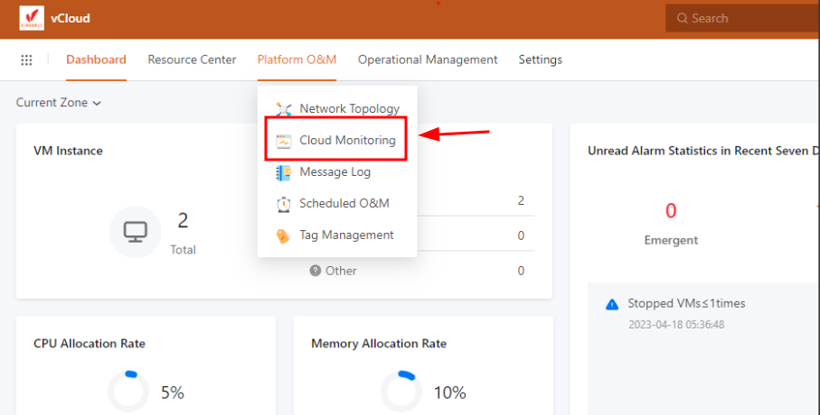
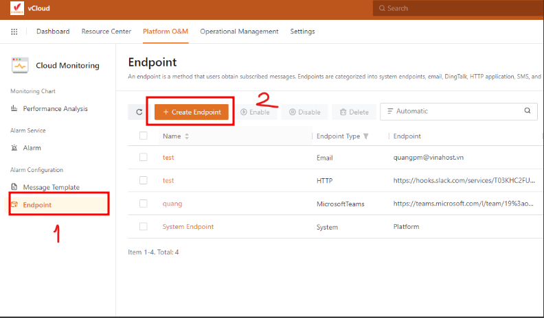
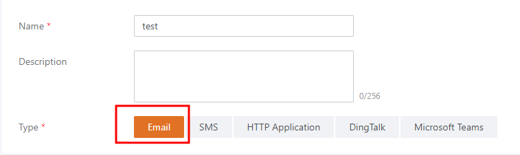
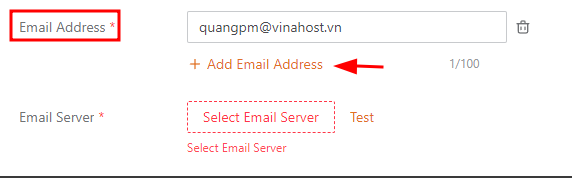
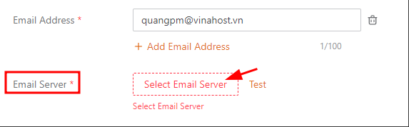
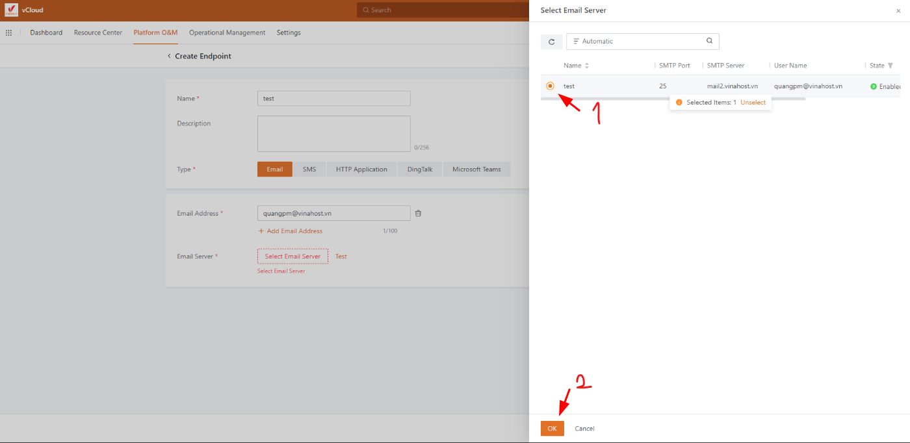
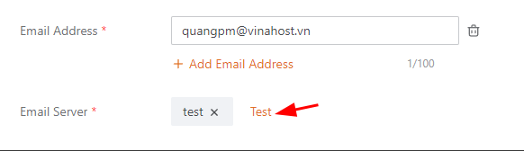

Bài viết này sẽ hướng dẫn bạn cách **Tạo Endpoint Trong vCloud.** Nếu bạn cần hỗ trợ, xin vui lòng liên hệ VinaHost qua **Hotline 1900 6046 ext. 3**, email về [support@vinahost.vn](mailto:support@vinahost.vn) hoặc chat với VinaHost qua livechat [https://livechat.vinahost.vn/chat.php](https://livechat.vinahost.vn/chat.php).

Endpoint là một phương thức mà người dùng có thể điều chỉnh để hệ thống có thể gửi các tin nhắn được thiết lập trước về

Có nhiều dạng endpoint có thể lựa chọn: email, DingTalk, HTTP application, SMS, and Microsoft Teams

Các bước để tạo endpoint (email)

**Bước 1**: Ở phần Platform O&M, chọn Cloud monitoring

**Bước** **2**: Để tạo endpoint mới, ta chọn Endpoint > Create Endpoint

**Bước 3**: Đặt tên cho endpoint mới và chọn vào phương thức mình muốn, ở đây là gửi mail

**Bước 4**:

- Chọn email cần hệ thống gửi đến, nếu cần thêm địa chỉ email cần gửi đến thì ta chọn vào add email address

- Chọn email server để gửi hệ thống gửi mail ra ngoài ( Cần có một email server trước và thêm vào Vcloud ở mục email server)

- Ta có thể chọn vào test để kiểm tra quá trình gửi mail đã hoạt động chưa

Chúc bạn thực hiện thành công!

> **THAM KHẢO CÁC DỊCH VỤ TẠI [VINAHOST](https://kb.vinahost.vn/)**
> 
> **\>>** [**SERVER**](https://vinahost.vn/thue-may-chu-rieng/) **–** [**COLOCATION**](https://vinahost.vn/colocation.html) – [**CDN**](https://vinahost.vn/dich-vu-cdn-chuyen-nghiep)
> 
> **\>> [CLOUD](https://vinahost.vn/cloud-server-gia-re/) – [VPS](https://vinahost.vn/vps-ssd-chuyen-nghiep/)**
> 
> **\>> [HOSTING](https://vinahost.vn/wordpress-hosting)**
> 
> **\>> [EMAIL](https://vinahost.vn/email-hosting)**
> 
> **\>> [WEBSITE](http://vinawebsite.vn/)**
> 
> **\>> [TÊN MIỀN](https://vinahost.vn/ten-mien-gia-re/)**
