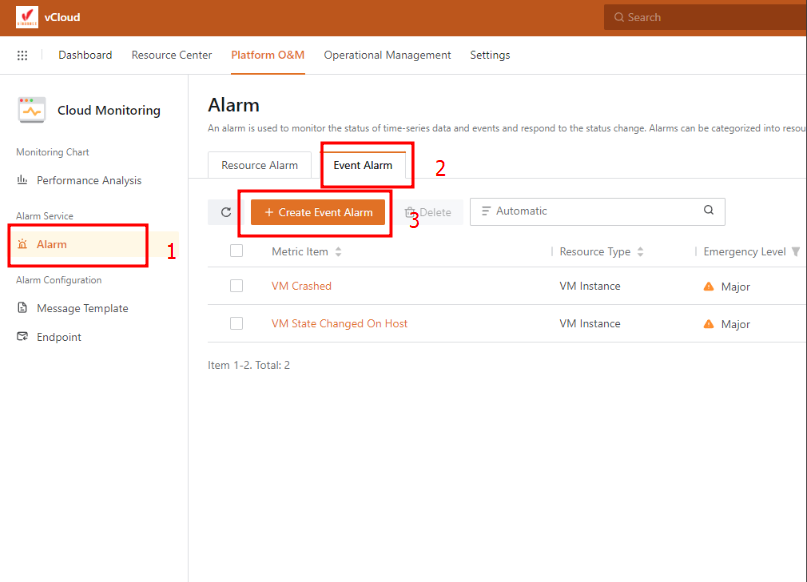
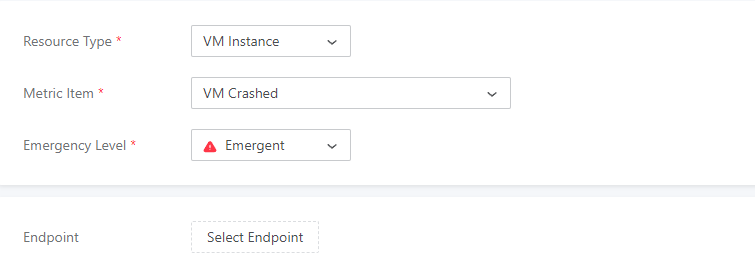
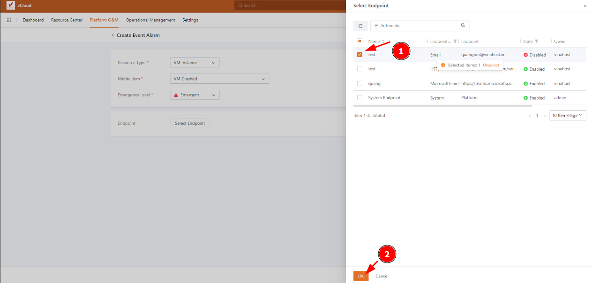

Bài viết này sẽ hướng dẫn bạn cách **tạo Event Alarm Trong vCloud.** Nếu bạn cần hỗ trợ, xin vui lòng liên hệ VinaHost qua **Hotline 1900 6046 ext. 3**, email về [support@vinahost.vn](mailto:support@vinahost.vn) hoặc chat với VinaHost qua livechat [https://livechat.vinahost.vn/chat.php](https://livechat.vinahost.vn/chat.php).

Mục đích của việc này là để kích hoạt báo động về các sự kiện đã được thiết lập trước. Ví dụ: bạn có thể định cấu hình cảnh báo khi máy chủ bị ngắt kết nối. Nếu máy chủ bị ngắt kết nối, một thông báo cảnh báo sẽ được gửi tới endpoint.

**Bước 1**: Ở phần **Platform O&M**, chọn **Cloud monitoring**

**Bước** **2**: Để tạo endpoint mới, ta chọn **Alarm > Event alarm  > Create event alarm**

**Bước 3**: Chọn các tùy chọn về sự kiện cần được thông báo

**Bước 4**: Chọn endpoint để tin nhắn được gửi đến khi có thông báo

Chúc bạn thực hiện thành công!

> **THAM KHẢO CÁC DỊCH VỤ TẠI [VINAHOST](https://kb.vinahost.vn/)**
> 
> **\>>** [**SERVER**](https://vinahost.vn/thue-may-chu-rieng/) **–** [**COLOCATION**](https://vinahost.vn/colocation.html) – [**CDN**](https://vinahost.vn/dich-vu-cdn-chuyen-nghiep)
> 
> **\>> [CLOUD](https://vinahost.vn/cloud-server-gia-re/) – [VPS](https://vinahost.vn/vps-ssd-chuyen-nghiep/)**
> 
> **\>> [HOSTING](https://vinahost.vn/wordpress-hosting)**
> 
> **\>> [EMAIL](https://vinahost.vn/email-hosting)**
> 
> **\>> [WEBSITE](http://vinawebsite.vn/)**
> 
> **\>> [TÊN MIỀN](https://vinahost.vn/ten-mien-gia-re/)**
