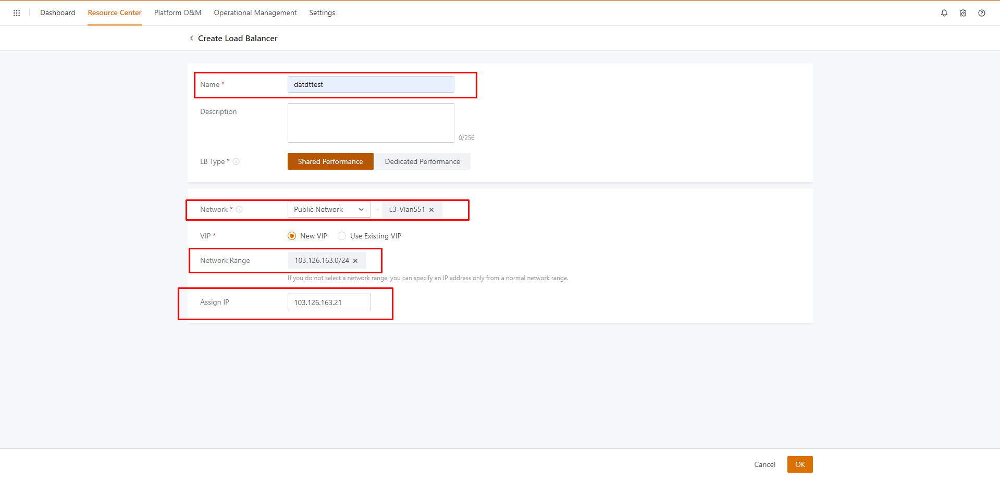
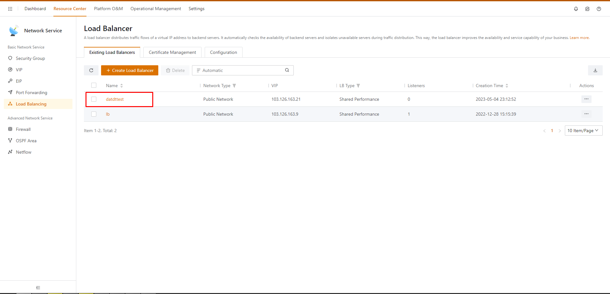

Bài viết này sẽ hướng dẫn bạn cách **tạo Load Balancer Trên vCloud Của VinaHost.** Nếu bạn cần hỗ trợ, xin vui lòng liên hệ VinaHost qua **Hotline 1900 6046 ext. 3**, email về [support@vinahost.vn](mailto:support@vinahost.vn) hoặc chat với VinaHost qua livechat [https://livechat.vinahost.vn/chat.php](https://livechat.vinahost.vn/chat.php).

**Load balancer** là một công nghệ rất quan trọng trong việc quản lý tải động trên các ứng dụng web. Nó giúp phân phối lưu lượng truy cập đến các **server backend** và đảm bảo rằng các server đó hoạt động hiệu quả, đồng thời cải thiện độ tin cậy của hệ thống. Trong bài viết này, tôi sẽ cung cấp cho bạn một số thông tin cơ bản về **load balancer** và cách sử dụng nó để cải thiện hiệu suất ứng dụng web.

## 1\. Khái niệm về load balancer

**Load balancer** là một thiết bị hoặc phần mềm được sử dụng để phân phối tải động trên các server backend. Nó hoạt động bằng cách chuyển tiếp yêu cầu từ client đến các **server backend**, đảm bảo rằng mỗi **server backend** được phân phối một cách cân đối các yêu cầu và không bị quá tải. Điều này giúp cải thiện hiệu suất của hệ thống, tăng độ tin cậy và giảm thời gian chết của ứng dụng.

## 2\. Các loại load balancer

Có hai loại load balancer chính:

### 2.1. Phần cứng

**Load balancer** phần cứng là một thiết bị độc lập, thường được đặt trước các server backend và được cấu hình để phân phối lưu lượng truy cập

### 2.2. Phần mềm

**Load balancer** phần mềm là một ứng dụng chạy trên một máy chủ, có thể được cài đặt trên cùng một server với các ứng dụng backend.

## 3\. Tổng kết

Ưu điểm và nhược điểm của **Load balancer** trên cloud

### 3.1. Ưu điểm

- High Availability
- Linh hoạt
- Tăng bảo mật cho hệ thống

### 3.2. Nhược điểm

\+ Hiệu suất có thể bị ảnh hưởng do phải sử dụng chung tài nguyên với nhiều khách hàng khác nhau.

\+ Không có sự kiểm soát tối đa trên cấu hình và các tính năng của load balancer.

## 4\. Hướng Dẫn tạo Load balancer trên cloud của Vinahost

### 4.1. Tạo Load balancer

- Ở phần **Network Service** nhấn vào **Load Balancing**

- Sau đó chọn vào **Create Load Balancer** để tạo một **Load Balancer** mới

- Sau khi Ấn vào **Create Load Balancer** sẽ hiện ra giao diện như hình dưới. Điền thông tin **Name, Network, Network Range, Assign IP** => Sau khi nhập xong các thông số ấn **OK** để tạo

- Sau khi nhấn **OK** sẽ hiện ra giao diện như hình dưới. Nhấp vào tên của load balancer vùa tạo để thêm backend  group, listener …

### 4.2. Tạo Listener

- Sau khi đã vào giao diện của **Load balancer** vừa tạo chuyển qua tab **Listener** => ấn **create Listener** để tạo 1 Listener mới.

- Nhập các thông số cần thiết để tạo listener mới (ở hình dưới tạo 1 listener để lắng nghe port 80 của server backend).

- Sau đó nhấn **OK** để tạo listener

### 4.3. Tạo Backend Server Group

- Ở giao diện **load balancer** đã tạo ở bước 1 chuyển qua tab **Backend Server Group** => **Create Backend Server Group.**

- Đặt tên cho **Server Backend Group**, chọn **Listener** vừa tạo ở “ 2/ ” và chọn các **NIC** cần thêm vào backend group (ở đây chọn 2 server datdttest2 và datdttest để thêm backend group).

- Sau đó nhấn **OK** để tạo **Backend Server Group.**

### 4.4. Kiểm tra hoạt động của load balancer

Cài **web server Apache** trên 2 **server backend** chạy trên **port 80** sau đó truy cập IP được gán cho load balancer và kiểm tra.

### 4.5. Tạo Certificate

Trong phần **Load Balancing** => **Certificate Managerment** => **Create Certificate**

Nhập **Name, Cer, Private Key** và **CA** của domain sau đó nhấn **OK**

Để kiểm tra **certificate** có hoạt động hay không, chúng ta tiến hành tạo thêm một **Listener**

Nhập các thông tin như hình dưới (ở đây lấy ví dụ là tên miền datne.name.vn)

Nhấn **OK** để tạo listener và tiến hành kiểm tra truy cập bằng tên miền datne.name.vn

Chúc bạn thực hiện thành công!

> **THAM KHẢO CÁC DỊCH VỤ TẠI [VINAHOST](https://kb.vinahost.vn/)**
> 
> **\>>** [**SERVER**](https://vinahost.vn/thue-may-chu-rieng/) **–** [**COLOCATION**](https://vinahost.vn/colocation.html) – [**CDN**](https://vinahost.vn/dich-vu-cdn-chuyen-nghiep)
> 
> **\>> [CLOUD](https://vinahost.vn/cloud-server-gia-re/) – [VPS](https://vinahost.vn/vps-ssd-chuyen-nghiep/)**
> 
> **\>> [HOSTING](https://vinahost.vn/wordpress-hosting)**
> 
> **\>> [EMAIL](https://vinahost.vn/email-hosting)**
> 
> **\>> [WEBSITE](http://vinawebsite.vn/)**
> 
> **\>> [TÊN MIỀN](https://vinahost.vn/ten-mien-gia-re/)**
