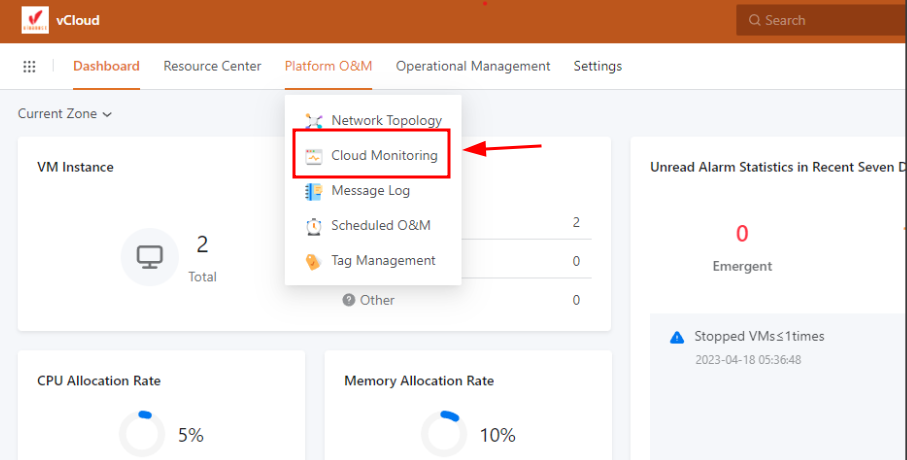

Bài viết này sẽ hướng dẫn bạn cách **tạo Message Template Trong vCloud.** Nếu bạn cần hỗ trợ, xin vui lòng liên hệ VinaHost qua **Hotline 1900 6046 ext. 3**, email về [support@vinahost.vn](mailto:support@vinahost.vn) hoặc chat với VinaHost qua livechat [https://livechat.vinahost.vn/chat.php](https://livechat.vinahost.vn/chat.php).

Mục đích của việc này là để tạo mẫu tin nhắn chỉ định văn bản của tin nhắn cảnh báo tài nguyên hoặc tin nhắn cảnh báo sự kiện được gửi đến hệ thống SNS.

**Bước 1**: Ở phần **Platform O&M**, chọn **Cloud monitoring.**

**Bước** **2**: Để tạo **endpoint mới,** ta chọn **Message template > Create Endpoint Message template**

**Bước 3**: Đặt tên cho **message template** mới và chọn vào phương thức mình muốn, ở đây là gửi mail

**Bước 4**:

- Ở đây, ta chọn dạng alarm cần điều chỉnh template (resource alarm hoặc event alarm)
- Ở dưới có các ô để điều chỉnh template của tin nhắn thông báo mà chúng ta muốn nhận được
- Có các chữ mờ mờ chính là mẫu của nhà sản xuất đã làm mẫu sẵn

- Nếu các bạn muốn sử dụng mẫu của nhà sản xuất thì có thể chọn vào ô Make default ở cuối trang thì các thông báo sẽ được định chuẩn như nhà sản xuất đã chuẩn bị trước

Chúc bạn thực hiện thành công!

> **THAM KHẢO CÁC DỊCH VỤ TẠI [VINAHOST](https://kb.vinahost.vn/)**
> 
> **\>>** [**SERVER**](https://vinahost.vn/thue-may-chu-rieng/) **–** [**COLOCATION**](https://vinahost.vn/colocation.html) – [**CDN**](https://vinahost.vn/dich-vu-cdn-chuyen-nghiep)
> 
> **\>> [CLOUD](https://vinahost.vn/cloud-server-gia-re/) – [VPS](https://vinahost.vn/vps-ssd-chuyen-nghiep/)**
> 
> **\>> [HOSTING](https://vinahost.vn/wordpress-hosting)**
> 
> **\>> [EMAIL](https://vinahost.vn/email-hosting)**
> 
> **\>> [WEBSITE](http://vinawebsite.vn/)**
> 
> **\>> [TÊN MIỀN](https://vinahost.vn/ten-mien-gia-re/)**
