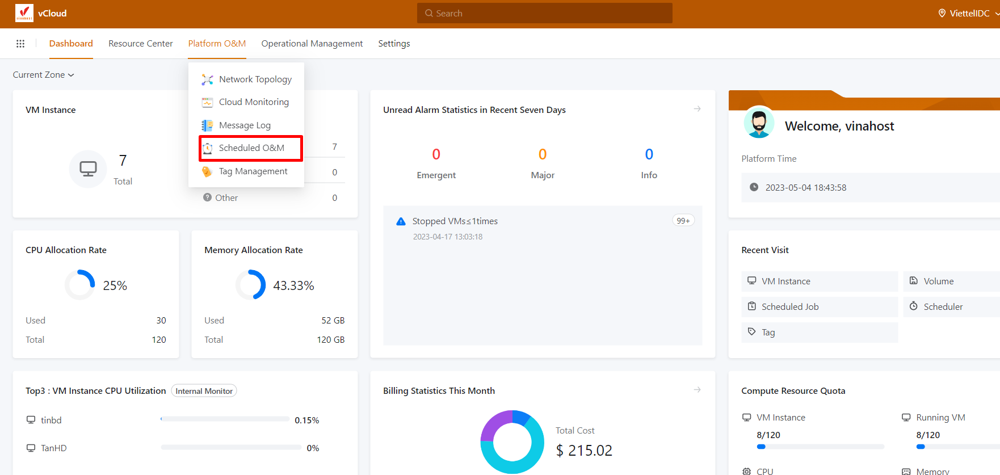

Bài viết này sẽ hướng dẫn bạn cách **Tạo Schedule Job Trên vCloud VinaHost.** Nếu bạn cần hỗ trợ, xin vui lòng liên hệ VinaHost qua **Hotline 1900 6046 ext. 3**, email về [support@vinahost.vn](mailto:support@vinahost.vn) hoặc chat với VinaHost qua livechat [https://livechat.vinahost.vn/chat.php](https://livechat.vinahost.vn/chat.php).

Sau khi login vào hệ thống chọn Platform O&M, bạn chọn chức năng Chức năng Schedule & OM.

Sau đó chọn Schedule Job và chọn Create Schedule Job.

- Name: Đặt tên cho Schedule Job.
- Description: mô tả công dụng của Schedule Job.
- Job: có thể lựa chọn tác vụ thực hiện các tác vụ hiện có ở đây là start VM, stop VM, reboot VM, tạo snapshot cho VM, tạo snapshot cho volume, ở hình minh họa trên mình đang chọn là reboot VM.
- VM Instance: Lựa chọn VM để thực hiện tác vụ của job (có thể chọn một lúc nhiều VM).
- Schedule: Lựa chọn schedule cho Schedule Job.

Sau đó chúng ta bấm và mục OK để hoàn tất quá trình tạo Schedule Job.

Đây là một Schedule Job với name là test, chúng ta cũng có thể thây đổi các thông số của một Scheduler bằng cách nhấn vào đấu ba chấm.

- Edit: chúng ta có thể thẩy đổi thông tin của Name và Description của một Schedule Job.
- Enable: Thực hiện chức năng bật Schedule Job.
- Disable: Thực hiện chức năng tắt Schedule Job.
- Attach Scheduler: Thực hiện thêm một schedule (Giới hạn một schedule cho một Schedule Job).
- Detach Scheduler: Thực hiện xóa một schedule.
- Delete: Thực hiện chức năng xóa Schedule Job.

Chúng ta cũng có thể kiểm tra quá trình vận hành của một Schedule Job bằng cách nhấn vào tên của một Schedule Job.

Ở phần Overview chúng ta có thể kiểm tra được quá trình hoạt động của một Schedule Job. Ở đây mình đã thiết lập Schedule Job với schedule với cấu hình reboot một phút một lần và thực hiện trên VM có tên là tinbd và kết quả vận hành của Schedule Job thành công hay thất bại.

Còn ở phần Audit chúng ta có theo dõi quá trình vận hành của Schedule Job, ví dụ như là tạo một Schedule Job, xóa schedule khỏi một schedule hoặc thêm một schedule khác.

Chúc bạn thực hiện thành công!

> **THAM KHẢO CÁC DỊCH VỤ TẠI [VINAHOST](https://kb.vinahost.vn/)**
> 
> **\>>** [**SERVER**](https://vinahost.vn/thue-may-chu-rieng/) **–** [**COLOCATION**](https://vinahost.vn/colocation.html) – [**CDN**](https://vinahost.vn/dich-vu-cdn-chuyen-nghiep)
> 
> **\>> [CLOUD](https://vinahost.vn/cloud-server-gia-re/) – [VPS](https://vinahost.vn/vps-ssd-chuyen-nghiep/)**
> 
> **\>> [HOSTING](https://vinahost.vn/wordpress-hosting)**
> 
> **\>> [EMAIL](https://vinahost.vn/email-hosting)**
> 
> **\>> [WEBSITE](http://vinawebsite.vn/)**
> 
> **\>> [TÊN MIỀN](https://vinahost.vn/ten-mien-gia-re/)**
