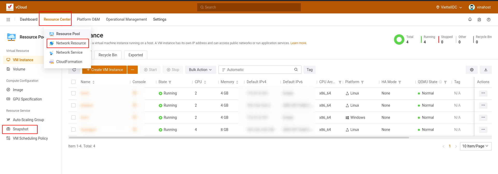
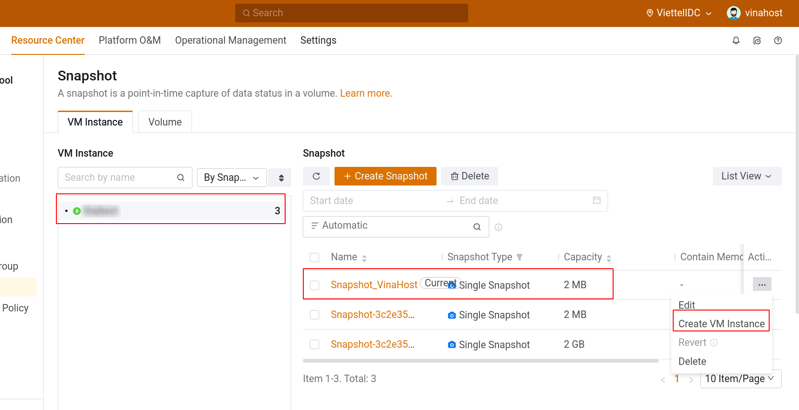
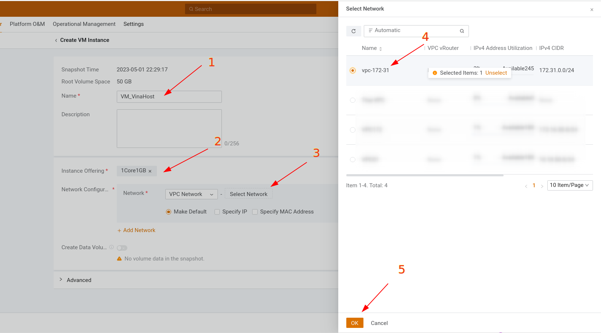
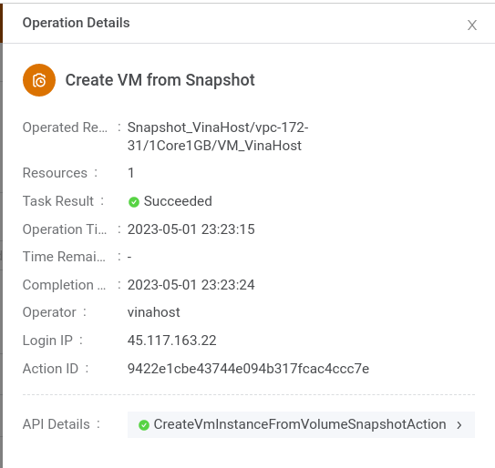
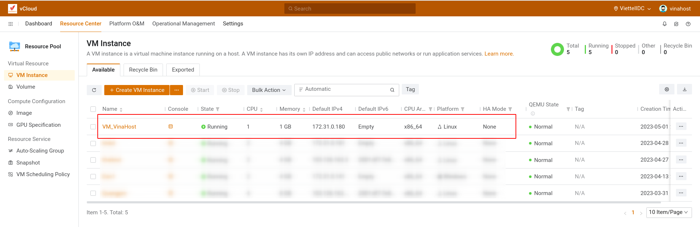

Bài viết này sẽ hướng dẫn bạn cách **tạo VM Instane từ Snapshot.** Nếu bạn cần hỗ trợ, xin vui lòng liên hệ VinaHost qua **Hotline 1900 6046 ext. 3**, email về [support@vinahost.vn](mailto:support@vinahost.vn) hoặc chat với VinaHost qua livechat [https://livechat.vinahost.vn/chat.php](https://livechat.vinahost.vn/chat.php).

Sau khi đã login vào hệ thống, các bạn chọn **Resource Center > Resource Pool > Snapshot**

Tại giao diện snapshot, chọn **VM Instance -> Bản Snapshot > Action > Create VM Instance**

Tại giao diện create VM instace. Chọn đầy đủ các option như: **Name, Instance Offering (cấu hình VM), Network, VPC…**

Sau khi khởi tạo VM Instance từ Snapshot thành công, sẽ có thông báo như sau:

Quay trở lại mục VM Instance, lúc này máy ảo VM\_VinaHost đã tạo và đang running.

Chúc bạn thực hiện thành công!

> **THAM KHẢO CÁC DỊCH VỤ TẠI [VINAHOST](https://kb.vinahost.vn/)**
> 
> **\>>** [**SERVER**](https://vinahost.vn/thue-may-chu-rieng/) **–** [**COLOCATION**](https://vinahost.vn/colocation.html) – [**CDN**](https://vinahost.vn/dich-vu-cdn-chuyen-nghiep)
> 
> **\>> [CLOUD](https://vinahost.vn/cloud-server-gia-re/) – [VPS](https://vinahost.vn/vps-ssd-chuyen-nghiep/)**
> 
> **\>> [HOSTING](https://vinahost.vn/wordpress-hosting)**
> 
> **\>> [EMAIL](https://vinahost.vn/email-hosting)**
> 
> **\>> [WEBSITE](http://vinawebsite.vn/)**
> 
> **\>> [TÊN MIỀN](https://vinahost.vn/ten-mien-gia-re/)**
