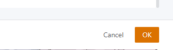

Bài viết này sẽ hướng dẫn bạn **thêm Image mới lên Cloud.** Nếu bạn cần hỗ trợ, xin vui lòng liên hệ VinaHost qua **Hotline 1900 6046 ext. 3**, email về [support@vinahost.vn](mailto:support@vinahost.vn) hoặc chat với VinaHost qua livechat [https://livechat.vinahost.vn/chat.php](https://livechat.vinahost.vn/chat.php).

## Hướng Dẫn Thêm Image Mới Lên Cloud

**Bước 1**: Trên trang dashboard chọn vào Image trong phần Resource Pool

**Bước 2**: Trong giao diện Image, chọn vào add image

**Bước 3**: Điền các thông tin cần thiết trong image

- Điền tên và ghi chú nếu có

- Ở phần platform, ta có thể chọn các platform hệ điều hành như: Windows, Linux

- Ở phần OS, ta chọn các hệ điều hành và các phiên bản hệ điều hành đó

- Ở phần Select Backup Storage, ta sẽ chọn gói backup có sẵn

- Ở phần image path, ta sẽ cung cấp đường dẫn tới file hệ điều hành cần thiết để cài đặt

- Sau đó chọn OK ở cuối trang để xác nhận hoàn thành

- Sau đó chờ hệ thống upload file của bạn lên

- Sau khi thành công sẽ hiện ra dòng như sau

Chúc bạn thực hiện thành công!

> **THAM KHẢO CÁC DỊCH VỤ TẠI [VINAHOST](https://kb.vinahost.vn/)**
> 
> **\>>** [**SERVER**](https://vinahost.vn/thue-may-chu-rieng/) **–** [**COLOCATION**](https://vinahost.vn/colocation.html) – [**CDN**](https://vinahost.vn/dich-vu-cdn-chuyen-nghiep)
> 
> **\>> [CLOUD](https://vinahost.vn/cloud-server-gia-re/) – [VPS](https://vinahost.vn/vps-ssd-chuyen-nghiep/)**
> 
> **\>> [HOSTING](https://vinahost.vn/wordpress-hosting)**
> 
> **\>> [EMAIL](https://vinahost.vn/email-hosting)**
> 
> **\>> [WEBSITE](http://vinawebsite.vn/)**
> 
> **\>> [TÊN MIỀN](https://vinahost.vn/ten-mien-gia-re/)**
