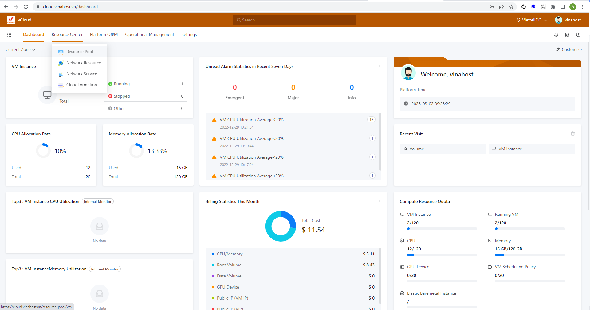
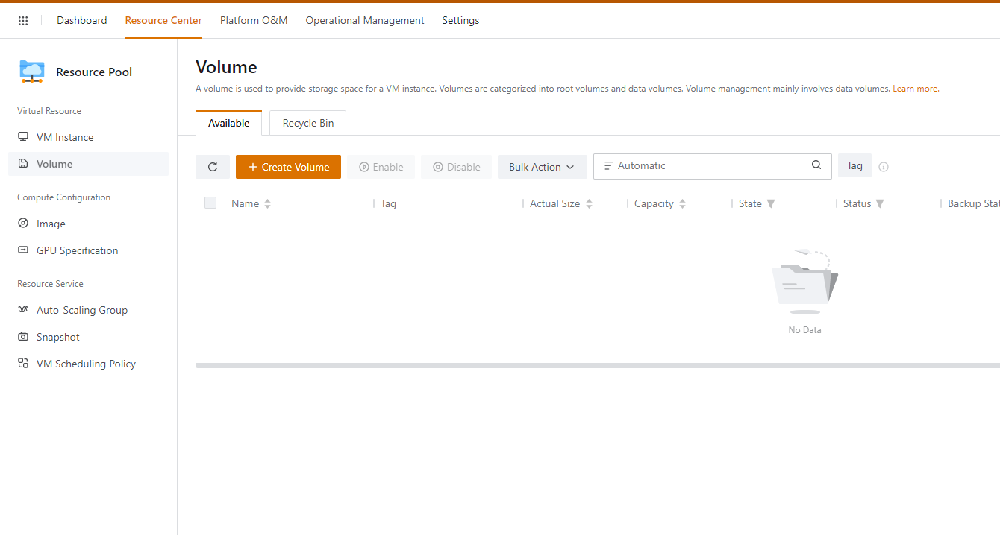
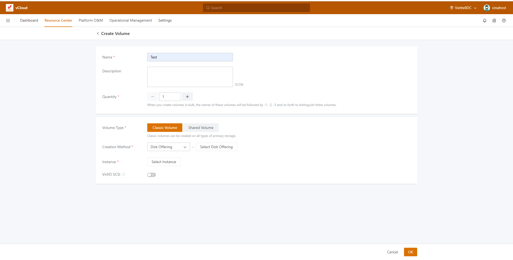
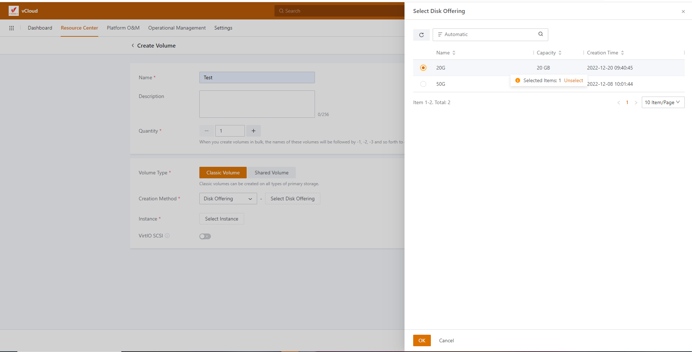
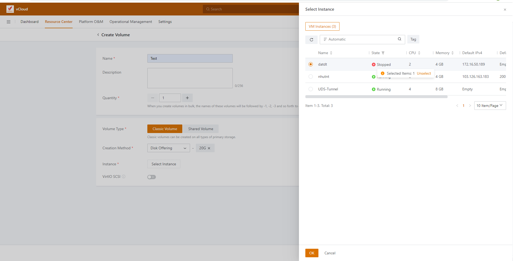
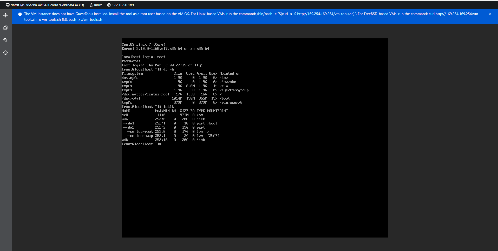
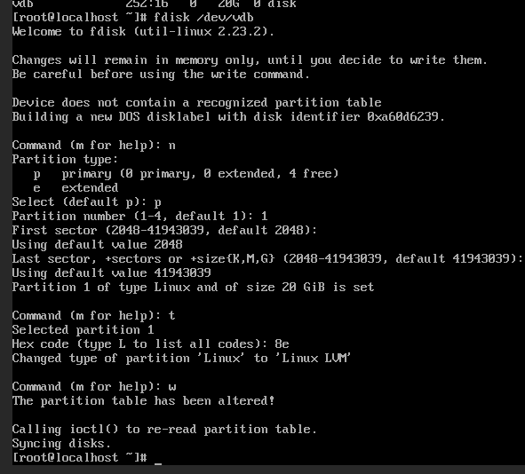
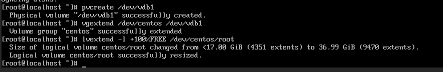
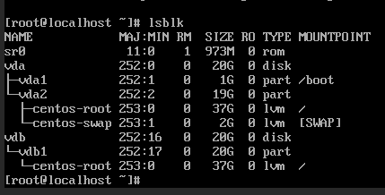

Bài viết này sẽ hướng dẫn bạn cách **Thêm Volume Cho VM Instance - vCloud.** Nếu bạn cần hỗ trợ, xin vui lòng liên hệ VinaHost qua **Hotline 1900 6046 ext. 3**, email về [support@vinahost.vn](mailto:support@vinahost.vn) hoặc chat với VinaHost qua livechat [https://livechat.vinahost.vn/chat.php](https://livechat.vinahost.vn/chat.php).

## Hướng Dẫn Thêm Volume Cho VM Instance - vCloud

Ở dashboard chon Resource center ==> Resource pool

Ở Resource pool chọn vào phần volume => Create volume

Sau đó điền tên và số lượng volume cần tạo (ở đây tên volume là test số lượng là 1)

Chọn Select Disk Offering để chọn dung lượng của mỗi disk (trong hình là thêm 1 disk 20G),sau đó nhấn OK

Sau dó chọn VM Instance cần thêm disk ==> OK (Nên tắt VM trước khi thêm disk để tránh gặp lỗi)

Sau khi thêm volume vào VM để kiểm tra (Vdb là volume mới được thêm vào)

Tiến hành add volume vào LVM

fdisk /dev/vdb (đĩa mới add)
n
p
1
t
8e
w

pvcreate /dev/vdb1
vgextend /dev/centos /dev/vdb1
lvextend -l +100%FREE /dev/centos/root

8. Kiểm tra lại dung lượng sau khi nâng

Chúc bạn thực hiện thành công!

> **THAM KHẢO CÁC DỊCH VỤ TẠI [VINAHOST](https://kb.vinahost.vn/)**
> 
> **\>>** [**SERVER**](https://vinahost.vn/thue-may-chu-rieng/) **–** [**COLOCATION**](https://vinahost.vn/colocation.html) – [**CDN**](https://vinahost.vn/dich-vu-cdn-chuyen-nghiep)
> 
> **\>> [CLOUD](https://vinahost.vn/cloud-server-gia-re/) – [VPS](https://vinahost.vn/vps-ssd-chuyen-nghiep/)**
> 
> **\>> [HOSTING](https://vinahost.vn/wordpress-hosting)**
> 
> **\>> [EMAIL](https://vinahost.vn/email-hosting)**
> 
> **\>> [WEBSITE](http://vinawebsite.vn/)**
> 
> **\>> [TÊN MIỀN](https://vinahost.vn/ten-mien-gia-re/)**
