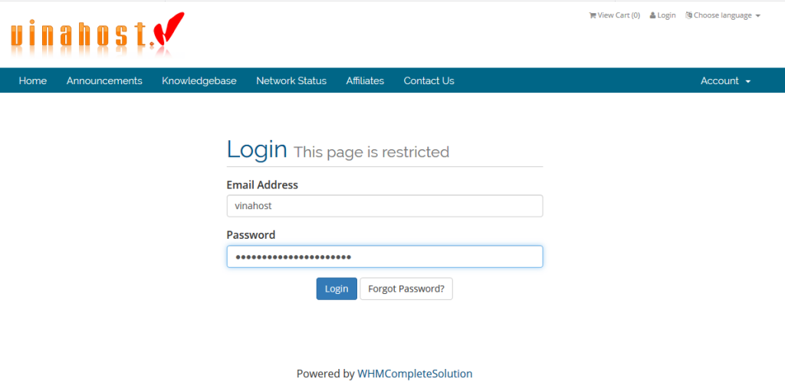
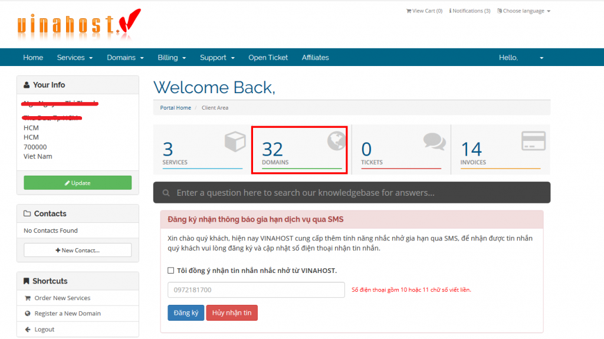
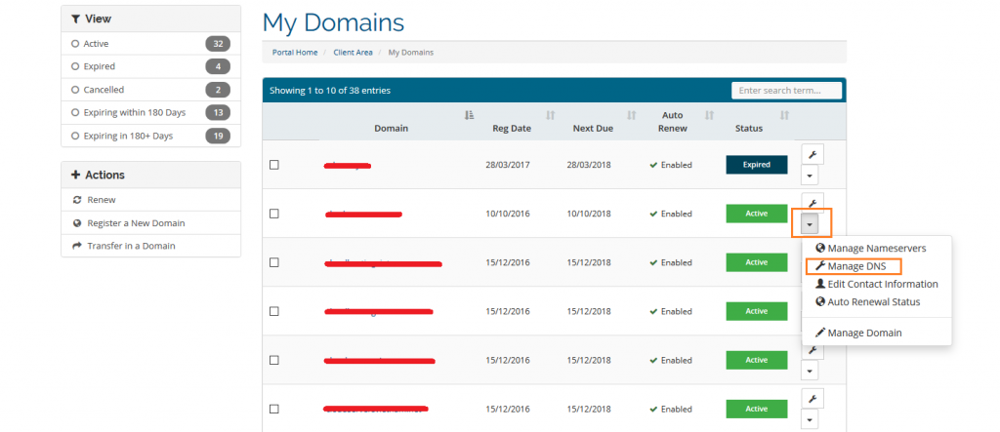
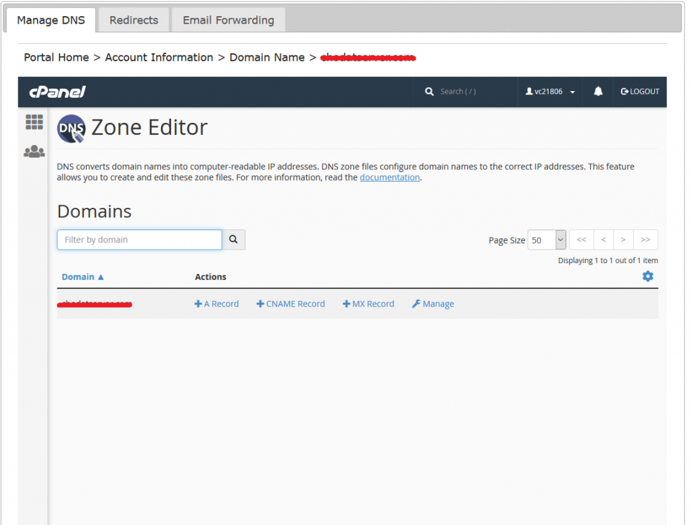

Bài viết này sẽ hướng dẫn các bạn thao tác trỏ tên miền tại VinaHost.

**Lưu ý:**

- Tên miền phải được mua tại VinaHost.
- Tài khoản đăng nhập vào trung tâm khách hàng phải là tài khoản quản lý tên miền đã mua.
- Tên miền phải sử dụng cặp nameserver là ns3.vinahost.vn và ns4.vinahost.vn.

**Thao tác trỏ gồm các bước sau:**

**Bước** 1\. Bạn đăng nhập vào tài khoản quản lý tên miền tại trung tâm khách hàng của VinaHost tại đường dẫn: [https://secure.vinahost.vn/ac/clientarea.php](https://secure.vinahost.vn/ac/clientarea.php)

**Bước** 2\. Sau khi đăng nhập hoàn tất, bạn chọn tiếp mục Domain:

**Bước** 3\. Bạn chọn mục Manage DNS của tên miền cần thực hiện quản lý DNS:

**Bước** 4\. Tại giao diện này, bạn có thể thực hiện trỏ DNS record mà mình cần tương ứng với các nút:

- A Record: thêm một record với type là A.
- CNAME Record: thêm một record với type là CNAME.
- MX Record: thêm một record với type là MX.
- Manage: quản lý chung toàn bộ các record, có thể xóa/sửa các record đã tồn tại hoặc thêm mới các record.

Chúc bạn thành công!

> **THAM KHẢO CÁC DỊCH VỤ TẠI [VINAHOST](https://blog.vinahost.vn/)**
> 
> **\>>** [**SERVER**](https://vinahost.vn/thue-may-chu-rieng/) **–** [**COLOCATION**](https://vinahost.vn/colocation.html) – [**CDN**](https://vinahost.vn/dich-vu-cdn-chuyen-nghiep)
> 
> **\>> [CLOUD](https://vinahost.vn/cloud-server-gia-re/) – [VPS](https://vinahost.vn/vps-ssd-chuyen-nghiep/)**
> 
> **\>> [HOSTING](https://vinahost.vn/wordpress-hosting)**
> 
> **\>> [EMAIL](https://vinahost.vn/email-hosting)**
> 
> **\>> [WEBSITE](http://vinawebsite.vn/)**
> 
> **\>> [TÊN MIỀN](https://vinahost.vn/ten-mien-gia-re/)**
> 
> **\>> [SSL](https://vinahost.vn/geotrust-ssl) – [LICENSE](https://vinahost.vn/bang-gia-license)**
