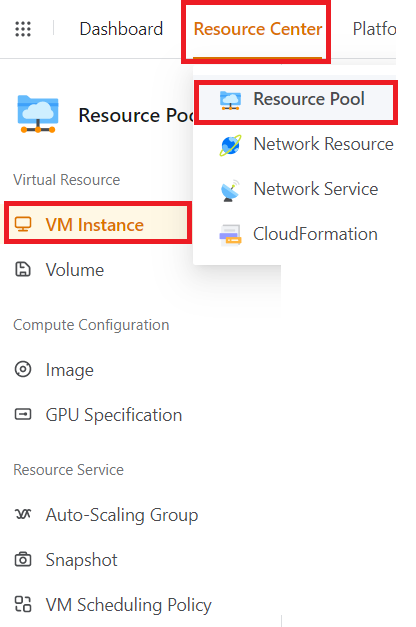
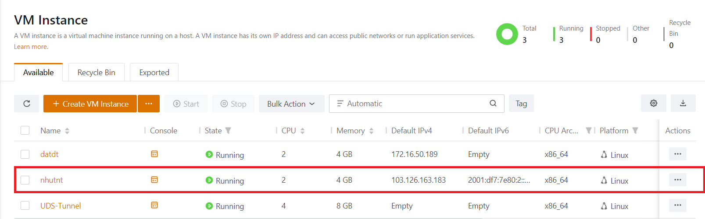
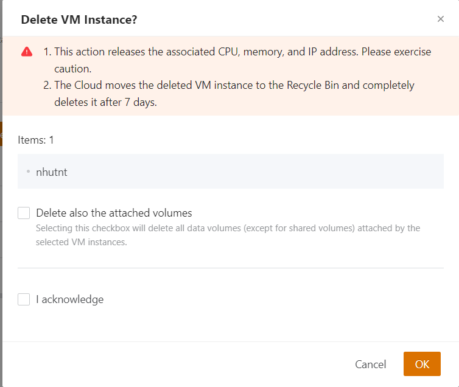
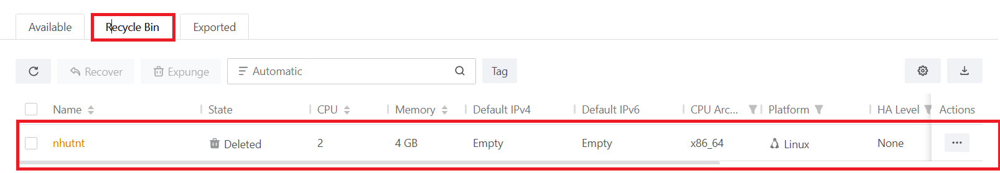
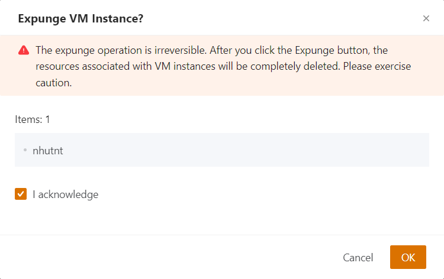

Bài viết này sẽ hướng dẫn bạn cách **Xóa Một VM instance.** Nếu bạn cần hỗ trợ, xin vui lòng liên hệ VinaHost qua **Hotline 1900 6046 ext. 3**, email về [support@vinahost.vn](mailto:support@vinahost.vn) hoặc chat với VinaHost qua livechat [https://livechat.vinahost.vn/chat.php](https://livechat.vinahost.vn/chat.php).

## Hướng Dẫn **Xóa Một VM instance**

Để xóa một **VM instance** thì trước tiên ta cần khởi tạo một **VM instance**. Sau khi quá trình khởi tạo VM hoàn thành. Ta thực hiện các bước sau nhé.

Bước 1: Ta click chuột vào mục **Resource Center** trên thanh công cụ và Chọn Resource Pool và Chọn **VM Instance** và tìm kiếm VM cần xóa nhé.

Bước 2: Chọn VM cần xóa và chọn vào dấu 3 chấm ở cuối VM cần xóa và click chọn mục **Delete** để xóa VM

Bước 3: Khi click vào mục **Delete** hệ thống sẽ trả về một bảng thông báo. Và **2 options** như ảnh bên dưới.

**_Lưu ý:_**

1. _Hành động này giải phóng **CPU**, bộ nhớ và địa chỉ **IP** liên quan. Hãy thận trọng_.
2. _The Cloud moves the deleted VM instance to the Recycle Bin and completely deletes it after 7 days._

Ở đây chúng ta có thể tick chọn 1 trong 2 lựa chọn bên dưới “**Delete also the attached volumes**” và "**I acknowledge"** hoặc cả 2. Sau đó chọn **OK** để tiếp tục bước tiếp theo.

Bước 4: Ở đây **VM** đã bị xóa. Nhưng **VM** vẫn còn lưu trong **Recycle Bin**

Ở đây ta chọn vào dấu 3 chấm ở cuối. Sẽ có 2 lựa chọn cho bạn đó là:

- **Recover**: Khôi phục lại VM đã xóa
- **Expunge**: Xóa VM khỏi hệ thống

Vì mình muốn xóa VM ra khỏi hệ thống vì thế mình sẽ chọn **Expunge** và xóa **VM** như ảnh bên dưới.

**_Lưu ý:_**

_Hoạt động xóa là không thể đảo ngược. Sau khi bạn nhấp vào nút **Xóa**, các tài nguyên được liên kết với các phiên bản VM sẽ bị xóa hoàn toàn. Hãy thận trọng._

Sau đó click **OK** để xóa **VM**.

Chúc bạn thực hiện thành công!

> **THAM KHẢO CÁC DỊCH VỤ TẠI [VINAHOST](https://kb.vinahost.vn/)**
> 
> **\>>** [**SERVER**](https://vinahost.vn/thue-may-chu-rieng/) **–** [**COLOCATION**](https://vinahost.vn/colocation.html) – [**CDN**](https://vinahost.vn/dich-vu-cdn-chuyen-nghiep)
> 
> **\>> [CLOUD](https://vinahost.vn/cloud-server-gia-re/) – [VPS](https://vinahost.vn/vps-ssd-chuyen-nghiep/)**
> 
> **\>> [HOSTING](https://vinahost.vn/wordpress-hosting)**
> 
> **\>> [EMAIL](https://vinahost.vn/email-hosting)**
> 
> **\>> [WEBSITE](http://vinawebsite.vn/)**
> 
> **\>> [TÊN MIỀN](https://vinahost.vn/ten-mien-gia-re/)**
