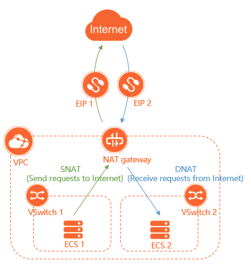

Bài viết này sẽ giới thiệu về **Internet NAT Gateway.** Nếu bạn cần hỗ trợ, xin vui lòng liên hệ VinaHost qua **Hotline 1900 6046 ext. 3**, email về [support@vinahost.vn](mailto:support@vinahost.vn) hoặc chat với VinaHost qua livechat [https://livechat.vinahost.vn/chat.php](https://livechat.vinahost.vn/chat.php).

## 1\. Internet NAT Gateway là gì?

**Internet NAT Gateway** là một dạng **enterprise-class gateway** cung cấp các tính năng gồm DNAT và SNAT. Internet NAT Gateway cung cấp khả năng chuyển tiếp lưu lượng truy cập lên tới **100 Gbit/s** và hỗ trợ tính năng **cross-zone disaster recovery** (phục hồi thảm họa giữa các zone).

**Internet NAT Gateway** hỗ trợ high performance, tự động **scale, flexible billing**… Dịch vụ **Internet NAT Gateway** cho phép user quản lý việc truyền tải dữ liệu qua Internet một cách linh hoạt và hiệu quả hơn.

## 2\. Mô hình network của Internet NAT Gateway

Có thể ưu tiên dùng trong các trường hợp sau:

- Nếu dịch vụ trên cloud của bạn cần ra Internet để lấy thông tin, **update** các bản vá hoặc cần **upgrade OS** và bạn không muốn public các địa chỉ nguồn ra mạng Internet. Lúc này nếu sử dụng **Internet NAT Gateway** sẽ bảo vệ các dịch vụ của bạn trước các cuộc tấn công từ Internet.
- Nếu dịch vụ trên cloud dự đoán lượng truy cập tăng đột biến trong một vài thời điểm, bạn có thể ưu tiên sử dụng **Internet NAT Gateway**. Với tính năng scale up và **scale down** phù hợp với các yêu cầu mở rộng/thu hẹp resource linh hoạt cho doanh nghiệp. Người dùng chỉ phải chi trả phần tài nguyên bạn sử dụng (**Pay-As-You-Go**) từ đó giúp tiết kiệm tối đa về chi phí vận hành và hoạt động.
- **Internet NAT Gateway** cũng phù hợp khi mô hình hoạt động có số lượng lớn các thiết bị yêu cầu truy cập Internet. Bằng cách dùng **Elastic IP (EIP)** trên **Internet NAT Gateway** để giúp các dịch vụ bên trong VPC truy cập Internet. Dịch vụ cung cấp khả năng giám sát các số liệu và lưu lượng truy cập Outbound ra ngoài Internet. Từ đó người dùng có thể giám sát/điều phối lưu lượng cho phù hợp với Doanh nghiệp.

_Mô hình hoạt động của Internet NAT Gateway_

## 3\. Các tính năng

- **Hiệu suất cao (High Performance):** Giúp bạn kiểm soát các lưu lượng tăng vượt ngưỡng. Phù hợp với các bài toán yêu cầu đồng bộ cao. Có thể upgrade tài nguyên bằng cách submit ticket tới trung tâm hỗ trợ.
- **Tính sẵn sàng cao (High Availability):** hỗ trợ **cross-zone disater recovery** - khắc phục thảm họa giữa các zone. Nếu một **zone** bị down, dịch vụ của bạn sẽ không bị gián đoạn.

 

- **Fine-grained O&M**: Internet NAT Gatewa có thể tự detect được ECS, qua đó giúp giám sát được lưu lượng traffic đỉnh và cung cấp các công cụ giám sát **metrics và data transfer**.
- **Tính linh hoạt cao (High elasticity)**: áp dụng các giải pháp cao cấp và khả năng scale linh hoạt để đáp ứng các tính huống khác nhau trong quá trình vận hành.

> **THAM KHẢO CÁC DỊCH VỤ TẠI [VINAHOST](https://kb.vinahost.vn/)**
> 
> **\>>** [**SERVER**](https://vinahost.vn/thue-may-chu-rieng/) **–** [**COLOCATION**](https://vinahost.vn/colocation.html) – [**CDN**](https://vinahost.vn/dich-vu-cdn-chuyen-nghiep)
> 
> **\>> [CLOUD](https://vinahost.vn/cloud-server-gia-re/) – [VPS](https://vinahost.vn/vps-ssd-chuyen-nghiep/)**
> 
> **\>> [HOSTING](https://vinahost.vn/wordpress-hosting)**
> 
> **\>> [EMAIL](https://vinahost.vn/email-hosting)**
> 
> **\>> [WEBSITE](http://vinawebsite.vn/)**
> 
> **\>> [TÊN MIỀN](https://vinahost.vn/ten-mien-gia-re/)**
