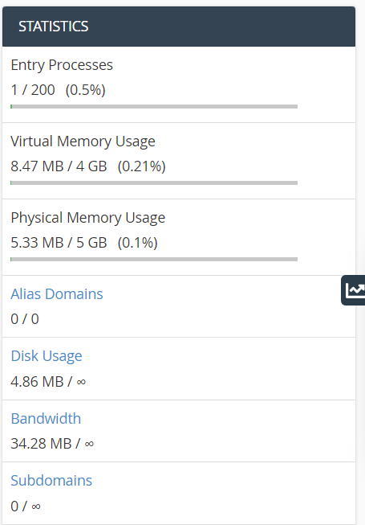
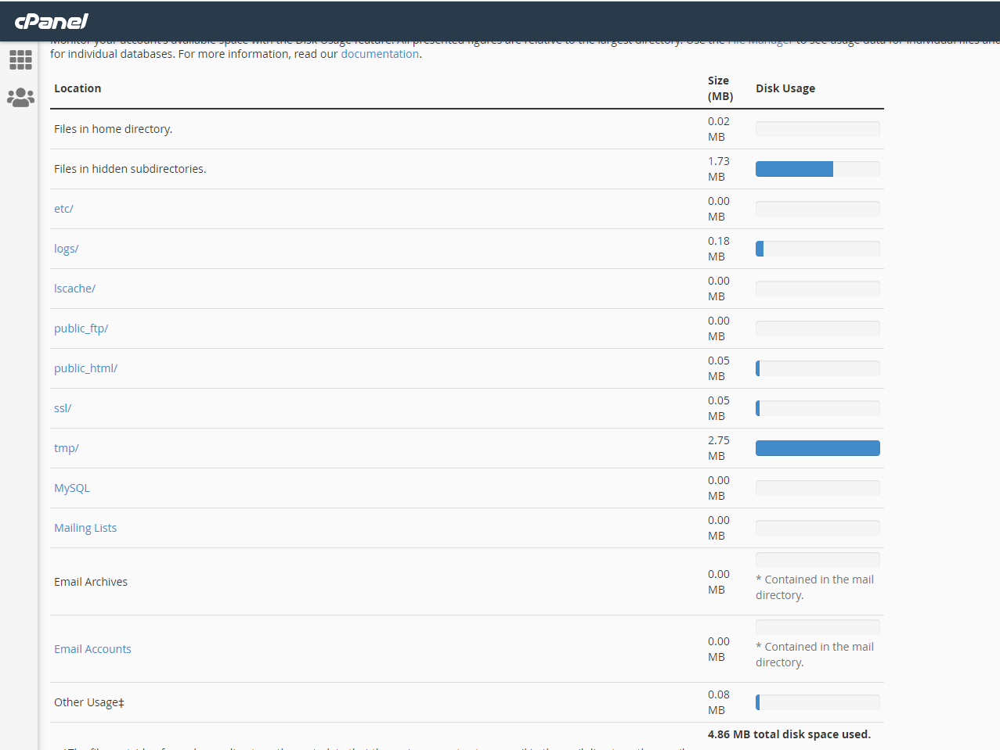
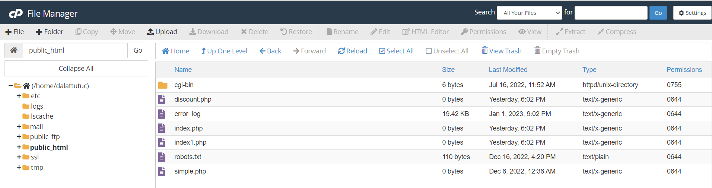
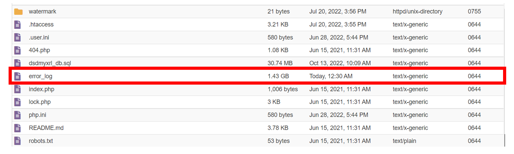
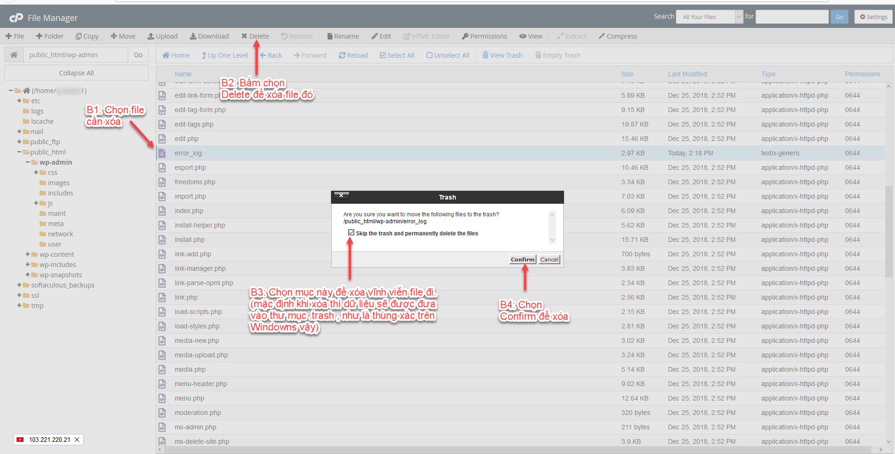

Bài viết này sẽ hướng dẫn bạn **Kiểm Tra Disk Usage Trên Cpanel Và Cách Xử Lý**. Nếu bạn cần hỗ trợ, xin vui lòng liên hệ VinaHost qua **Hotline 1900 6046 ext.3**, email về [support@vinahost.vn](mailto:support@vinahost.vn) hoặc chat với VinaHost qua livechat [https://livechat.vinahost.vn/chat.php](https://livechat.vinahost.vn/chat.php).

## 1\. Giới thiệu chung

Trong quá trình sử dụng Hosting Cpanel chúng ta thường có chung thắc mắc là tại sao Hosting của chúng ta sử dụng quá nhiều dung lượng. Trong khi đó website của chúng ta chỉ có vài bài viết và hình ảnh.

Vậy bài viết hôm nay mình sẽ hướng dẫn mọi người kiểm tra Disk Usage và xử lý các file chưa dung lượng lớn trên Cpanel nhé.

## 2\. Hướng dẫn kiểm tra Disk Usage trên cPanel và cách xử lý

Bước 1: Chúng ta cần truy cập vào giao diện Cpanel của Hosting.

Bước 2: Tìm đến phần Disk Usage (mức dùng đĩa) ở thanh bên phải giao diện Cpanel (như ảnh bên dưới).

Sau khi truy cập sẽ hiển thị ra giao diện đầy đủ như hình bên dưới:

Bước 3: Liệt kê các thư mục chứa nhiều dùng lượng nhất.

Ở đây vì là hosting mình tạo để test nên dùng lượng hiện tại không nhiều. Và nếu Hosting dùng chưa source website thì dung lượng nhiều nhất sẽ nằm ở mục public\_html.

Bước 4: Kiểm tra chi tiết bên trong các thư mục sử dụng nhiều dung lượng.

Sau khi đã xác định được thư mục nào chiếm dụng nhiều dung lượng, chúng ta chỉ cần Click (nhấp đúp chuột) và thư mục đó trên giao diện Disk Usage (Mức dùng đĩa).

Ví dụ: Mình sẽ bấm chọn thư mục public\_html. Sau khi bấm vào Cpanel sẽ chuyển chúng ta đến giao diện của thư mục public\_html

Ở đây chúng ta sẽ thấy thư mục và dung lượng của từng mục. Ví dụ: Hiện tại ở đây thư mục error\_log chiếm khá nhiều dung lượng hosting của mình.

File error\_log đường dẫn đầy đủ là: /home/\*usercPanel\*/public\_html/error\_log

File error\_log ghi lại những thông báo, cảnh báo, lỗi của website trong quá trình website hoạt động.

Ví dụ với WordPresss: Lỗi có thể là do bị xung đột, sai khác các phiên bản của WordPress với phiên bản themes/plugin hiện đã kích hoạt trên website chẳng hạn (như WooCommerce).

Bạn có thể mở file này ra để đọc được các cảnh báo/lỗi từ website và khắc phục lỗi từ đó. Bạn có thể cần liên hệ phía lập trình website/thiết kế website của mình để kiểm tra lại website của mình.

Bước 5: Xử lý các file có dung lượng lớn

Trong trường hợp này vì file **error\_log** chiếm quá nhiều dung lượng rồi nên chỉ còn cách là xóa file **error\_log** này đi để giải phóng dung lượng Hosting thôi. File này sau khi xóa Hosting cPanel sẽ tự tạo lại. Các trường hợp các file dung lượng lớn khác như các file backup **.zip , .tar.gz** ,…

**Xóa file:** Các bạn xem hình ở trên trên để xóa file theo cách đúng nhất nhé. Áp dụng tương tự với nhiều file/thư mục thì các bạn chỉ cần chọn nhiều file/thư mục là được.

Như vậy mình đã hoàn thành việc hướng dẫn việc kiểm tra và xử lý các thư mục chiếm dụng dung lượng trong Hosting Cpanel rồi nhé.

Chúc bạn thực hiện Kiểm Tra Disk Usage Trên Cpanel Và Xử Lý thành công!

> **THAM KHẢO CÁC DỊCH VỤ TẠI [VINAHOST](https://kb.vinahost.vn/)**
> 
> **\>>** [**SERVER**](https://vinahost.vn/thue-may-chu-rieng/) **–** [**COLOCATION**](https://vinahost.vn/colocation.html) – [**CDN**](https://vinahost.vn/dich-vu-cdn-chuyen-nghiep)
> 
> **\>> [CLOUD](https://vinahost.vn/cloud-server-gia-re/) – [VPS](https://vinahost.vn/vps-ssd-chuyen-nghiep/)**
> 
> **\>> [HOSTING](https://vinahost.vn/wordpress-hosting)**
> 
> **\>> [EMAIL](https://vinahost.vn/email-hosting)**
> 
> **\>> [WEBSITE](http://vinawebsite.vn/)**
> 
> **\>> [TÊN MIỀN](https://vinahost.vn/ten-mien-gia-re/)**
