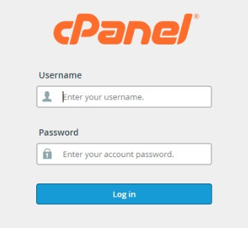
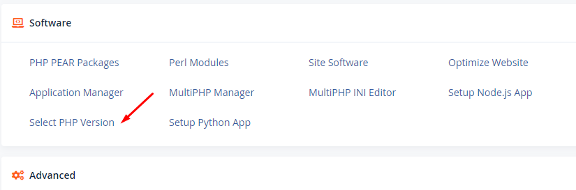
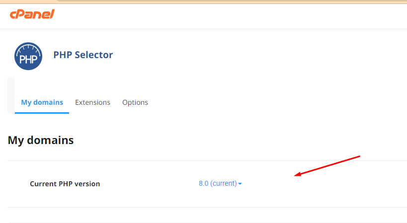
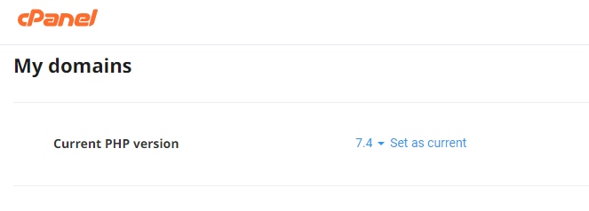
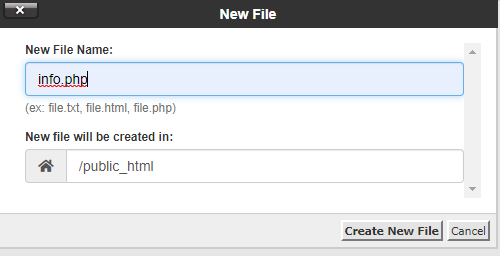
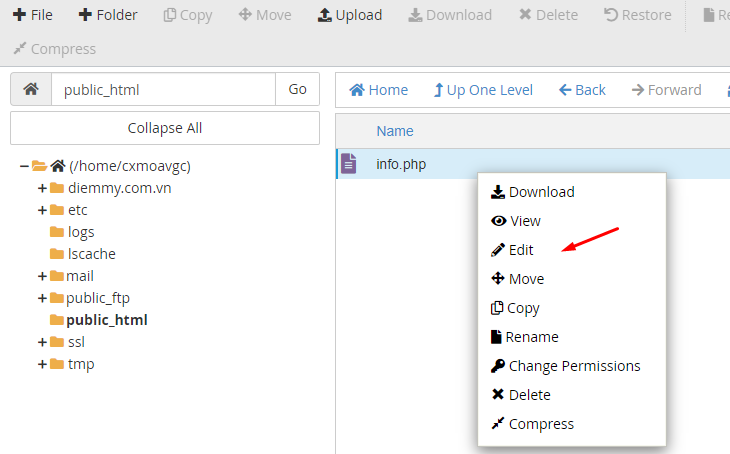
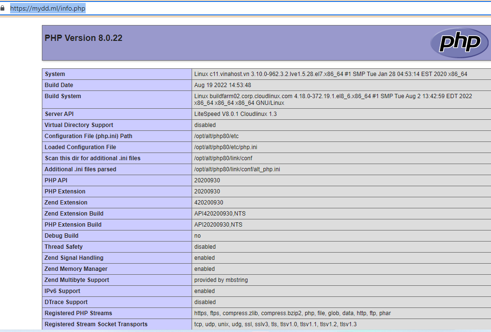

Bài viết này sẽ hướng dẫn bạn cách **Kiểm Tra Và Thay Đổi PHP Version Trên Hosting Cpanel**. Nếu bạn cần hỗ trợ, xin vui lòng liên hệ VinaHost qua Hotline 1900 6046 ext.3, email về support@vinahost.vn hoặc chat với VinaHost qua livechat https://livechat.vinahost.vn/chat.php.

## **1\. Kiểm tra version PHP**

Bước 1: Đăng nhập vào hosting.

Bước 2: Tại **Software,** chọn **Select PHP Version.**

Tại đây, bạn sẽ thấy version của hosting là version bao nhiêu.

## **2\. Thay đổi PHP version trên hosting cPanel**

Tại **Select PHP Version,** click vào dấu tam giác, chọn version bạn muốn thay đổi, sau đó click **Set as current** để thay đổi:

****

Kiểm tra thông tin PHP với File Info

Bước 1: Tạo file info

\-  Bạn tạo trực tiếp qua **File Manager**.

\-  Chọn File và click tạo:

Bước 2: Sửa file:

\- Cấu trúc Edit:

<?php
phpinfo();
?>

\- Sau đó click Save Changes.

Bước 3: Kiểm tra

\-  Đầu tiên bạn vào trình duyệt bất kỳ, sau đó truy cập theo cấu trúc [https://ten\_website.com/ten\_file.php](https://ten_website.com/ten_file.php) (ví dụ như [https://mydd.ml/info.php](https://mydd.ml/info.php)) và ra được data như hình dưới là thành công:

Chúc quý khách thực hiện thành công!

> **THAM KHẢO CÁC DỊCH VỤ TẠI [VINAHOST](https://kb.vinahost.vn/)**
> 
> **\>>** [**SERVER**](https://vinahost.vn/thue-may-chu-rieng/) **–** [**COLOCATION**](https://vinahost.vn/colocation.html) – [**CDN**](https://vinahost.vn/dich-vu-cdn-chuyen-nghiep)
> 
> **\>> [CLOUD](https://vinahost.vn/cloud-server-gia-re/) – [VPS](https://vinahost.vn/vps-ssd-chuyen-nghiep/)**
> 
> **\>> [HOSTING](https://vinahost.vn/wordpress-hosting)**
> 
> **\>> [EMAIL](https://vinahost.vn/email-hosting)**
> 
> **\>> [WEBSITE](http://vinawebsite.vn/)**
> 
> **\>> [TÊN MIỀN](https://vinahost.vn/ten-mien-gia-re/)**
