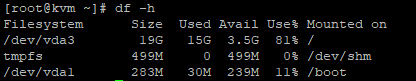
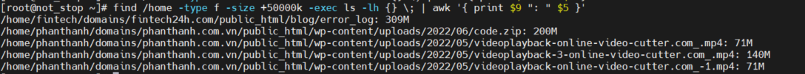
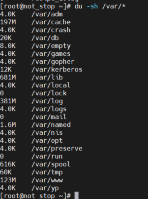

Bài viết này sẽ hướng dẫn bạn **Kiểm Tra Và Xử Lý VPS Khi Bị Đầy Ổ Cứng**. Nếu bạn cần hỗ trợ, xin vui lòng liên hệ VinaHost qua **Hotline 1900 6046 ext.3**, email về [support@vinahost.vn](mailto:support@vinahost.vn) hoặc chat với VinaHost qua livechat [https://livechat.vinahost.vn/chat.php](https://livechat.vinahost.vn/chat.php).

## **1\. Lý do phải Kiểm Tra Và Xử Lý VPS Khi Bị Đầy Ổ Cứng**

Việc đầy ổ cứng sẽ dẫn đến việc website trên VPS của bạn bị treo tạm thời. Điều này sẽ gây tổn thất đến việc hoạt động của bạn. Vậy bạn đã biết cách xử lý vấn đề này chưa. Nếu chưa thì chúng ta cùng bắt tay vào tìm hiểu và xử lý nhé.

## **2\. Hướng Dẫn Kiểm Tra Và Xử Lý VPS Khi Bị Đầy Ổ Cứng**

**Bước 1:** SSH vào VPS của bạn

**Bước 2:** Chúng ta sử dụng df -h để kiểm tra xem dung lượng ổ cứng của mình đã full chưa nhé.

\# df -h

Cụ thể như sau:

- **Size**: tổng dung lượng ổ cứng
- **Used**: dung lượng đã sử dụng
- **Avail**: dung lượng còn trống
- **Use%**: phần trăm dung lượng đã sử dụng.

**Bước 3:** Tìm và liệt kê ra các file có dung lượng lớn mà chúng ta không còn sử dụng hoặc không cần thiết.

Chúng ta có thể sử dụng lệnh sau:

\# find /home -type f -size +500000k -exec ls -lh {} \\; | awk '{ print $9 ": " $5 }

Lưu ý: Lệnh trên sẽ liệt kê các file có dung lượng >= 500000 KB (~500MB) và đường dẫn chưa file đó.

**Bước 4**: Chúng ta cũng có thể sử dụng lệnh sau:

\# du -sh \*

Lệnh này nhằm liệt kê ra các thư mục đang chiếm dung lượng VPS của bạn.

Ở đây thư mục log đang chúng ta tiếp tục sử dụng lệnh: # du -sh /var/log \* để xem tiếp thư mục nào chiếm dụng dung lượng nhé.

Lưu ý: Không nên xóa các file log trong thư mục httpd và nginx nhé

**Bước 5:** Hãy xác định những file không cần thiết và tiến hành xóa bằng lệnh sau:

\# rm -rf /đường dẫn/thư mục/file

Sau khi hoàn thành chúng ta sử dụng lệnh # df -h để kiểm tra xem ổ cứng VPS chúng ta đã trống được bao nhiêu GB. Nếu vẫn còn tình trạng full disk thì chúng ta có thể thực hiện tiếp các bước trên.

Hoặc cách xử lý nhanh nhất là chúng ta có thể nâng cấp dung lượng ổ cứng.

Chúc bạn thực hiện **Kiểm Tra Và Xử Lý VPS Khi Bị Đầy Ổ Cứng** thành công!

> **THAM KHẢO CÁC DỊCH VỤ TẠI [VINAHOST](https://vinahost.vn/)**
> 
> **\>>** [**SERVER**](https://vinahost.vn/thue-may-chu-rieng/) **–** [**COLOCATION**](https://vinahost.vn/colocation.html) – [**CDN**](https://vinahost.vn/dich-vu-cdn-chuyen-nghiep)
> 
> **\>> [CLOUD](https://vinahost.vn/cloud-server-gia-re/) – [VPS](https://vinahost.vn/vps-ssd-chuyen-nghiep/)**
> 
> **\>> [HOSTING](https://vinahost.vn/wordpress-hosting)**
> 
> **\>> [EMAIL](https://vinahost.vn/email-hosting)**
> 
> **\>> [WEBSITE](http://vinawebsite.vn/)**
> 
> **\>> [TÊN MIỀN](https://vinahost.vn/ten-mien-gia-re/)**
