Bài viết này sẽ hướng dẫn bạn cách **Migrate Server, VM Trên Alibaba Cloud Sử Dụng Sử Dụng Tool go2aliyun\_client.** Nếu bạn cần hỗ trợ, xin vui lòng liên hệ VinaHost qua **Hotline 1900 6046 ext. 3**, email về [support@vinahost.vn](mailto:support@vinahost.vn) hoặc chat với VinaHost qua livechat [https://livechat.vinahost.vn/chat.php](https://livechat.vinahost.vn/chat.php).

## 1\. Yêu cầu chung

**\* Lưu ý: Trước khi bạn sử dụng dịch vụ Mirgate của SMC, phải đáp ứng các yêu cầu sau:**

**(1) Đã kích hoạt dịch vụ RAM và cho phép SMC truy cập tài nguyên Cloud của mình**

Thao tác này chỉ cần thao tác một lần trong lần đầu sử dụng dịch vụ SMC.

Khi lần đầu sử dụng sẽ nhận được thông báo như hình, bấm vào **Authorize** sau đó làm theo hướng dẫn để kích hoạt.

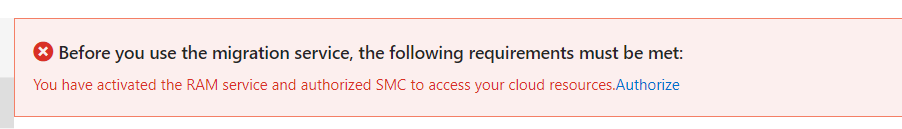

**(2) Đã Active Snapshot Service**

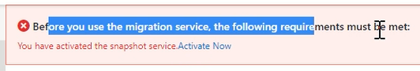

Tương tự như trên bạn cần clicks vào **Active Now** một lần trong lần đầu sử dụng và làm theo hướng dẫn.

**\* Yêu cầu:**

- Server/VM có thể SSH, tắt Selinux/Firewall
- Cài đặt Rsync, wget, gzip, unzip.

## 2\. Hướng dẫn thực hiện Migrate Server, VM Trên Alibaba Cloud Sử Dụng Tool go2aliyun\_client

<iframe title="YouTube video player" src="https://www.youtube.com/embed/qHwJtFZbofs" width="560" height="315" frameborder="0" allowfullscreen="allowfullscreen" data-mce-fragment="1"></iframe>

_Video Hướng Dẫn Migrate Server, VM Trên Alibaba Cloud Sử Dụng Tool go2aliyun\_client_

### **Bước 1: Vào trang SMC để lấy đường links tải tool về**

Link có thể lấy như hình ảnh hoặc sử dụng link sau:

[https://p2v-tools.oss-cn-hangzhou.aliyuncs.com/smc/Alibaba\_Cloud\_Migration\_Tool.zip](https://p2v-tools.oss-cn-hangzhou.aliyuncs.com/smc/Alibaba_Cloud_Migration_Tool.zip)

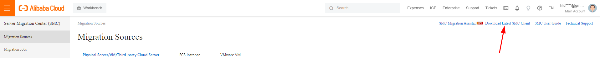

### **Bước 2: SSH vào server/VM cần chuyển dùng wget để tải File về**

Sử dụng link sau:

[https://p2v-tools.oss-cn-hangzhou.aliyuncs.com/smc/Alibaba\_Cloud\_Migration\_Tool.zip](https://p2v-tools.oss-cn-hangzhou.aliyuncs.com/smc/Alibaba_Cloud_Migration_Tool.zip)

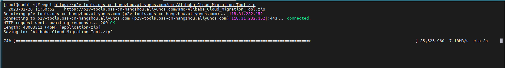

### **Bước 3: Unzip các file và tools tùy vào OS của VM**

**Unzip** các file vừa tải về ra

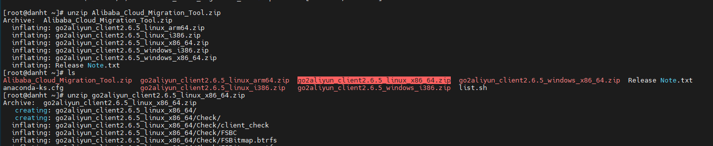

Sau khi **unzip file Alibaba\_Cloud\_Migration\_Tool.zip,** bạn chọn tool đúng với hệ điều hành mà **Server/VM** đang dùng để unzip.

### **Bước 4: Cấu hình Access ID và Sercet ID**

Đầu tiên cần lấy đc Acces ID và Sercet ID

Vào  [Alibaba Cloud Management Console](https://home-intl.console.aliyun.com/) \=> chọn phần **AccessKey Management**.

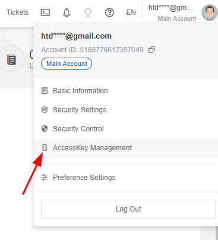

Chọn **Use Curent Access Key**

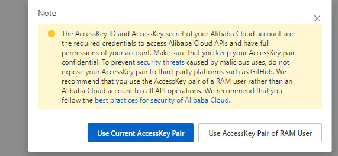

Tại đây có thể tạo key mới hoặc sử dụng key cũ

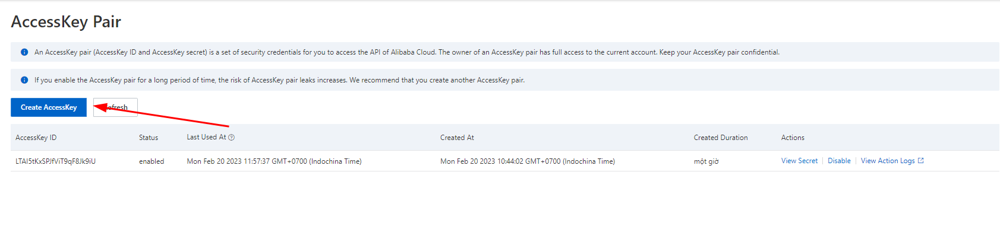

Chọn **view secret** để lấy **secret id**

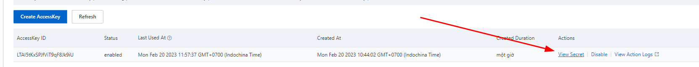

Có thể tham khảo cách lấy tại links sau: [https://www.alibabacloud.com/help/en/basics-for-beginners/latest/obtain-an-accesskey-pair](https://www.alibabacloud.com/help/en/basics-for-beginners/latest/obtain-an-accesskey-pair)

**Có 2 cách:**

- Cách 1: Chỉnh sửa trực tiếp tại **file user\_config.json**

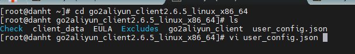

Điền **access key id** và **secret key id** tại đây

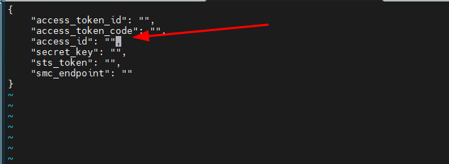

- Cách 2: chạy trực tiếp trên **script.**

./go2aliyun\_client --accessid=<AccessKey ID> --secretkey=<AccessKey Secret>

### **Bước 5: Chạy tool tiến hành import**

Tiến hành chạy **script go2aliyun\_client**

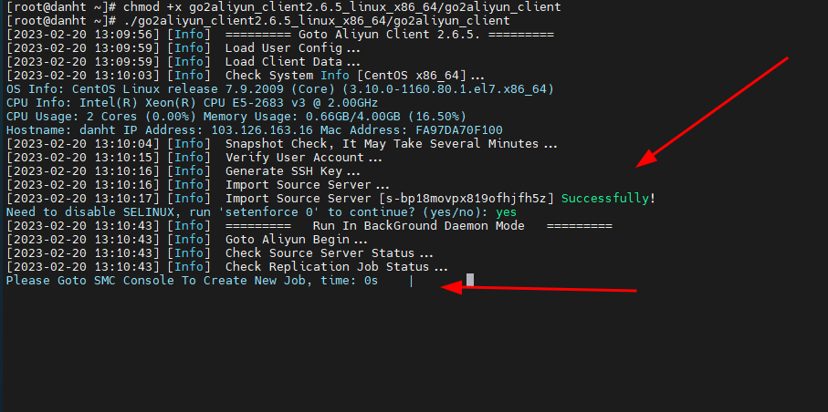

Khi có thông báo **Suscessfully** và **Go to SMC console to Create New Job**, thì truy cập trang web: [https://smc.console.aliyun.com/sourceServers](https://smc.console.aliyun.com/sourceServers) để tạo Migrate Jobs.

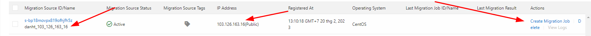

Khi tạo **Migrate Jobs** thì trên **server** sẽ thể hiện như sau:

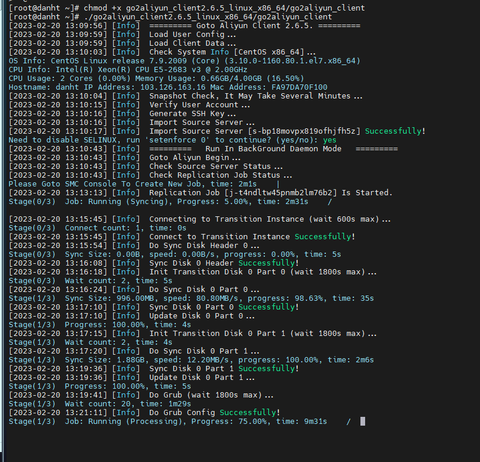

**\* Lưu ý:**

- Sau khi tạo và bắt đầu Migrate, hãy đảm bảo rằng **Server/VM đang phải online** cho đến khi công việc hoàn thành. Nếu không, quá trình Migrate sẽ không thành công.
- Sau khi công việc **Migrate** bắt đầu, một phiên bản trung gian sẽ được tạo. Không thực hiện các thao tác trên VM này. Nếu không, lỗi có thể xảy ra.
- Thời gian **Migrate Server, VM** phụ thuộc vào dung lượng dữ liệu và băng thông mạng. Nếu khối lượng dữ liệu lớn hoặc băng thông mạng nhỏ, quá trình **Migrate** có thể mất nhiều thời gian. Trong trường hợp này, bạn có thể đợi hoặc chuyển qua mạng **Express Connect.**

Lúc này nên đợi hệ thống thực hiện xong, bạn không nên thao tác trong thời gian này.

Chúc bạn thực hiện **Migrate Server, VM Trên Alibaba Cloud Sử Dụng Tool go2aliyun\_client** thành công!

\> Tham khảo [Hướng Dẫn Migrate Server, VM Trên Alibaba Cloud Sử Dụng SSH](https://kb.vinahost.vn/migrate-server-vm-tren-alibaba-cloud-su-dung-ssh/)

> **THAM KHẢO CÁC DỊCH VỤ TẠI [VINAHOST](https://kb.vinahost.vn/)**
> 
> **\>>** [**SERVER**](https://vinahost.vn/thue-may-chu-rieng/) **–** [**COLOCATION**](https://vinahost.vn/colocation.html) – [**CDN**](https://vinahost.vn/dich-vu-cdn-chuyen-nghiep)
> 
> **\>> [CLOUD](https://vinahost.vn/cloud-server-gia-re/) – [VPS](https://vinahost.vn/vps-ssd-chuyen-nghiep/)**
> 
> **\>> [HOSTING](https://vinahost.vn/wordpress-hosting)**
> 
> **\>> [EMAIL](https://vinahost.vn/email-hosting)**
> 
> **\>> [WEBSITE](http://vinawebsite.vn/)**
> 
> **\>> [TÊN MIỀN](https://vinahost.vn/ten-mien-gia-re/)**
