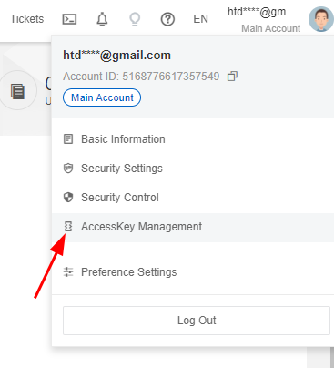

Bài viết này sẽ hướng dẫn bạn cách **Migrate server, VM sử dụng OS Windows bằng Alibaba Cloud Migration Tool****.** Nếu bạn cần hỗ trợ, xin vui lòng liên hệ VinaHost qua **Hotline 1900 6046 ext. 3**, email về [support@vinahost.vn](mailto:support@vinahost.vn) hoặc chat với VinaHost qua livechat [https://livechat.vinahost.vn/chat.php](https://livechat.vinahost.vn/chat.php).

Qua bài [Hướng Dẫn Migrate Server, VM Lên Alibaba Cloud Sử Dụng SSH](https://kb.vinahost.vn/migrate-server-vm-len-alibaba-cloud-su-dung-ssh/) và bài Hướng Dẫn Migrate Server, VM Lên Alibaba Cloud Sử Dụng Tool go2aliyun\_client, bạn đã biết cách Migrate các VM với OS Linux đến Aliabba Cloud. Tuy nhiên đối với OS Windown vốn không phải OS hỗ trợ quá sâu về hệ thống sẽ không thể Migrate như đối với Linux.

Hôm nay mình sẽ hướng dẫn các bạn Migrate VM với OS windown đến Alibaba Cloud. Bạn có thể xem qua video hướng dẫn demo dưới đây:

<iframe title="VinaHost.vn | Migrate server, VM sử dụng OS Windows bằng Alibaba Cloud Migration Tool" src="https://www.youtube.com/embed/s70rgKznf2g" width="640" height="360" frameborder="0" allowfullscreen="allowfullscreen"></iframe>

## **Một số lưu ý trước khi tiến hành Migrate**

**Server Migration Center (SMC)** để chuyển server từ Physical Server/VM/Third-party Cloud Server/ECS Alibabacloud/VMWare về Alibabacloud (hoặc có thể migrate các VM giữa các khu vực với nhau)

Link dịch vụ: [https://smc..aliyun.com/](https://smc.console.aliyun.com/)

**\*\* Lưu ý:** Trước khi bạn sử dụng dịch vụ Mirgate của SMC, phải đáp ứng các yêu cầu sau: Đã  kích hoạt dịch vụ RAM và cho phép SMC truy cập tài nguyên Cloud của mình.

Thao tác này chỉ cần thao tác một lần trong lần đầu sử dụng dịch vụ SMC.

Khi lần đầu sử dụng sẽ nhận được thông báo như hình, bấm vào **Authorize** sau đó làm theo hướng dẫn để kích hoạt.

Đã **Active Snapshot Service**

Tương tự như trên bạn cần clicks vào **Active Now** một lần trong lần đầu sử dụng và làm theo hướng dẫn.

Yêu cầu trước khi tiến hành Migrate:

- Đối với server windows cần cài OpenSSH cho Windows
- Đối với việc cài đặt Open SSH lên Windows nếu chưa cài đặt có thể tham khảo [Link](https://kb.vinahost.vn/cai-dat-openssh-server-tren-windows/).
- Tắt **Firewall** trên Windown.
- Đảm bảo VM có thể kết nối đến: https://smc.aliyuncs.com:443.
- Đảm bảo rằng Volume Shadow Copy Service (VSS) đã được bật.
- Ngoài ra đối với **Windows** cần thêm một số lưu ý về Giấy phép bản quyền Windows, sau khi migrate các bản quyền có thể trở nên không hợp lệ lúc này cần liên lạc với bên cung cấp bản quyền Windows để phối hợp kích lại giấy phép trên VM mới.
- **QEMU Guest Agent** đã được cài đặt chưa. Nếu QEMU Guest Agent được cài đặt, bạn phải gỡ cài đặt nó.

Nếu có các câu hỏi khác về SMC có thể tham khảo các câu trả lời tại [SMC FAQ](https://www.alibabacloud.com/help/en/server-migration-center/latest/smc-faq#section-22e-ozc-d0w) hoăc [links.](https://www.alibabacloud.com/help/en/server-migration-center/latest/smc-faq#section-22e-ozc-d0w)

## **Bắt đầu quá trình Migrate**

### Bước 1: Chuẩn bị môi trường

Cài đặt SMC Agent trên server/VM đang chạy trên máy chủ cục bộ của bạn và kết nối nó với tài khoản Alibaba Cloud của bạn. Bạn có thể tải xuống **SMC Agent** từ trang web chính thức của Alibaba Cloud tại [links](https://p2v-tools.oss-cn-hangzhou.aliyuncs.com/smc/Alibaba_Cloud_Migration_Tool.zip).

Sau khi tải về chọn phiên bản phù hợp với VM cần Migrate và giải nén.

Vào thư mục vừa được giải nén  sẽ thấy các file **exe và json**.

Sau khi giải nén tools hoàn tất thì bắt đầu liên kết SMC Agent với tài khoản Alibaba của mình bằng cách edit trực tiếp vào file Json, hoặc chạy các file **go2aliyun\_client.exe** (nếu bạn muốn sử dụng màn hình console của Win) hoặc **go2aliyun\_gui.exe** (nếu bạn muốn sử dụng giao diện GUI) để điền token ID/Token code (**AcessKey ID/AccessKey Secret**)

Nếu chưa biết cách lấy **AcessKey ID/AccessKey Secret** thì có thể làm theo hướng dẫn sau:

_Cách nhận Access ID và Sercet ID_

Vào [Alibaba Cloud Management Console](https://home-intl.console.aliyun.com/) => chọn phần **AccessKey Management**.

Chọn **Use Curent Access Key**

Tại đây có thể tạo key mới hoặc sử dụng key cũ

Chọn **View secret** để lấy **SecretKey ID**

Có thể tham khảo cách lấy tại [link.](https://www.alibabacloud.com/help/en/basics-for-beginners/latest/obtain-an-accesskey-pair)

Sau khi điền thông tin vào TọkenID và Token code thì bấm Start (nếu dùng Gui) và Enter (nếu dùng console).

Sau khi thấy thông báo Goto SMC Console thì tiến hành vào tranh web của SMC để tiến hành bước kế tiếp.

### Bước 2: Thực hiện việc migrate

Vào **Migration Source** tại **SME console** -> vào phần **Migration Source**.

Chọn **Create Migration Job** để tiến hành **Migrate.**

Chọn thông số như khu vực và các thông số khác bạn mong muốn sau đó click **Create** để bắt đầu.

Quá trình migrate sẽ tiến hành và bạn có thể theo dõi nó từ giao diện của **SMC** => Phần **Migration Jobs**.

Hoặc có thể kiểm tra ngay trên **Go2ailiyun\_Gui**.

**Lưu ý :**

1. Sau khi tạo và bắt đầu công việc Migrate, hãy đảm bảo rằng Server/VM đang phải online cho đến khi công việc hoàn thành. Nếu không, công việc Migrate không thành công.
2. Sau khi công việc Migrate bắt đầu, một phiên bản trung gian sẽ được tạo. Không thực hiện các thao tác trên cá thể. Nếu không, lỗi có thể xảy ra.
3. Thời gian Migrate phụ thuộc vào dung lượng dữ liệu và băng thông mạng. Nếu khối lượng dữ liệu lớn hoặc băng thông mạng nhỏ, quá trình Migrate có thể mất nhiều thời gian. Trong trường hợp này,có thể đợi hoặc chuyển qua mạch Express Connect.

Lúc này bạn chỉ đợi load cho xong, tốt nhất đừng nên tác động gì vào.

### Bước 3: Tạo ESC Instance

Sau khi trạng thái status đã thông báo **Completed** thì quá trình migrate đã hoàn thành, có thể chọn **Create Instance** để tạo một **ESC Instance** mới trên Alibaba Cloud.

Khi tạo **ESC Instance** bạn hãy chọn Images theo như tên mà bạn đã đặt ở bước trước đó.

Sau khi quá trình **Migrate** hoàn tất, kiểm tra **server/VM** mới để đảm bảo rằng nó hoạt động bình thường và chứa đầy đủ các dữ liệu cần thiết.

Đó là hướng dẫn để **migrate server/VM** sử dụng chức năng **Server Migration Center (SMC)** của **Alibaba Cloud với OS Windows**. Nếu bạn gặp phải bất kỳ vấn đề nào trong quá trình migrate, hãy liên hệ với bộ phận kỹ thuật của VinaHost qua email support@vinahost.vn để được giúp đỡ.

Chúc bạn thực hiện thành công!

> **THAM KHẢO CÁC DỊCH VỤ TẠI [VINAHOST](https://kb.vinahost.vn/)**
> 
> **\>>** [**SERVER**](https://vinahost.vn/thue-may-chu-rieng/) **–** [**COLOCATION**](https://vinahost.vn/colocation.html) – [**CDN**](https://vinahost.vn/dich-vu-cdn-chuyen-nghiep)
> 
> **\>> [CLOUD](https://vinahost.vn/cloud-server-gia-re/) – [VPS](https://vinahost.vn/vps-ssd-chuyen-nghiep/)**
> 
> **\>> [HOSTING](https://vinahost.vn/wordpress-hosting)**
> 
> **\>> [EMAIL](https://vinahost.vn/email-hosting)**
> 
> **\>> [WEBSITE](http://vinawebsite.vn/)**
> 
> **\>> [TÊN MIỀN](https://vinahost.vn/ten-mien-gia-re/)**
