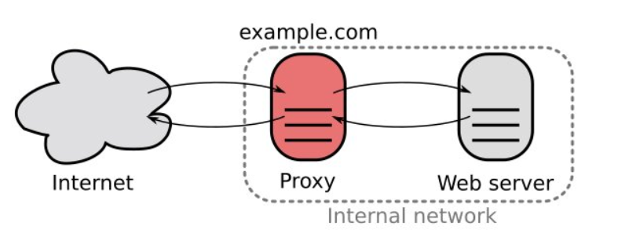
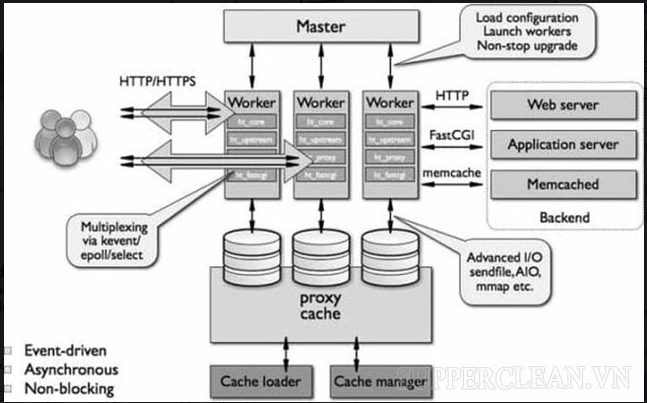
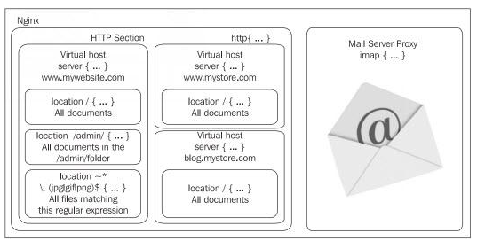
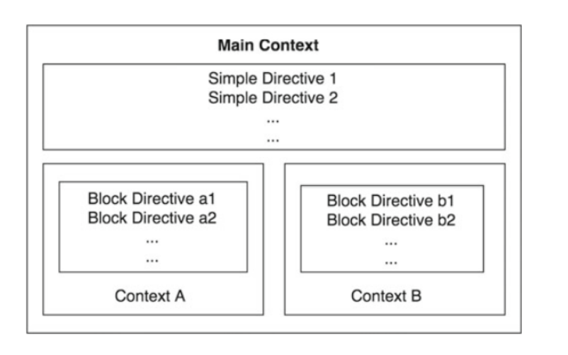
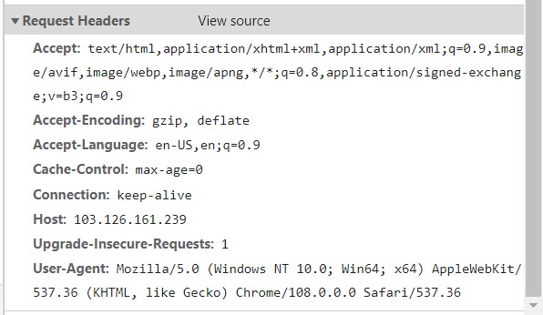
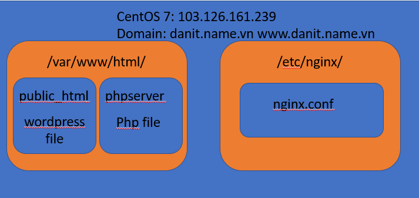
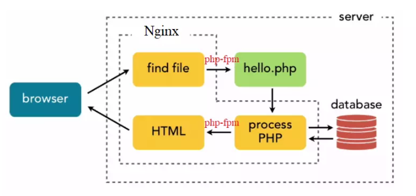

Bài viết này sẽ giới thiệu cho bạn biết **NGINX Là Gì** cũng như **Cơ Chế Hoạt Động & Chức Năng Của NGINX**. Nếu bạn cần hỗ trợ, xin vui lòng liên hệ VinaHost qua **Hotline 1900 6046 ext.3**, email về [support@vinahost.vn](mailto:support@vinahost.vn) hoặc chat với VinaHost qua livechat [https://livechat.vinahost.vn/chat.php](https://livechat.vinahost.vn/chat.php).

## 1\. Nginx là gì

### 1.1. Web server là gì và tại sao cần web server

Khi phát triển các ứng dụng web, ta có thể chạy thử nghiệm trên local mà không cần phải cài thêm web server. Nhưng khi phát triển thành sản phẩm cho cộng đồng sử dụng, có rất nhiều vấn đến phát sinh như cân bằng tải, chuyển hương url, SSL, domain,…, nhiều web app cùng chạy trên 1  server,…, tất cả điều đó khiến ta cần 1 web server để xử lý.

Đơn giản hơn, khi user gửi 1 request đến máy chủ, ứng dụng web server (nginx, apache,…) sẽ nhận request, và đưa ra các xử lý phù hợp như xác định url, chuyển hướng request đến web app, nhận kết quả trả về từ web app và trả về cho user.

### 1.2. Nginx là gì

Nginx là một web server mạnh mẽ, mã nguồn mở, miễn phí và được nhiều người sử dụng. Ra mắt lần đầu năm 2004. Thuộc 1 công ty có trụ sở tại Mỹ.

Các tính năng cơ bản của Nginx:

- Xử lý 10000 kết nối cùng lúc.
- Xử lý static file, index file và tự động lập chỉ mục.
- Reverse proxy với bộ nhớ đệm (HTTP caching).
- Cân bằng tải
- Hỗ trợ TLS/SSL (TLS là một phiên bản mới của SSL).
- Hỗ trợ FastCGI, SCGI, uWSGI.
- Virtual Host
- Tương thích với IPv6
- Redirect URL
- Hỗ trợ truyền tải file FLV và MP4.
- và nhiều tính năng mạnh mẽ khác.
- Có thể dùng Nginx làm Webserver, Reverse Proxy, Mail proxy,… Load Balancer.

### 1.3. Reverse Proxy và Webserver

Webserver là máy có vai trò lắng nghe các request http và trả về phản hồi hay dữ liệu phù hợp.

Trong mô hình web ta có server và client. Với Reverse Proxy, nó đóng vai trò là server nhận request từ client sau đó nó đóng vai trò là 1 client để gửi request đến server phù hợp. Nhận trả lời từ server và gửi phản hồi đó đó đến client ban đầu như thể nó là webserver.

Điều này dẫn đến ta có thể cấu hình Reverse Proxy làm Load Balancing do nó có thể phân phối các request của mình đến các server phù hợp. Nó được quyền lựa chọn server nào mà nó sẽ gửi request đến (nên ta có thể triển khai thuật toán load balancing để lựa chọn server phù hợp).

Đồng thời nó cũng giúp bảo vệ các server trong mạng, do đối với người ngoài (client), chỉ nhìn thấy Reverse Proxy như 1  web server duy nhất, và trong trường hợp có người muốn tấn công web server, Revevrse Proxysẽ bị tấn công (do với người ngoài, xem Reverse Proxy là web server), nhưng web server vẫn an toàn. Và ta có thể kịp thời cảnh giác khi biết được có người có ý định tấn công hệ thống.

Tóm lại, Reverse Proxy làm trung gian giữa người dùng (client) và các web server.

## 2\. Cài đặt

### 2.1. Cài đặt Nginx trên CentOS 7:

<table><tbody><tr><td width="963"><pre>sudo yum install epel-release -y
sudo yum install nginx</pre></td></tr></tbody></table>

Thêm repo epel – một repo dành cho nhánh RedHat để dễ dàng quản lý và cài đặt các gói phần mềm mới nhất.

Cài đặt nginx bằng yum.

Lưu ý: có thể cấu hình firewall để nginx có thể hoạt động bình thường.

<table><tbody><tr><td width="963"><pre>systemctl status nginx
systemclt enable nginx</pre></td></tr></tbody></table>

Câu lệnh trên dùng để kiểm tra tình trạng của nginx trên máy. Nếu ngĩn đang chạy bình thường thì sẽ có trạng thái active (running).  Lệnh enable để nginx có thể khởi động cùng hệ thống.

Sau khi cài đặt xong có thể gõ [http://IP](http://IP) để kiểm tra.

## 3\. Cấu hình Nginx

### 3.1. Hoạt động cơ bản của Nginx

Về cơ bản, Nginx hoạt động theo kiến trúc bất đồng bộ, hướng sự kiện. Nginx cho phép các thread tương tự nhau được quản lý trong cùng 1 process. Mỗi process bao gồm các worker connection có nhiệm vụ xử lý các threads.

Thay vì phải tạo process mới để phục vụ cho mỗi request đến. Nginx có một master process để điều khiển và duy trì các worker process. Mỗi worker process sẽ thực hiện các công việc cụ thể (xử lý các threads). Bất đồng bộ nghĩ là các request có thể được xử lý đồng thời trong các worker process, mà không bị blocking.

### 3.2. File cấu hình nginx.conf

Các cấu hình chính của nginx chủ yếu được định nghĩa ở thư mục /etc/nginx/ và file cấu hình chính là nginx.conf.

File cấu hình của Nginx gồm các context và các module. Một module chính của Nginx là http mudule, chứa những chỉ thị và biến liên quan đến http server.

Các module được điều khiển bởi các Directive (chỉ dẫn, hướng dẫn, chỉ thị). Directive có thể là 1 câu lệnh đơn, hoặc 1 khối các câu lệnh.

<table><tbody><tr><td width="963"><pre>user nginx;
worker_processes auto;
error_log /var/log/nginx/error.log;
pid /run/nginx.pid;
events {
 &nbsp;&nbsp; worker_connections 1024;
}
http {

 &nbsp;&nbsp; include&nbsp;&nbsp;&nbsp;&nbsp;&nbsp;&nbsp;&nbsp;&nbsp;&nbsp;&nbsp;&nbsp;&nbsp; /etc/nginx/mime.types;
 &nbsp;&nbsp; default_type&nbsp;&nbsp;&nbsp;&nbsp;&nbsp;&nbsp;&nbsp; application/octet-stream;
 &nbsp;&nbsp; server {
 &nbsp;&nbsp;&nbsp;&nbsp;&nbsp;&nbsp; listen&nbsp;&nbsp;&nbsp;&nbsp;&nbsp;&nbsp; 80;
 &nbsp;&nbsp;&nbsp;&nbsp;&nbsp;&nbsp; listen&nbsp;&nbsp;&nbsp;&nbsp;&nbsp;&nbsp; [::]:80;
 &nbsp;&nbsp;&nbsp;&nbsp;&nbsp;&nbsp; server_name&nbsp; _;
 &nbsp;&nbsp;&nbsp;&nbsp;&nbsp;&nbsp; root&nbsp;&nbsp;&nbsp;&nbsp;&nbsp;&nbsp;&nbsp;&nbsp; /usr/share/nginx/html;
 &nbsp;&nbsp;&nbsp;&nbsp;&nbsp;&nbsp; index index.html
 &nbsp;&nbsp;&nbsp;&nbsp;&nbsp;&nbsp; error_page 404 /404.html;
 &nbsp;&nbsp;&nbsp;&nbsp;&nbsp;&nbsp; location = /404.html {
 &nbsp;&nbsp;&nbsp;&nbsp;&nbsp;&nbsp; }
 &nbsp;&nbsp;&nbsp;&nbsp;&nbsp;&nbsp; error_page 500 502 503 504 /50x.html;
 &nbsp;&nbsp;&nbsp;&nbsp;&nbsp;&nbsp; location = /50x.html {
&nbsp;&nbsp;&nbsp;&nbsp;&nbsp;&nbsp;&nbsp; }

&nbsp;&nbsp;&nbsp; }</pre>}</td></tr></tbody></table>

Trên đây là 1 file cấu hình nginx cơ bản.

**Core Context** – Không đề cập.

**Main context** hay khối global context, định nghĩa tất cả các thiết lập dùng chung cho tất cả các context con. Chứa các context con, các câu lệnh đơn hoặc khối câu lệnh.

Dòng đầu tiên là khai báo các user sử dụng dịch vụ nginx ( trong file này user tên nginx), nếu không có user này tồn tại, thì được tạo tự động. Sau này khi cấu hình các file source web cần lưu ý cấp quyền cho user này có quyền cần thiết (read, wirte hoặc exe).

Dòng 2 khai báo số lượng các worker process. Nó là tham số liên quan đến hoạt động của Nginx. Mặc định là 1, nên để mặc định hoặc bằng với số core CPU.

**error\_log** (**access\_log**) chỉ định file lưu các error (access) và chỉ thị pid chỉ dẫn đường dẫn lưu pid của nginx server khi chạy.

**event context** liên quan đến đặc tính xử lý hướng sự kiện của nginx. Lệnh worker\_connections chỉ định số lượng woker connections mà mỗi worker process có thể xử lý được.

**http context** là 1 context quan trọng. Chỉ thị cho Nginx biết cách xử lý các request liên quan đến giao thức http.

Trong **http** bao gồm 1 số chỉ thị như:

- **Include:** bạn có thể viết các cấu hình bên ngoài file nginx.conf và dùng chỉ thị include để “ thêm nội dung file cấu hình của bạn” vào nginx.conf. Với ví dụ như trên, những cấu hình bạn viết trong file /etc/nginx/mime.types sẽ được “chèn” vào trong khối http. Kết quả giống như đang viết cấu hình trực tiếp trong file nginx.conf.
- **Gzip:** các chỉ thị liên quan đến gzip giúp nén dữ liệu trước gửi đến client giúp giảm kích thước dữ liệu gửi đi, hạn chế tiêu tốn băng thông.
- **Server context:** context này nằm trong http context, được phép khai báo nhiều lần. Dựa trên request từ client, Nginx sẽ lựa chọn server context phù hợp để phục vụ. Một số Direction để quyết định server nào sẽ phục vụ request là:
- **listen:** lắng nghe trên port, nếu request gửi đến port này thì server này sẽ xử lý. Nếu có 2 server như dưới đây, thì request gửi đến port 80 sẽ do server context trên xử lý, còn gửi port 443 sẽ do server context dưới xử lý.

<table><tbody><tr><td width="963"><pre>#main context
http{
 &nbsp;&nbsp; server{
 &nbsp;&nbsp;&nbsp;&nbsp;&nbsp; &nbsp;listen 80;
 &nbsp;&nbsp;&nbsp;&nbsp;&nbsp;&nbsp; server_name localhost;
 &nbsp;&nbsp; }
 &nbsp;&nbsp; server{
 &nbsp;&nbsp;&nbsp;&nbsp;&nbsp;&nbsp; listen 443;
 &nbsp;&nbsp;&nbsp;&nbsp;&nbsp;&nbsp; server_name localhost;
 &nbsp;&nbsp; }
}</pre></td></tr></tbody></table>

- **server\_name:** Nếu các server có cùng listen port, nginx sẽ phân tích trường host trong http header request để chọn server context có server\_name phù hợp.

- **Location context:** được đặt trong server context. Sau khi tìm được server context phù hợp, Nginx tiếp tục phân tích uri và lựa chọn location context phù hợp để xử lý.

Cú pháp của location context: location optional\_modifier location\_match. Trong đó optinal là các lựa chọn về regex. Location\_match là mẫu cụ thể để so sánh.

- **optinal\_modifier:** Các cách để so sánh uri của request và location\_match, có vài cách cơ bản như: (none) – đây là mặc định hay prefix match, nếu không để gì thì nginx sẽ hiểu là các uri bắt đầu bằng location\_match sẽ được context này xử lý (nghĩa là location match và các con của nó). Với ví dụ dưới đây, các uri như /admin, /admin1, /admin/index.html,…. Đều do location context này xử lý. Miễn là phần đầu của uri giống với location\_match.

<table><tbody><tr><td width="963"><pre>#server context
location /admin {…}</pre></td></tr></tbody></table>

-  **optinal\_modifier:** ngoài ra còn có một số lựa chọn khác như (=) – uri phải giống chính xác với location\_match thì context này mới xử lý. (~) – sử dụng regular expression để so sánh. (\*~) – như (~) nhưng cho phép cả hoa thường. Với ví dụ dưới thì chỉ có uri /site1 mới được context này xử lý. Uri như site1/site2 sẽ không được chấp nhận.

**Lưu ý: Nginx ưu tiên regex match trước. Nghĩa là nếu uri match cả prefix\_match và regex match thì location của regex match sẽ được chọn. Ta có thể đổi thiết lập này bằng ^~  location\_match để ưu tiên prefix match.**

<table><tbody><tr><td width="963"><pre>#server context
location =&nbsp; /site1 {…}</pre></td></tr></tbody></table>

Các uri có đuôi jpe, png, gif,… đều được context dưới xử lý (PNG thì không).

<table><tbody><tr><td width="963"><pre>location ~ \.(jpe?g|png|gif|ico)$ {…}</pre></td></tr></tbody></table>

**Các directive trong location context**:

- **root** : dùng cả server và location, chỉ ra đường dẫn của thư mục root, thư mục gốc.
- **index:** chỉ ra đường dẫn đến file mặc định (dùng đc trong server context). Có thể chỉ nhiều tập tin, tập tin nào tìm thấy đầu tiên sẽ được phục vụ trước.
- **try\_files:** trả về các tập tin được chỉ định, nếu không có thì nhảy sang location context khác hoặc 1 uri nào đó. Directive này cho phép nhảy từ location này sang location khác.

**Biến trong nginx:** Nginx cũng cho phép sử dụng biến. dùng directive set $<tên biến> <giá trị> để tạo biến. Nginx cũng có một số biến được định nghĩa sẵn như:

- $host: Lưu trữ hostname của server.
- $uri: Lưu trữ URI.
- $args: Lưu trữ query prams.
- Tham khảo them các biến tại: https://nginx.org/en/docs/varindex.html

**Vấn đề redirect và rewrite:**

- **Redirect** là chuyển hướng request từ đường dẫn này sang đường dẫn khác, hoạt động này sẽ làm thay đổi url trên thanh trình duyệt của client. Mã code trả về thường là 301 (chuyển hướng vĩnh viễn) hay 302, 307,…. (chuyển tạm thời). Thường dùng cú pháp return. Đơn giản, dễ sử dụng
- **Rewrite** là nginx sẽ đổi đường dẫn, nhưng không ảnh hưởng hay tác động gì ở phía client, nghĩa là client không hề biết đến hoạt động này (trừ khi rewrite gây ra redirect). Rewrite chỉ có mã code 301 và 302.  Thường dùng directive là rewrite. Lưu ý rằng sau khi rewrite, nginx sẽ lặp lại quá trình : tìm location phù hợp (cho url vừa rewrite) và thực hiện các directive trong location mới. Việc lặp lại không quá 10 lần. Cú pháp rewrite: rewrite regex change flag.

Cờ flag có break (dừng việc xử lý rewrite) last (dừng việc xử lý rewrite và tìm location phù hợp với url vừa thay đổi), redirect (chuyển hướng và trả về mã code 302), permanent (chuyển hướng và trả về mã 301). Tuy nhiên nếu sử dụng các cờ như redirect hay permanent cho rewrite thì nên cân nhắc sử dụng return vì rewrite xử lý chậm hơn.

- **Error\_page directive**: chỉ thị file trả về khi không tìm thấy tài nguyên cần thiết.
- **Upstream context:** xác định nhóm các máy chủ mà nginx có thể proxy request đến, nginx có thể chọn các máy chủ trong đây bằng Round-Robin để chọn (và cũng để cân bằng tải).
- **If context:** gồm if (điều kiện) {} dùng như lệnh if trong các ngôn ngữ lập trình khác. Điều kiện trong lệnh if tương tự như so sánh match của location context, có thể dùng regex hoặc so sánh =,…

## 4\. Ví dụ về cấu hình Nginx

### 4.1. Mô hình cơ bản

Ta có một server CentOS 7, có IP và domain, trong thư mục /var/www/html/public\_html chứa các file liên quan đến wordpress, thư mục /etc/nginx chưa các file cấu hình của nginx.

### 4.2. Cấu hình nginx phục vụ file tĩnh index.html

Tạo file index.html trong /var/www/html có nội dung “Hell world”.

Cấu hình file nginx.conf như sau:

<table><tbody><tr><td width="963"><pre>user nginx;
worker_processes auto;
error_log /var/log/nginx/error.log;
pid /run/nginx.pid;
events {
 &nbsp;&nbsp; worker_connections 1024;
}

http {
 &nbsp;&nbsp; server {
 &nbsp;&nbsp;&nbsp;&nbsp;&nbsp;&nbsp; listen&nbsp;&nbsp;&nbsp;&nbsp;&nbsp;&nbsp; 80;
 &nbsp;&nbsp;&nbsp;&nbsp;&nbsp;&nbsp; listen&nbsp;&nbsp;&nbsp;&nbsp;&nbsp;&nbsp; [::]:80;
 &nbsp;&nbsp;&nbsp;&nbsp;&nbsp;&nbsp; server_name&nbsp; _;
 &nbsp;&nbsp;&nbsp;&nbsp;&nbsp;&nbsp; root&nbsp;&nbsp;&nbsp;&nbsp;&nbsp;&nbsp;&nbsp;&nbsp; /var/www/html;
 &nbsp;&nbsp;&nbsp;&nbsp;&nbsp;&nbsp; index index.html;
 &nbsp;&nbsp; }
}</pre></td></tr></tbody></table>

**Giải thích:** chỉ có 1 server context, trả lời các request gửi đến port 80. (hoặc port 80 với IPv6).

Server\_name có thể là domain, wild card,… ở đây “\_” là server sẽ bắt tất cả các host name.

Root xác định đường dẫn đến thư mục root, là /var/www/html, đây là nơi lưu tập tin index.html

Index: chỉ định tập tin mặc định mà server sẽ trả về là index.html.

Khi Request được gửi tới với giao thức http (port 80), khối server sẽ được chọn để phục vụ. tập tin mặc định là index.html nằm trong thư mục /var/www/html sẽ được trả về cho request này. Kể cả gõ [http://103.126.161.129/](http://103.126.161.129/) hay [http://danit.name.vn/](http://danit.name.vn/) đều ra được. Nhưng nếu có thêm uri khác như /index.php ,… sẽ trả về 404 Not Found.

**Lưu ý:** gõ nginx -t để test format của file cấu hình và nginx -s reload để cập nhật file cấu hình vừa chỉnh sửa.

### 4.3. Cấu hình nginx trả về 2 trang web khi gõ IP và domain

<table><tbody><tr><td width="963"><pre>user nginx;
worker_processes auto;
error_log /var/log/nginx/error.log;
pid /run/nginx.pid;
events {
 &nbsp;&nbsp; worker_connections 1024;
}

http {
 &nbsp;&nbsp; server {
 &nbsp;&nbsp;&nbsp;&nbsp;&nbsp;&nbsp; listen&nbsp;&nbsp;&nbsp;&nbsp;&nbsp;&nbsp; 80;
 &nbsp;&nbsp;&nbsp;&nbsp;&nbsp;&nbsp; server_name&nbsp; _;
 &nbsp;&nbsp;&nbsp;&nbsp;&nbsp;&nbsp; root&nbsp;&nbsp;&nbsp;&nbsp;&nbsp;&nbsp;&nbsp;&nbsp; /var/www/html;
 &nbsp;&nbsp;&nbsp;&nbsp;&nbsp;&nbsp; index index.html;
&nbsp;&nbsp;&nbsp; }

 &nbsp; server {
 &nbsp;&nbsp;&nbsp;&nbsp;&nbsp;&nbsp; listen&nbsp; 80;
 &nbsp;&nbsp;&nbsp;&nbsp;&nbsp;&nbsp; server_name danit.name.vn;
 &nbsp;&nbsp;&nbsp;&nbsp;&nbsp;&nbsp; root&nbsp; /var/www/html;
 &nbsp;&nbsp;&nbsp;&nbsp;&nbsp;&nbsp; index index2.html;
&nbsp; }

}</pre></td></tr></tbody></table>

**Giải thích:** tạo 2 server context, đều nghe ở port 80 (http) có server name khác nhau. Khi ở trình duyệt gõ [http://IP](http://IP) thì sẽ nhận được file index.html, còn nếu gõ [http://danit.name.vn](http://danit.name.vn) thì nginx sẽ chọn server context 2 để phục vụ, và file index2.html sẽ được trả về.

### 4.4. Cấu hình SSL cho domain danit.name.vn

Tạo chứng chỉ SSL free Let Encrypt cho domain với nginx.

<table><tbody><tr><td width="963"><pre>yum install epel-release -y
yum install certbot-nginx&nbsp; -y
certbot --nginx -d danit.name.vn</pre></td></tr></tbody></table>

Sau khi chạy các lệnh, điền các option phù hợp, cerbot sẽ tự động tạo chứng chỉ ssl. Trong các option được chọn có option tự động cấu hình nginx hoặc cerbot chỉ tạo chứng chỉ và bạn phải tự cấu hình nginx thủ công.

Khi chọn tự động. Trong server context có server name giống với domain, cerbot sẽ add thêm cấu hình lắng nghe trên port 443 và tự động add thêm đường dẫn của các chứng chỉ vào nginx.

Sau khi cerbot chạy xong ta được:

<table><tbody><tr><td width="963"><pre>User nginx;
worker_processes auto;
error_log /var/log/nginx/error.log;
pid /run/nginx.pid;
events {
 &nbsp;&nbsp; worker_connections 1024;
}
http {
 &nbsp;&nbsp; server {
 &nbsp;&nbsp;&nbsp;&nbsp;&nbsp;&nbsp; server_name&nbsp; danit.name.vn www.danit.name.vn;
 &nbsp;&nbsp;&nbsp;&nbsp;&nbsp;&nbsp; root /var/www/html/;
 &nbsp;&nbsp;&nbsp;&nbsp;&nbsp;&nbsp; index index.html;
 &nbsp;&nbsp;&nbsp;&nbsp;&nbsp; listen [::]:443 ssl ipv6only=on; # managed by Certbot
 &nbsp;&nbsp;&nbsp;&nbsp;&nbsp; listen 443 ssl; # managed by Certbot
 &nbsp;&nbsp;&nbsp;&nbsp;&nbsp; ssl_certificate /etc/letsencrypt/live/danit.name.vn/fullchain.pem; # managed by Certbot
 &nbsp;&nbsp;&nbsp;&nbsp;&nbsp; ssl_certificate_key /etc/letsencrypt/live/danit.name.vn/privkey.pem; # managed by Certbot
 &nbsp;&nbsp;&nbsp;&nbsp;&nbsp; include /etc/letsencrypt/options-ssl-nginx.conf; # managed by Certbot
 &nbsp;&nbsp;&nbsp;&nbsp;&nbsp; ssl_dhparam /etc/letsencrypt/ssl-dhparams.pem; # managed by Certbot
}

 &nbsp;&nbsp; server {
 &nbsp;&nbsp;&nbsp;&nbsp;&nbsp; if ($host = danit.name.vn) {
 &nbsp;&nbsp;&nbsp;&nbsp;&nbsp;&nbsp;&nbsp;&nbsp;&nbsp; return 301 https://$host$request_uri;
 &nbsp;&nbsp;&nbsp;&nbsp;&nbsp; } # managed by Certbot
 &nbsp;&nbsp;&nbsp;&nbsp;&nbsp; listen&nbsp;&nbsp;&nbsp;&nbsp;&nbsp;&nbsp; 80;
 &nbsp;&nbsp;&nbsp;&nbsp;&nbsp; listen&nbsp;&nbsp;&nbsp;&nbsp;&nbsp;&nbsp; [::]:80;
 &nbsp;&nbsp;&nbsp;&nbsp;&nbsp; server_name&nbsp; _;
 &nbsp;&nbsp;&nbsp;&nbsp;&nbsp; return 404; # managed by Certbot
 &nbsp;&nbsp; }
}</pre></td></tr></tbody></table>

**Giải thích:** ở đây có server lắng nghe ở port 80, nếu người dùng sử dụng giao thức http, mà domain giống với domain đã đăng ký thì redirect qua link https sử dụng cú pháp return với mã 301.

Server đầu tiên có listen port là 443 (port mặc định cho các giao thức có mã hóa như htpps, rtmps,….). Các đường dẫn cho các file “chứng chỉ” và cấu hình cần thiết đã được Cerbot thêm vào tự động.

### 4.5. Cấu hình Nginx làm reverse proxy cho php server

Để cài đặt php có thể cài thêm repo phù hợp.

<table><tbody><tr><td width="963"><pre>wget http://rpms.remirepo.net/enterprise/remi-release-7.rpm
rpm -Uvh remi-release-7.rp
yum install yum-utils -yyum-config-manager --enable remi-php73yum --enablerepo=remi,remi-php73 install php-fpm php-common&nbsp;yum --enablerepo=remi,remi-php73 install php-opcache php-pecl-apcu php-cli php-pear php-pdo php-mysqlnd php-pgsql php-pecl-mongodb php-pecl-redis php-pecl-memcache php-pecl-memcached php-gd php-mbstring php-mcrypt php-xml&nbsp;hoặcsudo yum install php-cli php-fpm php-mysql php-json php-opcache php-mbstring php-xml php-gd php-curl</pre></td></tr></tbody></table>

Gõ php -v để kiểm tra version của php, tốt nhất từ 7.3 trở lên. Sau khi cài đặt php, tại thư mục var/www/html tạo file index.php với nội dung:

<table><tbody><tr><td width="963"><pre>&lt;?php
  $output = phpinfo();
  echo('&lt;div&gt;$output&lt;/div&gt;');
?&gt;</pre></td></tr></tbody></table>

Nội dung trên là chạy lệnh phpinfo() để lấy thông tin về phiên bản php đang có trong máy. Ta có thể cấu hình nginx trả về file index.php bằng cách thay lệnh “index index.html” thành “index index.php” nhưng nginx sẽ không chạy code php.

Nên cấu hình như vậy, khi client request sẽ hiển thị đoạn code trên lên cửa sổ trình duyệt chứ không phải là thông tin phiên bản php như mình mong muốn. Về cơ bản nginx chỉ phục vụ các trang web tĩnh (không cần chạy code tương tác với database,...).

Để đoạn code trên có thể chạy được, ta có 2 cách (ít nhất). Một là chạy file index.php với **php backend (php server)** và cấu hình nginx làm **reverse proxy** trỏ tới php server. Cách 2 là sử dụng **PHP-FPM** (viết tắt của FastCGI Process Manager là chương trình có chức năng phiên dịch PHP khi chạy trang web cho web server).

Nó có vai trò kết nối web server (Nginx) với các chương trình chạy bằng php. Nghĩa là Nginx chuyển các file php qua chop php-fpm thực thi code, và php-fpm sẽ trả kết quả về cho nginx, để nginx trả cho client.

- **Cách 1:**

Ở cách 1 cần chạy câu lệnh**: php -S IP:port**. Cụ thể là **php -S 103.126.161.139:8000**

Lúc này, php sẽ là 1 web server, khi có yêu cầu gửi đến port 8000, nó sẽ trả về thông tin phiên bản php đang sử dụng.

Tuy nhiên, với client, họ chỉ nhập domain, hoặc IP mà không quan tâm đến port, lúc này ta cấu hình Nginx như một reverse proxy, nhận request từ client, Nginx sẽ gửi request đến 103.126.161.139:8000, sau khi nhận câu trả lời sẽ gửi về cho client.

Cấu hình nginx như sau:

<table><tbody><tr><td width="963"><pre>user nginx;
worker_processes auto;
error_log /var/log/nginx/error.log;
pid /run/nginx.pid;
events {
 &nbsp;&nbsp; worker_connections 1024;
}
http {
 &nbsp;&nbsp; include&nbsp;&nbsp;&nbsp;&nbsp;&nbsp;&nbsp;&nbsp;&nbsp;&nbsp;&nbsp;&nbsp;&nbsp; /etc/nginx/mime.types;
 &nbsp;&nbsp; default_type&nbsp;&nbsp;&nbsp;&nbsp;&nbsp;&nbsp;&nbsp; application/octet-stream;
 &nbsp;&nbsp; server {
 &nbsp;&nbsp;&nbsp;&nbsp;&nbsp;&nbsp; listen&nbsp;&nbsp;&nbsp;&nbsp;&nbsp;&nbsp; 80;
 &nbsp;&nbsp;&nbsp;&nbsp;&nbsp;&nbsp; listen&nbsp;&nbsp;&nbsp;&nbsp;&nbsp;&nbsp; [::]:80;
 &nbsp;&nbsp;&nbsp;&nbsp;&nbsp;&nbsp; server_name&nbsp; _;
 &nbsp;&nbsp;&nbsp;&nbsp;&nbsp;&nbsp; location / {
 &nbsp;&nbsp;&nbsp;&nbsp;&nbsp; &nbsp;&nbsp;&nbsp;&nbsp;&nbsp;&nbsp;&nbsp;&nbsp;proxy_pass http://103.126.161.239:8000;
 &nbsp;&nbsp;&nbsp;&nbsp;&nbsp; }
 &nbsp;&nbsp; }
}</pre></td></tr></tbody></table>

Ở file cấu hình có directive là proxy\_pass, nó dùng để chỉ rằng Nginx đóng vài trò là proxy và chuyển hướng đến server thích hợp, ở đây là server 103.126.126.239 ở port 8000. Có thể dùng proxy\_pass với upstream context để biến Nginx thành bộ cân bằng tải.

- **Cách 2: Dùng php-fpm:**

Dùng lệnh systemctl status php-fpm để kiểm tra tình trạng dịch vụ có đang chạy không.

Để kết hợp với nginx, cần sửa cấu hình trong file /etc/php-fpm.d/www.conf như sau:

<table><tbody><tr><td width="963"><pre>...
user = nginx
...
group = nginx
...
listen = /run/php-fpm/www.sock
...
listen.owner = nginx
listen.group = nginx</pre></td></tr></tbody></table>

Chú ý đường dẫn ở listen để cấu hình nginx:

<table><tbody><tr><td width="963"><pre>user nginx;
worker_processes auto;
error_log /var/log/nginx/error.log;
pid /run/nginx.pid;
events {
 &nbsp;&nbsp; worker_connections 1024;
}
http {
 &nbsp;&nbsp; include&nbsp;&nbsp;&nbsp;&nbsp;&nbsp;&nbsp;&nbsp;&nbsp;&nbsp;&nbsp;&nbsp;&nbsp; /etc/nginx/mime.types;
 &nbsp;&nbsp; default_type&nbsp;&nbsp;&nbsp;&nbsp;&nbsp;&nbsp;&nbsp; application/octet-stream;
 &nbsp;&nbsp; server {
 &nbsp;&nbsp;&nbsp;&nbsp;&nbsp;&nbsp; server_name&nbsp; danit.name.vn;
 &nbsp;&nbsp;&nbsp;&nbsp;&nbsp;&nbsp; root /var/www/html/;
 &nbsp;&nbsp;&nbsp;&nbsp;&nbsp;&nbsp; index index.php;
 &nbsp;&nbsp;&nbsp;&nbsp;&nbsp;&nbsp; listen 80;
 &nbsp;&nbsp;&nbsp;&nbsp;&nbsp;&nbsp; # pass the PHP scripts to FastCGI server listening on 127.0.0.1:9000
 &nbsp;&nbsp;&nbsp;&nbsp;&nbsp;&nbsp; location ~ \.php$ {
 &nbsp;&nbsp;&nbsp;&nbsp;&nbsp;&nbsp;&nbsp;&nbsp;&nbsp;&nbsp; fastcgi_pass unix:/run/php-fpm/www.sock;
 &nbsp;&nbsp;&nbsp;&nbsp;&nbsp;&nbsp;&nbsp;&nbsp;&nbsp;&nbsp; fastcgi_index&nbsp;&nbsp; index.php;
 &nbsp;&nbsp;&nbsp;&nbsp;&nbsp;&nbsp;&nbsp;&nbsp;&nbsp;&nbsp; fastcgi_param SCRIPT_FILENAME $document_root$fastcgi_script_name;
 &nbsp;&nbsp;&nbsp;&nbsp;&nbsp;&nbsp;&nbsp;&nbsp;&nbsp;&nbsp; include fastcgi_params;
 &nbsp;&nbsp;&nbsp;&nbsp;&nbsp;&nbsp;&nbsp;&nbsp;&nbsp;&nbsp; include fastcgi.conf;
 &nbsp;&nbsp;&nbsp;&nbsp;&nbsp;&nbsp; }
 &nbsp;&nbsp;&nbsp;&nbsp; }
}</pre></td></tr></tbody></table>

Khi request gửi đến danit.name.vn port 80, tập tin index.php trong thư mcuj /var/www/html sẽ được trả về, nhưng lúc này chúng match với location context được định nghĩa là đường dẫn có đuôi .php. Lúc này nginx sẽ xử lý theo những directive trong location này.

Gồm có chuyển qua cho trình php-fpm đang chạy trong máy (theo đường dẫn lúc này đã cấu hình là /run/php-fpm/www.sock. Các directive khác là nâng cao. Đợi nó chạy code trong file index.php và trả kết quả về cho người dùng.

### 4.6. Cấu hình wordpress với nginx

Wordpress chạy trên php, và cần MySQL, có thể cài MariaDB hoặc MySQL đều được. Tải source code WordPress về, giải nén và đặt trong thư mục /var/www/html/public\_html

<table><tbody><tr><td width="963"><pre>wget http://wordpress.org/latest.tar.gz
tar -xfz latest.tar.gz</pre></td></tr></tbody></table>

Sau đó cấu hình file nginx.conf:

<table><tbody><tr><td width="963"><pre>user nginx;
worker_processes auto;
error_log /var/log/nginx/error.log;
pid /run/nginx.pid;
events {
worker_connections 1024;

}
http {
 &nbsp;&nbsp; include&nbsp;&nbsp;&nbsp;&nbsp;&nbsp;&nbsp;&nbsp;&nbsp;&nbsp;&nbsp;&nbsp;&nbsp; /etc/nginx/mime.types;
 &nbsp;&nbsp; default_type&nbsp;&nbsp;&nbsp;&nbsp;&nbsp;&nbsp;&nbsp; application/octet-stream;
 &nbsp;&nbsp; server {
 &nbsp;&nbsp;&nbsp;&nbsp;&nbsp;&nbsp; server_name&nbsp; danit.name.vn www.danit.name.vn;
 &nbsp;&nbsp;&nbsp;&nbsp;&nbsp;&nbsp; root /var/www/html/public_html;
 &nbsp;&nbsp;&nbsp;&nbsp;&nbsp;&nbsp; index index.php;
 &nbsp;&nbsp;&nbsp;&nbsp;&nbsp;&nbsp; error_page 404 /404.html;
 &nbsp;&nbsp;&nbsp;&nbsp;&nbsp;&nbsp; location = /404.html {
 &nbsp;&nbsp;&nbsp;&nbsp;&nbsp;&nbsp; }
 &nbsp;&nbsp;&nbsp;&nbsp; &nbsp; error_page 500 502 503 504 /50x.html;
 &nbsp;&nbsp;&nbsp;&nbsp;&nbsp;&nbsp; location = /50x.html 
 &nbsp;&nbsp;&nbsp;&nbsp;&nbsp;&nbsp; }
&nbsp;&nbsp;&nbsp;&nbsp;&nbsp;&nbsp;&nbsp; location ~ \.php$ {

 &nbsp;&nbsp;&nbsp;&nbsp;&nbsp;&nbsp;&nbsp;&nbsp; &nbsp; try_files $uri =404;
 &nbsp;&nbsp;&nbsp;&nbsp;&nbsp;&nbsp;&nbsp;&nbsp;&nbsp;&nbsp; fastcgi_pass unix:/run/php-fpm/www.sock;
 &nbsp;&nbsp;&nbsp;&nbsp;&nbsp;&nbsp;&nbsp;&nbsp;&nbsp;  fastcgi_index&nbsp;&nbsp; index.php;
 &nbsp;&nbsp;&nbsp;&nbsp;&nbsp;&nbsp;&nbsp;&nbsp;&nbsp;&nbsp; fastcgi_param SCRIPT_FILENAME $document_root$fastcgi_script_name;
 &nbsp;&nbsp;&nbsp;&nbsp;&nbsp;&nbsp;&nbsp;&nbsp;&nbsp;&nbsp; include fastcgi_params;
 &nbsp;&nbsp;&nbsp;&nbsp;&nbsp;&nbsp;&nbsp;&nbsp;&nbsp;&nbsp; include fastcgi.conf;
 &nbsp;&nbsp;&nbsp;&nbsp;&nbsp;&nbsp; }

 &nbsp;&nbsp;&nbsp;&nbsp;&nbsp; listen [::]:443 ssl ipv6only=on; # managed by Certbot
 &nbsp;&nbsp;&nbsp;&nbsp;&nbsp; listen 443 ssl; # managed by Certbot
 &nbsp;&nbsp;&nbsp;&nbsp;&nbsp; ssl_certificate /etc/letsencrypt/live/danit.name.vn/fullchain.pem; # managed by Certbot
 &nbsp;&nbsp;&nbsp;&nbsp;&nbsp; ssl_certificate_key /etc/letsencrypt/live/danit.name.vn/privkey.pem; # managed by Certbot
 &nbsp;&nbsp;&nbsp;&nbsp;&nbsp; include /etc/letsencrypt/options-ssl-nginx.conf; # managed by Certbot
 &nbsp;&nbsp;&nbsp;&nbsp;&nbsp; ssl_dhparam /etc/letsencrypt/ssl-dhparams.pem; # managed by Certbot
}
 &nbsp;&nbsp; server {
 &nbsp;&nbsp;&nbsp;&nbsp;&nbsp; if ($host = danit.name.vn) {
 &nbsp;&nbsp;&nbsp;&nbsp;&nbsp;&nbsp;&nbsp;&nbsp;&nbsp; return 301 https://$host$request_uri;
 &nbsp;&nbsp;&nbsp;&nbsp;&nbsp; } # managed by Certbot

 &nbsp;&nbsp;&nbsp;&nbsp;&nbsp; listen&nbsp;&nbsp;&nbsp;&nbsp;&nbsp;&nbsp; 80;
 &nbsp;&nbsp;&nbsp;&nbsp;&nbsp; listen&nbsp;&nbsp;&nbsp;&nbsp;&nbsp;&nbsp; [::]:80;
 &nbsp;&nbsp;&nbsp;&nbsp;&nbsp; server_name&nbsp; danit.name.vn www.danit.name.vn;
 &nbsp;&nbsp;&nbsp;&nbsp;&nbsp; return 404; # managed by Certbot
 &nbsp;&nbsp; }
}</pre></td></tr></tbody></table>

Ta chỉ cần điều chỉnh root thành /var/www/html/public\_html và index mặc định là file index.php là được, các cấu hình ssl, php-fpm vẫn giữ như cũ. Việc cấu hình wordpress và database chưa được đề cập trong báo cáo.

### 4.7. Tổng hợp

File cấu hình nginx:

<table><tbody><tr><td width="963"><pre>user nginx;
worker_processes auto;
error_log /var/log/nginx/error.log;
pid /run/nginx.pid;
events {
 &nbsp;&nbsp; worker_connections 1024;
}
http {
 &nbsp;&nbsp; include&nbsp;&nbsp;&nbsp;&nbsp;&nbsp;&nbsp;&nbsp;&nbsp;&nbsp;&nbsp;&nbsp;&nbsp; /etc/nginx/mime.types;
 &nbsp;&nbsp; default_type&nbsp;&nbsp;&nbsp;&nbsp;&nbsp;&nbsp;&nbsp; application/octet-stream;
 &nbsp;&nbsp; server {
 &nbsp;&nbsp;&nbsp;&nbsp;&nbsp;&nbsp; server_name&nbsp; danit.name.vn wwww.danit.name.vn;
 &nbsp;&nbsp;&nbsp;&nbsp;&nbsp;&nbsp; #root&nbsp;&nbsp;&nbsp;&nbsp;&nbsp;&nbsp;&nbsp;&nbsp; /usr/share/nginx/html;
 &nbsp;&nbsp;&nbsp;&nbsp;&nbsp;&nbsp; root /var/www/html/public_html;
 &nbsp;&nbsp;&nbsp;&nbsp;&nbsp;&nbsp; #index index.php;
 &nbsp;&nbsp;&nbsp;&nbsp;&nbsp;&nbsp; error_page 404 /404.html;
 &nbsp;&nbsp;&nbsp;&nbsp;&nbsp;&nbsp; location = /404.html {
 &nbsp;&nbsp;&nbsp;&nbsp;&nbsp;&nbsp; }
 &nbsp;&nbsp;&nbsp;&nbsp;&nbsp;&nbsp; error_page 500 502 503 504 /50x.html;
 &nbsp;&nbsp;&nbsp;&nbsp;&nbsp;&nbsp; location = /50x.html {
 &nbsp;&nbsp;&nbsp;&nbsp;&nbsp; }
 &nbsp;&nbsp;&nbsp;&nbsp;&nbsp;&nbsp; location ~ \.php$ {
 &nbsp;&nbsp;&nbsp;&nbsp;&nbsp;&nbsp;&nbsp;&nbsp;&nbsp; try_files $uri =404;
 &nbsp;&nbsp;&nbsp;&nbsp;&nbsp;&nbsp;&nbsp;&nbsp;&nbsp;&nbsp; fastcgi_pass unix:/run/php-fpm/www.sock;
 &nbsp;&nbsp;&nbsp;&nbsp;&nbsp; &nbsp;&nbsp;&nbsp;&nbsp;&nbsp;fastcgi_index&nbsp;&nbsp; index.php;
 &nbsp;&nbsp;&nbsp;&nbsp;&nbsp;&nbsp;&nbsp;&nbsp;&nbsp;&nbsp; fastcgi_param SCRIPT_FILENAME $document_root$fastcgi_script_name;
 &nbsp;&nbsp;&nbsp;&nbsp;&nbsp;&nbsp;&nbsp;&nbsp;&nbsp;&nbsp; include fastcgi_params;
 &nbsp;&nbsp;&nbsp;&nbsp;&nbsp;&nbsp;&nbsp;&nbsp;&nbsp;&nbsp; include fastcgi.conf;
 &nbsp;&nbsp;&nbsp;&nbsp;&nbsp;&nbsp; }
 &nbsp;&nbsp;&nbsp;&nbsp;&nbsp;&nbsp; location /testproxy {
 &nbsp;&nbsp;&nbsp;&nbsp;&nbsp;&nbsp;&nbsp;&nbsp;&nbsp;&nbsp; proxy_pass http://localhost:8000;
 &nbsp;&nbsp;&nbsp;&nbsp;&nbsp;&nbsp; }
 &nbsp;&nbsp;&nbsp;&nbsp;&nbsp;&nbsp; location / {
 &nbsp;&nbsp;&nbsp;&nbsp;&nbsp;&nbsp;&nbsp;&nbsp; index index.php;
 &nbsp;&nbsp;&nbsp;&nbsp;&nbsp;&nbsp; }
 &nbsp;&nbsp;&nbsp;&nbsp;&nbsp; listen [::]:443 ssl ipv6only=on; # managed by Certbot
 &nbsp;&nbsp;&nbsp;&nbsp;&nbsp; listen 443 ssl; # managed by Certbot
 &nbsp;&nbsp;&nbsp;&nbsp;&nbsp; ssl_certificate /etc/letsencrypt/live/danit.name.vn/fullchain.pem; # managed by Certbot
 &nbsp;&nbsp;&nbsp;&nbsp;&nbsp; ssl_certificate_key /etc/letsencrypt/live/danit.name.vn/privkey.pem; # managed by Certbot
 &nbsp;&nbsp;&nbsp;&nbsp;&nbsp; include /etc/letsencrypt/options-ssl-nginx.conf; # managed by Certbot
 &nbsp;&nbsp;&nbsp;&nbsp;&nbsp; ssl_dhparam /etc/letsencrypt/ssl-dhparams.pem; # managed by Certbot
}
 &nbsp;&nbsp; server {
&nbsp;&nbsp;&nbsp;&nbsp;&nbsp;&nbsp; if ($host = danit.name.vn) {
 &nbsp;&nbsp;&nbsp;&nbsp;&nbsp;&nbsp;&nbsp;&nbsp;&nbsp; return 301 https://$host$request_uri;
 &nbsp;&nbsp;&nbsp;&nbsp;&nbsp; } # managed by Certbot
 &nbsp;&nbsp;&nbsp;&nbsp;&nbsp; listen&nbsp;&nbsp;&nbsp;&nbsp;&nbsp;&nbsp; 80;
 &nbsp;&nbsp;&nbsp;&nbsp;&nbsp; listen &nbsp;&nbsp;&nbsp;&nbsp;&nbsp;&nbsp;[::]:80;
 &nbsp;&nbsp;&nbsp;&nbsp;&nbsp; server_name&nbsp; danit.name.vn wwww.danit.name.vn;
 &nbsp;&nbsp;&nbsp;&nbsp;&nbsp; return 404; # managed by Certbot
 &nbsp;&nbsp; }
}</pre></td></tr></tbody></table>

Test wordpress tại: [https://danit.name.vn](https://danit.name.vn)

Test reverse proxy tại: [https://danit.name.vn/testproxy](https://danit.name.vn/testproxy)

Nếu reverse proxy trả về 404 có thể là do php chưa chạy trên server.

> **THAM KHẢO CÁC DỊCH VỤ TẠI [VINAHOST](https://vinahost.vn/)**
> 
> **\>>** [**SERVER**](https://vinahost.vn/thue-may-chu-rieng/) **–** [**COLOCATION**](https://vinahost.vn/colocation.html) – [**CDN**](https://vinahost.vn/dich-vu-cdn-chuyen-nghiep)
> 
> **\>> [CLOUD](https://vinahost.vn/cloud-server-gia-re/) – [VPS](https://vinahost.vn/vps-ssd-chuyen-nghiep/)**
> 
> **\>> [HOSTING](https://vinahost.vn/wordpress-hosting)**
> 
> **\>> [EMAIL](https://vinahost.vn/email-hosting)**
> 
> **\>> [WEBSITE](http://vinawebsite.vn/)**
> 
> **\>> [TÊN MIỀN](https://vinahost.vn/ten-mien-gia-re/)**
