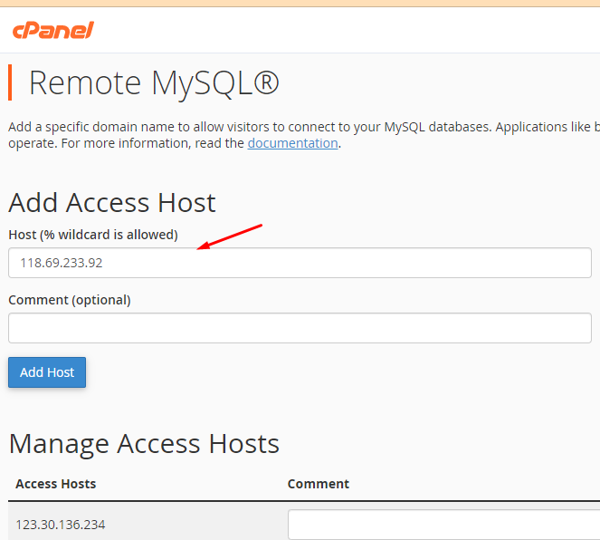

Bài viết này sẽ hướng dẫn bạn cách **Remote MySQL Database Trong cPanel**. Nếu bạn cần hỗ trợ, xin vui lòng liên hệ VinaHost qua Hotline 1900 6046 ext.3, email về support@vinahost.vn hoặc chat với VinaHost qua livechat https://livechat.vinahost.vn/chat.php.

- Đầu tiên, bạn cần tải xuống phần mềm remote MySQL Database như navicat, work brench…. Hoặc các phần mềm tương tự.
- Tiếp theo, kiểm tra IP máy bằng cách truy cập [https://ip.vinahost.vn/](https://ip.vinahost.vn/)

**Các bước để remote sql:**

- Bước 1: truy cập Cpanel, tại Database chọn Remote MySQL.
- Bước 2: tại đây, điền IP máy trạm vào để remote và Add Host:

Sau khi đồng ý cho remote, truy cập vào phần mềm, có 3 thông số cần điền:

- IP Hosting
- User database
- Pass user database

Sau khi kết nối thành công bạn có thể thao tác trên máy trạm.

Chúc quý khách thực hiện thành công!

> **THAM KHẢO CÁC DỊCH VỤ TẠI [VINAHOST](https://vinahost.vn/)**
> 
> **\>>** [**SERVER**](https://vinahost.vn/thue-may-chu-rieng/) **–** [**COLOCATION**](https://vinahost.vn/colocation.html) – [**CDN**](https://vinahost.vn/dich-vu-cdn-chuyen-nghiep)
> 
> **\>> [CLOUD](https://vinahost.vn/cloud-server-gia-re/) – [VPS](https://vinahost.vn/vps-ssd-chuyen-nghiep/)**
> 
> **\>> [HOSTING](https://vinahost.vn/wordpress-hosting)**
> 
> **\>> [EMAIL](https://vinahost.vn/email-hosting)**
> 
> **\>> [WEBSITE](http://vinawebsite.vn/)**
> 
> **\>> [TÊN MIỀN](https://vinahost.vn/ten-mien-gia-re/)**
