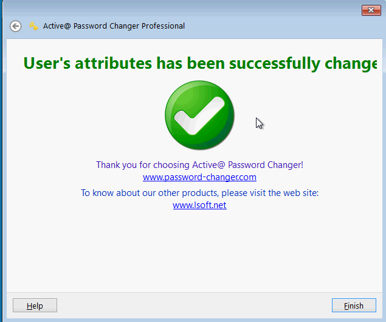

Bài viết này sẽ hướng dẫn bạn cách **Reset Password Windows Bằng Active Boot Disk**. Nếu bạn cần hỗ trợ, xin vui lòng liên hệ VinaHost qua **Hotline 1900 6046 ext.3, email về support@vinahost.vn hoặc chat với VinaHost qua livechat https://livechat.vinahost.vn/chat.php**.

Active@ Boot Disk là hệ điều hành hoạt động trên USB/CD/DVD/(LiveCD), bao gồm các công cụ được hỗ trợ người sử dụng khi Windows gặp sự cố. Các công cụ này có thể cho phép thay đổi mật khẩu người dùng Windows, xóa/khôi phục dữ liệu, khôi phục các partition của đĩa v/v…

Việc tạo đĩa CD/DVD khởi động được Active Boot Disk có thể thực hiện một cách thủ công bằng cách dùng chương trình ghi đĩa để ghi các file iso trên ra CD/DVD.

## 1\. Hướng dẫn Reset Password Windows Bằng Active Boot Disk

Sau khi boot được vào Active Boot Disk, các bạn tiến hành các bước sau:

**Bước 1:** Chọn phần mềm Active@ Password Changer.

**Bước 2:** Chọn mục SAM (Security Accounts Manager) chứa thông tin các Acounts trên Server

**Bước 3:** Lựa chọn phân vùng chứa Windows và User cần xóa Password.

Chọn User Administrator

**Bước 4:** Check “Clear this User’s Password” và chọn Apply.

## 2\. Kết quả

Lúc này, mật khẩu của User đã bị xoá hoàn toàn và bạn có thể đăng nhập vào Windows mà không cần nhập mật khẩu nữa.

Chúc bạn thực hiện **Reset Password Windows Bằng Active Boot Disk** thành công!

> **THAM KHẢO CÁC DỊCH VỤ TẠI [VINAHOST](https://kb.vinahost.vn/)**
> 
> **\>>** [**SERVER**](https://vinahost.vn/thue-may-chu-rieng/) **–** [**COLOCATION**](https://vinahost.vn/colocation.html) – [**CDN**](https://vinahost.vn/dich-vu-cdn-chuyen-nghiep)
> 
> **\>> [CLOUD](https://vinahost.vn/cloud-server-gia-re/) – [VPS](https://vinahost.vn/vps-ssd-chuyen-nghiep/)**
> 
> **\>> [HOSTING](https://vinahost.vn/wordpress-hosting)**
> 
> **\>> [EMAIL](https://vinahost.vn/email-hosting)**
> 
> **\>> [WEBSITE](http://vinawebsite.vn/)**
> 
> **\>> [TÊN MIỀN](https://vinahost.vn/ten-mien-gia-re/)**
