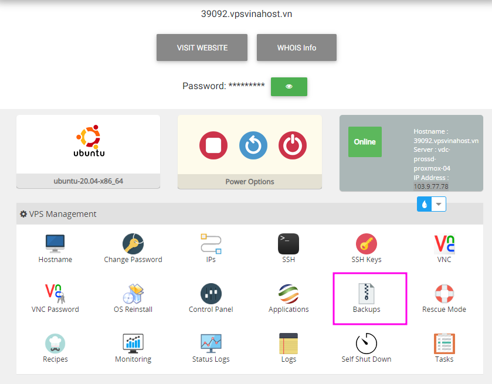
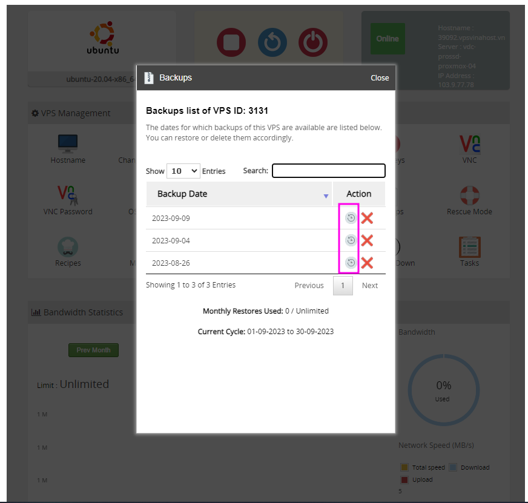
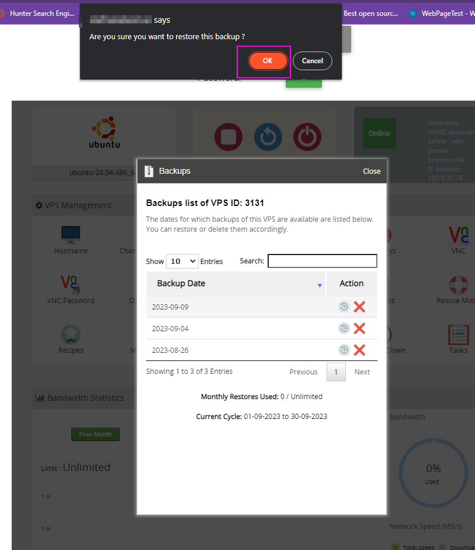

Bài viết này sẽ hướng dẫn bạn bạn **tự khôi phục VPS trong trường hợp cần thiết**. Nếu bạn cần hỗ trợ, xin vui lòng liên hệ VinaHost qua Hotline 1900 6046 ext.3, email về support@vinahost.vn hoặc chat với VinaHost qua livechat https://livechat.vinahost.vn/chat.php.

Đối với dịch vụ **ProSSD** do **VinaHost** cung cấp, ngoài việc sử dụng phần cứng có cấu hình cao và ổ cứng dùng hoàn toàn bằng **SSD** thì giao diện quản lý còn có nhiều chức năng giúp bạn thực hiện hầu hết các tác vụ mong muốn.

Mặc định các gói **ProSSD** được **VinaHost** tự động sao lưu - **backup** - định kỳ hàng tuần vào ngày cuối tuần và lưu trữ tối đa **3 bản sao lưu - backup**, tức là lưu các bản sao **lưu - backup - khoảng 3 tuần**. Trong trường hợp bạn muốn **khôi phục VPS** do các thao tác lỗi nghiệm trọng gây lỗi về cấu hình thì hãy thực hiện các hướng dẫn bên dưới để tự thực hiện tạo **khôi phục cho VPS**.

**Lưu ý**: Hệ thống chỉ lưu được **tối đa 3 bản sao lưu - backup gần nhất**

## Các bước thực hiện khôi phục - restore - VPS

Mặc định hệ thống sẽ backup VPS của bạn hằng tuần và giữ lại 3 bản gần nhất. Trong trường hợp bạn muốn khôi phục lại VPS từ các bản sao lưu trước đó, bạn thực hiện các bước sau để thực hiện khôi phục VPS.

\- Bước 1: Truy cập vào gói dịch vụ ProSSD đang sử dụng tại VinaHost bằng cách vào link[https://secure.vinahost.vn/ac/clientarea.php](https://secure.vinahost.vn/ac/clientarea.php) >> chọn "**Services**" và chọn tiếp gói dịch vụ ProSSD mà bạn muốn thực hiện sao lưu VPS.  

\- Bước 2: Tiến hành khôi phục lại VPS bằng cách chọn chức năng "**Backups**" trong mục "**VPS Management**".

Tiếp theo bạn cần chọn bản sao lưu trước đó dùng để khôi phục VPS và chọn chức năng "**Restore**" như hình bên dưới (biểu tượng hình tròn có mũi tên). Các bản 

Trong cửa sổ mới, bạn đọc kỹ thông tin và nhấn chọn nút "**Restore**" để tiến hành khôi phục lại VPS.

Lưu ý: Khi restore thì toàn bộ dữ liệu trên VPS hiện tại của bạn sẽ bị xóa và không thể khôi phục lại.

Bạn cần chờ **15 - 30 phút** để hệ thống thực hiện khôi phục dữ liệu. Để theo dõi trạng thái VPS, bạn có thể xem tại mục "**Status**" như video bên dưới.

<iframe title="YouTube video player" src="https://www.youtube.com/embed/ztSFidFQ0us" width="560" height="315" frameborder="0" allowfullscreen="allowfullscreen"></iframe>

Chúc quý khách thực hiện thành công!

> **THAM KHẢO CÁC DỊCH VỤ TẠI VINAHOST**
> 
> **\>>** [**SERVER**](https://vinahost.vn/thue-may-chu-rieng/) **–** [**COLOCATION**](https://vinahost.vn/colocation.html) – [**CDN**](https://vinahost.vn/dich-vu-cdn-chuyen-nghiep)
> 
> **\>> [CLOUD](https://vinahost.vn/cloud-server-gia-re/) – [VPS](https://vinahost.vn/vps-ssd-chuyen-nghiep/)**
> 
> **\>> [HOSTING](https://vinahost.vn/wordpress-hosting)**
> 
> **\>> [EMAIL](https://vinahost.vn/email-hosting)**
> 
> **\>> [WEBSITE](http://vinawebsite.vn/)**
> 
> **\>> [TÊN MIỀN](https://vinahost.vn/ten-mien-gia-re/)**
