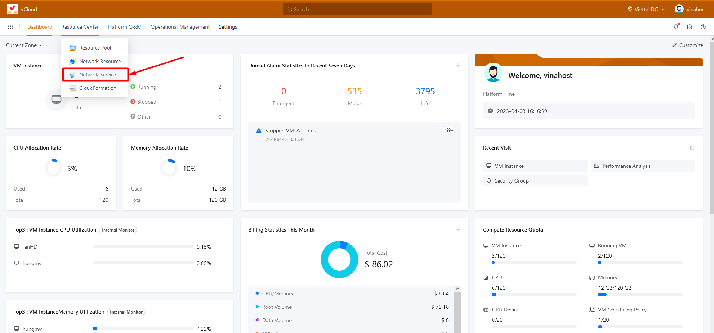
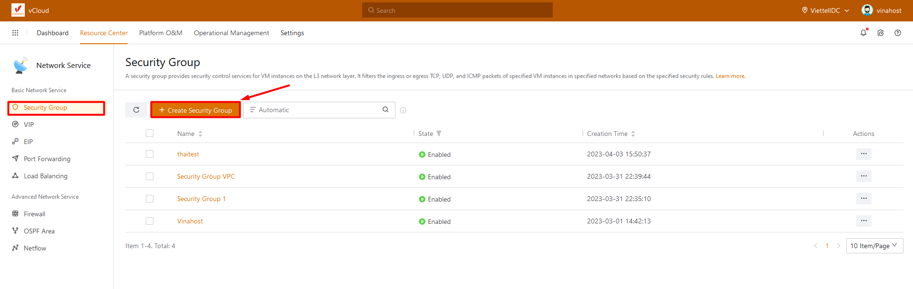
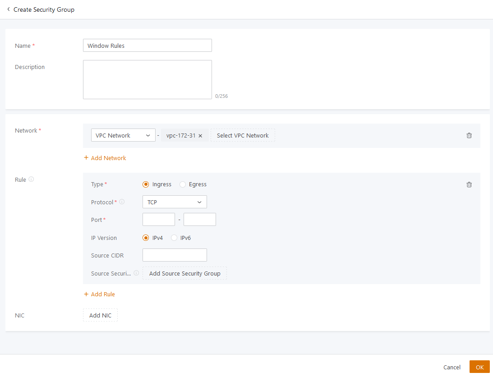
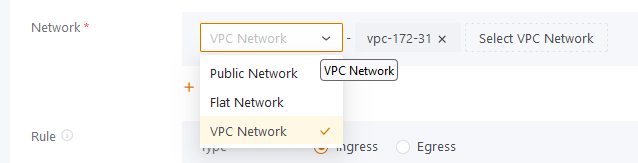
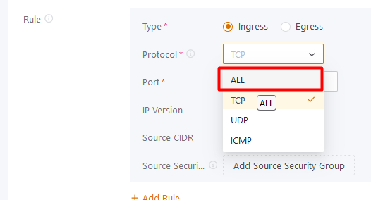
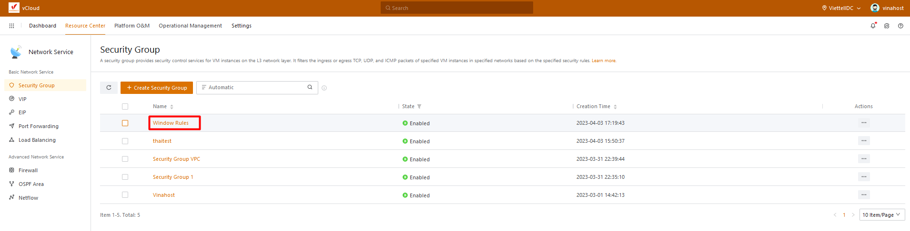
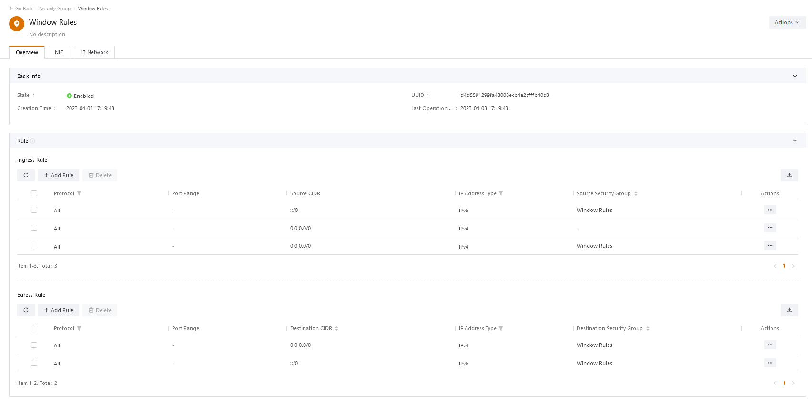

Bài viết này sẽ hướng dẫn bạn cách **tạo và quản lý Security Group.** Nếu bạn cần hỗ trợ, xin vui lòng liên hệ VinaHost qua **Hotline 1900 6046 ext. 3**, email về [support@vinahost.vn](mailto:support@vinahost.vn) hoặc chat với VinaHost qua livechat [https://livechat.vinahost.vn/chat.php](https://livechat.vinahost.vn/chat.php).

## 1\. Security Group là gì?

Security Group (SG) hoạt động giống như một tường lửa để bảo vệ Instance khỏi các cuộc tấn công mạng, SG hoạt động bằng cách cấp quyền cho các traffic ra và vào Instance. Một VM phải được gắn ít nhất một hoặc nhiều SG và một SG có thể liên kết với nhiều VM. Khi tạo SG ta phải cấu hình Ingress rule và Egress rule.

## 2\. Security Group Rules

Security Group là thường phải cho phép truy cập. Bạn không thể tạo rule với chỉ quyền từ chối truy cập.

Bạn có thể thêm và xóa nhiều luật ở bất cứ thời điểm. Thay đổi sẽ tự động được áp dụng vào các Instances mà đã được gắn với SG đó.

Khi bạn gán nhiều SG tới một 1 Instance, Các luật từ mỗi security group sẽ được tổng hợp để ra 1 tập hợp các luật phù hợp. vCloud sẽ dựa vào đó để xác định là có được phép truy cập không.

### 1.1. Ingress Rules

Ingress Rules chỉ ra các traffic được phép truy cập vào VM gắn SG chứa Ingress rule đó. Một Ingress rule bao gồm:

- Protocol: giao thức, chỉ các request được gửi qua giao thức này
- Port range: một dãy các cổng của Instance, các request chỉ được phép đi qua cổng này.
- Source CIDR: là một dãy địa chỉ IP hoặc ID của một tài nguyên bên trong SG, chỉ các địa chỉ IP nằm trong dãy này mới có thể truy cập vào VM được
- IP version: IPv4 hoặc IPv6

### 1.2. Egress Rules

Egress rule định nghĩa các traffic từ trong Instance gửi ra ngoài thông qua VM, tương tự Ingress rule, Egress rule cũng có 4 giá trị:

- Protocol: giao thức, chỉ các request được gửi qua giao thức này
- Port range: một dãy các cổng của Instance, các request chỉ được phép đi qua cổng này
- Destination CIDR: là một dãy địa chỉ IP hoặc ID của một tài nguyên bên trong SG, định nghĩa phạm vi request bên trong Instance được phép truy cập tới
- IP version: IPv4 hoặc IPv6

## 3\. Hướng dẫn tạo Security Group

Ở giao diện quản lý, truy cập **Resource Center > Network Service**

Chọn **Tab Security Group** và **Create Security Group**

## 4\. Cấu hình Security Group

- Name: Đặt tên Rule
- Description: Mô tả rule
- Network: Phạm vi rule hoạt động

- Rule:
- Type: Ingress (chiều vào), Egress (chiều ra)
- Protocol: Chọn ALL để allow tất cả hoặc giới hạn Port theo từng giao thức (TCP, UPD, ICMP)

- IP Version: chọn IPv4 hoặc IPv6
- Source CIDR: chọn IP hoặc ID của VM truy cập vào rule này
- Source Security Group: Chọn SG có sẵn các Rules
- NIC: áp SG vào NIC của VM
- Sau khi cấu hình hoàn tất chọn OK

Tạo SG hoàn tất

Chúc bạn thực hiện thành công!

> **THAM KHẢO CÁC DỊCH VỤ TẠI [VINAHOST](https://kb.vinahost.vn/)**
> 
> **\>>** [**SERVER**](https://vinahost.vn/thue-may-chu-rieng/) **–** [**COLOCATION**](https://vinahost.vn/colocation.html) – [**CDN**](https://vinahost.vn/dich-vu-cdn-chuyen-nghiep)
> 
> **\>> [CLOUD](https://vinahost.vn/cloud-server-gia-re/) – [VPS](https://vinahost.vn/vps-ssd-chuyen-nghiep/)**
> 
> **\>> [HOSTING](https://vinahost.vn/wordpress-hosting)**
> 
> **\>> [EMAIL](https://vinahost.vn/email-hosting)**
> 
> **\>> [WEBSITE](http://vinawebsite.vn/)**
> 
> **\>> [TÊN MIỀN](https://vinahost.vn/ten-mien-gia-re/)**
