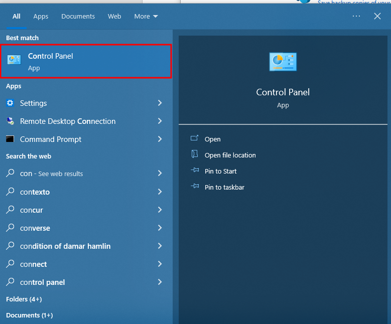
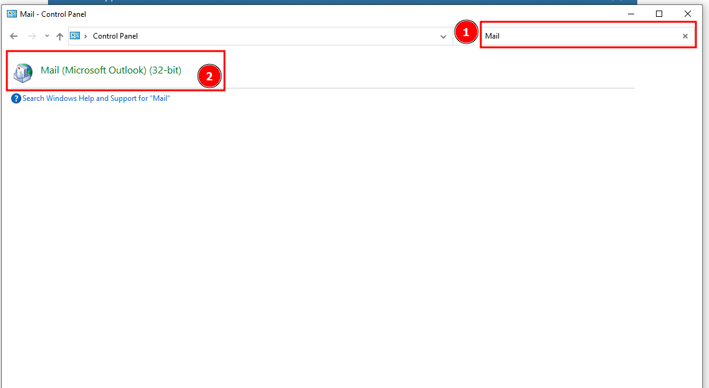
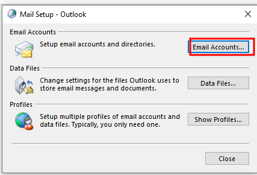
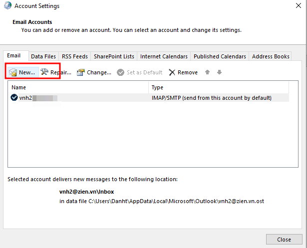
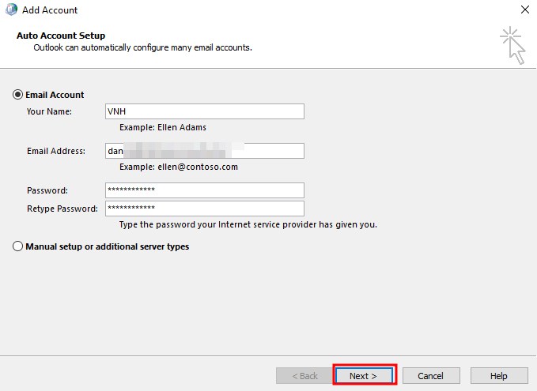
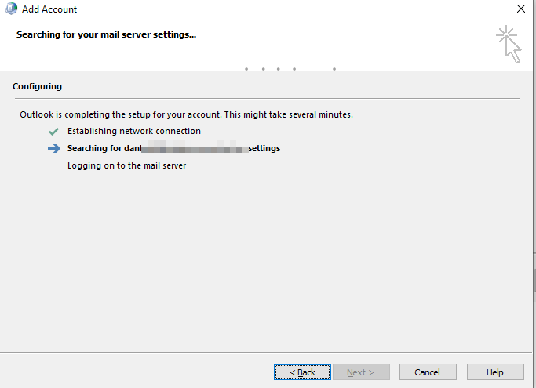
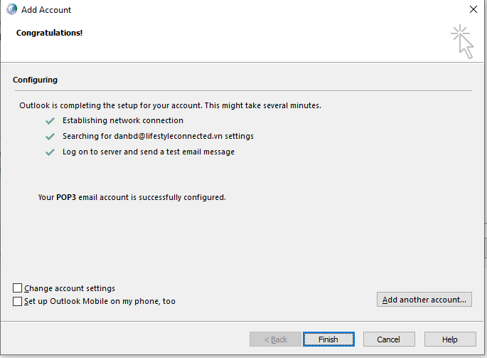
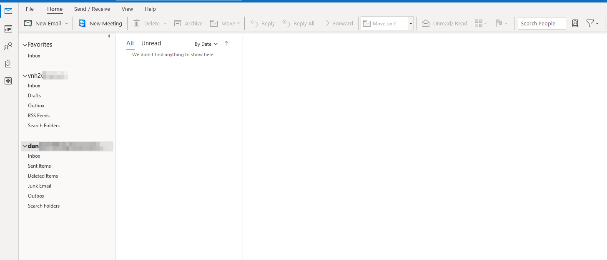

Bài viết này sẽ hướng dẫn bạn **Setup Mail Trên Outlook Thông Qua Control Panel**. Nếu bạn cần hỗ trợ, xin vui lòng liên hệ VinaHost qua **Hotline 1900 6046 ext.3**, email về [support@vinahost.vn](mailto:support@vinahost.vn) hoặc chat với VinaHost qua livechat [https://livechat.vinahost.vn/chat.php](https://livechat.vinahost.vn/chat.php).

## Hướng Dẫn Setup Mail Trên Outlook Thông Qua Control Panel

Bước 1. Vào Control Panel của máy.

Sau đó nhập từ khóa mail.

Vào Email Account

Chọn New Email

Điền thông tin Email sau đó chọn Next

Sau đó đợi đến khi màn hình load xong.

Sau khi load xong chọn finish.

Sau đó có thể vào outlook để kiểm tra.

Chúc bạn thực hiện Setup Mail Trên Outlook Thông Qua Control Panel thành công!

> **THAM KHẢO CÁC DỊCH VỤ TẠI [VINAHOST](https://kb.vinahost.vn/)**
> 
> **\>>** [**SERVER**](https://vinahost.vn/thue-may-chu-rieng/) **–** [**COLOCATION**](https://vinahost.vn/colocation.html) – [**CDN**](https://vinahost.vn/dich-vu-cdn-chuyen-nghiep)
> 
> **\>> [CLOUD](https://vinahost.vn/cloud-server-gia-re/) – [VPS](https://vinahost.vn/vps-ssd-chuyen-nghiep/)**
> 
> **\>> [HOSTING](https://vinahost.vn/wordpress-hosting)**
> 
> **\>> [EMAIL](https://vinahost.vn/email-hosting)**
> 
> **\>> [WEBSITE](http://vinawebsite.vn/)**
> 
> **\>> [TÊN MIỀN](https://vinahost.vn/ten-mien-gia-re/)**
