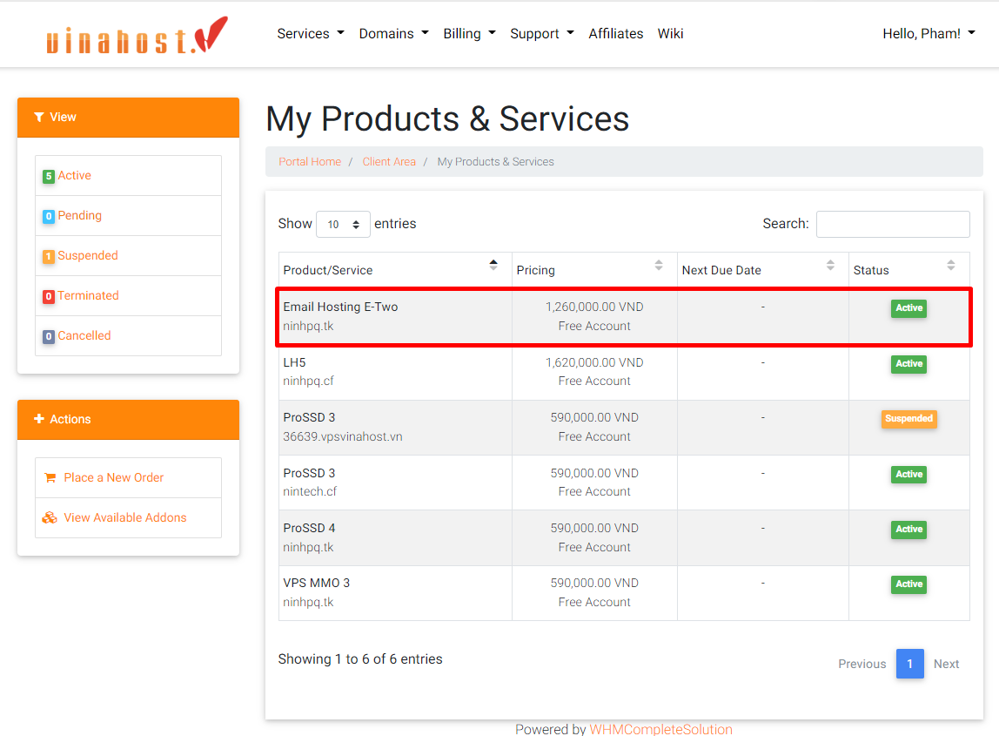
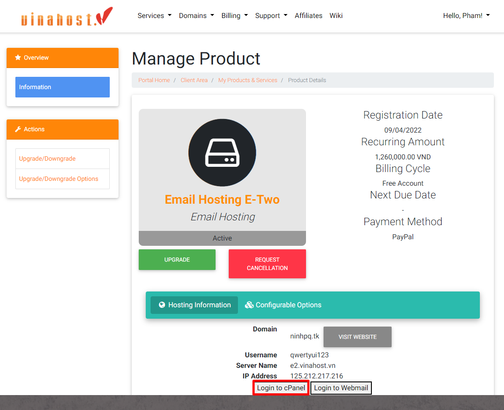
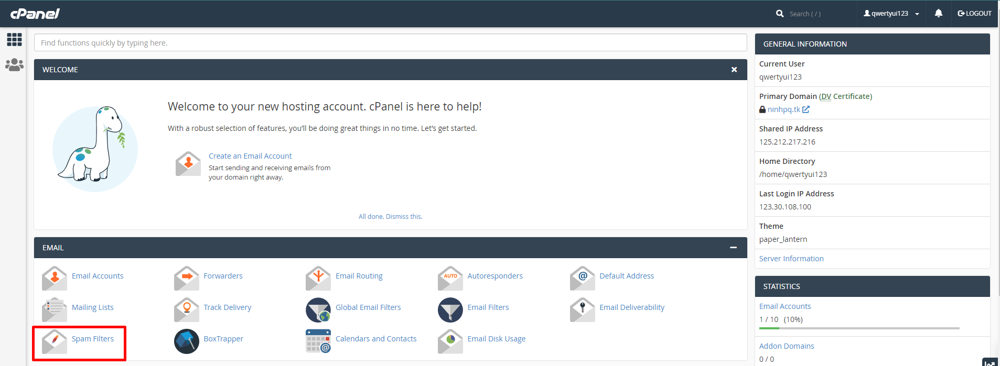
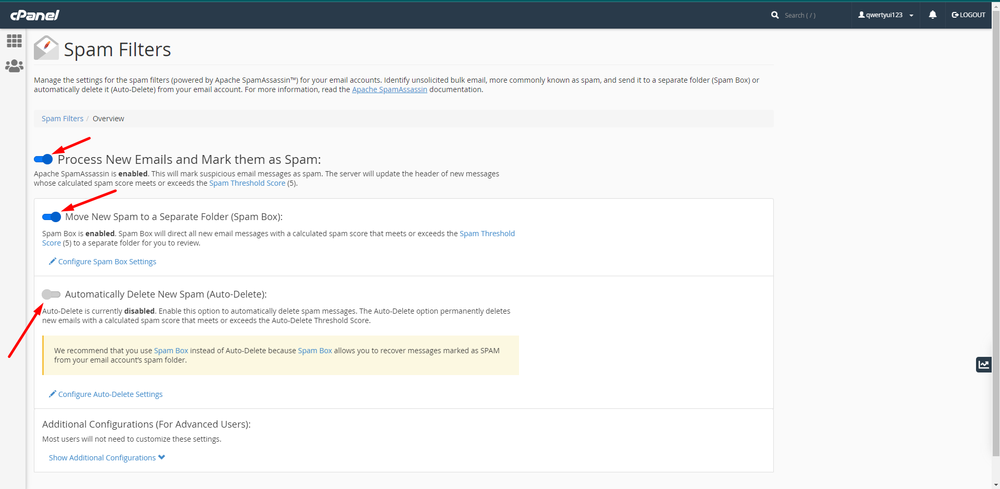
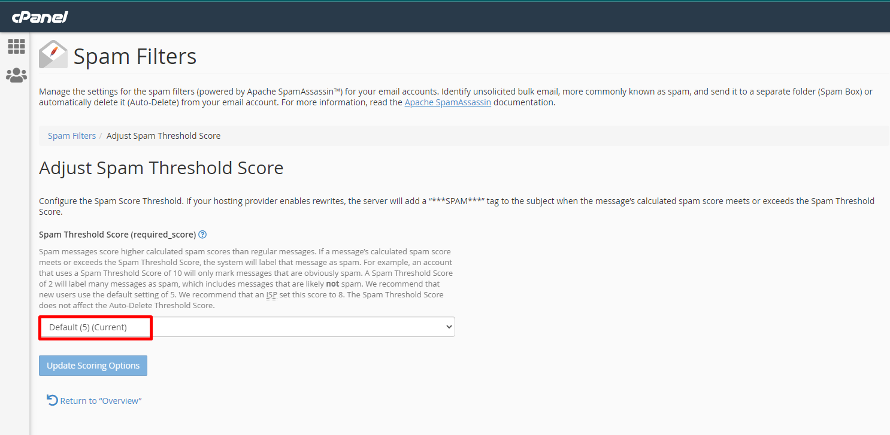
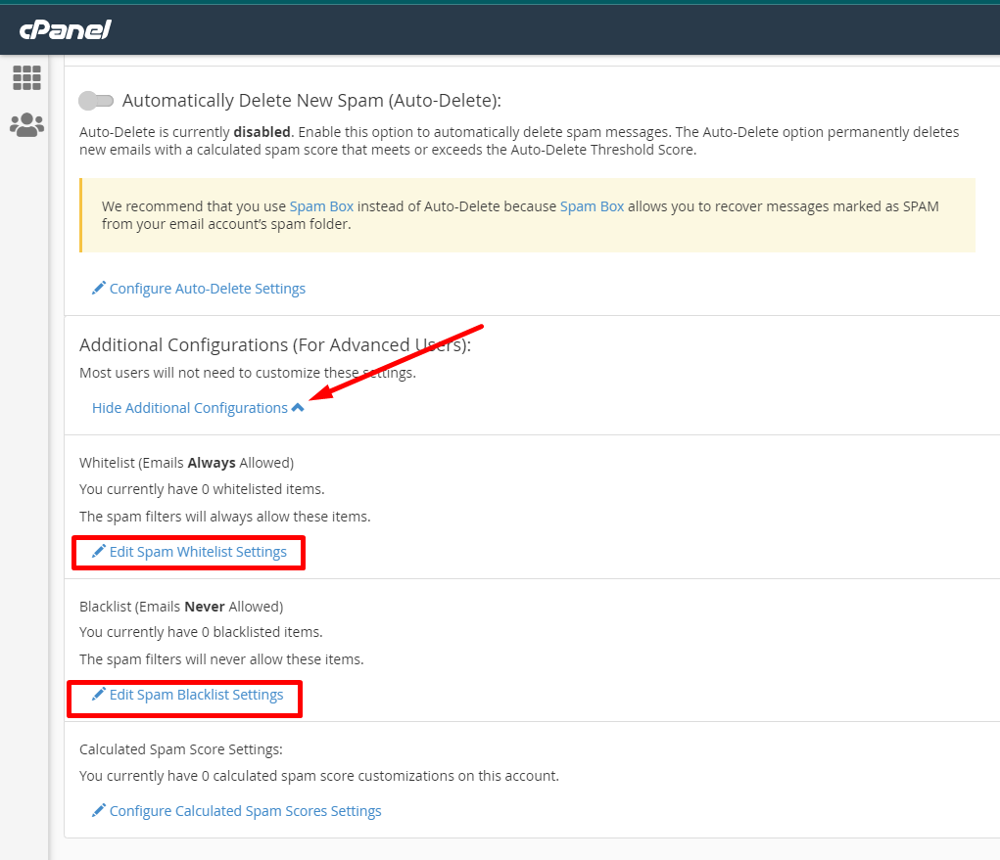
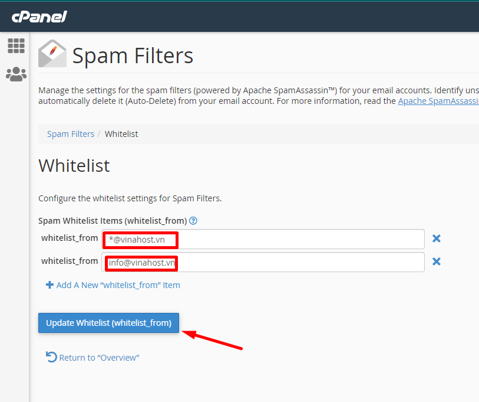
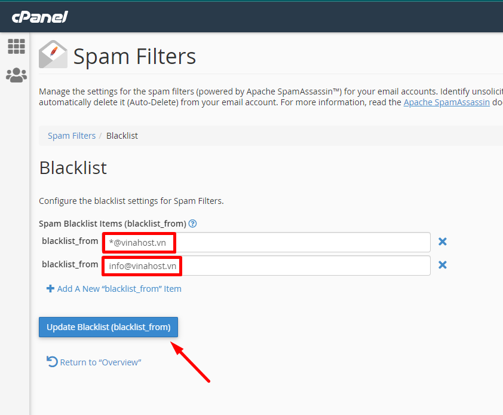

Khi bạn sử dụng dịch vụ mail thì không thể không gặp phải trường hợp các tài khoản mail của bạn bị SPAM mail . Mỗi ngày bạn phải nhận liên tục những mail rác tự động. Với dịch vụ Email Hosting tại Vinahost có thể giúp bạn ngăn chặn được  điều đó.

Spam Filters được tích hợp sẵn trong Email Hosting giúp bạn ngăn chặn được toàn bộ thư rác gửi đến hệ thống Email Hosting của bạn với các bước cấu hình đơn giản. Hãy cùng mình thực hiện cấu hình nhé,

## **Bước 1: Đăng nhập vào Email Hosting**

Bạn đăng nhập vào quản trị dịch vụ tại trang chủ của [Vinahost](https://vinahost.vn/)

Chọn Dịch vụ(Services) => Dịch vụ của tôi (My Services) chọn gói dịch vụ Email Hosting tương ứng.

Sau đó bạn chọn biểu tượng Login to CPanel như ảnh bên dưới.

## **Bước 2: Kích hoạt và cấu hình Spam Filters trên Email Hosting**

Tại giao diện bạn hãy click vào **Spam Filters** như ảnh đính kèm

Sau đó bạn click vào bật **Process New Emails and Mark them as Spam** để kích hoạt bộ lọc mail. 

- Tích chọn  vào **Move New Spam to a Separate Folder ( Spam Box)** để các mail spam được di chuyển và lưu tại hộp thư Spam
- Không tích vào  **Automatically Delete New Spam (Auto-Delete)** để tránh trường hợp các mail chính thống nhưng lại gửi nhiều lần cùng tiêu đề và nội dung dẫn đến hệ thống hiểu nhầm đánh giá là Spam và sẽ tự động xoá mail đó. Hoặc Quý Khách có thể bật để hệ thống xoá tự động các mail Spam.
    

Mỗi một thư gửi đến nó sẽ được tính điểm **Spam Score**. Khi mail đó được gửi nhiều lần, điểm Spam Score sẽ tăng lên tương ứng với số lần gửi. Điểm Spam Score đạt 5 điểm Hệ thống sẽ tự đánh giá rằng email đó đang thực hiện Spam và sẽ chuyển email đó vào mục Spam ( thư rác). Bạn có thể thay đổi điểm Spam Score mặc định trong phần **Spam Threshold Score**.

Khi chọn xong bạn click vào **Update Scoring Options** để cập nhật.

Sau khi Update Scoring Options bộ lọc mail sẽ được kích hoạt ngay trên hệ thống của bạn. Với bộ lọc này sẽ ngăn chặn Email Spam đến Email Hosting của bạn

Nhưng trong quá trình sử dụng một số mail đặc biệt mà bạn muốn nhận vô tình bị lọc bởi công cụ Spam Filters thì bạn phải làm gì. Khi đó bạn có thể sử dụng chức năng **Spam Whitelist** để thêm các mail đặc biệt vào danh sách an toàn, bỏ qua bộ lọc trên.

Tại giao diện **Spam Filters** bạn chọn dòng **Show Additiional Configurations**, sau đó tiếp tục chọn mục **Edit Spam Whitelist Setttings** như ảnh bên dưới.

Chúng ta nhấp vào **A New "whitelist\_from**" Item để thêm địa chỉ Email muốn nhận vào danh sách an toàn

- Cú pháp **\*@vinahost.vn** sẽ cho phép tất cả các địa chỉ email từ tên miền vinahost.vn
- Cú pháp **info@vinahost.vn** sẽ cho phép một địa chỉ email với tên là "info"

Sau khi đã thêm hoàn tất bạn chọn **Update Whitelist (whitelist\_from)** để cập nhật.

Với chức năng **Spam Blacklist** Items (blacklist\_from) bạn cũng làm tương tự như trên.

Chúng ta nhấp vào **A New "blacklist\_from"** Item để thêm địa chỉ Email muốn chặn vào danh sách đen

- Cú pháp **\*@vinahost.vn** sẽ chặn tất cả các địa chỉ email từ tên miền vinahost.vn
- Cú pháp **info@vinahost.vn** sẽ chặn một địa chỉ email với tên là "info"

Sau khi đã thêm hoàn tất bạn chọn U**pdate BlackList**  để cập nhật.

Như vậy mình đã hoàn tất các bước Hướng dẫn sử dụng chức năng Spam Filters trên Email Hosting.

Chúc các bạn thực hiện thành công!

Nếu bạn cần hỗ trợ, xin vui lòng liên hệ VinaHost qua Hotline **1900 6046** **ext.3,** email về **support@vinahost.vn** hoặc chat với VinaHost qua livechat [https://livechat.vinahost.vn/chat.php](https://livechat.vinahost.vn/chat.php)

> **THAM KHẢO CÁC DỊCH VỤ TẠI [VINAHOST](https://vinahost.vn/)**
> 
> **\>>** [**SERVER**](https://vinahost.vn/thue-may-chu-rieng/) **–** [**COLOCATION**](https://vinahost.vn/colocation.html) – [**CDN**](https://vinahost.vn/dich-vu-cdn-chuyen-nghiep)
> 
> **\>> [CLOUD](https://vinahost.vn/cloud-server-gia-re/) – [VPS](https://vinahost.vn/vps-ssd-chuyen-nghiep/)**
> 
> **\>> [HOSTING](https://vinahost.vn/wordpress-hosting)**
> 
> **\>> [EMAIL](https://vinahost.vn/email-hosting)**
> 
> **\>> [WEBSITE](http://vinawebsite.vn/)**
> 
> **\>> [TÊN MIỀN](https://vinahost.vn/ten-mien-gia-re/)**
