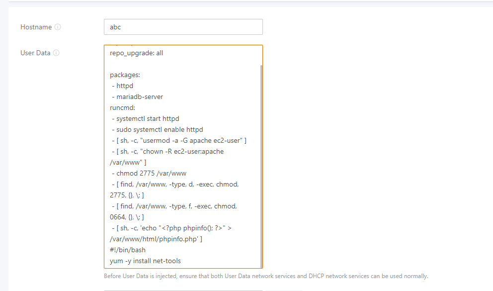
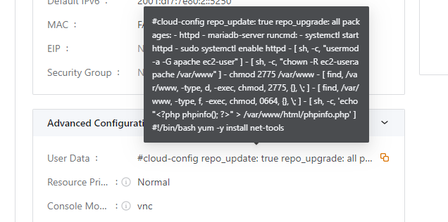
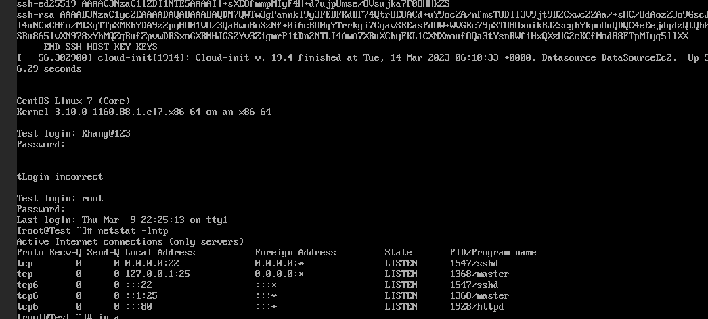
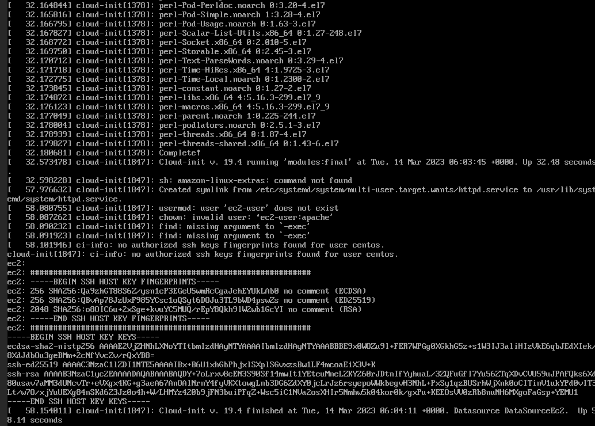

Bài viết này sẽ hướng dẫn bạn cách **Sử Dụng Cơ Bản UserData Trong Việc Tạo VM.** Nếu bạn cần hỗ trợ, xin vui lòng liên hệ VinaHost qua **Hotline 1900 6046 ext. 3**, email về [support@vinahost.vn](mailto:support@vinahost.vn) hoặc chat với VinaHost qua livechat [https://livechat.vinahost.vn/chat.php](https://livechat.vinahost.vn/chat.php).

## Giới thiệu chung

Khi tạo một VM mới trên **vCloud VinaHost** bạn sẽ nhận được một VM với cấu hình trắng hoặc các cấu hình có sẵn khi tạo thông qua Instance. Tuy nhiên, đôi khi bạn muốn tạo một VM với các service được cài đặt sẵn mà mà các Instance không có sẵn hoặc các service khác hoàn toàn với Instance, bạn phải dựng một VM trắng để cài đặt, điều này sẽ tốn thời gian của bạn.

Hôm nay mình sẽ hướng dẫn các bạn sử dụng tính năng **UserData** trong việc tạo VM để hạn chế việc tốn thời gian đợi VM khởi tạo xong và vào VM để cài đặt.

Dưới đây là một số điều cần lưu ý khi làm việc với **UserData**:

- **Định dạng:** UserData có thể được viết theo nhiều định dạng khác nhau, chẳng hạn như tập lệnh shell, tập lệnh PowerShell hoặc tập lệnh cloud-init. Định dạng bạn chọn sẽ phụ thuộc vào hệ điều hành bạn đang sử dụng và nhu cầu cụ thể của bạn.
- **Thực thi**: UserData được thực thi khi thực thể được khởi chạy, trước khi bất kỳ dữ liệu người dùng nào được thêm vào thực thể. Điều này có nghĩa là bạn có thể sử dụng UserData để cấu hình thực thể, cài đặt phần mềm hoặc thực hiện các hành động khác trước khi thực thể sẵn sàng sử dụng.
- **Siêu dữ liệu:** UserData có thể truy cập siêu dữ liệu về thực thể, chẳng hạn như ID thực thể, khu vực và tên máy chủ. Điều này có thể hữu ích khi cấu hình thực thể hoặc tích hợp nó với các dịch vụ VCloud khác.
- **Quyền người dùng:** Mặc định, UserData chạy với quyền root trên thực thể. Điều này có nghĩa là nó có đầy đủ quyền truy cập vào thực thể và có thể thực hiện bất kỳ hành động nào. Tuy nhiên, bạn cũng có thể chỉ định một người dùng không phải root để chạy UserData nếu cần.
- **Cloud-init:** Cloud-init là một công cụ thường được sử dụng với UserData trên VCloud. Nó cung cấp một tập các tập lệnh và công cụ để cấu hình các thực thể và có thể được sử dụng để thực hiện các tác vụ như cài đặt gói phần mềm, tạo người dùng và cấu hình thiết lập mạng.

## Hướng dẫn sử dụng

Các bạn tiến hành tạo một VM theo bài viết [**Hướng Dẫn Tạo VM Instance Trên vCloud VinaHost**](https://kb.vinahost.vn/tao-vm-instance-tren-vcloud-vinahost/)  đến bước 7 lưu ý nếu cài đặt với Instance thì Image đó phải có Cloud-init

Tại đây ngoài một số config về server còn có phần **UserData**. Bạn hãy nhập các lệnh muốn VM chạy ngay sau khi cài đặt xong, hoặc một số script cài đặt để VM tự động cài đặt mà không cần phải chạy tay.

Mình sẽ thử sử dụng đoạn script tự động cài **Apache + Mariadb** và **net-tools**

#cloud-config
repo\_update: true
repo\_upgrade: all

packages:

 - httpd
 - mariadb-server
 - net-tools

runcmd:

 - systemctl start httpd
 - sudo systemctl enable httpd
 - \[ sh, -c, "usermod -a -G apache ec2-user" \]
 - \[ sh, -c, "chown -R ec2-user:apache /var/www" \]
 - chmod 2775 /var/www
 - \[ find, /var/www, -type, d, -exec, chmod, 2775, {}, \\; \]
 - \[ find, /var/www, -type, f, -exec, chmod, 0664, {}, \\; \]
 - \[ sh, -c, 'echo "<?php phpinfo(); ?>" > /var/www/html/phpinfo.php' \]

Sau đó tạo VM như thông thường, sau khi tạo chờ một khoảng thời gian để VM thực thi xong shell Script.

UserData sẽ được thực thi khi máy ảo của bạn được khởi tạo. Bạn có thể sử dụng UserData để cài đặt phần mềm, cấu hình mạng, tạo người dùng hoặc thực hiện bất kỳ tác vụ nào khác cần thiết để cấu hình máy ảo của bạn.

Chúc bạn thực hiện thành công!

> **THAM KHẢO CÁC DỊCH VỤ TẠI [VINAHOST](https://vinahost.vn/)**
> 
> **\>>** [**SERVER**](https://vinahost.vn/thue-may-chu-rieng/) **–** [**COLOCATION**](https://vinahost.vn/colocation.html) – [**CDN**](https://vinahost.vn/dich-vu-cdn-chuyen-nghiep)
> 
> **\>> [CLOUD](https://vinahost.vn/cloud-server-gia-re/) – [VPS](https://vinahost.vn/vps-ssd-chuyen-nghiep/)**
> 
> **\>> [HOSTING](https://vinahost.vn/wordpress-hosting)**
> 
> **\>> [EMAIL](https://vinahost.vn/email-hosting)**
> 
> **\>> [WEBSITE](http://vinawebsite.vn/)**
> 
> **\>> [TÊN MIỀN](https://vinahost.vn/ten-mien-gia-re/)**
