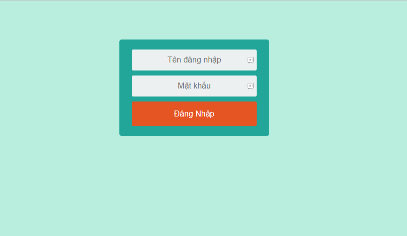
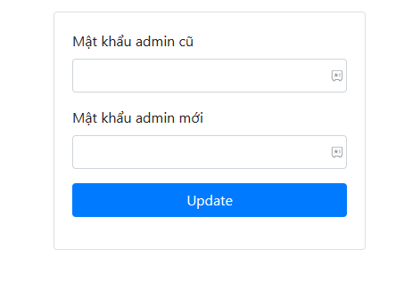
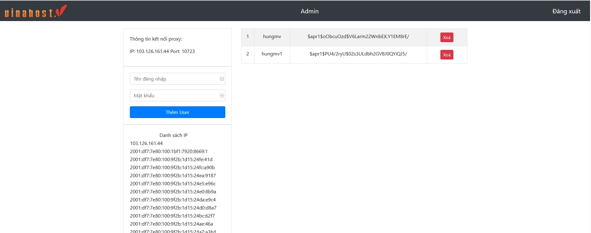
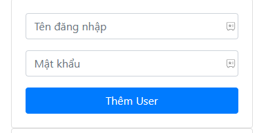
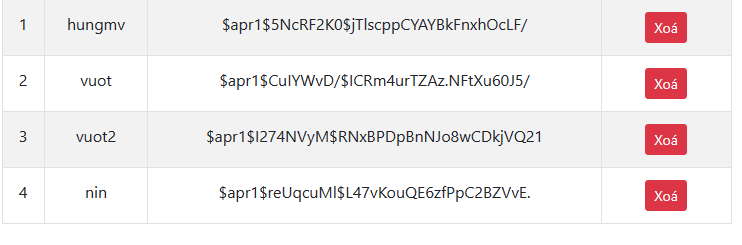
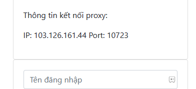
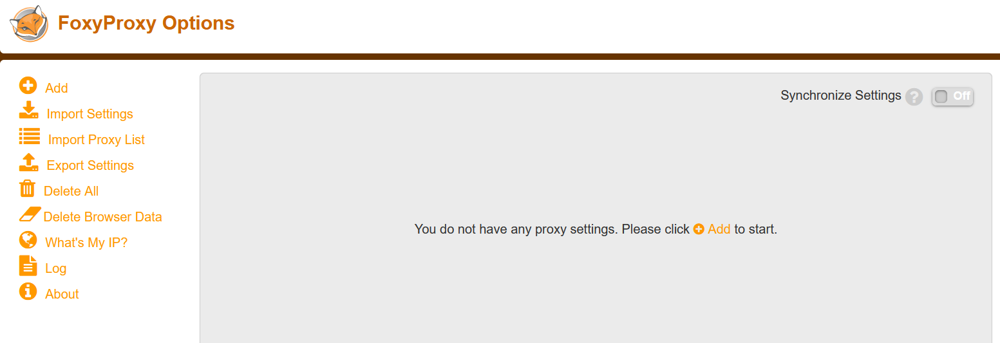
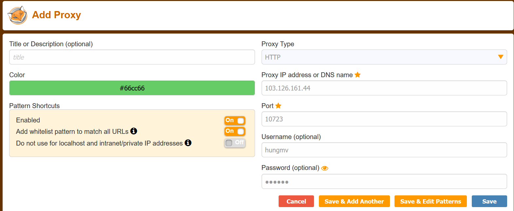
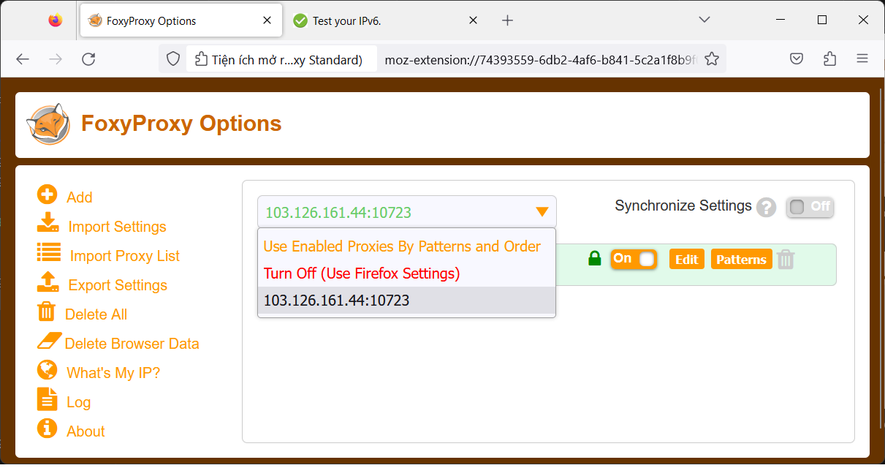
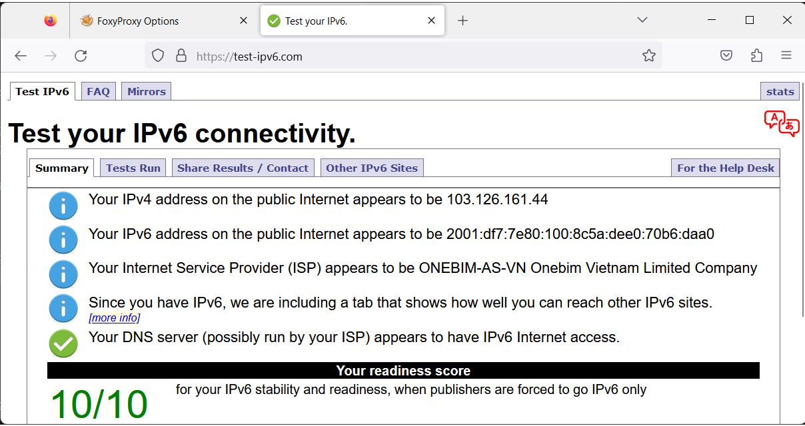

Bài viết này sẽ hướng dẫn bạn cách sử dụng **Proxy Web-interface.** Nếu bạn cần hỗ trợ, xin vui lòng liên hệ VinaHost qua **Hotline 1900 6046 ext. 3**, email về [support@vinahost.vn](mailto:support@vinahost.vn) hoặc chat với VinaHost qua livechat [https://livechat.vinahost.vn/chat.php](https://livechat.vinahost.vn/chat.php).

## 1\. Đăng nhập sử dụng Proxy Web-interface

Tại màn hình đăng nhập, bạn nhập tài khoản và mật khẩu được cung cấp qua emai.



Sau khi đăng nhập với mật khẩu được cung cấp, hệ thống sẽ chuyển hướng đến trang đổi mật khẩu mới trước khi truy cập trang **dashboard**.



Sau khi đổi mật khẩu thành công và đăng nhập lại, bạn sẽ truy cập được trang **dashboard** như bên dưới.



Bạn tiến hành tạo **user proxy** mới tại **form** tạo user như hình sau.



Các user sau khi tạo sẽ hiển thị trên bảng. Lưu ý, **mật khẩu** hiển thị trên bảng đã được mã hoá, hãy note lại mật khẩu của user.



Trong bảng trên có thể thao tác xoá user khỏi **proxy server** với nút **`Xoá`**

Để thay đổi mật khẩu **Admin**, bạn truy cập mục **Admin**. Nếu quên mật khẩu admin đã thay đổi, bạn hãy sử dụng **SSH** truy cập vào **server** và chạy lệnh sau để tạo lại mật khẩu admin:

```
python3 /opt/squidwebmin/gen_admin.py
```

## [](#k%E1%BA%BFt-n%E1%BB%91i-v%E1%BB%9Bi-proxy)2\. Kết nối với Proxy Web-interface

Thông tin **IP, Port** để kết nối được hiển thị trên **dashboard**:



Trong hướng dẫn này, chúng ta sẽ sử dụng extension [FoxyProxy](https://kb.vinahost.vn/huong-dan-su-dung-plugin-foxyproxy-tren-chrome-va-firefox/) để kết nối. Bạn có thể xem hướng dẫn cài đặt **[TẠI ĐÂY](https://kb.vinahost.vn/huong-dan-su-dung-plugin-foxyproxy-tren-chrome-va-firefox/)**

[](https://kb.vinahost.vn/huong-dan-su-dung-plugin-foxyproxy-tren-chrome-va-firefox/)

Click **Add** tại menu bên trái và nhập các thông tin **IP, Port, username, password** để kết nối **proxy Web-interface**.



Chọn **proxy** vừa tạo để bật và sử dụng **proxy**.



Truy cập trang [https://test-ipv6.com/](https://test-ipv6.com/) để kiểm tra proxy đã hoạt động hay chưa, nếu đã kết nối thành công kết quả sẽ được hiển thị như bên dưới



Trong trường hợp không thể kết nối, hãy kiểm tra lại **username/password, IP, Port** đã chính xác chưa.

Nếu bạn đã nhập thông tin chính xác mà vẫn không kết nối được, hãy sử dụng **SSH đến Server** và sử dụng lệnh sau để kiểm tra trạng thái hoạt động của **Proxy**:

```
sudo systemctl status squid
```

Chúc bạn sử dụng Proxy Web-interface thành công!

> **THAM KHẢO CÁC DỊCH VỤ TẠI [VINAHOST](https://kb.vinahost.vn/)**
> 
> **\>>** [**SERVER**](https://vinahost.vn/thue-may-chu-rieng/) **–** [**COLOCATION**](https://vinahost.vn/colocation.html) – [**CDN**](https://vinahost.vn/dich-vu-cdn-chuyen-nghiep)
> 
> **\>> [CLOUD](https://vinahost.vn/cloud-server-gia-re/) – [VPS](https://vinahost.vn/vps-ssd-chuyen-nghiep/)**
> 
> **\>> [HOSTING](https://vinahost.vn/wordpress-hosting)**
> 
> **\>> [EMAIL](https://vinahost.vn/email-hosting)**
> 
> **\>> [WEBSITE](http://vinawebsite.vn/)**
> 
> **\>> [TÊN MIỀN](https://vinahost.vn/ten-mien-gia-re/)**
