Bài viết này sẽ hướng dẫn bạn cách S**ử Dụng Và Cấu Hình Dịch Vụ CDN**. Nếu bạn cần hỗ trợ, xin vui lòng liên hệ VinaHost qua Hotline 1900 6046 ext.3, email về support@vinahost.vn hoặc chat với VinaHost qua livechat https://livechat.vinahost.vn/chat.php.

## 1\. Giới thiệu về Dịch Vụ CDN

- **Định nghĩa CDN**: CDN là viết tắt của Content Delivery Network là mạng lưới máy chủ lưu giữ bảo sao của các nội dung tĩnh bên trong website và phân phối đến nhiều máy chủ PoP. CDN đề cập đến một nhóm máy chủ được phân phối theo địa lỹ hoạt động cùng nhau để cung cấp nội dung Internet nhanh chóng. CDN cho phép chuyển nhanh các nội dung cần thiết để tải nội dung Internet bao gồm các trang HTML, tệp Javascript, bảng định kiểu, hình ảnh và video. Sự phổ biến của các dịch vụ CDN tiếp tục phát triển và ngày nay phần lớn lưu lượng truy cập website được phục vụ thông qua CDN, bao gồm cả lưu lượng truy cập từ các trang web lớn như Facebook, Netflix và Amazon. CDN được định cấu hình đúng cũng có thể giúp bảo vệ các trang web chống lại một số cuộc tấn công độc hại phổ biến, chẳng hạn như các cuộc tấn công Từ chối Dịch vụ Phân tán (DDOS).

**Vậy CDN có giống như web host hay không**?

- Mặc dù CDN không lưu trữ nội dung và không thể thay thế nhu cầu lưu trữ web thích hợp, nhưng nó giúp lưu trữ nội dung vào bộ nhớ cache ở biên mạng, giúp cải thiện hiệu suất trang web. Nhiều trang web đấu tranh để đáp ứng nhu cầu hiệu suất của họ bằng các dịch vụ lưu trữ truyền thống, đó là lý do tại sao họ chọn CDN.
- Bằng cách sử dụng bộ nhớ đệm để giảm băng thông lưu trữ, giúp tránh gián đoạn dịch vụ và cải thiện bảo mật, CDN là một lựa chọn phổ biến để giảm bớt một số điểm khó khăn đi kèm với lưu trữ web truyền thống.

## **2\. Lợi ích của việc sử dụng CDN là gì?**

- **Cải thiện thời gian tải trang web** - Bằng cách phân phối nội dung gần hơn với khách truy cập trang web bằng cách sử dụng máy chủ CDN gần đó (trong số các tối ưu hóa khác), khách truy cập trải nghiệm thời gian tải trang nhanh hơn. Vì khách truy cập có xu hướng nhấp vào một trang web tải chậm, CDN có thể giảm tốc độ thoát và tăng thời gian mà mọi người dành cho trang web. Nói cách khác, một trang web nhanh hơn có nghĩa là nhiều khách truy cập sẽ ở lại và gắn bó lâu hơn.
- **Giảm chi phí băng thông** - Chi phí tiêu thụ băng thông để lưu trữ trang web là chi phí chính cho các trang web. Thông qua bộ nhớ đệm và các tối ưu hóa khác, CDN có thể giảm lượng dữ liệu mà máy chủ gốc phải cung cấp, do đó giảm chi phí lưu trữ cho chủ sở hữu trang web.
- **Tăng tính khả dụng và dự phòng của nội dung** - Một lượng lớn lưu lượng truy cập hoặc lỗi phần cứng có thể làm gián đoạn chức năng bình thường của trang web. Nhờ bản chất phân tán của chúng, CDN có thể xử lý nhiều lưu lượng hơn và chịu được lỗi phần cứng tốt hơn nhiều máy chủ gốc.
- **Cải thiện bảo mật trang web** - CDN có thể cải thiện bảo mật bằng cách giảm thiểu DDoS, cải tiến chứng chỉ bảo mật và các tối ưu hóa khác.

## 3\. Hướng dẫn cấu hình CDN

Để có thể cấu hình dịch vụ CDN thì đầu tiên bạn có thể tham khảo dịch vụ này của VinaHost: [https://vinahost.vn/dich-vu-cdn-chuyen-nghiep/](https://vinahost.vn/dich-vu-cdn-chuyen-nghiep/)

Sau khi mua dịch vụ người quản trị sẽ kích hoạt và gửi một thử Invite về mail đăng ký dịch vụ của bạn:

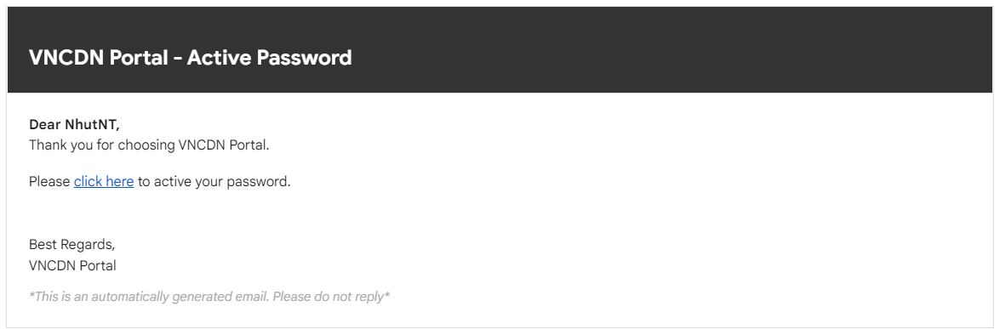

Bạn sẽ phải chọn mục click here để thay đổi password. Username sẽ là mail đăng ký dịch vụ của bạn nhé. Sau khi có thông tin dịch vụ CDN ta cần login vào giao diện chính của nó.

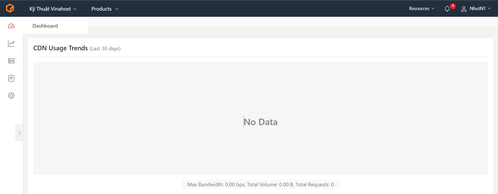

Được rồi chúng ta bắt tay vào việc cấu hình CDN nhé.

Bước 1: Ta chọn vào mục Products > Click chọn Content Delivery Network (CDN)

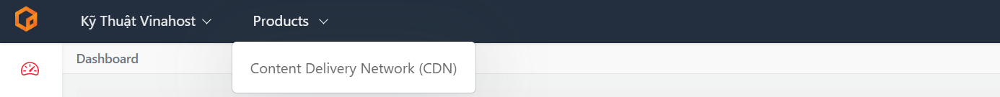

Bước 2: Chúng ta sẽ thấy bên trái có các thanh công cụ như sau:

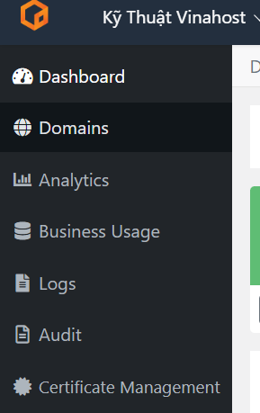

Ta click chọn vào mục domain

Bước 3: Sau khi click chọn Domain. Ta sẽ chọn vào mục Add a Domain/ File Domain.

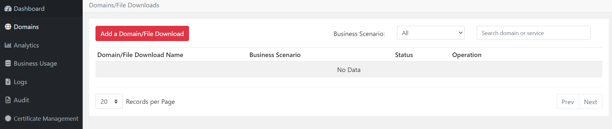

Bước 4: Ta sẽ điền thông tin như sau:

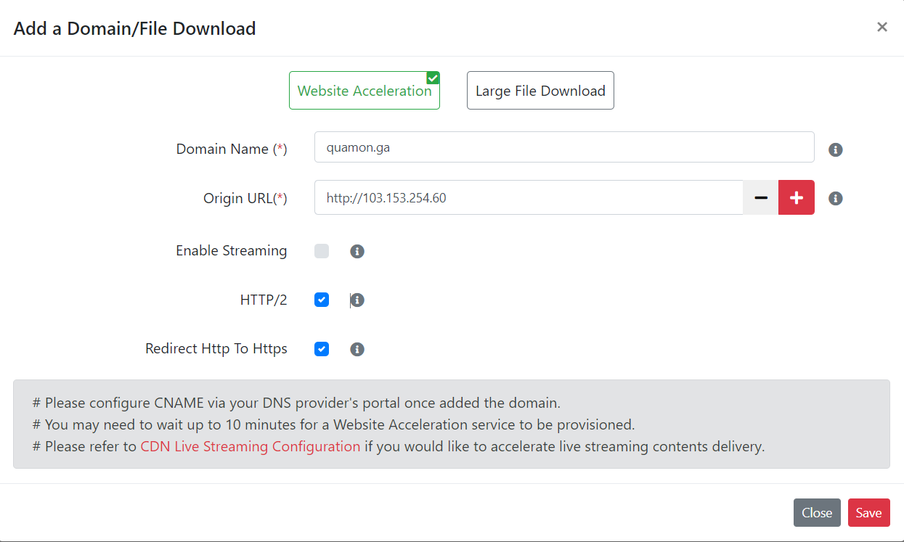

- Domain Name: Sẽ là domain chính của bạn. Ví dụ như: abc.com, [abc.com](http://www.abc.com)
- Origin URL: Sẽ là địa chỉ IP của server website của bạn. Bạn sẽ điền theo cấu trúc như sau: [http://ip](http://ip)
- Sau khi hoàn thành việc điền các thông tin sau ta nhấn “Save” để lưu cấu hình.

Bước 5: Sau khi lưu file cấu hình và được trả về giao diện Domain. Bạn sẽ thấy phía trước tên miền của mình có dấu “!” bạn trỏ chuột vào đó sẽ nhận được thông tin như sau:

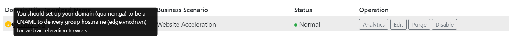

Sau đó ta đi đến trang quản trị tên miền của mình và tạo một Record CNAME như sau:

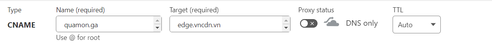

Và thêm cả một Record A có cấu trúc như sau:

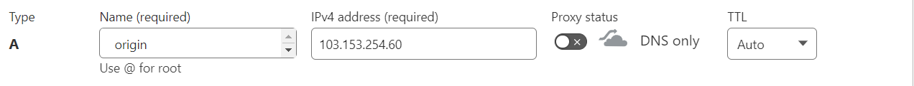

Bước tiếp theo chúng ta quay trở lại trang quản trị của CDN

Bước 6: Ở mục domain bạn sẽ thấy ở phần “Domain/ File Download Name” domain của bạn sẽ cho bạn click chuột vào đó. Sau đó bạn thao tác click chuột và domain name của mình. Và sẽ thấy giao diện như sau:

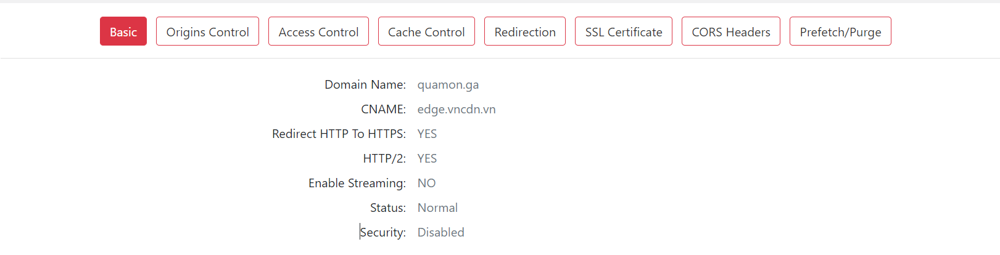

Bước 7: Ta chọn vào mục Origins Control > chọn Edit

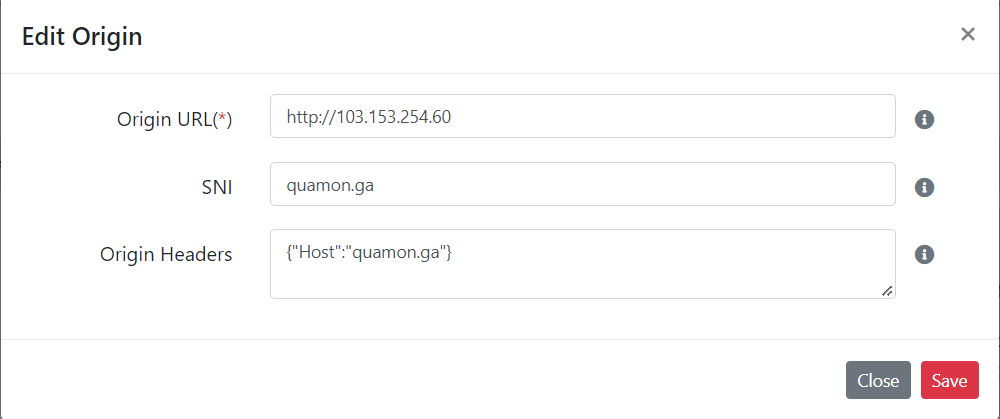

- Origin URL: Ta sẽ điền thông tin IP host của bạn. [http://ip](http://ip)
- SNI: Ta sẽ điền thông tin domain: Ví dụ: abc.com.vn
- Origin Headers: Ta điền nội dung có cấu trúc như sau. {“Host”: “domain.com.vn”}

Sau đó ta nhấn “Save” để lưu cấu hình.

Bước 8: Trước khi cấu hình SSL ta cần Import SSL lên CDN. Và CDN chỉ dùng SSL Pro (có nghĩa là bạn phải bỏ tiền mua SSL) vì CDN không tự gen SSL được.

Ta chọn vào mục Certifacate Management ở góc trái màn hình:

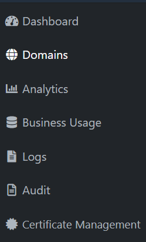

Sau đó chọn mục Import Certificate.

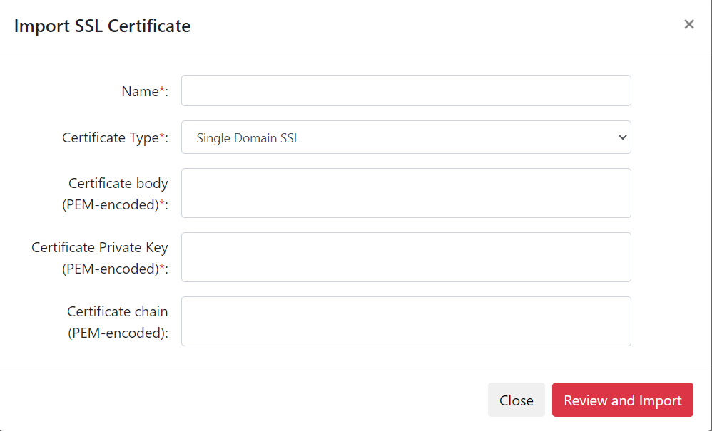

- Name: Là domain của bạn. abc.com.vn
- Certificate Type: Giữ nguyên mặc định
- Certificate body (PEM-encoded)\*: Ở đây chúng ta sẽ copy và dán file certificate.crt
- Certificate Private Key (PEM-encoded)\*: Ở đây chúng ta sẽ copy và dán private key khi gen key để cấu hình SSL nó có cấu trúc như sau:

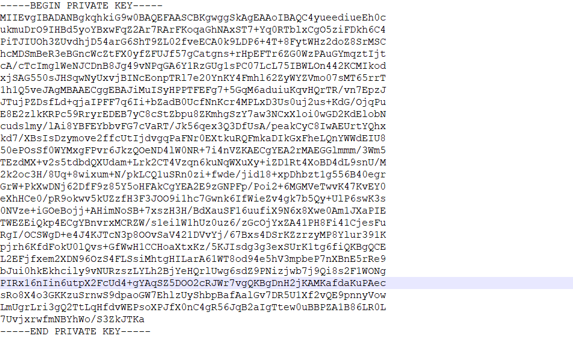

- Certificate chain (PEM-encoded): Ở đây chúng ta sẽ copy và dán nội dung file certificate.ca

Sau đó nhấn “Save” để lưu cấu hình.

Tiếp theo đó ta quay lại giao diện như ở bước 7 và chọn mục SSL Certificate

Ở mục Choose Certificate chúng ta clock vào mũi tên đi xuống và chọn domain mình đã cấu hình SSL và tick chọn vào mục VAS-SSL….

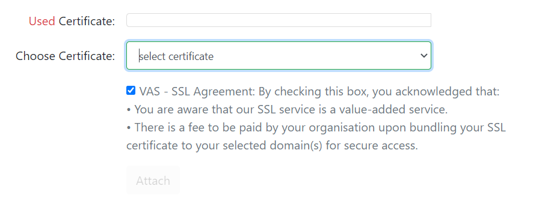

Khi đó Attach sẽ hiển thị màu đỏ bạn chỉ cần nhấn vào đó thì hệ thống sẽ nhận SSL của bạn.

Bước 9: Chọn mục CORS Headers > chọn Edit > Và điền nội dung “\*” vào mục Header Value nhấn “Save” để lưu file cấu hình.

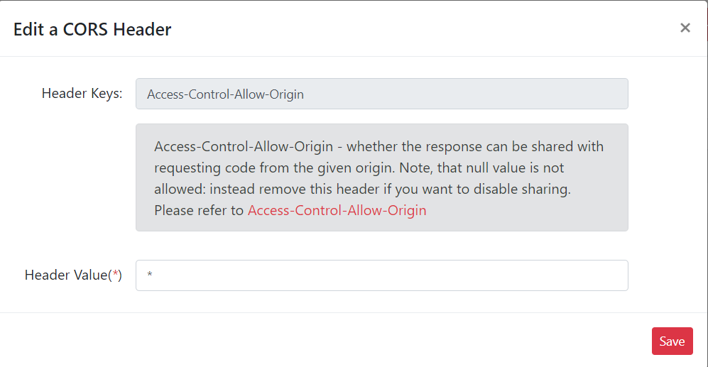

Sau đó bạn chỉ cần truy cập vào site của mình là được rồi. Để kiểm tra hoạt động của website ta chọn mục “Analytics” nhé.

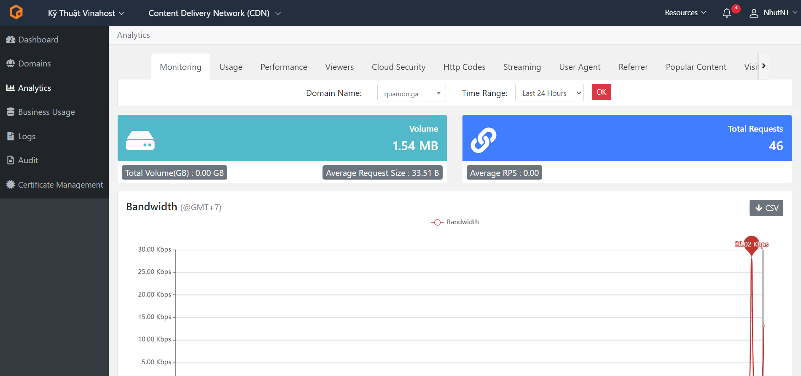

Chúc quý khách thực hiện thành công!

> **THAM KHẢO CÁC DỊCH VỤ TẠI [VINAHOST](https://kb.vinahost.vn/)**
> 
> **\>>** [**SERVER**](https://vinahost.vn/thue-may-chu-rieng/) **–** [**COLOCATION**](https://vinahost.vn/colocation.html) – [**CDN**](https://vinahost.vn/dich-vu-cdn-chuyen-nghiep)
> 
> **\>> [CLOUD](https://vinahost.vn/cloud-server-gia-re/) – [VPS](https://vinahost.vn/vps-ssd-chuyen-nghiep/)**
> 
> **\>> [HOSTING](https://vinahost.vn/wordpress-hosting)**
> 
> **\>> [EMAIL](https://vinahost.vn/email-hosting)**
> 
> **\>> [WEBSITE](http://vinawebsite.vn/)**
> 
> **\>> [TÊN MIỀN](https://vinahost.vn/ten-mien-gia-re/)**
