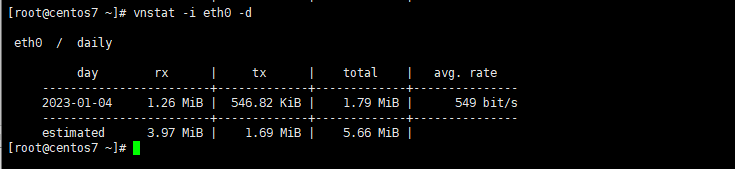

Bài viết này sẽ hướng dẫn bạn cách **Sử Dụng vnStat Để Giám Sát Lưu Lượng Mạng Trong VPS**. Nếu bạn cần hỗ trợ, xin vui lòng liên hệ VinaHost qua **Hotline 1900 6046 ext.3**, email về [support@vinahost.vn](mailto:support@vinahost.vn) hoặc chat với VinaHost qua livechat [https://livechat.vinahost.vn/chat.php](https://livechat.vinahost.vn/chat.php).

**vnStat** là một công cụ giám sát lưu lượng mạng cơ bản cho Linux bằng cách lưu ghi lại nhật ký sử dụng lưu lượng mạng trên các card mạng (intreface). Nó thống kế số liệu các network interface từ nguồn thông tin được cung cấp bởi hạt nhân (kernel).

Điều này nó nghĩa là vnstat không thực sự theo dõi lưu lượng truy cập và cũng không sử dụng tài nguyên hệ thống. VnStat có thể giám sát nhiều interface cùng một lúc. Nó hiển thị bảng tóm tắt đầu ra theo giờ, ngày, tuần, tháng.

Dưới đây là các bước cài đặt cũng như là hướng dẫn **sử dụng vnstat để giảm sát lưu lượng mạng trong VPS**.

## 1\. Cài đặt **vnStat**

Bước 1: Chúng ta sẽ download công cụ về từ trang [GitHub](https://github.com/vergoh/vnstat/releases). Sử dụng câu lệnh wget sau:

\# wget --no-check-certificate "https://humdi.net/vnstat/vnstat-2.6.tar.gz"

Bước 2: Sau khi tải về chúng ta tiến hành giải nén và biên dịch từ mã nguồn

Trên Fedora/CentOS ta sử dụng các câu lệnh sau để giải nén và biên dịch từ mã nguồn

\# yum group install "Development Tools" # yum install gd gd-devel sqlite-devel
# tar -xvf vnstat-2.6.tar.gz # cd vnstat-2.6/
# ./configure --prefix=/usr --sysconfdir=/etc # make
# make install

Trên Debian/Ubuntu ta sử dụng các câu lệnh sau để giải nén và biên dịch từ mã nguồn

\# sudo apt-get install build-essential gd gd-devel libsqlite3-dev # tar -xvf vnstat-2.6.tar.gz
# cd vnstat-2.6/
# sudo ./configure --prefix=/usr --sysconfdir=/etc # sudo make
# sudo make install

Bước 3: Sau khi biên dịch thành công, chúng ta sẽ copy file vnstat vào hệ thống Với Systemd:

# cp -v examples/systemd/vnstat.service /etc/systemd/system/ # systemctl enable vnstat
# systemctl start vnstat

Với Init.d

\# cp -v examples/init.d/redhat/vnstat /etc/init.d/ # chkconfig vnstat on
# service vnstat start

Bước 4: Sau khi hoàn tất quá trình cài đặt ta tiến hành thêm **Network Interface**

vào file cấu hình như hình dưới đây

\# vi /etc/vnstat.conf

## **2\. Sử Dụng vnStat Để Giám Sát Lưu Lượng Mạng Trong VPS**

Vậy là quá trình cài đặt đã hoàn tất ta tiến hành sử dụng vnstat để kiểm tra lưu lượng mạng với các câu lệnh như sau

Để xem thống kê lưu lượng mạng sử dụng trên tất cả interface, sử dụng lệnh sau:

\# vnstat

Để xem thống kê lưu lượng mạng sử dụng trên một interface cụ thể trong trường hợp này là eth0, sử dụng lệnh sau:

\# vnstat -i eth0

Để xem lưu lượng sử dụng theo giờ, sử dụng tham số **\-h:**

\# vnstat -i eth0 -h

Để xem lưu lượng sử dụng trong ngày, sử dụng tham số **\-d**

\# vnstat -i eth0 -d

 

Tương tự với các lệnh trên để xem thông số theo tuần và theo tháng ta sử dụng các lệnh sau:

\# vnstat -i eth0 –w (xem lưu lượng sử dụng trong tuần, sử dụng tham số **\-w**)

\# vnstat -i eth0 –m (xem lưu lượng sử dụng trong tháng, sử dụng tham số **\-m**)

Để xem lưu lượng sử dụng trong 5 giây, sử dụng lệnh sau:

\# vnstat -i eth0 –tr

Để xem lưu lượng sử dụng trực tiếp trên interface eth0, sử dụng lệnh sau:

\# vnstat -i eth0 –l

Lệnh này sẽ ghi lại lưu lượng sử dụng trên interface venet0. Để dừng quá trình này nhấn **Ctrl + C**

 

Chúc bạn thực hiện cài đặt và **Sử Dụng vnStat Để Giám Sát Lưu Lượng Mạng Trong VPS** thành công!

> **THAM KHẢO CÁC DỊCH VỤ TẠI [VINAHOST](https://vinahost.vn/)**
> 
> **\>>** [**SERVER**](https://vinahost.vn/thue-may-chu-rieng/) **–** [**COLOCATION**](https://vinahost.vn/colocation.html) – [**CDN**](https://vinahost.vn/dich-vu-cdn-chuyen-nghiep)
> 
> **\>> [CLOUD](https://vinahost.vn/cloud-server-gia-re/) – [VPS](https://vinahost.vn/vps-ssd-chuyen-nghiep/)**
> 
> **\>> [HOSTING](https://vinahost.vn/wordpress-hosting)**
> 
> **\>> [EMAIL](https://vinahost.vn/email-hosting)**
> 
> **\>> [WEBSITE](http://vinawebsite.vn/)**
> 
> **\>> [TÊN MIỀN](https://vinahost.vn/ten-mien-gia-re/)**
