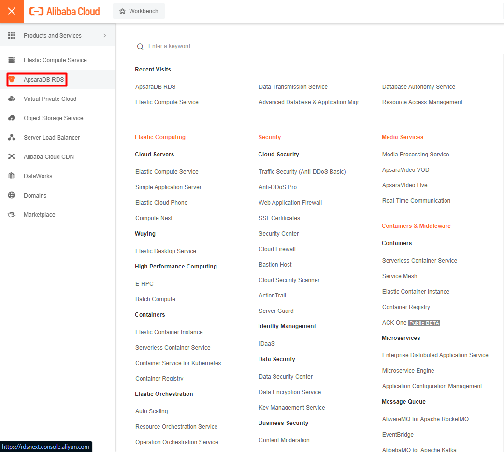
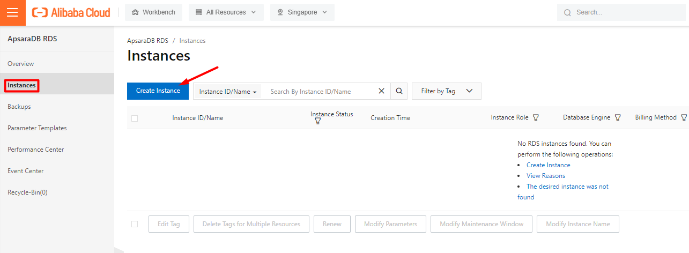
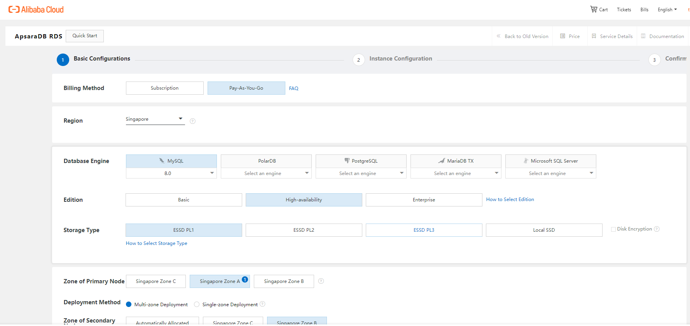
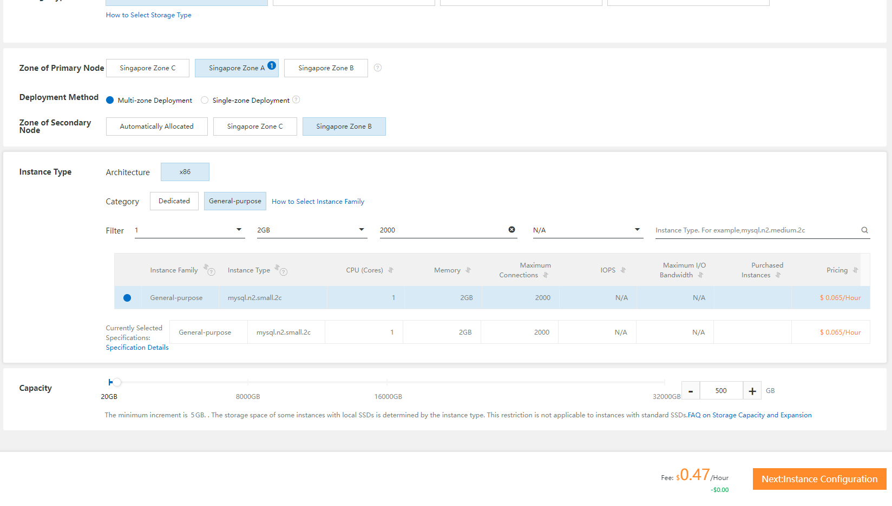
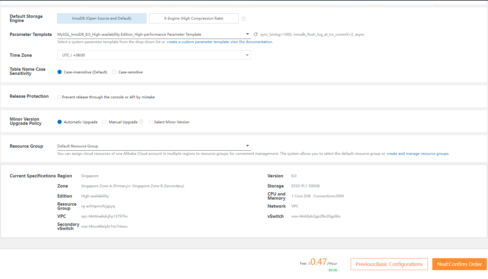
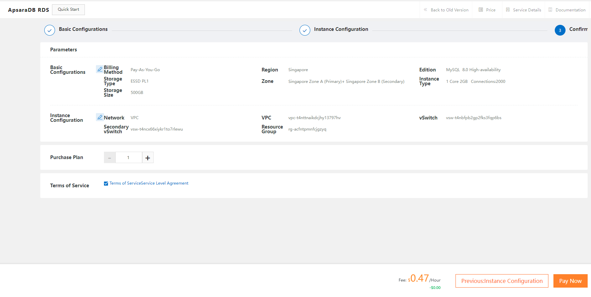
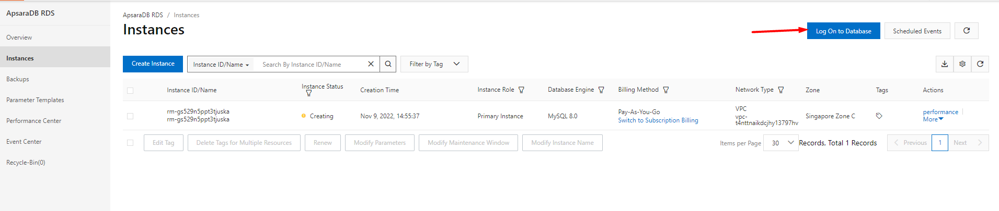
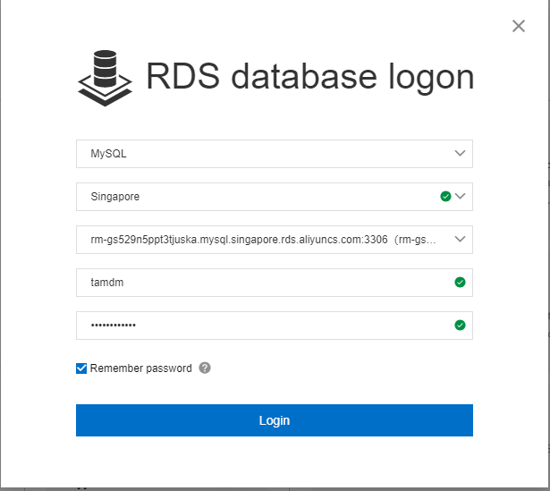
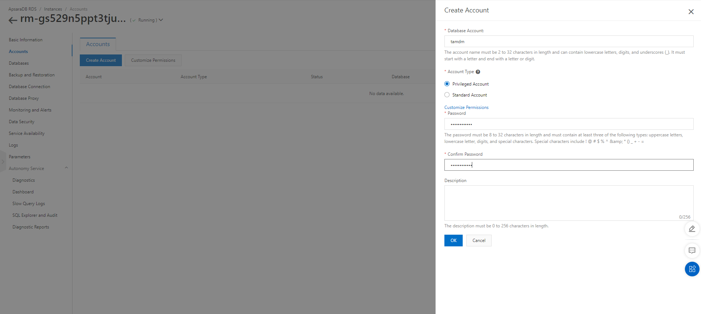
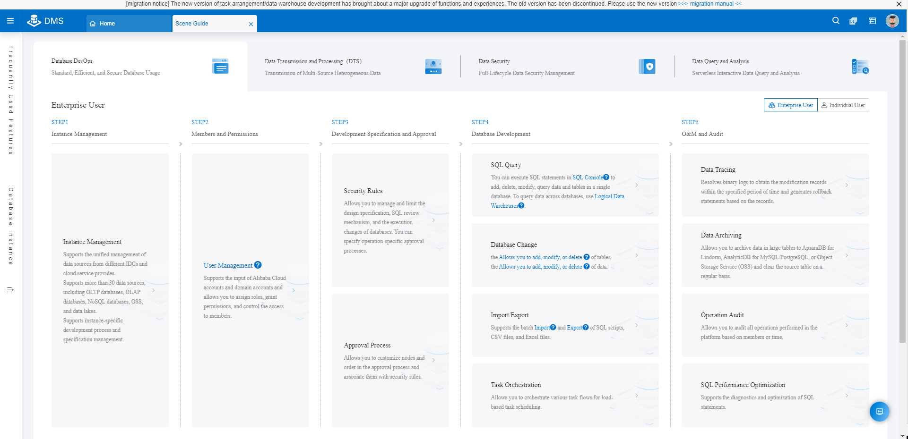

Bài viết này sẽ hướng dẫn bạn cách **Tạo ApsaraDB Instances Trên Alibaba Cloud**. Nếu bạn cần hỗ trợ, xin vui lòng liên hệ VinaHost qua **Hotline 1900 6046 ext.3, email về support@vinahost.vn hoặc chat với VinaHost qua livechat https://livechat.vinahost.vn/chat.php**.

## Hướng dẫn Tạo ApsaraDB Instances Trên Alibaba Cloud

Truy cập ApsaraDB RDS từ thanh menu

Chọn Instances > Create Instance

**Phương thức thanh toán:**

- Subcription: trả phí trước theo tháng
- Pay-as-you-go: trả phí theo giờ sử dụng

**Region:** Khu vực chứa Instance

**Database Engine:** Nền tảng CSDL

**Edition:** Cấu trúc lưu trữ dữ liệu

**Storage Type:** Loại SSD

**Zone of Primary Node:** Vùng của node chính

**Deployment Method:** Chạy Multi-zone hoặc Single-zone

**Instence Type:** Chọn cấu hình của Instance

**Capacity:** Dung lượng của Instance

Next

Next

Xem lại cấu hình đã chọn và Pay

Sau khi Create Instance hoàn tất -> Chọn Log On Database

Logon vào database

Nếu chưa có tài khoản -> Truy cập muc Accounts > Create Account

Đăng nhập hoàn tất vào giao diện quản lý Database

Chúc bạn **Tạo ApsaraDB Instances Trên Alibaba Cloud** thành công!

> **THAM KHẢO CÁC DỊCH VỤ TẠI [VINAHOST](https://kb.vinahost.vn/)**
> 
> **\>>** [**SERVER**](https://vinahost.vn/thue-may-chu-rieng/) **–** [**COLOCATION**](https://vinahost.vn/colocation.html) – [**CDN**](https://vinahost.vn/dich-vu-cdn-chuyen-nghiep)
> 
> **\>> [CLOUD](https://vinahost.vn/cloud-server-gia-re/) – [VPS](https://vinahost.vn/vps-ssd-chuyen-nghiep/)**
> 
> **\>> [HOSTING](https://vinahost.vn/wordpress-hosting)**
> 
> **\>> [EMAIL](https://vinahost.vn/email-hosting)**
> 
> **\>> [WEBSITE](http://vinawebsite.vn/)**
> 
> **\>> [TÊN MIỀN](https://vinahost.vn/ten-mien-gia-re/)**
