Bài viết này sẽ hướng dẫn bạn cách **Tạo Dịch Vụ ECS Trên Alibaba Cloud**. Nếu bạn cần hỗ trợ, xin vui lòng liên hệ VinaHost qua **Hotline 1900 6046 ext.3, email về support@vinahost.vn hoặc chat với VinaHost qua livechat https://livechat.vinahost.vn/chat.php**.

Để **Tạo** **Dịch Vụ ECS Trên Alibaba Cloud**, bạn nhấp vào thanh tìm kiếm phía trên góc trái màn hình và chọn Elastic Compute Service

[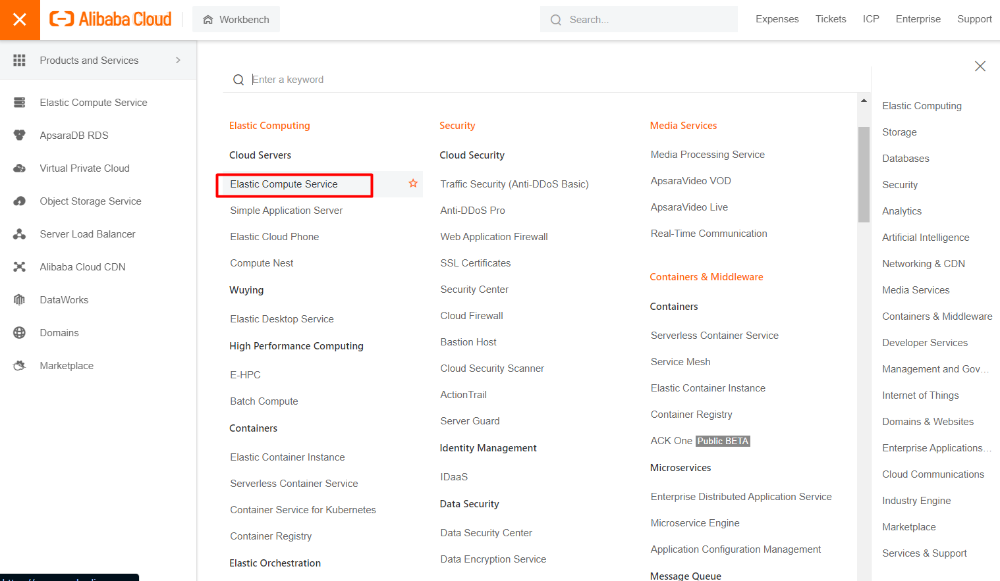](https://kb.vinahost.vn/wp-content/uploads/2022/11/tao-dich-vu-ecs-1.png)

Chọn Create ECS instance

[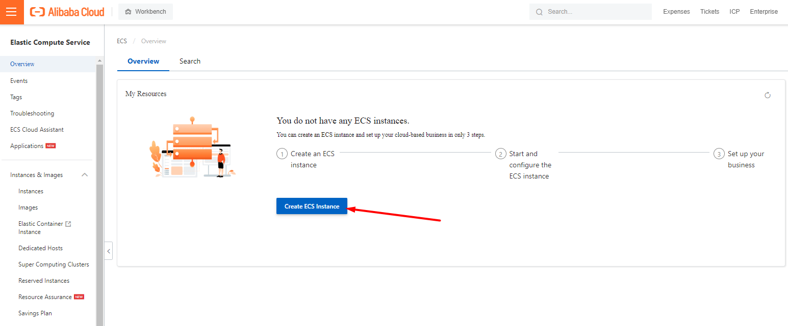](https://kb.vinahost.vn/wp-content/uploads/2022/11/tao-dich-vu-ecs-2.png)

**Phương thức thanh toán:**

\- Subcription: trả phí trước theo tháng

\- Pay-as-you-go: trả phí theo giờ sử dụng

**Region và Zone:** ở ví dụ chọn Singapore

Chọn thông số CPU là RAM sẽ xuất hiện các option khác nhau bên dưới

[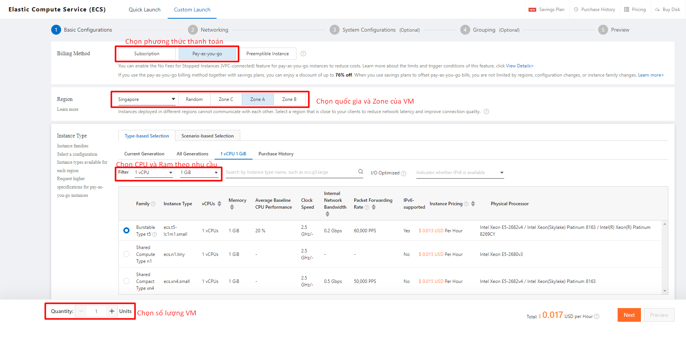](https://kb.vinahost.vn/wp-content/uploads/2022/11/tao-dich-vu-ecs-3.png)

Image: chọn Image cài đặt từ các nguồn bên dưới. Bạn có thể custom các Image của cá nhân hoặc sử dụng Public Image có sẵn do Alibaba cung cấp

Tiếp theo chọn dung lượng Disk và Next:

[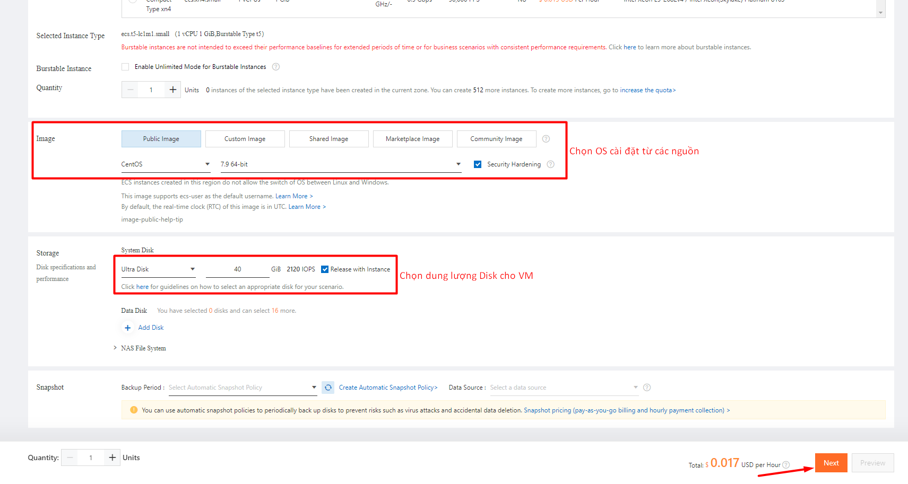](https://kb.vinahost.vn/wp-content/uploads/2022/11/tao-dich-vu-ecs-4.png)

**Ở phần Networking:**

\- Private: bạn có thể cấu hình IP theo ý mình tùy theo từng Zone

\- Public IP: chọn cung cấp Public IP theo Instance này hoặc có thể bỏ tick và sử dụng EIP sau đó

**Bandwitdth:**

\- Pay-by-Traffic: trả phí theo dung lượng sử dụng

\- Pay-by-Bandwidth: trả phí theo BW

**Next**

[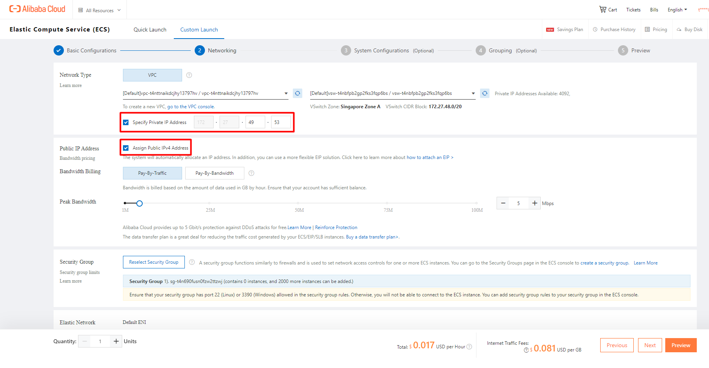](https://kb.vinahost.vn/wp-content/uploads/2022/11/tao-dich-vu-ecs-5.png)

**Logon Credentials**: có 3 options

- Key Pair: sử dụng key để đăng nhập
- Password: root (ecs-user) password
- Cài đặt sau

Tiếp theo đặt tên cho Instance, Host và Next

[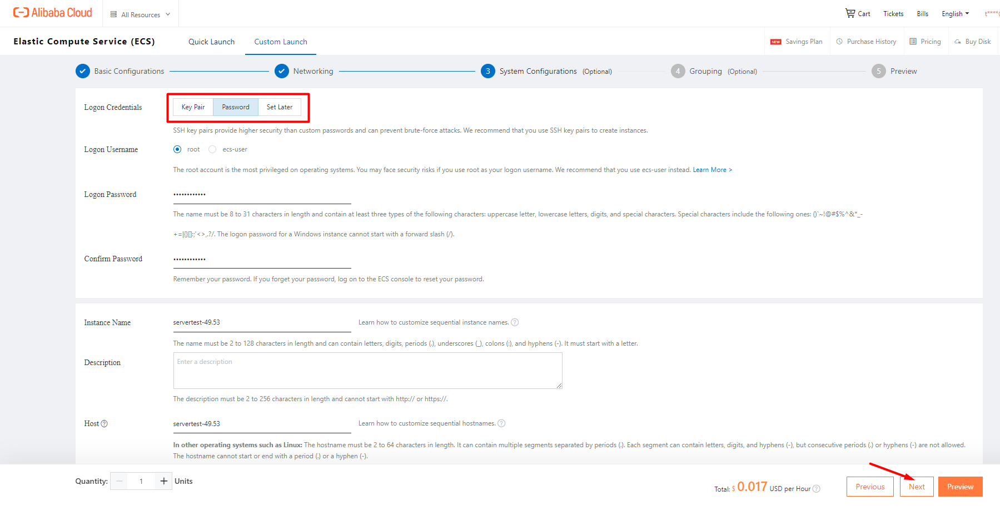](https://kb.vinahost.vn/wp-content/uploads/2022/11/tao-dich-vu-ecs-6.png)

Chọn Group mặc định và Next

[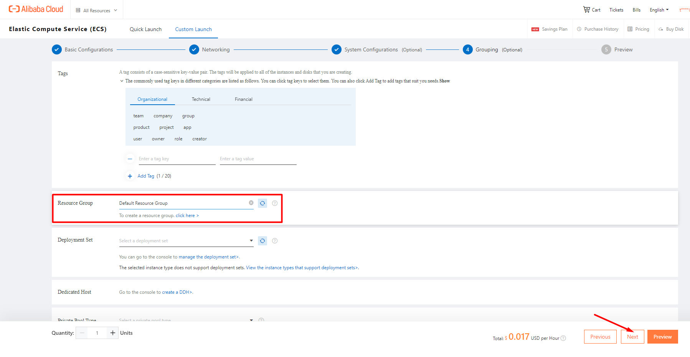](https://kb.vinahost.vn/wp-content/uploads/2022/11/tao-dich-vu-ecs-7.png)

Kiểm tra lại các cấu hình và Chọn Create Instance

[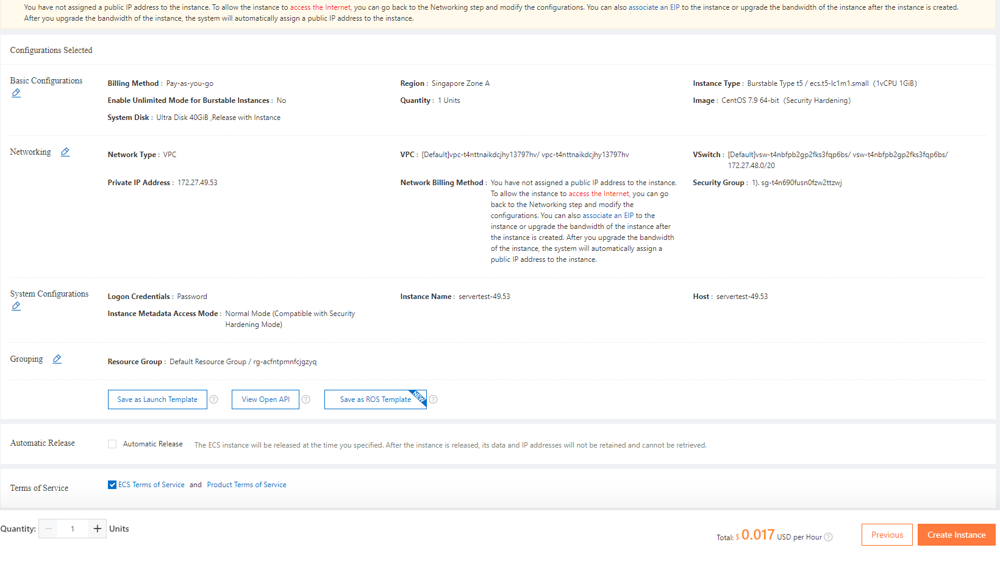](https://kb.vinahost.vn/wp-content/uploads/2022/11/tao-dich-vu-ecs-8.png)

**Lưu ý:** trong trường hợp bạn muốn sử dụng **Coupon** để thanh toán, có thể thực hiện như bên dưới ( check vào **Teams of Service** )

[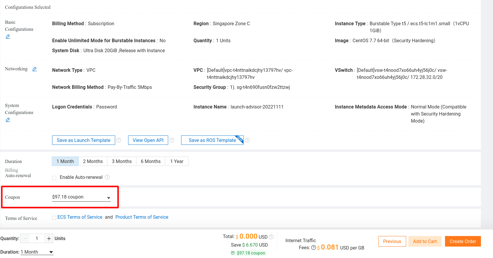](https://kb.vinahost.vn/wp-content/uploads/2022/11/alibabacloud-coupon.png)

Create thành công

[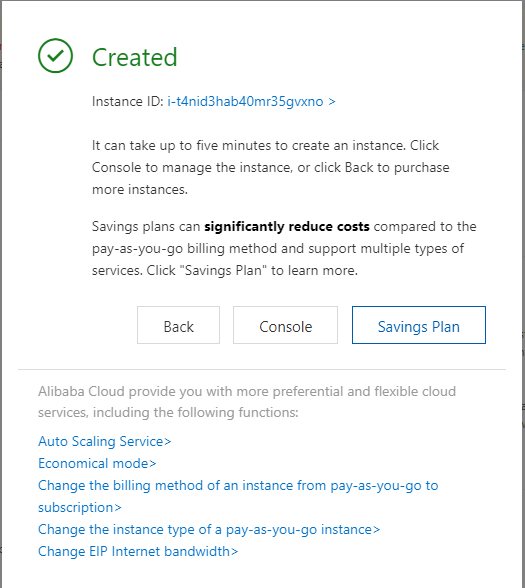](https://kb.vinahost.vn/wp-content/uploads/2022/11/tao-dich-vu-ecs-9.png)

Vào lại mục Instances để kiểm tra Instance vừa tạo

[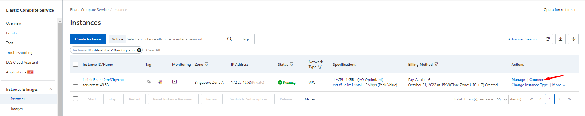](https://kb.vinahost.vn/wp-content/uploads/2022/11/tao-dich-vu-ecs-10.png)

Chúc bạn **Tạo Dịch Vụ ECS Trên Alibaba Cloud** thành công!

> **THAM KHẢO CÁC DỊCH VỤ TẠI [VINAHOST](https://kb.vinahost.vn/)**
> 
> **\>>** [**SERVER**](https://vinahost.vn/thue-may-chu-rieng/) **–** [**COLOCATION**](https://vinahost.vn/colocation.html) – [**CDN**](https://vinahost.vn/dich-vu-cdn-chuyen-nghiep)
> 
> **\>> [CLOUD](https://vinahost.vn/cloud-server-gia-re/) – [VPS](https://vinahost.vn/vps-ssd-chuyen-nghiep/)**
> 
> **\>> [HOSTING](https://vinahost.vn/wordpress-hosting)**
> 
> **\>> [EMAIL](https://vinahost.vn/email-hosting)**
> 
> **\>> [WEBSITE](http://vinawebsite.vn/)**
> 
> **\>> [TÊN MIỀN](https://vinahost.vn/ten-mien-gia-re/)**
