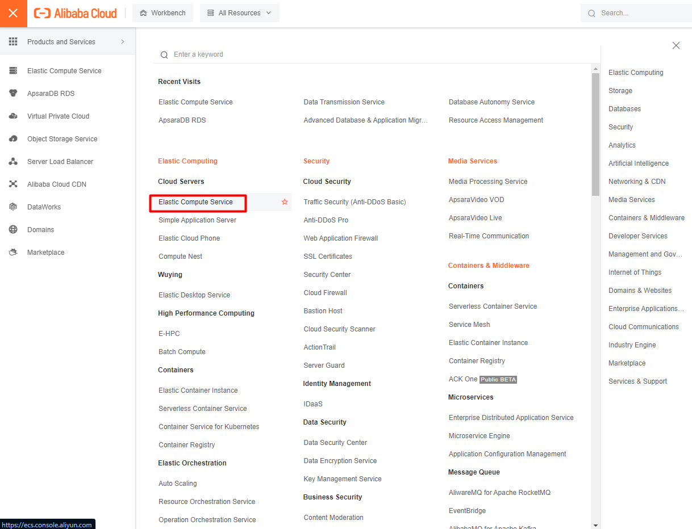

Bài viết này sẽ hướng dẫn bạn cách **Tạo Disk Cloud Và Gán Vào ECS Trên Alibaba Cloud**. Nếu bạn cần hỗ trợ, xin vui lòng liên hệ VinaHost qua **Hotline 1900 6046 ext.3, email về support@vinahost.vn hoặc chat với VinaHost qua livechat https://livechat.vinahost.vn/chat.php**.

Truy cập **Elastic Compute Service** từ thanh menu

Truy cập **Disk** ở **Storage & Snapshot**

**Create Disk**

- **Attach:** có thể gán vào ECS hoặc gán sau
- **Region:** chọn vùng của disk (Lưu ý: Region phải trùng với Instance muốn gán)
- **Storage:** loại ổ cứng và dung lượng Disk
- **Quantily:** số lượng Disk

Sau khi Pay hoàn tất. Chọn **More > Attach** để gán **Disk** vào **Instance**

Chọn **Instance** cần gán **Disk** và **Next**

Việc gán **Disk Cloud** cần **Instance** phải đang hoạt động. **Start Instance** và **OK**

Gán **Disk Cloud** cho **Instance** thành công

Chúc bạn **Tạo Disk Cloud Và Gán Vào ECS Trên Alibaba Cloud** thành công!

> **THAM KHẢO CÁC DỊCH VỤ TẠI [VINAHOST](https://vinahost.vn/)**
> 
> **\>>** [**SERVER**](https://vinahost.vn/thue-may-chu-rieng/) **–** [**COLOCATION**](https://vinahost.vn/colocation.html) – [**CDN**](https://vinahost.vn/dich-vu-cdn-chuyen-nghiep)
> 
> **\>> [CLOUD](https://vinahost.vn/cloud-server-gia-re/) – [VPS](https://vinahost.vn/vps-ssd-chuyen-nghiep/)**
> 
> **\>> [HOSTING](https://vinahost.vn/wordpress-hosting)**
> 
> **\>> [EMAIL](https://vinahost.vn/email-hosting)**
> 
> **\>> [WEBSITE](http://vinawebsite.vn/)**
> 
> **\>> [TÊN MIỀN](https://vinahost.vn/ten-mien-gia-re/)**
