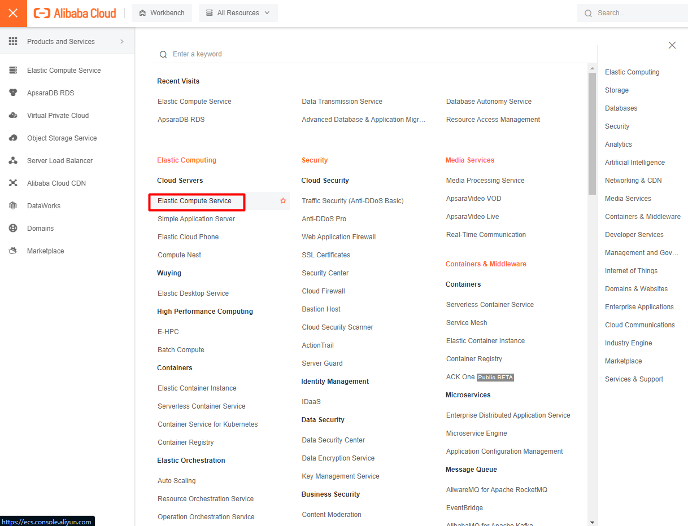
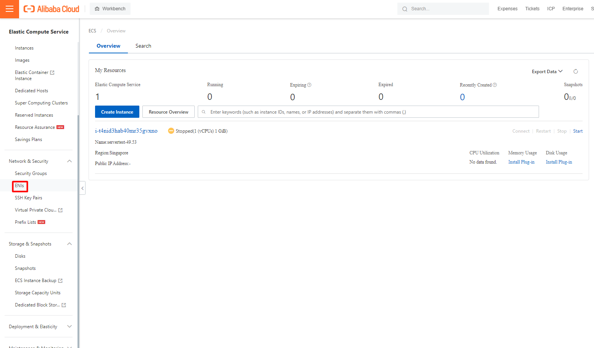
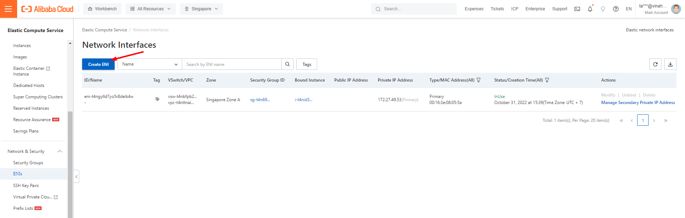
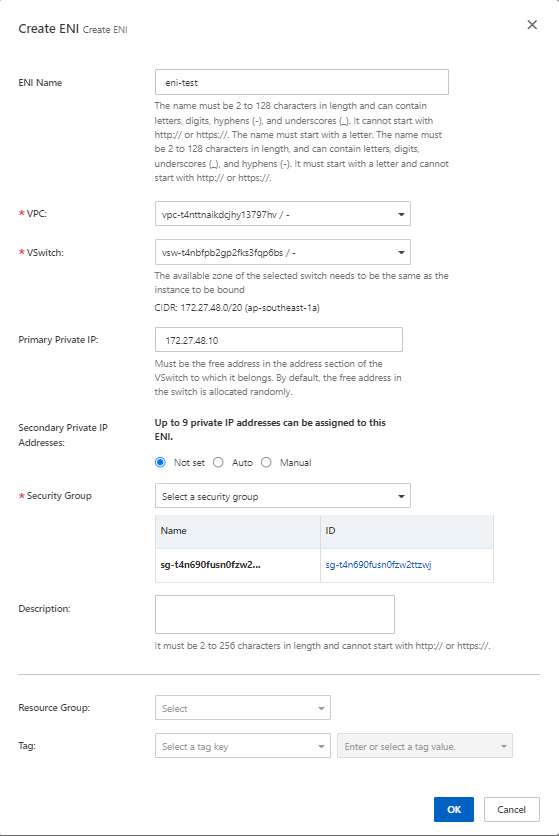
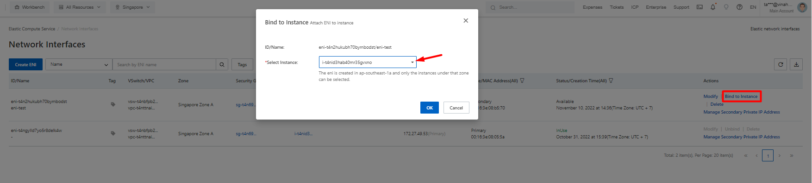
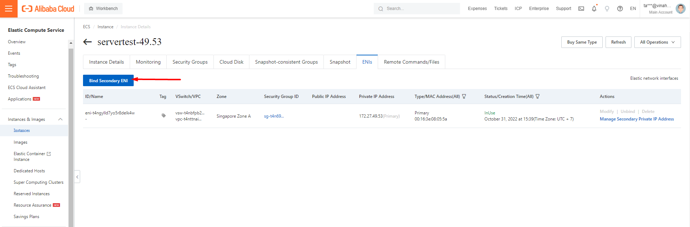

Bài viết này sẽ hướng dẫn bạn cách **Tạo Elastic Network Interfaces Trên Alibaba Cloud**. Nếu bạn cần hỗ trợ, xin vui lòng liên hệ VinaHost qua **Hotline 1900 6046 ext.3, email về support@vinahost.vn hoặc chat với VinaHost qua livechat https://livechat.vinahost.vn/chat.php**.

## Các bước tạo Elastic Network Interfaces trên Alibaba Cloud:

Truy cập **Elastic Compue Service** trên thanh menu

Truy cập **ENIs ở Network & Security**

Create ENI

Điền các thông tin cần thiết:

- **ENI Name**: tên ENI
- **VPC & Vswitch**: phải trùng zone với ECS muốn gán ENI
- **Primary Private IP**: IP private chính (buộc điền)
- **Secondary Private IP**: có thể bỏ qua

Có 2 cách để gán ENI cho ECS:

- Bind to Instance thì vừa tạo ENI xong

- Bind ENI ở mục ENIs của Instance đó

Chúc bạn **Tạo Elastic Network Interfaces Trên Alibaba Cloud** thành công!

> **THAM KHẢO CÁC DỊCH VỤ TẠI [VINAHOST](https://kb.vinahost.vn/)**
> 
> **\>>** [**SERVER**](https://vinahost.vn/thue-may-chu-rieng/) **–** [**COLOCATION**](https://vinahost.vn/colocation.html) – [**CDN**](https://vinahost.vn/dich-vu-cdn-chuyen-nghiep)
> 
> **\>> [CLOUD](https://vinahost.vn/cloud-server-gia-re/) – [VPS](https://vinahost.vn/vps-ssd-chuyen-nghiep/)**
> 
> **\>> [HOSTING](https://vinahost.vn/wordpress-hosting)**
> 
> **\>> [EMAIL](https://vinahost.vn/email-hosting)**
> 
> **\>> [WEBSITE](http://vinawebsite.vn/)**
> 
> **\>> [TÊN MIỀN](https://vinahost.vn/ten-mien-gia-re/)**
