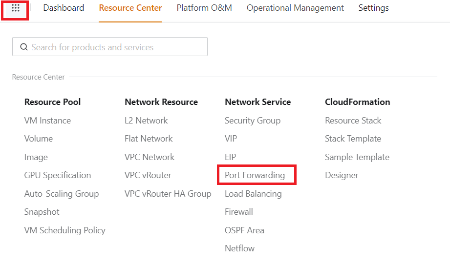
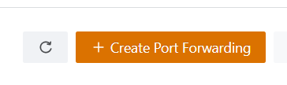
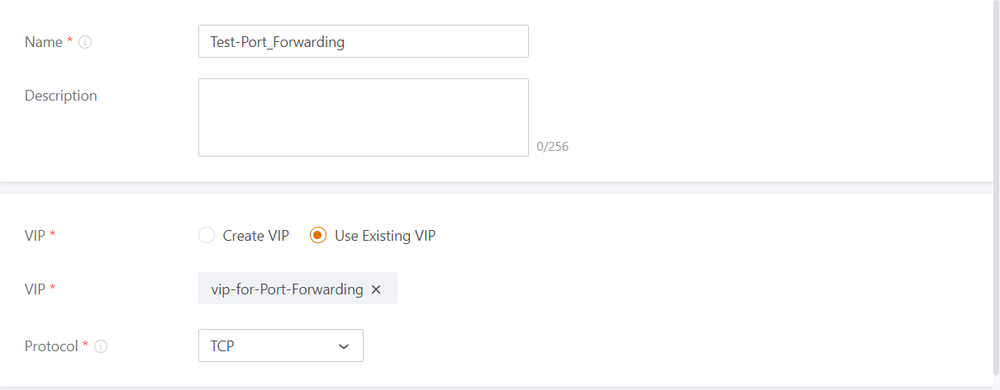
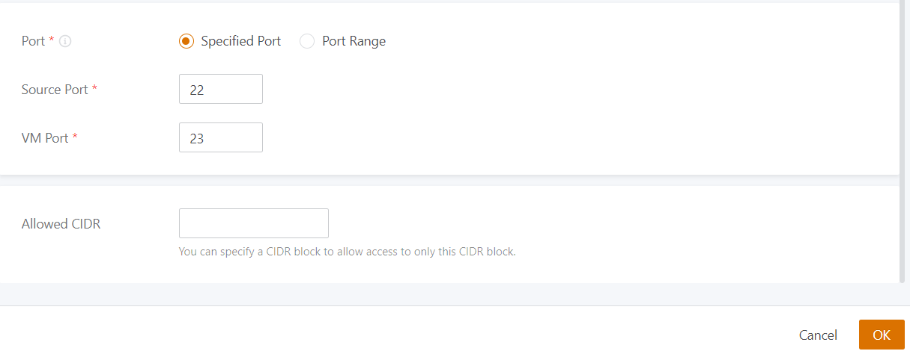
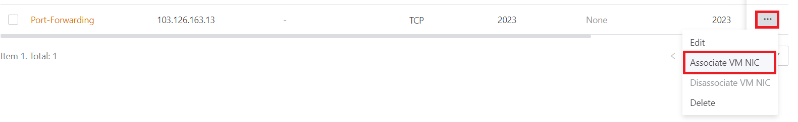
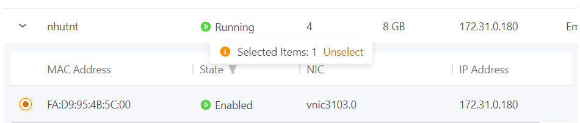

Bài viết này sẽ hướng dẫn bạn cách **Tạo Port Forwarding Trên vCloud VinaHost.** Nếu bạn cần hỗ trợ, xin vui lòng liên hệ VinaHost qua **Hotline 1900 6046 ext. 3**, email về [support@vinahost.vn](mailto:support@vinahost.vn) hoặc chat với VinaHost qua livechat [https://livechat.vinahost.vn/chat.php](https://livechat.vinahost.vn/chat.php).

## **Giới thiệu về Port Forwarding**

**Port forwarding** là một kỹ thuật cho phép các máy tính hoạt động trên cùng một mạng có thể truy cập vào các dịch vụ mạng của nhau thông qua một cổng truy cập từ bên ngoài mạng. Các máy tính được chuyển tiếp truy cập từ Internet thông qua cổng này và chuyển tiếp đến các máy tính bên trong mạng.

Vcloud cung cấp tính năng **Port forwarding** để cho phép các máy ảo trong hệ thống của bạn truy cập từ xa vào các dịch vụ của họ thông qua một địa chỉ IP công khai.

## **Tạo Port Forwarding trên Vcloud Vinahost**

### **Bước 1: Tạo VM**

Trước khi bạn có thể tạo **Port forwarding**, bạn cần phải tạo một máy ảo trong hệ thống của bạn. Bạn có thể sử dụng bất kỳ hệ điều hành nào bạn muốn cho máy ảo của mình.

### **Bước 2: Tạo Port Forwarding Rule**

Sau khi bạn đã tạo máy ảo, bạn có thể tạo một **Port Forwarding Rule**. Bạn cần truy cập vào trang quản lý hệ thống của Vcloud và thực hiện các bước sau:

Chọn "**Port Forwarding**" từ menu bên trái.

Nhấp vào nút "**Create**" ở góc phải của trang.

Nhập các thông tin cần thiết cho **Port Forwarding Rule**, bao gồm:

- **Tên**: Tên của Port Forwarding Rule.
- **Giao diện**: Giao diện mà bạn muốn chuyển tiếp các kết nối. Nếu bạn chỉ có một giao diện, nó sẽ được tự động chọn.
- **IP VM**: Địa chỉ IP của máy ảo mà bạn muốn chuyển tiếp các kết nối.
- **Cổng gốc**: Cổng trên máy tính của bạn mà bạn muốn chuyển tiếp các kết nối từ Internet vào.
- **Cổng đích**: Cổng trên máy ảo của bạn mà bạn muốn chuyển tiếp các kết nối đến.

Nhấp vào "**OK**" để tạo **Port Forwarding Rule**.

Sau khi hoàn thành quá trình tạo **Port Forwarding** ta thực hiện các bước sau để gán Port Forwarding cho VM nhé.

Chọn vào dấu 3 chấm è Chọn Associate VM NIC è Sau đó chọn VM mà bạn muốn gán Rule Port Forwarding

### **Bước 3: Kiểm tra Port Forwarding Rule**

Sau khi bạn đã tạo **Port Forwarding Rule**, bạn có thể kiểm tra xem nó có hoạt động hay không bằng cách thực hiện các bước sau:

- Truy cập vào máy tính của bạn từ bên ngoài mạng thông qua địa chỉ IP công khai của bạn.
- Nhập địa chỉ IP công khai của bạn và cổng gốc của bạn vào thanh địa chỉ của trình duyệt.

Chúc bạn thực hiện thành công!

> **THAM KHẢO CÁC DỊCH VỤ TẠI [VINAHOST](https://vinahost.vn/)**
> 
> **\>>** [**SERVER**](https://vinahost.vn/thue-may-chu-rieng/) **–** [**COLOCATION**](https://vinahost.vn/colocation.html) – [**CDN**](https://vinahost.vn/dich-vu-cdn-chuyen-nghiep)
> 
> **\>> [CLOUD](https://vinahost.vn/cloud-server-gia-re/) – [VPS](https://vinahost.vn/vps-ssd-chuyen-nghiep/)**
> 
> **\>> [HOSTING](https://vinahost.vn/wordpress-hosting)**
> 
> **\>> [EMAIL](https://vinahost.vn/email-hosting)**
> 
> **\>> [WEBSITE](http://vinawebsite.vn/)**
> 
> **\>> [TÊN MIỀN](https://vinahost.vn/ten-mien-gia-re/)**
