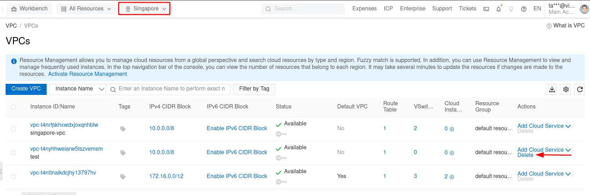

Bài viết này hướng dẫn bạn **Tạo Và Quản Lý Virtual Private Cloud Với Alibaba Cloud**. Nếu bạn cần hỗ trợ, xin vui lòng liên hệ VinaHost qua **Hotline 1900 6046 ext.3**, email về [support@vinahost.vn](mailto:support@vinahost.vn) hoặc chat với VinaHost qua livechat [https://livechat.vinahost.vn/chat.php](https://livechat.vinahost.vn/chat.php).

## **1\. Giới thiệu chung**

A Virtual private cloud (VPC) là một mạng ảo hoạt động trên hạ tầng cloud.

Đây là nơi mà bạn có toàn quyền kiểm soát môi trường mạng ảo của mình, bao gồm lựa chọn CIDR block (IPv4 & IPv6), tạo các mạng con (Subnet), và cấu hình các bảng định tuyến (Route Tables) và Gateway. Bạn có thể phân phối và sử dụng cả IPv4 và IPv6 ngay trong môi trường VPC.

## **2\. Tính năng và ưu điểm của Alibaba VPC**

### **Bảo mật**

AlibabaCloud cung cấp các giải pháp bảo mật tiên tiến như chính sách bảo mật (Security Groups), danh sách quản lý truy cập mạng (Network access control lists), bộ lọc dữ liệu vào ra ở mức Instance hoặc Subnet.

### **Đơn giản**

Việc tạo VPC diễn ra rất nhanh chóng và dễ dàng nhờ vào việc sử dụng Alibaba Management Console với giao diện đồ họa trực quan nên web. Bạn chỉ việc thao tác vài bước theo hướng dẫn của nhà cung cấp.

### **Khả năng mở rộng và tin cậy**

Alibaba VPC cung cấp các tính năng cao cấp đối với hệ thống cloud. Bạn có thể lập tức mở rộng hoặc thu hẹp tài nguyên VPC của bạn, chọn các thể loại và kích cỡ ECS Instance thích hợp cho các ứng dụng của bạn và chỉ trả tiền cho các tài nguyên mà bạn sử dụng.

## **3\. Hướng dẫn tạo VPC**

### 3.1. Mô hình mạng

### 3.2. Tạo mới VPC và vSwitch

Bước 1: Log on vào [VPC Console](https://vpcnext.console.aliyun.com/vpc?spm=a2c63.p38356.0.0.70e8c52ffyTpG7).

Bước 2: Trong thanh điều hướng tìm kiếm trên cùng, search dịch vụ “Virtual Private Cloud”

Bước 3: Ở trang VPC, chọn “Create VPC” để tạo mới một VPC

Bước 4:  Tạo VPC

Nhập các thông tin sau:

**VPC:**

- Name: đặt cho cho VPC, ở đây mình đặt tên VPC là “singapore-vpc”
- IPv4 CIDR block: chọn dải địa chỉ IPv4 của bạn VD: 10.0.0.0/8 hoặc 172.16.0.0/12 và 192.168.0.0/16.

Note: Sau khi đã tạo VPC, bạn không thể thay đổi primary IPv4 CIDR block. Tuy nhiên bạn có thể add thêm một secondary IPv4 CIDR block.

- IPv6 CIDR block: Dải mạng địa chỉ IPv6 của bạn. Ở đây mình ko sử dụng IPv6 nên mình chọn “Do Not Assign”

_**Note:**_

Cần kiểm tra regions có hỗ trợ Ipv6 CIDR block trước.

Sau khi đã tạo VPC, bạn không thể thay đổi primary IPv6 CIDR block. Tuy nhiên bạn có thể add thêm một secondary IPv6 CIDR block.

- Description: Mô tả các thông tin của VPC
- Resource Group: Chọn default resource group.

**vSwitch**

- Name: Nhập tên của vSwitch
- Zone: chọn zone cho vSwitch. Trong một VPC, 2 vSwitch ở khác zone có thể giao tiếp và kết nối được với nhau.
- IPv4 CIDR block của vSwitch phải thuộc IPv4 CIDR block của VPC.

**Ví dụ:** CIDR block của VPC là 192.168.0.0/16 thì phạm vi CIDR block của vSwitch phải thuộc khoảng 192.168.0.0/17 - 192.168.0.0/29.

- IPv6 CIDR block của vSwitch phải thuộc IPv6 CIDR block của VPC.
- Optional: Để tạo nhiều vSwitch, bấm chọn add và lập lại các bước tùy chọn.

**Note:** Có thể tạo tối đa 10 vSwitch trong mỗi VPC.

Bước 5: Bấm chọn “Creating” và chờ quá trình khởi tạo VPC và vSwitch hoàn tất.

## **4\. Quản lý VPC**

Bước 1: Truy cập vào [VPC console](https://vpcnext.console.aliyun.com/vpc?spm=a2c63.p38356.0.0.70e8c52ffyTpG7).

Bước 2: Trên thanh điều hướng, chọn region đã chọn khi tạo VPC trước đó.

Bước 3: Ở giao diện VPCs, chúng ta sẽ thấy VPC vừa được khởi tạo thành công. Bấm chọn VPC muốn quản lý.

Bước 4: tại giao diện quản lý VPC. Người dùng có thể theo dõi các tài nguyên sau:

- VPC Details
- vRouter Basic Information
- Resources
- CIDRs

Ở tab Advanced Features sẽ cung cấp thêm các thông tin khác như:

- [Network ACL](https://vpc.console.aliyun.com/nacl/ap-southeast-1/nacls)
- [Custom Route Table](https://vpc.console.aliyun.com/vpc/ap-southeast-1/route-tables)
- [DHCP Options Sets](https://vpc.console.aliyun.com/dhcp/ap-southeast-1/dhcps)
- [IPv4 Gateway](https://vpc.console.aliyun.com/ipv4/ap-southeast-1/ipv4s)

Ở tab Authorize Cross Account Attach CEN được sử dụng để cấp quyền Cloud Enterprise Network ( CEN) cho một tài khoản Alibaba Cloud khác. Phương pháp này người dùng có thể attach VPC vào CEN Instance.

## **5\. Xóa một VPC**

Bước 1: Truy cập vào [VPC console](https://vpcnext.console.aliyun.com/vpc?spm=a2c63.p38356.0.0.70e8c52ffyTpG7).

Bước 2: Trên thanh điều hướng, chọn region đã chọn khi tạo VPC trước đó.

Bước 3: Tại giao diện VPCs, click chọn nút Delete để xóa VPC

**Lưu ý:** VPC chỉ được phép xóa sau khi đã unbind - delete hết các sub-resource liên quan như Group Security, vSwitch …

## **6\. Khởi tạo ECS Instance và thêm vào VPC**

Bước 1: Log on vào [VPC Console](https://vpcnext.console.aliyun.com/vpc?spm=a2c63.p38356.0.0.70e8c52ffyTpG7).

Bước 2: Trong thanh điều hướng tìm kiếm trên cùng, search dịch vụ “Elastic Compute Service”

Bước 3: Click chọn “Create Instance”. Chi tiết cách tạo dịch vụ ECS Instance tham khảo tại [đây](https://kb.vinahost.vn/tao-dich-vu-ecs-tren-alibaba-cloud/).

Các bước tùy chọn cấu hình ECS, ISO, Disk đã có trong hướng dẫn. Do vậy mình sẽ bỏ qua và đi thẳng tới bước thêm Instance vào VPC đã tạo

Bước 4: Tại tab Networking, tiến hành chọn VPC, vSwitch đã tạo ở các bước trước đó

Tùy chọn Specify Private IP Address sẽ giúp bạn tự động gán IP Private vào cho Instance khi khởi tạo sẵn.

Sau đó bạn cần hoàn tất các bước khởi tạo ECS cho tới khi hoàn tất.

Như vậy bạn đã nắm được cách khỏi tạo instance và thêm vào VPC/vSwitch Chúc bạn thành công.

## **7\. Thêm ECS Instance đã có sẵn vào VPC**

Bước 1: Log on vào [VPC Console](https://vpcnext.console.aliyun.com/vpc?spm=a2c63.p38356.0.0.70e8c52ffyTpG7).

Bước 2: Trong thanh điều hướng tìm kiếm trên cùng, search dịch vụ “Elastic Compute Service”

Bước 3: Tại giao diện quản lý Instance, click vào ECS cần quản lý hoặc bấm vào nút “Manage”

Bước 4: Tại giao diện ECS Console, tìm tới Network Information. Bấm chọn “Change VPC”

Chọn “Next” và tiến hành chọn Destionation VPC, Destination vSwitch, Destination Security Group và chọn Next

Bước 5: Kiểm tra và xác thực lại các thông tin lần cuối trước khi bấm OK.

Bước 6: Sau khi hoàn tất, sẽ có thông báo chờ ít phút để hệ thống hoàn tất quá trình migration.

Chúc bạn Tạo Và Quản Lý Virtual Private Cloud Với Alibaba Cloud thành công!

> **THAM KHẢO CÁC DỊCH VỤ TẠI [VINAHOST](https://kb.vinahost.vn/)**
> 
> **\>>** [**SERVER**](https://vinahost.vn/thue-may-chu-rieng/) **–** [**COLOCATION**](https://vinahost.vn/colocation.html) – [**CDN**](https://vinahost.vn/dich-vu-cdn-chuyen-nghiep)
> 
> **\>> [CLOUD](https://vinahost.vn/cloud-server-gia-re/) – [VPS](https://vinahost.vn/vps-ssd-chuyen-nghiep/)**
> 
> **\>> [HOSTING](https://vinahost.vn/wordpress-hosting)**
> 
> **\>> [EMAIL](https://vinahost.vn/email-hosting)**
> 
> **\>> [WEBSITE](http://vinawebsite.vn/)**
> 
> **\>> [TÊN MIỀN](https://vinahost.vn/ten-mien-gia-re/)**
