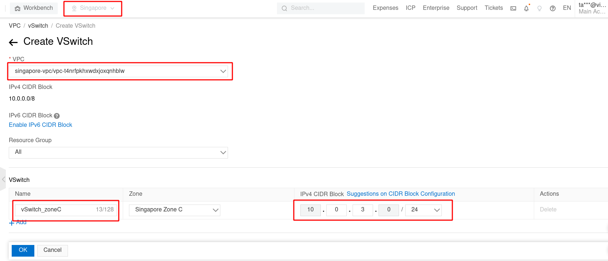
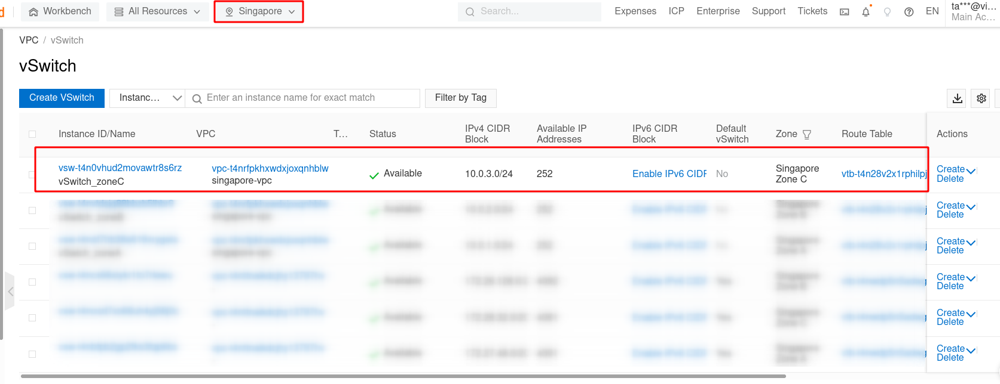
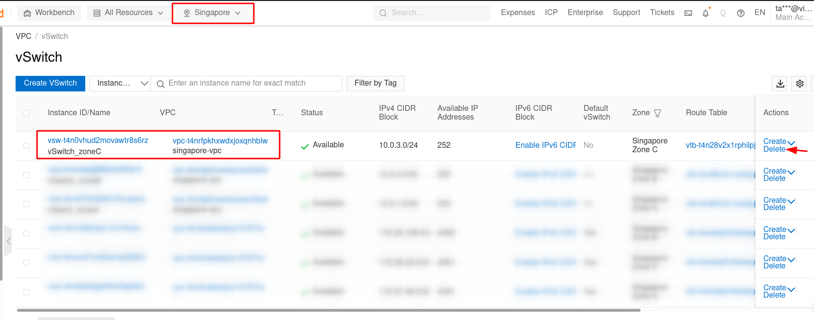

Bài viết này sẽ hướng dẫn bạn **Tạo Và Quản Lý Vswitch Với Alibaba Cloud**. Nếu bạn cần hỗ trợ, xin vui lòng liên hệ VinaHost qua **Hotline 1900 6046 ext.3**, email về [support@vinahost.vn](mailto:support@vinahost.vn) hoặc chat với VinaHost qua livechat [https://livechat.vinahost.vn/chat.php](https://livechat.vinahost.vn/chat.php).

## **1\. Giới thiệu chung**

vSwitch: là một ứng dụng phần mềm được ảo hóa trên hạ tầng phần cứng vật lý,  ho phép có thể giao tiếp với nhau, chuyển tiếp frame và hoạt động như một thiết bị chuyển mạch layer 2.

Các vSwitch có thể nằm ở khác Zone nhưng chung 1 Region có thể kết nối được với nhau.

## **2\. Hướng dẫn tạo và quản lý vSwitch với Alibaba Cloud**

Bước 1: Log in vào [VPC Console](https://vpcnext.console.aliyun.com/vpc?spm=a2c63.p38356.0.0.70e8c52ffyTpG7).

Bước 2: Trong thanh điều hướng tìm kiếm trên cùng, search dịch vụ “Virtual Private Cloud”.

Bước 3: Tại giao diện quản lý VPC > bấm chọn vSwitch > Create VSwitch.

Bước 4: Chọn các thông tin cần thiết như VPC, Name, Zone, IPv4 CIDR Block. Tham khảo hình bên dưới.

Sau khi đã hoàn tất, bấm chọn OK để khởi tạo VSwitch mới thuộc VPC Zone Singapore-vpc.

Bước 5: Quay trở lại trang quản lý vSwitch, lúc nào vSwitch mới tạo đã hiện trong bảng điều khiển.

## **3\. Hướng dẫn xóa vSwitch đang tồn tại**

Bước 1: Log on vào [VPC Console](https://vpcnext.console.aliyun.com/vpc?spm=a2c63.p38356.0.0.70e8c52ffyTpG7).

Bước 2: Trong thanh điều hướng tìm kiếm trên cùng, search dịch vụ “Virtual Private Cloud”.

Bước 3: Tại giao diện quản lý VPC > bấm chọn tab vSwitch để truy cập vào giao diện quản lý vSwitch.

Bước 4: Tại giao diện vSwitch, cột Actions, bấm chọn Delete vSwitch mình muốn xóa.

Một bảng thông báo sẽ hiện ra để xác nhận lại. Bấm chọn OK và hoàn tất quá trình xóa một vSwitch trong VPC.

Chúc bạn **Tạo Và Quản Lý Vswitch Với Alibaba Cloud** thành công!

> **THAM KHẢO CÁC DỊCH VỤ TẠI [VINAHOST](https://kb.vinahost.vn/)**
> 
> **\>>** [**SERVER**](https://vinahost.vn/thue-may-chu-rieng/) **–** [**COLOCATION**](https://vinahost.vn/colocation.html) – [**CDN**](https://vinahost.vn/dich-vu-cdn-chuyen-nghiep)
> 
> **\>> [CLOUD](https://vinahost.vn/cloud-server-gia-re/) – [VPS](https://vinahost.vn/vps-ssd-chuyen-nghiep/)**
> 
> **\>> [HOSTING](https://vinahost.vn/wordpress-hosting)**
> 
> **\>> [EMAIL](https://vinahost.vn/email-hosting)**
> 
> **\>> [WEBSITE](http://vinawebsite.vn/)**
> 
> **\>> [TÊN MIỀN](https://vinahost.vn/ten-mien-gia-re/)**
