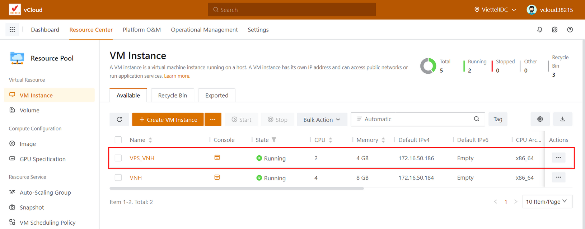

Bài viết này sẽ hướng dẫn bạn **Tạo VM Instance Bằng Tính Năng Fast Creation.** Nếu bạn cần hỗ trợ, xin vui lòng liên hệ VinaHost qua **Hotline 1900 6046 ext. 3**, email về [support@vinahost.vn](mailto:support@vinahost.vn) hoặc chat với VinaHost qua livechat [https://livechat.vinahost.vn/chat.php](https://livechat.vinahost.vn/chat.php).

## 1\. Tổng quan

Qua bài [Hướng Dẫn Tạo VM Instance Trên vCloud,](https://kb.vinahost.vn/tao-vm-instance-tren-vcloud-vinahost/) VinaHost đã hướng dẫn các bạn cách tạo VM Instance bằng tính năng Standard Creation. Phải trải qua nhiều bước thao tác cấu hình như điền đầy đủ thông tin của VM, chọn các cấu hình VM và OS Image cho VM, cấu hình network, cấu hình thông tin truy cập VM. Bài viết hôm nay mình sẽ hướng dẫn các bạn sử dụng tính năng **Fast Creation** để rút ngắn-đơn giản hóa quá trình tạo VM Instance

## 2\. Hướng dẫn tạo VM Instance bằng tính năng Fast Creation

1\. Sau khi login vào hệ thông chọn _Resource Pool > VM Instance_ sau đó nhấp vào dấu 3 chấm cạnh nút **Create VM Instance** và chọn **Fast Creation**

2\. Điền thông tin tên cho **VM Instance**

3\. Chọn cấu hình **VM, OS Image** và dung lượng **Disk** cho VM **Instance**

Ở đây mình chọn VM có cấu hình là 2 CPU và 4GB RAM và chọn OS là **Centos & Minimal** và có dung lượng Disk là 20GB. Các bạn có thể chọn cấu hình theo nhu cầu tùy ý và tài nguyên của gói cho phép

_Chọn thông số CPU, RAM cho VM_ 

_Chọn OS Image_

_Chọn dung lượng Disk_

4\. Cấu hình Network cho VM

Ở đây sẽ có thể chọn 1 trong 3 loại như sau

- VPC network (Virtual Private Cloud)
- Public Network
- Flat Network

Ở đây mình chọn **VPC Network** và sử dụng **VPC172**

Các bạn có thể chỉ định địa chỉ IP cho VM bằng cách tích chọn vào **Assign IP** và chọn **IP** mong muốn, hoặc bỏ trống để hệ thống tự cấp **DHCP**

Cuối cùng các bạn nhấn OK để tạo **VM Instance**

5\. Sau khi cài đặt hoàn tất thì thông tin của VM sẽ hiện ra

Đợi khoảng vài giây là hệ thống đã tạo xong VM

Nhấp vào VM vừa tạo để kiểm tra thêm thông tin

Chúc các bạn tạo **VM Instance trên vCloud VinaHost** bằng tính năng **Fast Creation** thành công!

> **THAM KHẢO CÁC DỊCH VỤ TẠI [VINAHOST](https://kb.vinahost.vn/)**
> 
> **\>>** [**SERVER**](https://vinahost.vn/thue-may-chu-rieng/) **–** [**COLOCATION**](https://vinahost.vn/colocation.html) – [**CDN**](https://vinahost.vn/dich-vu-cdn-chuyen-nghiep)
> 
> **\>> [CLOUD](https://vinahost.vn/cloud-server-gia-re/) – [VPS](https://vinahost.vn/vps-ssd-chuyen-nghiep/)**
> 
> **\>> [HOSTING](https://vinahost.vn/wordpress-hosting)**
> 
> **\>> [EMAIL](https://vinahost.vn/email-hosting)**
> 
> **\>> [WEBSITE](http://vinawebsite.vn/)**
> 
> **\>> [TÊN MIỀN](https://vinahost.vn/ten-mien-gia-re/)**
