Bài viết này sẽ hướng dẫn bạn **Tạo VM Instance Trên vCloud VinaHost**. Nếu bạn cần hỗ trợ, xin vui lòng liên hệ VinaHost qua **Hotline 1900 6046 ext.3**, email về [support@vinahost.vn](mailto:support@vinahost.vn) hoặc chat với VinaHost qua livechat [https://livechat.vinahost.vn/chat.php](https://livechat.vinahost.vn/chat.php).

## Hướng Dẫn Tạo VM Instance Trên vCloud VinaHost

<iframe title="YouTube video player" src="https://www.youtube.com/embed/Zto_qmrP_xo" width="560" height="315" frameborder="0" allowfullscreen="allowfullscreen"></iframe>

**\>>> [Nên chọn Email Hosting hay Email Server?](https://blog.vinahost.vn/su-khac-nhau-giua-email-hosting-va-email-server/)** **1\.** **Sau khi login vào hệ thông chọn VM Instance sau đó chọn Create VM Instance**

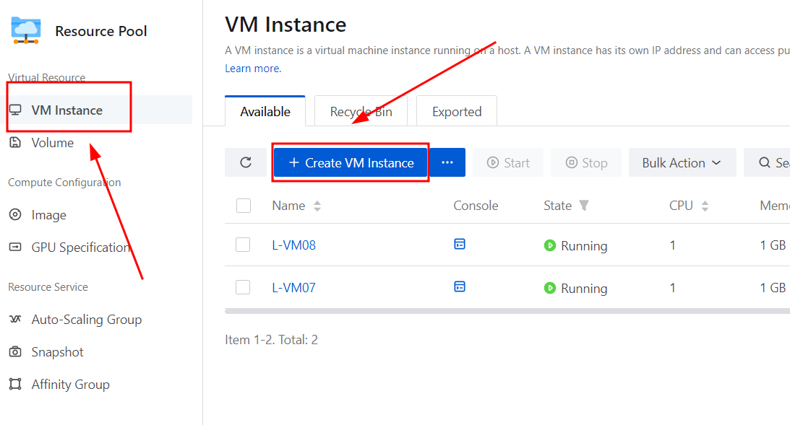

**2\.** **Tiếp theo cần điền đầy đủ thông tin như sau:**

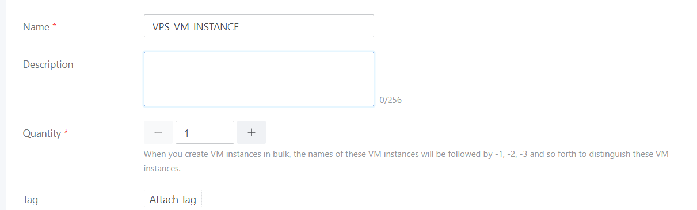

**3\.** **Tiếp theo cần chọn các cấu hình VM và OS Image cho VM**

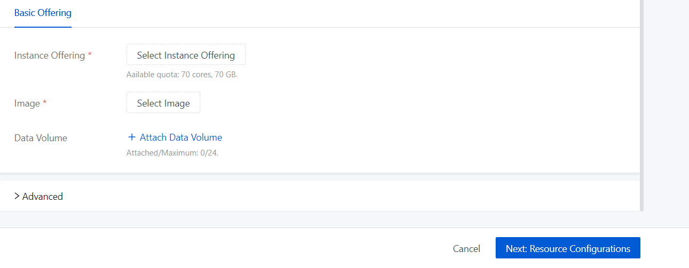

_Ở đây có sẵn một số cấu hình và Image như sau:_

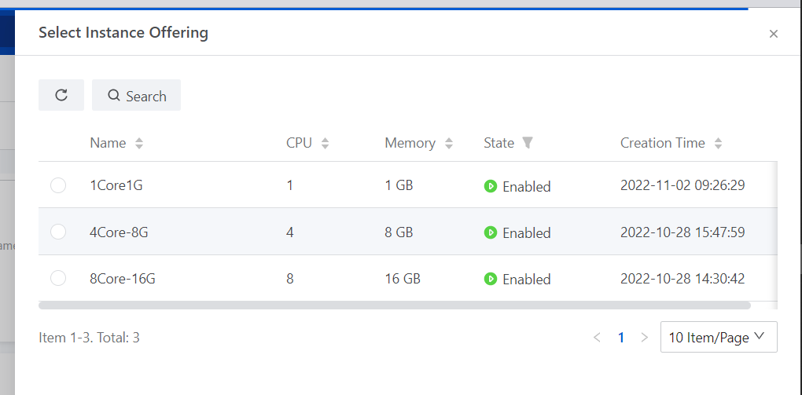

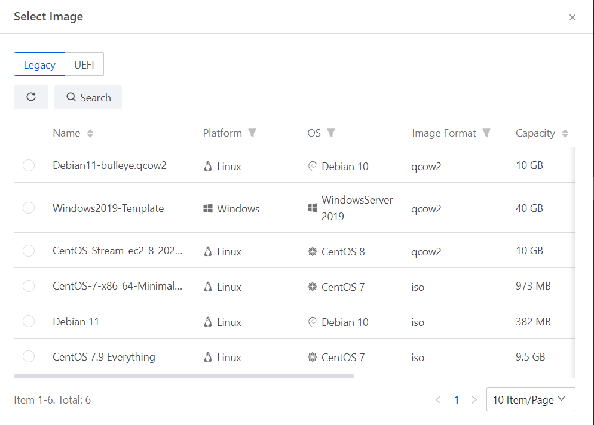

**4\.** **Sau khi đã chọn xong cấu hình như thì chọn vào ô Next**

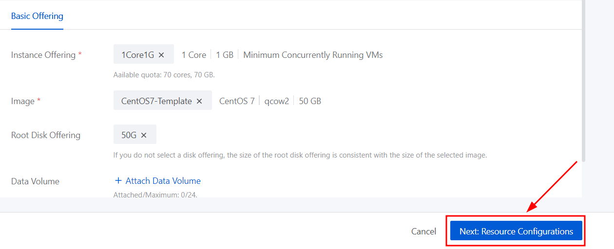

**5\. Tiếp theo cần cần cấu hình một số thông số về net work và vDrive**

_Ở đây sẽ có thể chọn 1 trong 3 loại như sau_

- _VPC network (Virtual Private Cloud)_
- _Public Network_
- _Flat Network_

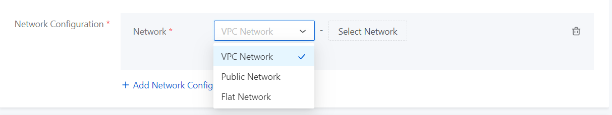

_Ở đây chọn VPC và sử dụng VPC-Vinahost_

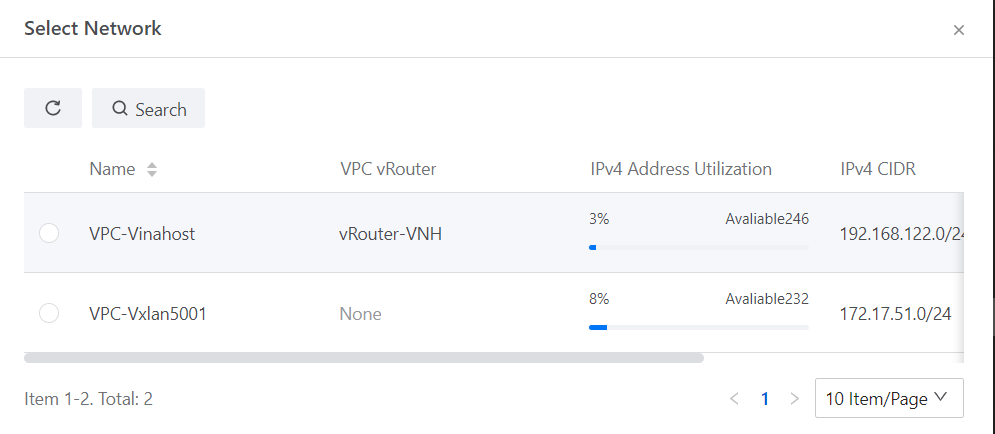

**6\.** **Sau khi chọn network thì có thể chọn ô Assign IP để có thể tự đặt IP tính cho VM sau đó nhấn Next**

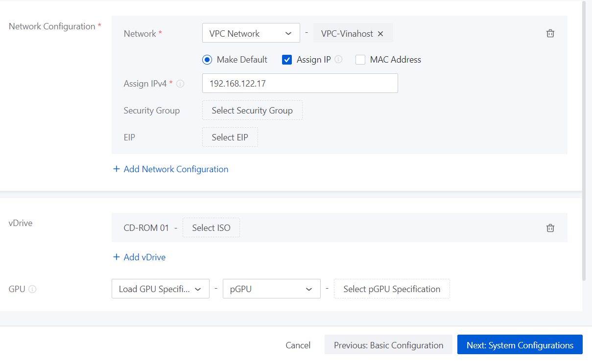

**7\.** **Tại đây sẽ tiến hành đặt password để có thể SSH/Remote vào VPS**

_Ở đây do đang sử dụng VM với OS là CentOS nên sẽ là chọn xác thực thông qua SSH public key và Password._

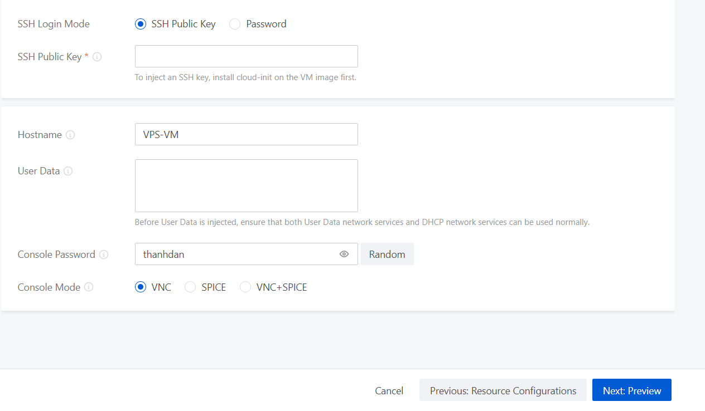

_Nếu cài đặt VM với OS là windown thì sẽ được đặt pass cho Administrator._

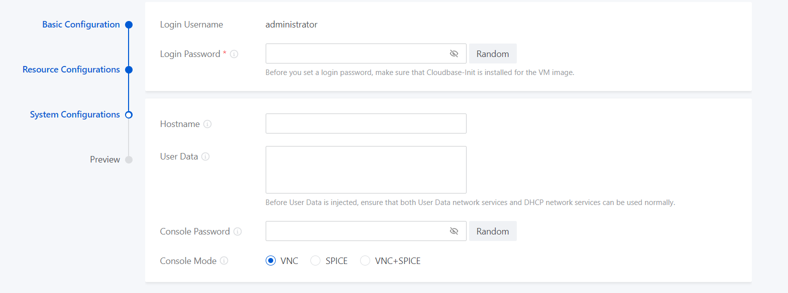

**8\.** **Sau khi đã điền đầy đủ password thì có thể tiếp tục click vào Next để xem lại cấu hình**

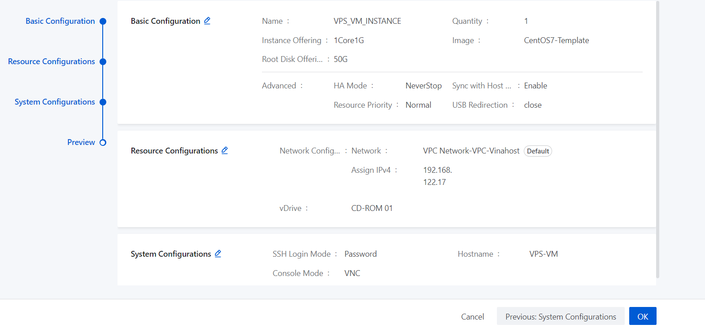

**9\.** **Nhấn OK để có tiến hành cài đặt**

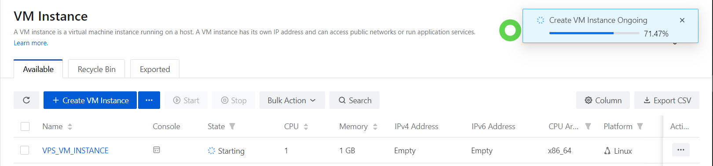

**10\.** **Sau khi cài đặt hoàn tất thì thông tin của VM sẽ hiện ra**

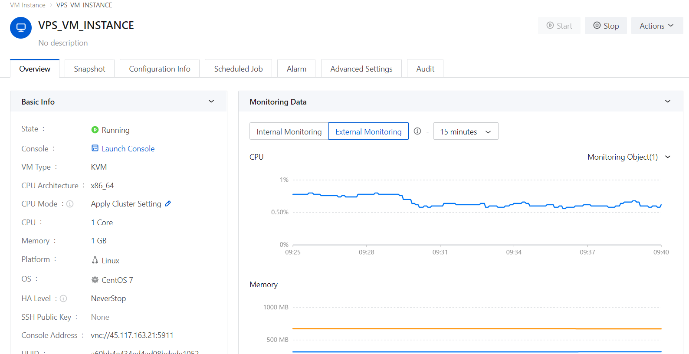

**11\.** **Tiến hành kiểm tra cấu hình của VM**

Trên màn hình thông tin của VPS click vào Launch Console để kiểm tra VM.

Sau khi truy cập thì sẽ được yêu cầu nhập pass, hãy nhập password đã đặt cho VNC ở bước trước.

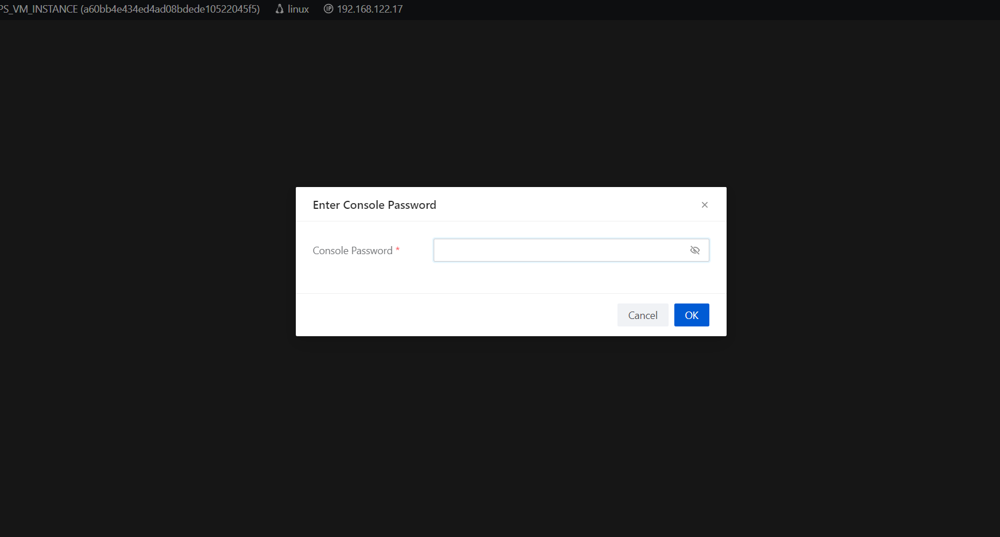

- Đối với VM windown

Để kiểm tra mạng IP có thể vào CMD và gõ các lệnh sau:

- Ipconfig để xem IP
- Ping 8.8.8.8 và ping google.com để check tình trạng kết nối internet

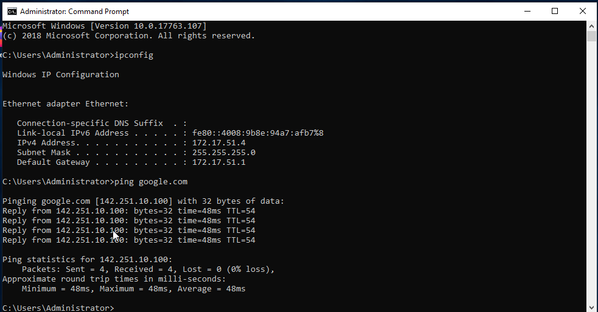

Bật Task manager lên để kiểm tra RAM và CPU:

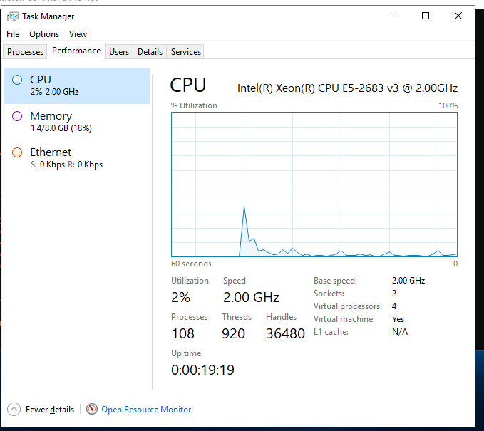

Check bộ nhớ của VM:

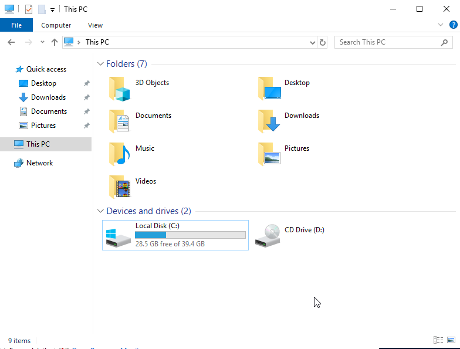

- Đối với VM Linux

Sau khi đã nhập pass VNC sau đó có thể đăng nhập thông qua pass root đã đặt

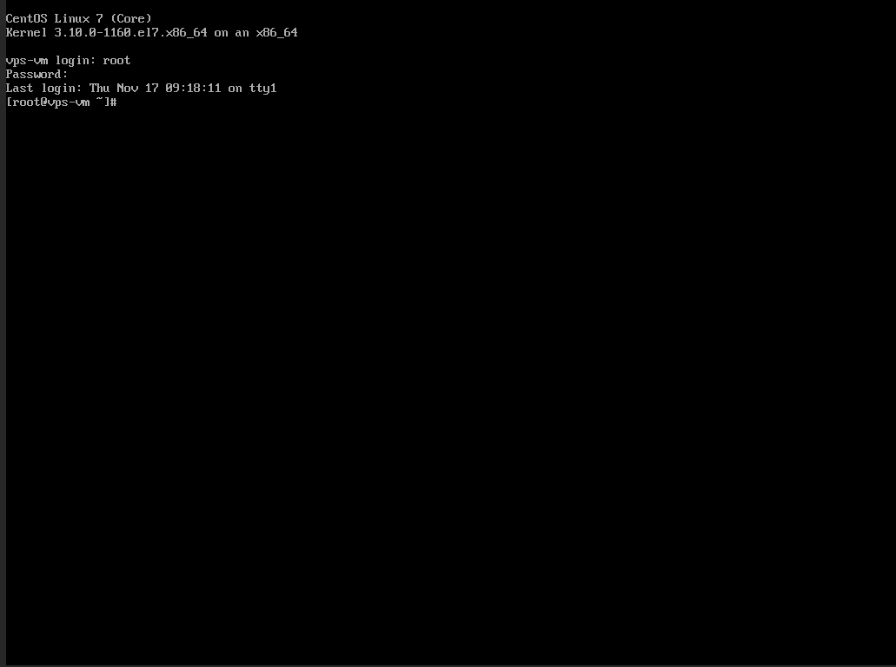

- Kiểm tra ổ cứng bằng lệnh df –ha

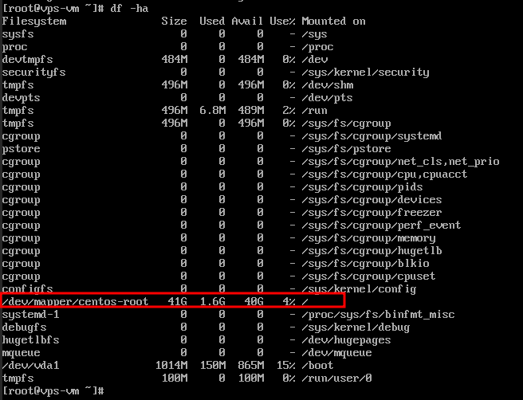

- Kiểm tra RAM bằng lệnh free –m

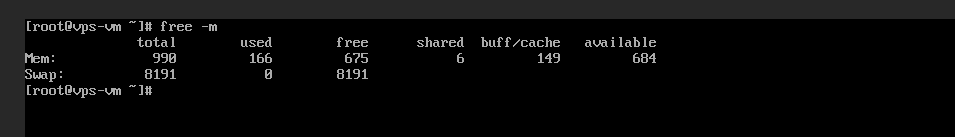

- Kiểm tra cấu hình OS core bằng lscpu

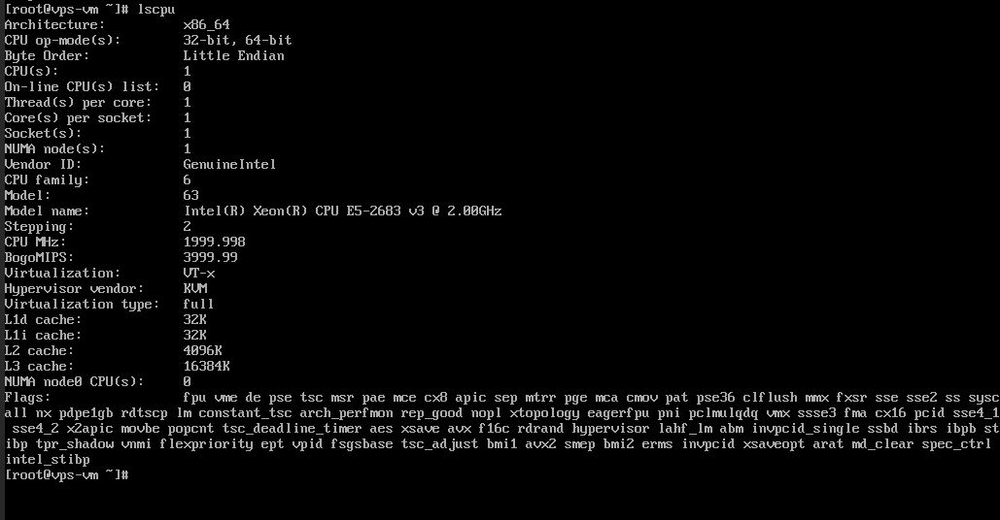

Chúc bạn Tạo VM Instance Trên vCloud VinaHost thành công!

> **THAM KHẢO CÁC DỊCH VỤ TẠI [VINAHOST](https://kb.vinahost.vn/)**
> 
> **\>>** [**SERVER**](https://vinahost.vn/thue-may-chu-rieng/) **–** [**COLOCATION**](https://vinahost.vn/colocation.html) – [**CDN**](https://vinahost.vn/dich-vu-cdn-chuyen-nghiep)
> 
> **\>> [CLOUD](https://vinahost.vn/cloud-server-gia-re/) – [VPS](https://vinahost.vn/vps-ssd-chuyen-nghiep/)**
> 
> **\>> [HOSTING](https://vinahost.vn/wordpress-hosting)**
> 
> **\>> [EMAIL](https://vinahost.vn/email-hosting)**
> 
> **\>> [WEBSITE](http://vinawebsite.vn/)**
> 
> **\>> [TÊN MIỀN](https://vinahost.vn/ten-mien-gia-re/)**
