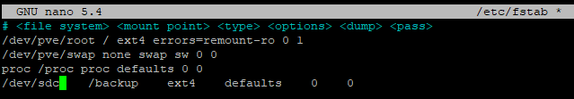
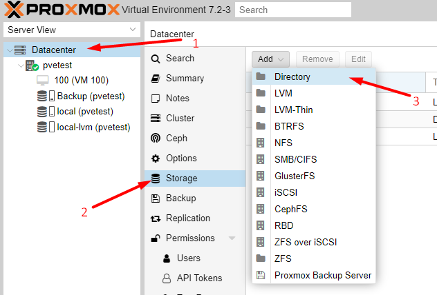
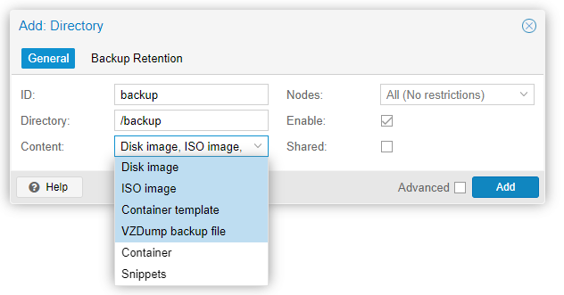
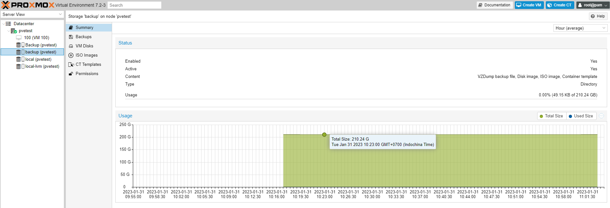

Bài viết này sẽ hướng dẫn bạn **Thêm Ổ Cứng Mới Trên Proxmox Để Backup**. Nếu bạn cần hỗ trợ, xin vui lòng liên hệ VinaHost qua **Hotline 1900 6046 ext. 3**, email về [support@vinahost.vn](mailto:support@vinahost.vn) hoặc chat với VinaHost qua livechat [https://livechat.vinahost.vn/chat.php](https://livechat.vinahost.vn/chat.php).

## Hướng Dẫn Thêm Ổ Cứng Mới Trên Proxmox Để Backup

**B****ư****ớc** **1:** Thêm ổ cứng SATA/SSD vào Server

**B****ư****ớc** **2:** Format ổ cứng

**root@pvetest:~# mkfs.ext4 /dev/sdc**
mke2fs 1.46.2 (28-Feb-2021)
Discarding device blocks: done
Creating filesystem with 52428800 4k blocks and 13107200 inodes
Filesystem UUID: c48b4097-c394-4c95-ac14-733686496cd5
Superblock backups stored on blocks:
        32768, 98304, 163840, 229376, 294912, 819200, 884736, 1605632, 2654208,
        4096000, 7962624, 11239424, 20480000, 23887872

Allocating group tables: done
Writing inode tables: done
Creating journal (262144 blocks): done
Writing superblocks and filesystem accounting information: done

**B****ư****ớc** **3:** Tạo phân vùng backup để mount ổ cứng mới, và thêm cấu hình sau vào _fstab_.

**mkdir /backup**
**nano /etc/fstab**
Add: /dev/sd? /backup ext4 defaults 0 0

**B****ư****ớc** **4:** Chạy lệnh dưới để check cấu hình ổ cứng

**root@pvetest:~# mount -a**
**root@pvetest:~# lsblk**
NAME                          MAJ:MIN RM   SIZE RO TYPE MOUNTPOINT
sda                             8:0    0   100G  0 disk
├─sda1                          8:1    0  1007K  0 part
├─sda2                          8:2    0   512M  0 part
└─sda3                          8:3    0  99.5G  0 part
  ├─pve-swap                  253:0    0     7G  0 lvm  \[SWAP\]
  ├─pve-root                  253:1    0  24.8G  0 lvm  /
  ├─pve-data\_tmeta            253:2    0     1G  0 lvm
  │ └─pve-data                253:4    0  53.4G  0 lvm
  └─pve-data\_tdata            253:3    0  53.4G  0 lvm
    └─pve-data                253:4    0  53.4G  0 lvm
sdb                             8:16   0   200G  0 disk
└─sdb1                          8:17   0   200G  0 part
  └─newdrive-vm--100--disk--0 253:5    0    32G  0 lvm
**sdc                             8:32   0   200G  0 disk /backup**
sr0                            11:0    1 994.2M  0 rom

**B****ư****ớc** **5:** Mở Proxmox Web UI và tạo Directory

**Bước 6:** Điền thông tin ổ đĩa (ID), đường dẫn (Directory) và chức năng (Content) của ổ đĩa này

Ổ cứng “backup” mới đã được active

Chúc bạn thực hiện Thêm Ổ Cứng Mới Trên Proxmox Để Backup thành công!

> **THAM KHẢO CÁC DỊCH VỤ TẠI [VINAHOST](https://kb.vinahost.vn/)**
> 
> **\>>** [**SERVER**](https://vinahost.vn/thue-may-chu-rieng/) **–** [**COLOCATION**](https://vinahost.vn/colocation.html) – [**CDN**](https://vinahost.vn/dich-vu-cdn-chuyen-nghiep)
> 
> **\>> [CLOUD](https://vinahost.vn/cloud-server-gia-re/) – [VPS](https://vinahost.vn/vps-ssd-chuyen-nghiep/)**
> 
> **\>> [HOSTING](https://vinahost.vn/wordpress-hosting)**
> 
> **\>> [EMAIL](https://vinahost.vn/email-hosting)**
> 
> **\>> [WEBSITE](http://vinawebsite.vn/)**
> 
> **\>> [TÊN MIỀN](https://vinahost.vn/ten-mien-gia-re/)**
