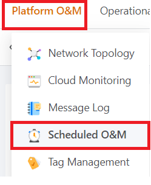
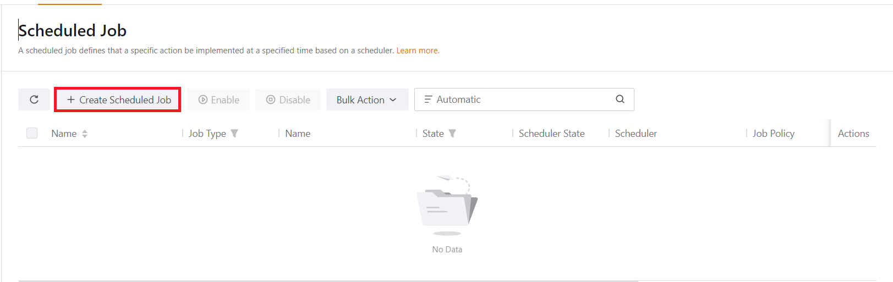
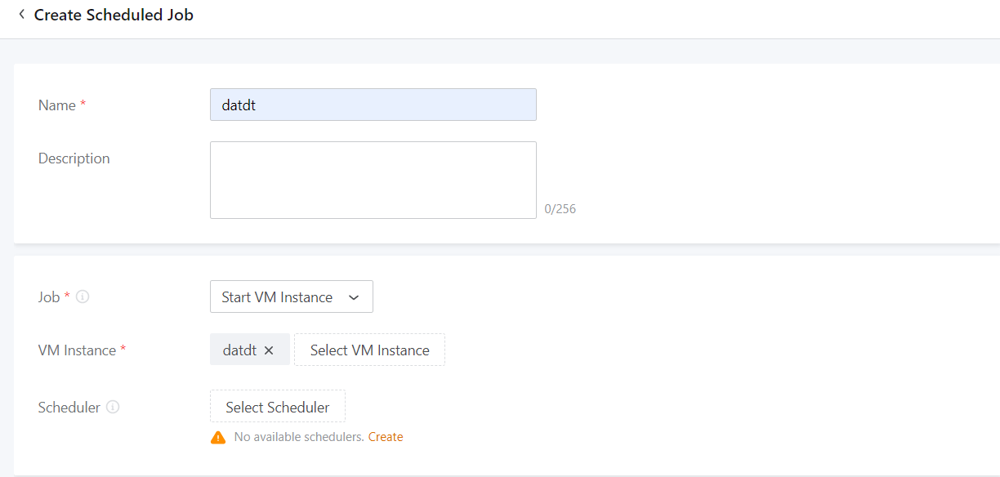
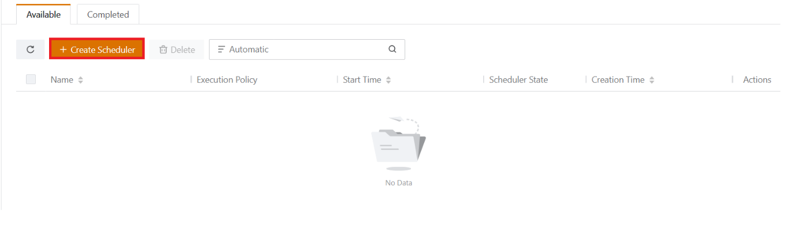
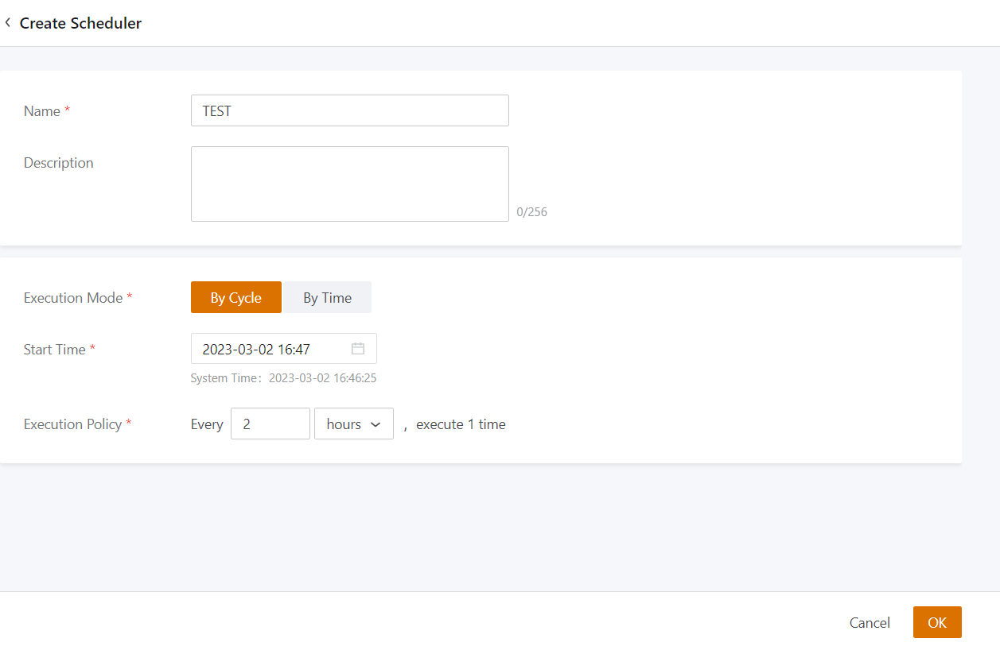
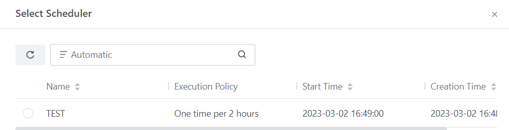

Bài viết này sẽ hướng dẫn bạn cách **Thêm Schedule Job Cho VM Instance.** Nếu bạn cần hỗ trợ, xin vui lòng liên hệ VinaHost qua **Hotline 1900 6046 ext. 3**, email về [support@vinahost.vn](mailto:support@vinahost.vn) hoặc chat với VinaHost qua livechat [https://livechat.vinahost.vn/chat.php](https://livechat.vinahost.vn/chat.php).

**Schedule Jobs** là những phần công việc tự động có thể được thực hiện tại một thời điểm cụ thể hoặc theo lịch trình định kỳ.

## Hướng Dẫn **Thêm Schedule Job Cho VM Instance**

**Bước 1:** Ta chọn vào mục **Platform O&M** trên thanh công cụ và chọn mục **Scheduled O&M**

Sau đó ta chọn Mục “**Create Scheduled Job**” để tạo **Scheduled cho VM** của mình nhé.

**Bước 2:** Ta điền thông tin vào các mục trong **Scheduled Jod** nhé

 Ở mục **Job** sẽ có nhiều option để bạn lựa chọn nhé.

Sau khi tạo xong **Scheduled Job** chúng ta tạo thêm **Scheduler** để có thể đặt thời gian cho 1 **Scheduled Job** nhé.

**Bước 3:** Ở đây chúng ta tiếp tục điền thông tin. Và chọn chế độ thực hiện **Scheduler** theo chu kỳ hoặc theo thời gian.

Sau đó ta chọn **OK** để tiếp tục.

**Bước 4:** Ta quay lại mục **Scheduled Job** để chọn thêm **Scheduler** cho **Scheduled Job** vừa tạo nhé.

Ta chọn và dấu 3 chấm và Chọn **Attach Scheduler** và chọn **Scheduler** vừa tạo

Chúc bạn thực hiện thành công!

> **THAM KHẢO CÁC DỊCH VỤ TẠI [VINAHOST](https://vinahost.vn/)**
> 
> **\>>** [**SERVER**](https://vinahost.vn/thue-may-chu-rieng/) **–** [**COLOCATION**](https://vinahost.vn/colocation.html) – [**CDN**](https://vinahost.vn/dich-vu-cdn-chuyen-nghiep)
> 
> **\>> [CLOUD](https://vinahost.vn/cloud-server-gia-re/) – [VPS](https://vinahost.vn/vps-ssd-chuyen-nghiep/)**
> 
> **\>> [HOSTING](https://vinahost.vn/wordpress-hosting)**
> 
> **\>> [EMAIL](https://vinahost.vn/email-hosting)**
> 
> **\>> [WEBSITE](http://vinawebsite.vn/)**
> 
> **\>> [TÊN MIỀN](https://vinahost.vn/ten-mien-gia-re/)**
