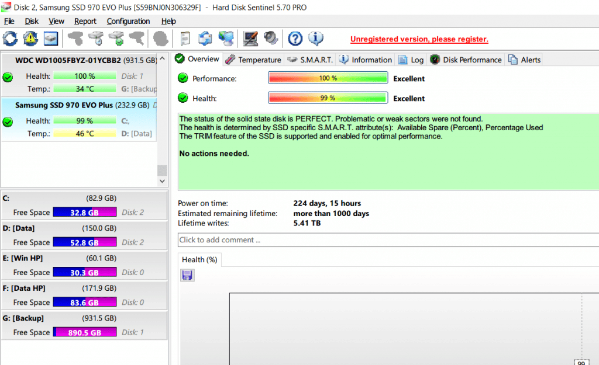
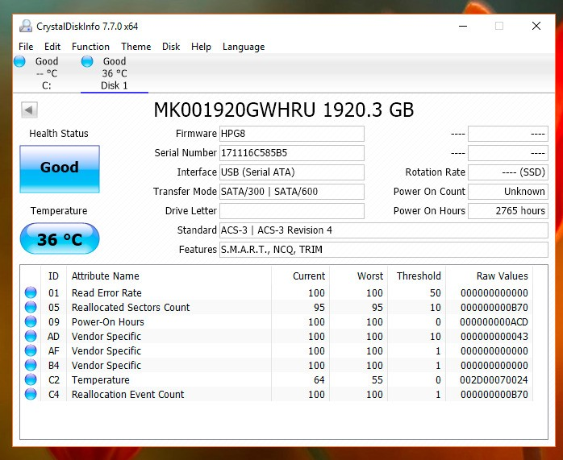

Bài viết này sẽ hướng dẫn bạn cách **Phân Biệt Thông Số TBW Và Bảng Thông Số TBW Ổ SSD Của Các Hãng Phần Cứng**. Nếu bạn cần hỗ trợ, xin vui lòng liên hệ VinaHost qua Hotline 1900 6046 ext.3, email về support@vinahost.vn hoặc chat với VinaHost qua livechat https://livechat.vinahost.vn/chat.php.

Ngày nay, thuật ngữ **“SSD”** chắc chắn đã không còn quá xa lạ với những người dùng thường xuyên sử dụng máy tính. Đây là thiết bị chuyên dùng để lưu trữ tất cả dữ liệu của toàn bộ máy tính với thiết kế vô cùng nhỏ gọn và góp phần cải thiện mạnh mẽ hiệu suất của thiết bị. Thế như bạn đã hiểu được những thông số quan trọng được ghi trên ổ cứng **SSD** hay chưa? **Thông số TBW SSD** có nghĩa là gì? Làm thế nào để lựa chọn được một chiếc ổ cứng **SSD** phù hợp với nhu cầu sử dụng của bạn.

## **1\. Thông số TBW của ổ cứng SSD là gì?**

**TBW (Tera Byte Written)** có nghĩa là tổng **Tera Byte** được ghi trên thiết bị ổ cứng **SSD** của bạn (**Với 1TB = 1000GB**). Thông số này dùng để thể hiện độ bền của ổ cứng và thay thế cho số vòng quay trên ổ cứng cơ **HDD** và được tính bằng số lượng TBW nhất định. Nếu như bạn nhìn thấy một chiếc ổ cứng **SSD** có chỉ số **TBW** khá lớn, tức là chứng tỏ nó đã được sử dụng rất lâu rồi.

## **2\. Thông số DWPD là gì?**

**DWPD (Drive Write Per Day)** là một thông số đánh giá độ bền mà các hãng sản xuất ổ cứng **SSD** cung cấp cho khách hàng của họ. Không như các thiết bị ổ cứng cơ truyền thống, **SSD** có giới hạn số lượng đọc ghi dữ liệu trước khi ổ cứng bị hỏng, một quá trình được hiểu như là hao mòn bộ nhớ **Flash**. Chỉ số **DWPD** cho khách hàng biết số lần anh ta/cô ta có thể ghi đè dữ liệu lên ổ cứng **SSD** trước khi nó “**gặp vấn đề**”.

## **3\. Công thức tính TBW và DWPD**

Để so sánh hai thông số này, bạn cần phải biết dung lượng ổ cứng và thời gian bảo hành. Nếu hãng sản xuất cung cấp cho bạn thông số **TBW** nhưng bạn vẫn muốn biết thông số **DWPD**, thì hãy áp dụng công thức sau đây:

### **TBW = DWPD \* Thời gian bảo hành \* 365 \* Capacity/1,024**

Còn nếu như bạn muốn thực hiện chuyển đổi **TBW** sang **DWPD**, thì bạn cũng có thể áp dụng công thức bên dưới:

### **DWPD = TBW \* 1024/(Capacity \* Thời gian bảo hành \* 365)**

Các hằng số như **1024** và **365** chỉ đơn giản là đổi từ **TB** ra **GB** và đổi từ năm ra ngày.

## **4\. Cách kiểm tra thông số TBW của ổ cứng**

Dùng các tool hỗ trợ kiểm tra ổ cứng như: **hdsentinel**, **CrystalDiskInfo** …

Hình minh họa:

  ** **

## **5\. Bảng thông số TBW của một số dòng** **SSD phổ biến**

**SSD Samsung 2.5 inch**

<table width="854"><tbody><tr><td width="269">Model</td><td width="162">TBW</td><td width="423">Link tham khảo</td></tr><tr><td width="269">Samsung 850 EVO 120GB</td><td width="162">75</td><td width="423">https://www.samsung.com/semiconductor/minisite/ssd/product/consumer/850evo/</td></tr><tr><td width="269">Samsung 850 EVO 250GB</td><td width="162">75</td><td width="423">https://www.samsung.com/semiconductor/minisite/ssd/product/consumer/850evo/</td></tr><tr><td width="269">Samsung 850 EVO 500GB</td><td width="162">150</td><td width="423">https://www.samsung.com/semiconductor/minisite/ssd/product/consumer/850evo/</td></tr><tr><td width="269">Samsung 850 EVO 1TB</td><td width="162">150</td><td width="423">https://www.samsung.com/semiconductor/minisite/ssd/product/consumer/850evo/</td></tr><tr><td width="269">Samsung 850 EVO 2TB</td><td width="162">300</td><td width="423">https://www.samsung.com/semiconductor/minisite/ssd/product/consumer/850evo/</td></tr><tr><td width="269">Samsung 850 EVO 4TB</td><td width="162">300</td><td width="423">https://www.samsung.com/semiconductor/minisite/ssd/product/consumer/850evo/</td></tr><tr><td width="269">Samsung 860 EVO 250GB</td><td width="162">150</td><td width="423">https://www.samsung.com/semiconductor/minisite/ssd/product/consumer/860evo/</td></tr><tr><td width="269">Samsung 860 EVO 500GB</td><td width="162">300</td><td width="423">https://www.samsung.com/semiconductor/minisite/ssd/product/consumer/860evo/</td></tr><tr><td width="269">Samsung 860 EVO 1TB</td><td width="162">600</td><td width="423">https://www.samsung.com/semiconductor/minisite/ssd/product/consumer/860evo/</td></tr><tr><td width="269">Samsung 860 EVO 2TB</td><td width="162">1200</td><td width="423">https://www.samsung.com/semiconductor/minisite/ssd/product/consumer/860evo/</td></tr><tr><td width="269">Samsung 860 EVO 4TB</td><td width="162">2400</td><td width="423">https://www.samsung.com/semiconductor/minisite/ssd/product/consumer/860evo/</td></tr><tr><td width="269">Samsung 860 PRO 256GB</td><td width="162">300</td><td width="423">https://www.samsung.com/semiconductor/minisite/ssd/product/consumer/860pro/</td></tr><tr><td width="269">Samsung 860 PRO 512GB</td><td width="162">600</td><td width="423">https://www.samsung.com/semiconductor/minisite/ssd/product/consumer/860pro/</td></tr><tr><td width="269">Samsung 860 PRO 1TB</td><td width="162">1200</td><td width="423">https://www.samsung.com/semiconductor/minisite/ssd/product/consumer/860pro/</td></tr><tr><td width="269">Samsung 860 PRO 2TB</td><td width="162">2400</td><td width="423">https://www.samsung.com/semiconductor/minisite/ssd/product/consumer/860pro/</td></tr><tr><td width="269">Samsung 860 PRO 4TB</td><td width="162">4800</td><td width="423">https://www.samsung.com/semiconductor/minisite/ssd/product/consumer/860pro/</td></tr><tr><td width="269">Samsung 860 QVO 1TB</td><td width="162">360</td><td width="423">https://www.samsung.com/uk/business/memory-storage/860-qvo-sata-3-2-5-ssd/mz-76q1t0bw/</td></tr><tr><td width="269">Samsung 860 QVO 2TB</td><td width="162">720</td><td width="423">https://www.samsung.com/uk/business/memory-storage/860-qvo-sata-3-2-5-ssd/mz-76q1t0bw/</td></tr><tr><td width="269">Samsung 860 QVO 4TB</td><td width="162">1440</td><td width="423">https://www.samsung.com/uk/business/memory-storage/860-qvo-sata-3-2-5-ssd/mz-76q1t0bw/</td></tr><tr><td width="269">Samsung 870 EVO 250GB</td><td width="162">150</td><td width="423">https://www.samsung.com/semiconductor/minisite/ssd/product/consumer/870evo/</td></tr><tr><td width="269">Samsung 870 EVO 500GB</td><td width="162">300</td><td width="423">https://www.samsung.com/semiconductor/minisite/ssd/product/consumer/870evo/</td></tr><tr><td width="269">Samsung 870 EVO 1TB</td><td width="162">600</td><td width="423">https://www.samsung.com/semiconductor/minisite/ssd/product/consumer/870evo/</td></tr><tr><td width="269">Samsung 870 EVO 2TB</td><td width="162">1200</td><td width="423">https://www.samsung.com/semiconductor/minisite/ssd/product/consumer/870evo/</td></tr><tr><td width="269">Samsung 870 EVO 4TB</td><td width="162">2400</td><td width="423">https://www.samsung.com/semiconductor/minisite/ssd/product/consumer/870evo/</td></tr><tr><td width="269">Samsung 870 QVO 1TB</td><td width="162">360</td><td width="423">https://www.samsung.com/semiconductor/minisite/ssd/product/consumer/870qvo/</td></tr><tr><td width="269">Samsung 870 QVO 2TB</td><td width="162">720</td><td width="423">https://www.samsung.com/semiconductor/minisite/ssd/product/consumer/870qvo/</td></tr><tr><td width="269">Samsung 870 QVO 4TB</td><td width="162">1440</td><td width="423">https://www.samsung.com/semiconductor/minisite/ssd/product/consumer/870qvo/</td></tr><tr><td width="269">Samsung 870 QVO 8TB</td><td width="162">2880</td><td width="423">https://www.samsung.com/semiconductor/minisite/ssd/product/consumer/870qvo/</td></tr><tr><td width="269">Samsung PM851 128GB</td><td width="162">43</td><td width="423">https://manualzz.com/doc/24634005/samsung-pm851-solid-state-drive—m2m</td></tr><tr><td width="269">Samsung PM851 256GB</td><td width="162">43</td><td width="423">https://manualzz.com/doc/24634005/samsung-pm851-solid-state-drive—m2m</td></tr><tr><td width="269">Samsung PM851 512GB</td><td width="162">43</td><td width="423">https://manualzz.com/doc/24634005/samsung-pm851-solid-state-drive—m2m</td></tr></tbody></table>

**SSD Samsung M2 PCIe**

<table width="863"><tbody><tr><td width="278">Model</td><td width="153">TBW</td><td width="432">Link tham khảo</td></tr><tr><td width="278">Samsung 970 EVO 250GB</td><td width="153">150</td><td width="432">https://www.samsung.com/semiconductor/minisite/ssd/product/consumer/970evo/</td></tr><tr><td width="278">Samsung 970 EVO 500GB</td><td width="153">300</td><td width="432">https://www.samsung.com/semiconductor/minisite/ssd/product/consumer/970evo/</td></tr><tr><td width="278">Samsung 970 EVO 1TB</td><td width="153">600</td><td width="432">https://www.samsung.com/semiconductor/minisite/ssd/product/consumer/970evo/</td></tr><tr><td width="278">Samsung 970 EVO 2TB</td><td width="153">1200</td><td width="432">https://www.samsung.com/semiconductor/minisite/ssd/product/consumer/970evo/</td></tr><tr><td width="278">Samsung 970 EVO PLUS 250GB</td><td width="153">150</td><td width="432">https://www.samsung.com/semiconductor/minisite/ssd/product/consumer/970evoplus/</td></tr><tr><td width="278">Samsung 970 EVO PLUS 500GB</td><td width="153">300</td><td width="432">https://www.samsung.com/semiconductor/minisite/ssd/product/consumer/970evoplus/</td></tr><tr><td width="278">Samsung 970 EVO PLUS 1TB</td><td width="153">600</td><td width="432">https://www.samsung.com/semiconductor/minisite/ssd/product/consumer/970evoplus/</td></tr><tr><td width="278">Samsung 970 EVO PLUS 2TB</td><td width="153">1200</td><td width="432">https://www.samsung.com/semiconductor/minisite/ssd/product/consumer/970evoplus/</td></tr><tr><td width="278">Samsung 970 PRO 512GB</td><td width="153">600</td><td width="432">https://www.samsung.com/semiconductor/minisite/ssd/product/consumer/970pro/</td></tr><tr><td width="278">Samsung 970 PRO 1TB</td><td width="153">1200</td><td width="432">https://www.samsung.com/semiconductor/minisite/ssd/product/consumer/970pro/</td></tr><tr><td width="278">Samsung 980 250GB</td><td width="153">150</td><td width="432">https://www.samsung.com/semiconductor/minisite/ssd/product/consumer/980/</td></tr><tr><td width="278">Samsung 980 500GB</td><td width="153">300</td><td width="432">https://www.samsung.com/semiconductor/minisite/ssd/product/consumer/980/</td></tr><tr><td width="278">Samsung 980 1TB</td><td width="153">600</td><td width="432">https://www.samsung.com/semiconductor/minisite/ssd/product/consumer/980/</td></tr><tr><td width="278">Samsung 980 PRO 250GB</td><td width="153">150</td><td width="432">https://www.samsung.com/semiconductor/minisite/ssd/product/consumer/980pro/</td></tr><tr><td width="278">Samsung 980 PRO 500GB</td><td width="153">300</td><td width="432">https://www.samsung.com/semiconductor/minisite/ssd/product/consumer/980pro/</td></tr><tr><td width="278">Samsung 980 PRO 1TB</td><td width="153">600</td><td width="432">https://www.samsung.com/semiconductor/minisite/ssd/product/consumer/980pro/</td></tr><tr><td width="278">Samsung 980 PRO 2TB</td><td width="153">1200</td><td width="432">https://www.samsung.com/semiconductor/minisite/ssd/product/consumer/980pro/</td></tr><tr><td width="278">Samsung PM9A1 256GB</td><td width="153">150</td><td width="432">https://samsungsemiconductor-us.com/app/uploads/2021/03/Mar26_PM9A1_Product_Brief_FINAL.pdf</td></tr><tr><td width="278">Samsung PM9A1 512GB</td><td width="153">300</td><td width="432">https://samsungsemiconductor-us.com/app/uploads/2021/03/Mar26_PM9A1_Product_Brief_FINAL.pdf</td></tr><tr><td width="278">Samsung PM9A1 1TB</td><td width="153">600</td><td width="432">https://samsungsemiconductor-us.com/app/uploads/2021/03/Mar26_PM9A1_Product_Brief_FINAL.pdf</td></tr><tr><td width="278">Samsung PM9A1 2TB</td><td width="153">1200</td><td width="432">https://samsungsemiconductor-us.com/app/uploads/2021/03/Mar26_PM9A1_Product_Brief_FINAL.pdf</td></tr><tr><td width="278">Samsung PM981A 256GB</td><td width="153">150</td><td width="432">https://www.amazon.com/Reading-Suitable-High-End-Motherboards-Ultrabooks/dp/B07V7FVPXT</td></tr><tr><td width="278">Samsung PM981A 512GB</td><td width="153">300</td><td width="432">https://www.amazon.com/Reading-Suitable-High-End-Motherboards-Ultrabooks/dp/B07V7FVPXT</td></tr><tr><td width="278">Samsung PM981A 1TB</td><td width="153">600</td><td width="432">https://www.amazon.com/Reading-Suitable-High-End-Motherboards-Ultrabooks/dp/B07V7FVPXT</td></tr><tr><td width="278">Samsung PM981A 2TB</td><td width="153">1200</td><td width="432"></td></tr><tr><td width="278">Samsung 750 EVO 120GB</td><td width="153">35</td><td width="432">https://www.samsung.com/semiconductor/global.semi.static/Samsung_SSD_750_EVO_Data_Sheet_Rev_2_1.pdf</td></tr><tr><td width="278">Samsung 750 EVO 250GB</td><td width="153">70</td><td width="432">https://www.samsung.com/semiconductor/global.semi.static/Samsung_SSD_750_EVO_Data_Sheet_Rev_2_1.pdf</td></tr><tr><td width="278">Samsung 750 EVO 500GB</td><td width="153">100</td><td width="432">https://www.samsung.com/semiconductor/global.semi.static/Samsung_SSD_750_EVO_Data_Sheet_Rev_2_1.pdf</td></tr><tr><td width="278">Samsung 950 Pro 256GB</td><td width="153">200</td><td width="432">https://www.samsung.com/us/computing/memory-storage/solid-state-drives/ssd-950-pro-nvme-256gb-mz-v5p256bw/</td></tr><tr><td width="278">Samsung 950 Pro 512GB</td><td width="153">400</td><td width="432">https://www.samsung.com/us/computing/memory-storage/solid-state-drives/ssd-950-pro-nvme-256gb-mz-v5p256bw/</td></tr><tr><td width="278">Samsung 960 EVO 250GB</td><td width="153">100</td><td width="432">https://www.samsung.com/semiconductor/minisite/ssd/product/consumer/960evo/</td></tr><tr><td width="278">Samsung 960 EVO 500GB</td><td width="153">200</td><td width="432">https://www.samsung.com/semiconductor/minisite/ssd/product/consumer/960evo/</td></tr><tr><td width="278">Samsung 960 EVO 1TB</td><td width="153">400</td><td width="432">https://www.samsung.com/semiconductor/minisite/ssd/product/consumer/960evo/</td></tr><tr><td width="278">Samsung 960 Pro 512GB</td><td width="153">400</td><td width="432">https://www.samsung.com/semiconductor/global.semi.static/SAMSUNG_SSD_Limited_Warranty_English_UK.pdf</td></tr><tr><td width="278">Samsung 960 Pro 1TB</td><td width="153">800</td><td width="432">https://www.samsung.com/semiconductor/global.semi.static/SAMSUNG_SSD_Limited_Warranty_English_UK.pdf</td></tr><tr><td width="278">Samsung 960 Pro 2TB</td><td width="153">1200</td><td width="432">https://www.samsung.com/semiconductor/global.semi.static/SAMSUNG_SSD_Limited_Warranty_English_UK.pdf</td></tr></tbody></table>

**SSD Intel**

<table width="863"><tbody><tr><td width="269">Model</td><td width="162">TBW</td><td width="432">Link tham khảo</td></tr><tr><td width="269">Intel 540s 120GB</td><td width="162">36.5</td><td width="432">https://ark.intel.com/content/www/vn/vi/ark/products/94420/intel-ssd-540s-series-120gb-2-5in-sata-6gb-s-16nm-tlc.html</td></tr><tr><td width="269">Intel 540s 180GB</td><td width="162">73</td><td width="432">https://ark.intel.com/content/www/vn/vi/ark/products/94213/intel-ssd-540s-series-180gb-2-5in-sata-6gb-s-16nm-tlc.html</td></tr><tr><td width="269">Intel 540s 240GB</td><td width="162">73</td><td width="432">https://ark.intel.com/content/www/vn/vi/ark/products/94203/intel-ssd-540s-series-240gb-2-5in-sata-6gb-s-16nm-tlc.html</td></tr><tr><td width="269">Intel 540s 360GB</td><td width="162">73</td><td width="432">https://ark.intel.com/content/www/vn/vi/ark/products/94207/intel-ssd-540s-series-360gb-2-5in-sata-6gb-s-16nm-tlc.html</td></tr><tr><td width="269">Intel 540s 480GB</td><td width="162">73</td><td width="432">https://ark.intel.com/content/www/vn/vi/ark/products/94209/intel-ssd-540s-series-480gb-2-5in-sata-6gb-s-16nm-tlc.html</td></tr><tr><td width="269">Intel 540s 1TB</td><td width="162">73</td><td width="432">https://ark.intel.com/content/www/vn/vi/ark/products/94204/intel-ssd-540s-series-1-0tb-2-5in-sata-6gb-s-16nm-tlc.html</td></tr><tr><td width="269">Intel 545s 256GB</td><td width="162">144</td><td width="432">https://ark.intel.com/content/www/vn/vi/ark/products/125020/intel-ssd-545s-series-256gb-2-5in-sata-6gb-s-3d2-tlc.html</td></tr><tr><td width="269">Intel 545s 512GB</td><td width="162">288</td><td width="432">https://ark.intel.com/content/www/vn/vi/ark/products/125019/intel-ssd-545s-series-512gb-2-5in-sata-6gb-s-3d2-tlc.html</td></tr><tr><td width="269">Intel 660P 512GB</td><td width="162">100</td><td width="432">https://ark.intel.com/content/www/vn/vi/ark/products/149405/intel-ssd-660p-series-512gb-m-2-80mm-pcie-3-0-x4-3d2-qlc.html</td></tr><tr><td width="269">Intel 660P 1TB</td><td width="162">200</td><td width="432">https://ark.intel.com/content/www/vn/vi/ark/products/149407/intel-ssd-660p-series-1-0tb-m-2-80mm-pcie-3-0-x4-3d2-qlc.html</td></tr><tr><td width="269">Intel 660P 2TB</td><td width="162">400</td><td width="432">https://ark.intel.com/content/www/us/en/ark/products/149403/intel-ssd-660p-series-2-0tb-m-2-80mm-pcie-3-0-x4-3d2-qlc.html</td></tr><tr><td width="269">Intel 760P 256GB</td><td width="162">144</td><td width="432">https://ark.intel.com/content/www/vn/vi/ark/products/134583/intel-ssd-760p-series-256gb-m-2-80mm-pcie-3-1-x4-3d2-tlc.html</td></tr><tr><td width="269">Intel 760P 512GB</td><td width="162">288</td><td width="432">https://ark.intel.com/content/www/vn/vi/ark/products/134582/intel-ssd-760p-series-512gb-m-2-80mm-pcie-3-1-x4-3d2-tlc.html</td></tr><tr><td width="269">Intel 760P 1TB</td><td width="162">576</td><td width="432">https://ark.intel.com/content/www/us/en/ark/products/134580/intel-ssd-760p-series-1-024tb-m-2-80mm-pcie-3-1-x4-3d2-tlc.html</td></tr><tr><td width="269">Intel 760P 2TB</td><td width="162">576</td><td width="432">https://ark.intel.com/content/www/us/en/ark/products/134581/intel-ssd-760p-series-2-048tb-m-2-80mm-pcie-3-1-x4-3d2-tlc.html</td></tr><tr><td width="269">Intel 670P 512GB</td><td width="162">185</td><td width="432">https://ark.intel.com/content/www/us/en/ark/products/204107/intel-ssd-670p-series-512gb-m-2-80mm-pcie-3-0-x4-3d4-qlc.html</td></tr><tr><td width="269">Intel 670P 1TB</td><td width="162">370</td><td width="432">https://ark.intel.com/content/www/us/en/ark/products/204109/intel-ssd-670p-series-1-0tb-m-2-80mm-pcie-3-0-x4-3d4-qlc.html</td></tr></tbody></table>

**SSD Crucial**

<table width="863"><tbody><tr><td width="269">Model</td><td width="162">TBW</td><td width="432">Link tham khảo</td></tr><tr><td width="269">Crucial BX500 240GB</td><td width="162">80</td><td width="432">https://content.crucial.com/content/dam/crucial/ssd-products/bx500/flyer/crucial-bx500-ssd-productflyer.pdf</td></tr><tr><td width="269">Crucial BX500 480GB</td><td width="162">120</td><td width="432">https://content.crucial.com/content/dam/crucial/ssd-products/bx500/flyer/crucial-bx500-ssd-productflyer.pdf</td></tr><tr><td width="269">Crucial BX500 1TB</td><td width="162">360</td><td width="432">https://content.crucial.com/content/dam/crucial/ssd-products/bx500/flyer/crucial-bx500-ssd-productflyer.pdf</td></tr><tr><td width="269">Crucial BX500 2TB</td><td width="162">720</td><td width="432">https://content.crucial.com/content/dam/crucial/ssd-products/bx500/flyer/crucial-bx500-ssd-productflyer.pdf</td></tr><tr><td width="269">Crucial MX500 250GB</td><td width="162">100</td><td width="432">https://gzhls.at/blob/ldb/9/f/7/0/9d4630bae4a7c5276f0c03933882e25cc640.pdf</td></tr><tr><td width="269">Crucial MX500 500GB</td><td width="162">180</td><td width="432">https://gzhls.at/blob/ldb/9/f/7/0/9d4630bae4a7c5276f0c03933882e25cc640.pdf</td></tr><tr><td width="269">Crucial MX500 1TB</td><td width="162">360</td><td width="432">https://gzhls.at/blob/ldb/9/f/7/0/9d4630bae4a7c5276f0c03933882e25cc640.pdf</td></tr><tr><td width="269">Crucial MX500 2TB</td><td width="162">700</td><td width="432">https://gzhls.at/blob/ldb/9/f/7/0/9d4630bae4a7c5276f0c03933882e25cc640.pdf</td></tr><tr><td width="269">Crucial P1 500GB</td><td width="162">100</td><td width="432">https://www.tomshardware.com/reviews/crucial-p1-nvme-ssd-qlc,5852.html</td></tr><tr><td width="269">Crucial P1 1TB</td><td width="162">200</td><td width="432">https://www.tomshardware.com/reviews/crucial-p1-nvme-ssd-qlc,5852.html</td></tr><tr><td width="269">Crucial P1 2TB</td><td width="162">400</td><td width="432">https://www.tomshardware.com/reviews/crucial-p1-nvme-ssd-qlc,5852.html</td></tr><tr><td width="269">Crucial P2 250GB</td><td width="162">150</td><td width="432">https://www.crucial.com/content/dam/crucial/ssd-products/P2/flyer/crucial-P2-productflyer-consumer.pdf</td></tr><tr><td width="269">Crucial P2 500GB</td><td width="162">150</td><td width="432">https://www.crucial.com/content/dam/crucial/ssd-products/P2/flyer/crucial-P2-productflyer-consumer.pdf</td></tr><tr><td width="269">Crucial P2 1TB</td><td width="162">300</td><td width="432">https://www.crucial.com/content/dam/crucial/ssd-products/P2/flyer/crucial-P2-productflyer-consumer.pdf</td></tr><tr><td width="269">Crucial P2 2TB</td><td width="162">600</td><td width="432">https://www.crucial.com/content/dam/crucial/ssd-products/P2/flyer/crucial-P2-productflyer-consumer.pdf</td></tr></tbody></table>

**SSD WD**

<table width="854"><tbody><tr><td width="269">Model</td><td width="162">TBW</td><td width="423">Link tham khảo</td></tr><tr><td width="269">WD BLUE 3D 250GB</td><td width="162">100</td><td width="423">https://docs.rs-online.com/ab77/0900766b816ba490.pdf</td></tr><tr><td width="269">WD BLUE 3D 500GB</td><td width="162">200</td><td width="423">https://docs.rs-online.com/ab77/0900766b816ba490.pdf</td></tr><tr><td width="269">WD BLUE 3D 1TB</td><td width="162">400</td><td width="423">https://docs.rs-online.com/ab77/0900766b816ba490.pdf</td></tr><tr><td width="269">WD BLUE 3D 2TB</td><td width="162">500</td><td width="423">https://docs.rs-online.com/ab77/0900766b816ba490.pdf</td></tr><tr><td width="269">WD SN550 250GB</td><td width="162">150</td><td width="423">https://www.tomshardware.com/reviews/wd-blue-sn550-m2-nvme-ssd-review-best-dramless-ssd-yet</td></tr><tr><td width="269">WD SN550 500GB</td><td width="162">300</td><td width="423">https://www.tomshardware.com/reviews/wd-blue-sn550-m2-nvme-ssd-review-best-dramless-ssd-yet</td></tr><tr><td width="269">WD SN550 1TB</td><td width="162">600</td><td width="423">https://www.tomshardware.com/reviews/wd-blue-sn550-m2-nvme-ssd-review-best-dramless-ssd-yet</td></tr><tr><td width="269">WD SN750 250GB</td><td width="162">200</td><td width="423">https://www.tomshardware.com/reviews/wd-black-sn750-ssd,5957.html</td></tr><tr><td width="269">WD SN750 500GB</td><td width="162">300</td><td width="423">https://www.tomshardware.com/reviews/wd-black-sn750-ssd,5957.html</td></tr><tr><td width="269">WD SN750 1TB</td><td width="162">600</td><td width="423">https://www.tomshardware.com/reviews/wd-black-sn750-ssd,5957.html</td></tr><tr><td width="269">WD SN750 2TB</td><td width="162">1200</td><td width="423">https://www.tomshardware.com/reviews/wd-black-sn750-ssd,5957.html</td></tr><tr><td width="269">WD SN530 256GB</td><td width="162">200</td><td width="423">https://www.westerndigital.com/products/commercial-internal-drives/pc-sn530-ssd</td></tr><tr><td width="269">WD SN530 512GB</td><td width="162">300</td><td width="423">https://www.westerndigital.com/products/commercial-internal-drives/pc-sn530-ssd</td></tr><tr><td width="269">WD SN530 1TB</td><td width="162">400</td><td width="423">https://www.westerndigital.com/products/commercial-internal-drives/pc-sn530-ssd</td></tr><tr><td width="269">WD SN520 128GB</td><td width="162">100</td><td width="423">https://www.westerndigital.com/products/commercial-internal-drives/pc-sn520-ssd</td></tr><tr><td width="269">WD SN520 256GB</td><td width="162">200</td><td width="423">https://www.westerndigital.com/products/commercial-internal-drives/pc-sn520-ssd</td></tr><tr><td width="269">WD SN520 512GB</td><td width="162">300</td><td width="423">https://www.westerndigital.com/products/commercial-internal-drives/pc-sn520-ssd</td></tr><tr><td width="269">WD SN850 500GB</td><td width="162">300</td><td width="423">https://www.tomshardware.com/reviews/wd-black-sn850-m-2-nvme-ssd-review</td></tr><tr><td width="269">WD SN850 1TB</td><td width="162">600</td><td width="423">https://www.tomshardware.com/reviews/wd-black-sn850-m-2-nvme-ssd-review</td></tr><tr><td width="269">WD SN850 2TB</td><td width="162">1200</td><td width="423">https://www.tomshardware.com/reviews/wd-black-sn850-m-2-nvme-ssd-review</td></tr></tbody></table>

**SSD Seagate**

<table width="878"><tbody><tr><td width="269">Model</td><td width="170">TBW</td><td width="439">Link tham khảo</td></tr><tr><td width="269">Seagate Firecuda 510 500GB</td><td width="170">650</td><td width="439">https://www.seagate.com/files/www-content/support-content/internal-products/ssd/firecuda-ssd/_shared/files/100847100_E.pdf</td></tr><tr><td width="269">Seagate Firecuda 510 1TB</td><td width="170">1300</td><td width="439">https://www.seagate.com/files/www-content/support-content/internal-products/ssd/firecuda-ssd/_shared/files/100847100_E.pdf</td></tr><tr><td width="269">Seagate Firecuda 510 2TB</td><td width="170">2600</td><td width="439">https://www.seagate.com/files/www-content/support-content/internal-products/ssd/firecuda-ssd/_shared/files/100847100_E.pdf</td></tr><tr><td width="269">Seagate Firecuda 520 500GB</td><td width="170">850</td><td width="439">https://www.tomshardware.com/reviews/seagate-firecuda-520-ssd</td></tr><tr><td width="269">Seagate Firecuda 520 1TB</td><td width="170">1800</td><td width="439">https://www.tomshardware.com/reviews/seagate-firecuda-520-ssd</td></tr><tr><td width="269">Seagate Firecuda 520 2TB</td><td width="170">3600</td><td width="439">https://www.tomshardware.com/reviews/seagate-firecuda-520-ssd</td></tr></tbody></table>

**SSD Server Samsung**

<table width="881"><tbody><tr><td width="269">Model</td><td width="171">TBW</td><td width="441">Link tham khảo</td></tr><tr><td width="269">Samsung 860DCT 960GB</td><td width="171">349</td><td width="441">https://www.samsung.com/semiconductor/minisite/ssd/product/data-center/860dct/</td></tr><tr><td width="269">Samsung 860DCT 1.92TB</td><td width="171">698</td><td width="441">https://www.samsung.com/semiconductor/minisite/ssd/product/data-center/860dct/</td></tr><tr><td width="269">Samsung 860DCT 3.84TB</td><td width="171">1396</td><td width="441">https://www.samsung.com/semiconductor/minisite/ssd/product/data-center/860dct/</td></tr><tr><td width="269">Samsung 883 DCT 240GB</td><td width="171">341</td><td width="441">https://www.samsung.com/us/business/computing/memory-storage/enterprise-solid-state-drives/883-dct-240gb-mz-7lh240ne/</td></tr><tr><td width="269">Samsung 883 DCT 480GB</td><td width="171">683</td><td width="441">https://www.samsung.com/us/business/computing/memory-storage/enterprise-solid-state-drives/883-dct-480gb-mz-7lh480ne/</td></tr><tr><td width="269">Samsung 883 DCT 960GB</td><td width="171">1366</td><td width="441">https://www.samsung.com/us/business/computing/memory-storage/enterprise-solid-state-drives/883-dct-960gb-mz-7lh960ne/</td></tr><tr><td width="269">Samsung 883 DCT 1.92TB</td><td width="171">2733</td><td width="441">https://www.samsung.com/us/business/computing/memory-storage/enterprise-solid-state-drives/883-dct-1-9tb-mz-7lh1t9ne/</td></tr><tr><td width="269">Samsung 883 DCT 3.84TB</td><td width="171">5466</td><td width="441">https://www.samsung.com/us/business/computing/memory-storage/enterprise-solid-state-drives/883-dct-3-8tb-mz-7lh3t8ne/</td></tr><tr><td width="269">Samsung 983 DCT 960GB</td><td width="171">1366</td><td width="441">https://www.samsung.com/us/business/computing/memory-storage/enterprise-solid-state-drives/983-dct-960gb-mz-1lb960ne/</td></tr><tr><td width="269">Samsung 983 DCT 1.92TB</td><td width="171">2733</td><td width="441">https://www.samsung.com/us/business/computing/memory-storage/enterprise-solid-state-drives/983-dct-1-9tb-mz-1lb1t9ne/</td></tr><tr><td width="269">Samsung 983 Zet 480GB</td><td width="171">7446</td><td width="441">https://www.storagereview.com/review/samsung-983-zet-review</td></tr><tr><td width="269">Samsung 983 Zet 960GB</td><td width="171">17520</td><td width="441">https://www.storagereview.com/review/samsung-983-zet-review</td></tr><tr><td width="269">Samsung PM1725A 1.6TB</td><td width="171">14600</td><td width="441">https://www.samsung.com/semiconductor/newsroom/tech-leadership/brochure-samsung-pm1725a-nvme-ssd/</td></tr><tr><td width="269">Samsung PM1725A 3.2TB</td><td width="171">29200</td><td width="441">https://www.samsung.com/semiconductor/newsroom/tech-leadership/brochure-samsung-pm1725a-nvme-ssd/</td></tr><tr><td width="269">Samsung PM1725A 6.4TB</td><td width="171">58400</td><td width="441">https://www.samsung.com/semiconductor/newsroom/tech-leadership/brochure-samsung-pm1725a-nvme-ssd/</td></tr><tr><td width="269">Samsung PM1725B 1,6TB</td><td width="171">8760</td><td width="441">https://www.samsung.com/semiconductor/ssd/enterprise-ssd/</td></tr><tr><td width="269">Samsung PM1725B 3.2TB</td><td width="171">17520</td><td width="441">https://www.samsung.com/semiconductor/ssd/enterprise-ssd/</td></tr><tr><td width="269">Samsung PM1725B 6.4TB</td><td width="171">35040</td><td width="441">https://www.samsung.com/semiconductor/ssd/enterprise-ssd/</td></tr><tr><td width="269">Samsung PM1725B 12.8TB</td><td width="171">70080</td><td width="441">https://www.samsung.com/semiconductor/ssd/enterprise-ssd/</td></tr><tr><td width="269">Samsung PM1735 1.6TB</td><td width="171">8760</td><td width="441">https://www.samsung.com/semiconductor/ssd/enterprise-ssd/</td></tr><tr><td width="269">Samsung PM1735 3.2TB</td><td width="171">17520</td><td width="441">https://www.samsung.com/semiconductor/ssd/enterprise-ssd/</td></tr><tr><td width="269">Samsung PM1735 6.4TB</td><td width="171">35040</td><td width="441">https://www.samsung.com/semiconductor/ssd/enterprise-ssd/</td></tr><tr><td width="269">Samsung PM1735 12.8TB</td><td width="171">70080</td><td width="441">https://www.samsung.com/semiconductor/ssd/enterprise-ssd/</td></tr><tr><td width="269">Samsung PM883 240GB</td><td width="171">341</td><td width="441">https://www.samsung.com/semiconductor/ssd/datacenter-ssd/</td></tr><tr><td width="269">Samsung PM883 480GB</td><td width="171">683</td><td width="441">https://www.samsung.com/semiconductor/ssd/datacenter-ssd/</td></tr><tr><td width="269">Samsung PM883 960GB</td><td width="171">1367</td><td width="441">https://www.samsung.com/semiconductor/ssd/datacenter-ssd/</td></tr><tr><td width="269">Samsung PM883 1.92TB</td><td width="171">2733</td><td width="441">https://www.samsung.com/semiconductor/ssd/datacenter-ssd/</td></tr><tr><td width="269">Samsung PM883 3.84TB</td><td width="171">5466</td><td width="441">https://www.samsung.com/semiconductor/ssd/datacenter-ssd/</td></tr><tr><td width="269">Samsung PM883 7.68TB</td><td width="171">10932</td><td width="441">https://www.samsung.com/semiconductor/ssd/datacenter-ssd/</td></tr><tr><td width="269">Samsung PM963 960GB</td><td width="171">1366</td><td width="441">https://www.compuram.de/documents/datasheet/Samsung_PM963-1.pdf</td></tr><tr><td width="269">Samsung PM963 1.92TB</td><td width="171">2733</td><td width="441">https://www.compuram.de/documents/datasheet/Samsung_PM963-1.pdf</td></tr><tr><td width="269">Samsung PM963 3.84TB</td><td width="171">5466</td><td width="441">https://www.compuram.de/documents/datasheet/Samsung_PM963-1.pdf</td></tr><tr><td width="269">Samsung SM833 240GB</td><td width="171">1314</td><td width="441">https://www.samsung.com/semiconductor/ssd/datacenter-ssd/</td></tr><tr><td width="269">Samsung SM833 480GB</td><td width="171">2628</td><td width="441">https://www.samsung.com/semiconductor/ssd/datacenter-ssd/</td></tr><tr><td width="269">Samsung SM833 960GB</td><td width="171">5256</td><td width="441">https://www.samsung.com/semiconductor/ssd/datacenter-ssd/</td></tr><tr><td width="269">Samsung SM833 1.92TB</td><td width="171">10512</td><td width="441">https://www.samsung.com/semiconductor/ssd/datacenter-ssd/</td></tr><tr><td width="269">Samsung SM833 3.84TB</td><td width="171">21024</td><td width="441">https://www.samsung.com/semiconductor/ssd/datacenter-ssd/</td></tr><tr><td width="269">Samsung PM1643 960GB</td><td width="171">1752</td><td width="441">https://www.samsung.com/semiconductor/global.semi.static/Product_Brief_Smasung_PM1643_SAS_SSD_1805.pdf</td></tr><tr><td width="269">Samsung PM1643 1.92TB</td><td width="171">3504</td><td width="441">https://www.samsung.com/semiconductor/global.semi.static/Product_Brief_Smasung_PM1643_SAS_SSD_1805.pdf</td></tr><tr><td width="269">Samsung PM1643 3.84TB</td><td width="171">7008</td><td width="441">https://www.samsung.com/semiconductor/global.semi.static/Product_Brief_Smasung_PM1643_SAS_SSD_1805.pdf</td></tr><tr><td width="269">Samsung PM1643 7.68TB</td><td width="171">14016</td><td width="441">https://www.samsung.com/semiconductor/global.semi.static/Product_Brief_Smasung_PM1643_SAS_SSD_1805.pdf</td></tr><tr><td width="269">Samsung PM1643 15.36TB</td><td width="171">28032</td><td width="441">https://www.samsung.com/semiconductor/global.semi.static/Product_Brief_Smasung_PM1643_SAS_SSD_1805.pdf</td></tr><tr><td width="269">Samsung PM1643 30.72TB</td><td width="171">56064</td><td width="441">https://www.samsung.com/semiconductor/global.semi.static/Product_Brief_Smasung_PM1643_SAS_SSD_1805.pdf</td></tr><tr><td width="269">Samsung PM983 960GB</td><td width="171">1366</td><td width="441">https://www.samsung.com/semiconductor/global.semi.static/Product_Brief_Samsung_PM983_NF1_NVMe_SSD_1806.pdf</td></tr><tr><td width="269">Samsung PM983 1.92TB</td><td width="171">2733</td><td width="441">https://www.samsung.com/semiconductor/global.semi.static/Product_Brief_Samsung_PM983_NF1_NVMe_SSD_1806.pdf</td></tr><tr><td width="269">Samsung PM983 3.84TB</td><td width="171">5466</td><td width="441">https://www.samsung.com/semiconductor/global.semi.static/Product_Brief_Samsung_PM983_NF1_NVMe_SSD_1806.pdf</td></tr><tr><td width="269">Samsung PM983 7.68TB</td><td width="171">10932</td><td width="441">https://www.samsung.com/semiconductor/global.semi.static/Product_Brief_Samsung_PM983_NF1_NVMe_SSD_1806.pdf</td></tr><tr><td width="269">Samsung PM863 120GB</td><td width="171">170</td><td width="441">https://gzhls.at/blob/ldb/b/5/c/e/3dbb8c0ee0dc3ef153c6f9d61fa7c2c66554.pdf</td></tr><tr><td width="269">Samsung PM863 240GB</td><td width="171">350</td><td width="441">https://gzhls.at/blob/ldb/b/5/c/e/3dbb8c0ee0dc3ef153c6f9d61fa7c2c66554.pdf</td></tr><tr><td width="269">Samsung PM863 480GB</td><td width="171">700</td><td width="441">https://gzhls.at/blob/ldb/b/5/c/e/3dbb8c0ee0dc3ef153c6f9d61fa7c2c66554.pdf</td></tr><tr><td width="269">Samsung PM863 960GB</td><td width="171">1400</td><td width="441">https://gzhls.at/blob/ldb/b/5/c/e/3dbb8c0ee0dc3ef153c6f9d61fa7c2c66554.pdf</td></tr><tr><td width="269">Samsung PM863 1.92TB</td><td width="171">2800</td><td width="441">https://gzhls.at/blob/ldb/b/5/c/e/3dbb8c0ee0dc3ef153c6f9d61fa7c2c66554.pdf</td></tr><tr><td width="269">Samsung PM863 3.84TB</td><td width="171">5600</td><td width="441">https://gzhls.at/blob/ldb/b/5/c/e/3dbb8c0ee0dc3ef153c6f9d61fa7c2c66554.pdf</td></tr><tr><td width="269">Samsung SM863 120GB</td><td width="171">770</td><td width="441">https://gzhls.at/blob/ldb/b/5/c/e/3dbb8c0ee0dc3ef153c6f9d61fa7c2c66554.pdf</td></tr><tr><td width="269">Samsung SM863 240GB</td><td width="171">1540</td><td width="441">https://gzhls.at/blob/ldb/b/5/c/e/3dbb8c0ee0dc3ef153c6f9d61fa7c2c66554.pdf</td></tr><tr><td width="269">Samsung SM863 480GB</td><td width="171">3080</td><td width="441">https://gzhls.at/blob/ldb/b/5/c/e/3dbb8c0ee0dc3ef153c6f9d61fa7c2c66554.pdf</td></tr><tr><td width="269">Samsung SM863 960GB</td><td width="171">6160</td><td width="441">https://gzhls.at/blob/ldb/b/5/c/e/3dbb8c0ee0dc3ef153c6f9d61fa7c2c66554.pdf</td></tr><tr><td width="269">Samsung SM863 1.92TB</td><td width="171">12320</td><td width="441">https://gzhls.at/blob/ldb/b/5/c/e/3dbb8c0ee0dc3ef153c6f9d61fa7c2c66554.pdf</td></tr><tr><td width="269">Samsung PM863A 240GB</td><td width="171">341</td><td width="441">https://www.compuram.de/documents/datasheet/PM863a_and_SM863a_Brochure.pdf</td></tr><tr><td width="269">Samsung PM863A 480GB</td><td width="171">683</td><td width="441">https://www.compuram.de/documents/datasheet/PM863a_and_SM863a_Brochure.pdf</td></tr><tr><td width="269">Samsung PM863A 960GB</td><td width="171">1366</td><td width="441">https://www.compuram.de/documents/datasheet/PM863a_and_SM863a_Brochure.pdf</td></tr><tr><td width="269">Samsung PM863A 1.92TB</td><td width="171">2733</td><td width="441">https://www.compuram.de/documents/datasheet/PM863a_and_SM863a_Brochure.pdf</td></tr><tr><td width="269">Samsung PM863A 3.84TB</td><td width="171">5466</td><td width="441">https://www.compuram.de/documents/datasheet/PM863a_and_SM863a_Brochure.pdf</td></tr><tr><td width="269">Samsung SM863A 240GB</td><td width="171">1540</td><td width="441">https://www.compuram.de/documents/datasheet/PM863a_and_SM863a_Brochure.pdf</td></tr><tr><td width="269">Samsung SM863A 480GB</td><td width="171">3080</td><td width="441">https://www.compuram.de/documents/datasheet/PM863a_and_SM863a_Brochure.pdf</td></tr><tr><td width="269">Samsung SM863A 960GB</td><td width="171">6160</td><td width="441">https://www.compuram.de/documents/datasheet/PM863a_and_SM863a_Brochure.pdf</td></tr><tr><td width="269">Samsung SM863A 1.92TB</td><td width="171">12320</td><td width="441">https://www.compuram.de/documents/datasheet/PM863a_and_SM863a_Brochure.pdf</td></tr><tr><td width="269">Samsung PM9A3 960GB</td><td width="171">1752</td><td width="441">https://www.samsung.com/semiconductor/ssd/datacenter-ssd/</td></tr><tr><td width="269">Samsung PM9A3 1.92TB</td><td width="171">3504</td><td width="441">https://www.samsung.com/semiconductor/ssd/datacenter-ssd/</td></tr><tr><td width="269">Samsung PM9A3 3.84TB</td><td width="171">7008</td><td width="441">https://www.samsung.com/semiconductor/ssd/datacenter-ssd/</td></tr><tr><td width="269">Samsung SM883 240GB</td><td width="171">1314</td><td width="441">https://www.samsung.com/semiconductor/ssd/datacenter-ssd/</td></tr><tr><td width="269">Samsung SM883 480GB</td><td width="171">2628</td><td width="441">https://www.samsung.com/semiconductor/ssd/datacenter-ssd/</td></tr><tr><td width="269">Samsung SM883 960GB</td><td width="171">5256</td><td width="441">https://www.samsung.com/semiconductor/ssd/datacenter-ssd/</td></tr><tr><td width="269">Samsung SM883 1.92TB</td><td width="171">10512</td><td width="441">https://www.samsung.com/semiconductor/ssd/datacenter-ssd/</td></tr><tr><td width="269">Samsung SM883 3.84TB</td><td width="171">21024</td><td width="441">https://www.samsung.com/semiconductor/ssd/datacenter-ssd/</td></tr><tr><td width="269">Samsung PM1643A 960GB</td><td width="171">1752</td><td width="441">https://www.samsung.com/semiconductor/ssd/enterprise-ssd/</td></tr><tr><td width="269">Samsung PM1643A 1.92TB</td><td width="171">3504</td><td width="441">https://www.samsung.com/semiconductor/ssd/enterprise-ssd/</td></tr><tr><td width="269">Samsung PM1643A 3.84TB</td><td width="171">7008</td><td width="441">https://www.samsung.com/semiconductor/ssd/enterprise-ssd/</td></tr><tr><td width="269">Samsung PM1643A 7.68TB</td><td width="171">14016</td><td width="441">https://www.samsung.com/semiconductor/ssd/enterprise-ssd/</td></tr><tr><td width="269">Samsung PM1643A 15.36TB</td><td width="171">28032</td><td width="441">https://www.samsung.com/semiconductor/ssd/enterprise-ssd/</td></tr><tr><td width="269">Samsung PM1643A 30.72TB</td><td width="171">56064</td><td width="441">https://www.samsung.com/semiconductor/ssd/enterprise-ssd/</td></tr><tr><td width="269">Samsung PM1733 1.92TB</td><td width="171">3504</td><td width="441">https://www.samsung.com/semiconductor/ssd/enterprise-ssd/</td></tr><tr><td width="269">Samsung PM1733 3.84TB</td><td width="171">7008</td><td width="441">https://www.samsung.com/semiconductor/ssd/enterprise-ssd/</td></tr><tr><td width="269">Samsung PM1733 7.68TB</td><td width="171">14016</td><td width="441">https://www.samsung.com/semiconductor/ssd/enterprise-ssd/</td></tr><tr><td width="269">Samsung PM1733 15.36TB</td><td width="171">28032</td><td width="441">https://www.samsung.com/semiconductor/ssd/enterprise-ssd/</td></tr><tr><td width="269">Samsung SM843 120GB</td><td width="171">265</td><td width="441">https://www.compuram.de/documents/datasheet/SM843_Datasheet.pdf</td></tr><tr><td width="269">Samsung SM843 240GB</td><td width="171">530</td><td width="441">https://www.compuram.de/documents/datasheet/SM843_Datasheet.pdf</td></tr><tr><td width="269">Samsung SM843 480GB</td><td width="171">1060</td><td width="441">https://www.compuram.de/documents/datasheet/SM843_Datasheet.pdf</td></tr><tr><td width="269">Samsung SM843T 120GB</td><td width="171">482</td><td width="441">https://www.tweaktown.com/reviews/6683/samsung-sm843t-480gb-enterprise-ssd-review/index.html</td></tr><tr><td width="269">Samsung SM843T 240GB</td><td width="171">965</td><td width="441">https://www.tweaktown.com/reviews/6683/samsung-sm843t-480gb-enterprise-ssd-review/index.html</td></tr><tr><td width="269">Samsung SM843T 480GB</td><td width="171">1930</td><td width="441">https://www.tweaktown.com/reviews/6683/samsung-sm843t-480gb-enterprise-ssd-review/index.html</td></tr><tr><td width="269">Samsung SM843T 960GB</td><td width="171">3680</td><td width="441">https://www.tweaktown.com/reviews/6683/samsung-sm843t-480gb-enterprise-ssd-review/index.html</td></tr></tbody></table>

**SSD Server Intel**

<table width="881"><tbody><tr><td width="269">Model</td><td width="171">TBW</td><td width="441">Link tham khảo</td></tr><tr><td width="269">Intel DC P3600 400GB</td><td width="171">2190</td><td width="441">https://ark.intel.com/content/www/vn/vi/ark/products/series/81000/intel-ssd-dc-p3600-series.html</td></tr><tr><td width="269">Intel DC P3600 800GB</td><td width="171">4380</td><td width="441">https://ark.intel.com/content/www/vn/vi/ark/products/series/81000/intel-ssd-dc-p3600-series.html</td></tr><tr><td width="269">Intel DC P3600 1.2TB</td><td width="171">5570</td><td width="441">https://ark.intel.com/content/www/vn/vi/ark/products/series/81000/intel-ssd-dc-p3600-series.html</td></tr><tr><td width="269">Intel DC P3600 1.6TB</td><td width="171">8760</td><td width="441">https://ark.intel.com/content/www/vn/vi/ark/products/series/81000/intel-ssd-dc-p3600-series.html</td></tr><tr><td width="269">Intel DC P3600 2TB</td><td width="171">10950</td><td width="441">https://ark.intel.com/content/www/vn/vi/ark/products/series/81000/intel-ssd-dc-p3600-series.html</td></tr><tr><td width="269">Intel DC P3700 400GB</td><td width="171">7300</td><td width="441">https://ark.intel.com/content/www/vn/vi/ark/products/series/79628/intel-ssd-dc-p3700-series.html</td></tr><tr><td width="269">Intel DC P3700 800GB</td><td width="171">14600</td><td width="441">https://ark.intel.com/content/www/vn/vi/ark/products/series/79628/intel-ssd-dc-p3700-series.html</td></tr><tr><td width="269">Intel DC P3700 1.6TB</td><td width="171">43800</td><td width="441">https://ark.intel.com/content/www/vn/vi/ark/products/series/79628/intel-ssd-dc-p3700-series.html</td></tr><tr><td width="269">Intel DC P3700 2TB</td><td width="171">62000</td><td width="441">https://ark.intel.com/content/www/vn/vi/ark/products/series/79628/intel-ssd-dc-p3700-series.html</td></tr><tr><td width="269">Intel DC S3700 100GB</td><td width="171">1825</td><td width="441">https://www.intel.com/content/dam/www/public/us/en/documents/product-specifications/ssd-dc-s3700-spec.pdf</td></tr><tr><td width="269">Intel DC S3700 200GB</td><td width="171">3650</td><td width="441">https://www.intel.com/content/dam/www/public/us/en/documents/product-specifications/ssd-dc-s3700-spec.pdf</td></tr><tr><td width="269">Intel DC S3700 400GB</td><td width="171">7300</td><td width="441">https://www.intel.com/content/dam/www/public/us/en/documents/product-specifications/ssd-dc-s3700-spec.pdf</td></tr><tr><td width="269">Intel DC S3700 800GB</td><td width="171">14600</td><td width="441">https://www.intel.com/content/dam/www/public/us/en/documents/product-specifications/ssd-dc-s3700-spec.pdf</td></tr><tr><td width="269">Intel DC S3710 200GB</td><td width="171">3650</td><td width="441">https://www.intel.com/content/dam/www/public/us/en/documents/product-specifications/ssd-dc-s3710-spec.pdf</td></tr><tr><td width="269">Intel DC S3710 400GB</td><td width="171">7300</td><td width="441">https://www.intel.com/content/dam/www/public/us/en/documents/product-specifications/ssd-dc-s3710-spec.pdf</td></tr><tr><td width="269">Intel DC S3710 800TB</td><td width="171">14600</td><td width="441">https://www.intel.com/content/dam/www/public/us/en/documents/product-specifications/ssd-dc-s3710-spec.pdf</td></tr><tr><td width="269">Intel DC S3710 1.2TB</td><td width="171">21900</td><td width="441">https://www.intel.com/content/dam/www/public/us/en/documents/product-specifications/ssd-dc-s3710-spec.pdf</td></tr><tr><td width="269">Intel DC S4500 240GB</td><td width="171">620</td><td width="441">https://ark.intel.com/content/www/vn/vi/ark/products/series/120535/intel-ssd-dc-s4500-series.html</td></tr><tr><td width="269">Intel DC S4500 480GB</td><td width="171">900</td><td width="441">https://ark.intel.com/content/www/vn/vi/ark/products/series/120535/intel-ssd-dc-s4500-series.html</td></tr><tr><td width="269">Intel DC S4500 960GB</td><td width="171">1860</td><td width="441">https://ark.intel.com/content/www/vn/vi/ark/products/series/120535/intel-ssd-dc-s4500-series.html</td></tr><tr><td width="269">Intel DC S4500 1.9TB</td><td width="171">3270</td><td width="441">https://ark.intel.com/content/www/vn/vi/ark/products/series/120535/intel-ssd-dc-s4500-series.html</td></tr><tr><td width="269">Intel DC S4500 3.8TB</td><td width="171">7640</td><td width="441">https://ark.intel.com/content/www/vn/vi/ark/products/series/120535/intel-ssd-dc-s4500-series.html</td></tr><tr><td width="269">Intel DC S4510 240GB</td><td width="171">900</td><td width="441">https://ark.intel.com/content/www/vn/vi/ark/products/134910/intel-ssd-d3-s4510-series-240gb-2-5in-sata-6gb-s-3d2-tlc.html</td></tr><tr><td width="269">Intel DC S4510 480GB</td><td width="171">1200</td><td width="441">https://ark.intel.com/content/www/vn/vi/ark/products/134920/intel-ssd-d3-s4510-series-480gb-2-5in-sata-6gb-s-3d2-tlc.html</td></tr><tr><td width="269">Intel DC S4510 960GB</td><td width="171">3500</td><td width="441">https://ark.intel.com/content/www/vn/vi/ark/products/134912/intel-ssd-d3-s4510-series-960gb-2-5in-sata-6gb-s-3d2-tlc.html</td></tr><tr><td width="269">Intel DC S4510 1.92TB</td><td width="171">6500</td><td width="441">https://ark.intel.com/content/www/us/en/ark/products/134924/intel-ssd-d3-s4510-series-1-92tb-2-5in-sata-6gb-s-3d2-tlc.html</td></tr><tr><td width="269">Intel DC S4510 3.84TB</td><td width="171">9900</td><td width="441">https://ark.intel.com/content/www/us/en/ark/products/134911/intel-ssd-d3-s4510-series-3-84tb-2-5in-sata-6gb-s-3d2-tlc.html</td></tr><tr><td width="269">Intel DC S4600 240GB</td><td width="171">1400</td><td width="441">https://tiscom.ru/sites/default/files/additional/ssd-dc-s4500-s4600-brief.pdf</td></tr><tr><td width="269">Intel DC S4600 480GB</td><td width="171">2950</td><td width="441">https://tiscom.ru/sites/default/files/additional/ssd-dc-s4500-s4600-brief.pdf</td></tr><tr><td width="269">Intel DC S4600 960GB</td><td width="171">5250</td><td width="441">https://tiscom.ru/sites/default/files/additional/ssd-dc-s4500-s4600-brief.pdf</td></tr><tr><td width="269">Intel DC S4600 1.9TB</td><td width="171">10840</td><td width="441">https://tiscom.ru/sites/default/files/additional/ssd-dc-s4500-s4600-brief.pdf</td></tr><tr><td width="269">Intel DC S4610 240GB</td><td width="171">1600</td><td width="441">https://ark.intel.com/content/www/us/en/ark/products/134923/intel-ssd-d3-s4610-series-240gb-2-5in-sata-6gb-s-3d2-tlc.html</td></tr><tr><td width="269">Intel DC S4610 480GB</td><td width="171">3000</td><td width="441">https://ark.intel.com/content/www/vn/vi/ark/products/134919/intel-ssd-d3-s4610-series-480gb-2-5in-sata-6gb-s-3d2-tlc.html</td></tr><tr><td width="269">Intel DC S4610 960GB</td><td width="171">5800</td><td width="441">https://ark.intel.com/content/www/vn/vi/ark/products/134917/intel-ssd-d3-s4610-series-960gb-2-5in-sata-6gb-s-3d2-tlc.html</td></tr><tr><td width="269">Intel DC S4610 1.92TB</td><td width="171">9400</td><td width="441">https://ark.intel.com/content/www/vn/vi/ark/products/134925/intel-ssd-d3-s4610-series-1-92tb-2-5in-sata-6gb-s-3d2-tlc.html</td></tr><tr><td width="269">Intel DC S4610 3.84TB</td><td width="171">15200</td><td width="441">https://ark.intel.com/content/www/us/en/ark/products/134916/intel-ssd-d3-s4610-series-3-84tb-2-5in-sata-6gb-s-3d2-tlc.html</td></tr><tr><td width="269">Intel DC P3608 1.6TB</td><td width="171">8760</td><td width="441">https://ark.intel.com/content/www/vn/vi/ark/products/88731/intel-ssd-dc-p3608-series-1-6tb-1-2-height-pcie-3-0-x8-20nm-mlc.html</td></tr><tr><td width="269">Intel DC P3608 3.2TB</td><td width="171">17520</td><td width="441">https://ark.intel.com/content/www/vn/vi/ark/products/88734/intel-ssd-dc-p3608-series-3-2tb-1-2-height-pcie-3-0-x8-20nm-mlc.html</td></tr><tr><td width="269">Intel DC P3608 4TB</td><td width="171">21900</td><td width="441">https://ark.intel.com/content/www/vn/vi/ark/products/88735/intel-ssd-dc-p3608-series-4-0tb-1-2-height-pcie-3-0-x8-20nm-mlc.html</td></tr><tr><td width="269">Intel Optane 900P 280GB</td><td width="171">5110</td><td width="441">https://ark.intel.com/content/www/us/en/ark/products/123623/intel-optane-ssd-900p-series-280gb-2-5in-pcie-x4-20nm-3d-xpoint.html</td></tr><tr><td width="269">Intel Optane 900P 480GB</td><td width="171">8760</td><td width="441">https://ark.intel.com/content/www/vn/vi/ark/products/123626/intel-optane-ssd-900p-series-480gb-1-2-height-pcie-x4-20nm-3d-xpoint.html</td></tr></tbody></table>

**SSD Server Micron**

<table width="881"><tbody><tr><td>Model</td><td width="172">TBW</td><td width="444">Link tham khảo</td></tr><tr><td>Micron 5200 ECO 480GB</td><td width="172">870</td><td width="444">https://www.micron.com/solutions/technical-briefs/micron-5200-series-of-sata-ssds</td></tr><tr><td>Micron 5200 ECO 960GB</td><td width="172">1750</td><td width="444">https://www.micron.com/solutions/technical-briefs/micron-5200-series-of-sata-ssds</td></tr><tr><td>Micron 5200 ECO 1.92TB</td><td width="172">3500</td><td width="444">https://www.micron.com/solutions/technical-briefs/micron-5200-series-of-sata-ssds</td></tr><tr><td>Micron 5200 ECO 3.84TB</td><td width="172">7700</td><td width="444">https://www.micron.com/solutions/technical-briefs/micron-5200-series-of-sata-ssds</td></tr><tr><td>Micron 5200 ECO 7.68TB</td><td width="172">8400</td><td width="444">https://www.micron.com/solutions/technical-briefs/micron-5200-series-of-sata-ssds</td></tr><tr><td>Micron 5200 PRO 960GB</td><td width="172">2270</td><td width="444">https://www.micron.com/solutions/technical-briefs/micron-5200-series-of-sata-ssds</td></tr><tr><td>Micron 5200 PRO 1.92TB</td><td width="172">5950</td><td width="444">https://www.micron.com/solutions/technical-briefs/micron-5200-series-of-sata-ssds</td></tr><tr><td>Micron 5200 PRO 3.84TB</td><td width="172">17600</td><td width="444">https://www.micron.com/solutions/technical-briefs/micron-5200-series-of-sata-ssds</td></tr><tr><td>Micron 5200 MAX 240GB</td><td width="172">2200</td><td width="444">https://www.micron.com/solutions/technical-briefs/micron-5200-series-of-sata-ssds</td></tr><tr><td>Micron 5200 MAX 480GB</td><td width="172">4380</td><td width="444">https://www.micron.com/solutions/technical-briefs/micron-5200-series-of-sata-ssds</td></tr><tr><td>Micron 5200 MAX 960GB</td><td width="172">8760</td><td width="444">https://www.micron.com/solutions/technical-briefs/micron-5200-series-of-sata-ssds</td></tr><tr><td>Micron 5200 MAX 1.92TB</td><td width="172">17520</td><td width="444">https://www.micron.com/solutions/technical-briefs/micron-5200-series-of-sata-ssds</td></tr><tr><td>Micron 5300 Pro 240GB</td><td width="172">657</td><td width="444">https://www.micron.com/-/media/client/global/documents/products/product-flyer/5300_product_brief.pdf?la=en</td></tr><tr><td>Micron 5300 Pro 480GB</td><td width="172">1324</td><td width="444">https://www.micron.com/-/media/client/global/documents/products/product-flyer/5300_product_brief.pdf?la=en</td></tr><tr><td>Micron 5300 Pro 960GB</td><td width="172">2628</td><td width="444">https://www.micron.com/-/media/client/global/documents/products/product-flyer/5300_product_brief.pdf?la=en</td></tr><tr><td>Micron 5300 Pro 1.92TB</td><td width="172">5256</td><td width="444">https://www.micron.com/-/media/client/global/documents/products/product-flyer/5300_product_brief.pdf?la=en</td></tr><tr><td>Micron 5300 Pro 3.84TB</td><td width="172">8410</td><td width="444">https://www.micron.com/-/media/client/global/documents/products/product-flyer/5300_product_brief.pdf?la=en</td></tr><tr><td>Micron 5300 Pro 7.68TB</td><td width="172">9110</td><td width="444">https://www.micron.com/-/media/client/global/documents/products/product-flyer/5300_product_brief.pdf?la=en</td></tr><tr><td>Micron 5300 Boot 240GB</td><td width="172">438</td><td width="444">https://www.micron.com/-/media/client/global/documents/products/product-flyer/5300_product_brief.pdf?la=en</td></tr><tr><td>Micron 5300 Max 240GB</td><td width="172">2190</td><td width="444">https://www.micron.com/-/media/client/global/documents/products/product-flyer/5300_product_brief.pdf?la=en</td></tr><tr><td>Micron 5300 Max 480GB</td><td width="172">4380</td><td width="444">https://www.micron.com/-/media/client/global/documents/products/product-flyer/5300_product_brief.pdf?la=en</td></tr><tr><td>Micron 5300 Max 960GB</td><td width="172">8760</td><td width="444">https://www.micron.com/-/media/client/global/documents/products/product-flyer/5300_product_brief.pdf?la=en</td></tr><tr><td>Micron 5300 Max 1.92TB</td><td width="172">17520</td><td width="444">https://www.micron.com/-/media/client/global/documents/products/product-flyer/5300_product_brief.pdf?la=en</td></tr><tr><td>Micron 5300 Max 3.84TB</td><td width="172">24528</td><td width="444">https://www.micron.com/-/media/client/global/documents/products/product-flyer/5300_product_brief.pdf?la=en</td></tr></tbody></table>

**SSD ADATA**

<table width="881"><tbody><tr><td width="260">Model</td><td width="180">TBW</td><td width="441">Link tham khảo</td></tr><tr><td width="260">FALCON 256GB</td><td width="180">150</td><td width="441">https://webapi3.adata.com/storage/downloadfile/warranty/SSD_TBW_Search_adataen.pdf</td></tr><tr><td width="260">FALCON 512GB</td><td width="180">300</td><td width="441"></td></tr><tr><td width="260">FALCON 1TB</td><td width="180">600</td><td width="441"></td></tr><tr><td width="260">FALCON 2TB</td><td width="180">1200</td><td width="441"></td></tr><tr><td width="260">SWORDFISH 250GB</td><td width="180">120</td><td width="441"></td></tr><tr><td width="260">SWORDFISH 500GB</td><td width="180">240</td><td width="441"></td></tr><tr><td width="260">SWORDFISH 1TB</td><td width="180">480</td><td width="441"></td></tr><tr><td width="260">SWORDFISH 2TB</td><td width="180">960</td><td width="441"></td></tr><tr><td width="260">SU800 128GB</td><td width="180">100</td><td width="441"></td></tr><tr><td width="260">SU800 256GB</td><td width="180">200</td><td width="441"></td></tr><tr><td width="260">SU800 512GB</td><td width="180">400</td><td width="441"></td></tr><tr><td width="260">SU800 1TB</td><td width="180">800</td><td width="441"></td></tr><tr><td width="260">SU800 2TB</td><td width="180">1600</td><td width="441"></td></tr><tr><td width="260">SU760 (US) 256GB</td><td width="180">200</td><td width="441"></td></tr><tr><td width="260">SU760 (US) 512GB</td><td width="180">400</td><td width="441"></td></tr><tr><td width="260">SU760 (US) 1TB</td><td width="180">800</td><td width="441"></td></tr><tr><td width="260">SU750 256GB</td><td width="180">200</td><td width="441"></td></tr><tr><td width="260">SU750 512GB</td><td width="180">400</td><td width="441"></td></tr><tr><td width="260">SU750 1TB</td><td width="180">800</td><td width="441"></td></tr><tr><td width="260">SU740 (US) 500TB</td><td width="180">100</td><td width="441"></td></tr><tr><td width="260">SU740 (US) 1TB</td><td width="180">200</td><td width="441"></td></tr><tr><td width="260">SU740 (US) 2TB</td><td width="180">400</td><td width="441"></td></tr><tr><td width="260">SU720 250GB</td><td width="180">50</td><td width="441"></td></tr><tr><td width="260">SU720 500GB</td><td width="180">100</td><td width="441"></td></tr><tr><td width="260">SU720 1TB</td><td width="180">200</td><td width="441"></td></tr><tr><td width="260">SU720 2TB</td><td width="180">400</td><td width="441"></td></tr><tr><td width="260">SU700 120GB</td><td width="180">70</td><td width="441"></td></tr><tr><td width="260">SU700 240GB</td><td width="180">140</td><td width="441"></td></tr><tr><td width="260">SU700 480GB</td><td width="180">280</td><td width="441"></td></tr><tr><td width="260">SU655 60GB</td><td width="180">35</td><td width="441"></td></tr><tr><td width="260">SU655 120GB</td><td width="180">70</td><td width="441"></td></tr><tr><td width="260">SU655 240GB</td><td width="180">140</td><td width="441"></td></tr><tr><td width="260">SU655 480GB</td><td width="180">280</td><td width="441"></td></tr><tr><td width="260">SU655 960GB</td><td width="180">560</td><td width="441"></td></tr><tr><td width="260">SU650 60GB</td><td width="180">35</td><td width="441"></td></tr><tr><td width="260">SU650 120GB</td><td width="180">70</td><td width="441"></td></tr><tr><td width="260">SU650 240GB</td><td width="180">140</td><td width="441"></td></tr><tr><td width="260">SU650 256GB</td><td width="180">140</td><td width="441"></td></tr><tr><td width="260">SU650 480GB</td><td width="180">280</td><td width="441"></td></tr><tr><td width="260">SU650 512GB</td><td width="180">280</td><td width="441"></td></tr><tr><td width="260">SU650 960GB</td><td width="180">560</td><td width="441"></td></tr><tr><td width="260">SU650 1.92TB</td><td width="180">1120</td><td width="441"></td></tr><tr><td width="260">SU635(US/RU) 240GB</td><td width="180">50</td><td width="441"></td></tr><tr><td width="260">SU635(US/RU) 480GB</td><td width="180">100</td><td width="441"></td></tr><tr><td width="260">SU635(US/RU) 960GB</td><td width="180">200</td><td width="441"></td></tr><tr><td width="260">SU630 480GB</td><td width="180">100</td><td width="441"></td></tr><tr><td width="260">SU630 960GB</td><td width="180">200</td><td width="441"></td></tr><tr><td width="260">SU630 1.92TB</td><td width="180">400</td><td width="441"></td></tr><tr><td width="260">SU630 3.84TB</td><td width="180">800</td><td width="441"></td></tr><tr><td width="260">SP580 120GB</td><td width="180">50</td><td width="441"></td></tr><tr><td width="260">SP580 240GB</td><td width="180">100</td><td width="441"></td></tr><tr><td width="260">SP580 (China) 120GB</td><td width="180">25</td><td width="441"></td></tr><tr><td width="260">SP580 (China) 240GB</td><td width="180">50</td><td width="441"></td></tr><tr><td width="260">SP580 (China) 480GB</td><td width="180">100</td><td width="441"></td></tr><tr><td width="260">SP580 (China) 960GB</td><td width="180">200</td><td width="441"></td></tr><tr><td width="260">SU800NS38 128GB</td><td width="180">100</td><td width="441"></td></tr><tr><td width="260">SU800NS38 256GB</td><td width="180">200</td><td width="441"></td></tr><tr><td width="260">SU800NS38 512GB</td><td width="180">400</td><td width="441"></td></tr><tr><td width="260">SU800NS38 1TB</td><td width="180">800</td><td width="441"></td></tr><tr><td width="260">SU650NS38 120GB</td><td width="180">70</td><td width="441"></td></tr><tr><td width="260">SU650NS38 240GB</td><td width="180">140</td><td width="441"></td></tr><tr><td width="260">SU650NS38 256GB</td><td width="180">140</td><td width="441"></td></tr><tr><td width="260">SU650NS38 480GB</td><td width="180">210</td><td width="441"></td></tr><tr><td width="260">SU650NS38 512GB</td><td width="180">210</td><td width="441"></td></tr><tr><td width="260">SU650NS38 1TB</td><td width="180">420</td><td width="441"></td></tr><tr><td width="260">SP920 [Silver] 128GB</td><td width="180">150</td><td width="441"></td></tr><tr><td width="260">SP920 [Silver] 256GB</td><td width="180">300</td><td width="441"></td></tr><tr><td width="260">SP920 [Silver] 512GB</td><td width="180">600</td><td width="441"></td></tr><tr><td width="260">SP920 [Silver] 1TB</td><td width="180">1200</td><td width="441"></td></tr><tr><td width="260">SP920 [Black] 128GB</td><td width="180">70</td><td width="441"></td></tr><tr><td width="260">SP920 [Black] 256GB</td><td width="180">140</td><td width="441"></td></tr><tr><td width="260">SU900 256GB</td><td width="180">200</td><td width="441"></td></tr><tr><td width="260">SU900 512GB</td><td width="180">400</td><td width="441"></td></tr><tr><td width="260">SU900 1TB</td><td width="180">800</td><td width="441"></td></tr><tr><td width="260">SU900 2TB</td><td width="180">1600</td><td width="441"></td></tr><tr><td width="260">PROSPECTOR 950 1TB</td><td width="180">28000</td><td width="441"></td></tr><tr><td width="260">LEGEND 840 512GB</td><td width="180">325</td><td width="441"></td></tr><tr><td width="260">LEGEND 840 1TB</td><td width="180">650</td><td width="441"></td></tr><tr><td width="260">LEGEND 750 500GB</td><td width="180">300</td><td width="441"></td></tr><tr><td width="260">LEGEND 750 1TB</td><td width="180">600</td><td width="441"></td></tr><tr><td width="260">LEGEND 740 250GB</td><td width="180">150</td><td width="441"></td></tr><tr><td width="260">LEGEND 740 500GB</td><td width="180">300</td><td width="441"></td></tr><tr><td width="260">LEGEND 740 1TB</td><td width="180">600</td><td width="441"></td></tr><tr><td width="260">Premier SSD for Gamers (JP) 512GB</td><td width="180">370</td><td width="441"></td></tr><tr><td width="260">Premier SSD for Gamers (JP) 1TB</td><td width="180">740</td><td width="441"></td></tr><tr><td width="260">Premier SSD for Gamers (JP) 2TB</td><td width="180">1480</td><td width="441"></td></tr></tbody></table>

Chúc bạn thực hiện thành công!

> **THAM KHẢO CÁC DỊCH VỤ TẠI [VINAHOST](https://blog.vinahost.vn/)**
> 
> **\>>** [**SERVER**](https://vinahost.vn/thue-may-chu-rieng/) **–** [**COLOCATION**](https://vinahost.vn/colocation.html) – [**CDN**](https://vinahost.vn/dich-vu-cdn-chuyen-nghiep)
> 
> **\>> [CLOUD](https://vinahost.vn/cloud-server-gia-re/) – [VPS](https://vinahost.vn/vps-ssd-chuyen-nghiep/)**
> 
> **\>> [HOSTING](https://vinahost.vn/wordpress-hosting)**
> 
> **\>> [EMAIL](https://vinahost.vn/email-hosting)**
> 
> **\>> [WEBSITE](http://vinawebsite.vn/)**
> 
> **\>> [TÊN MIỀN](https://vinahost.vn/ten-mien-gia-re/)**
> 
> **\>> [SSL](https://vinahost.vn/geotrust-ssl) – [LICENSE](https://vinahost.vn/bang-gia-license)**
