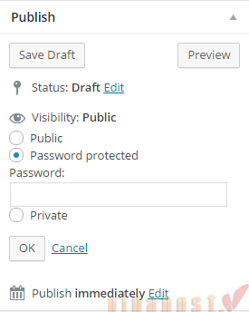
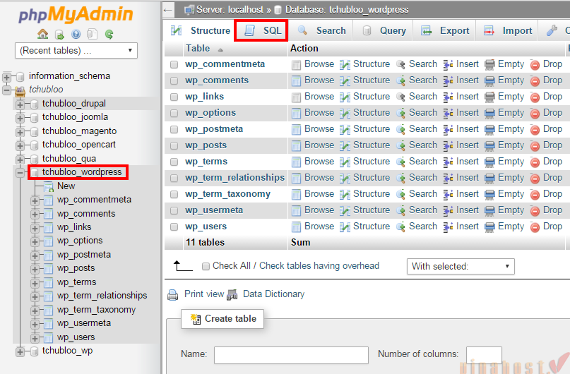
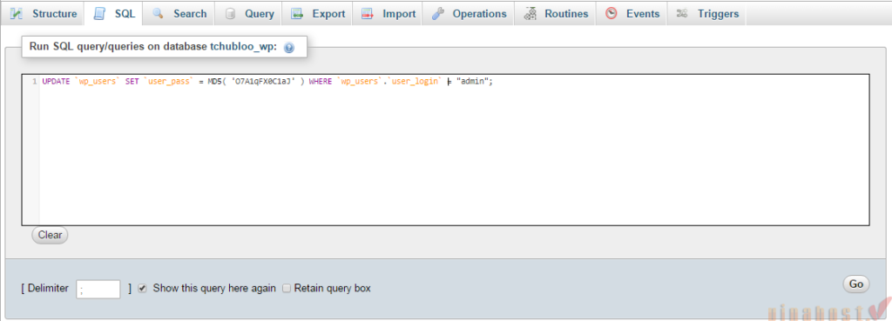
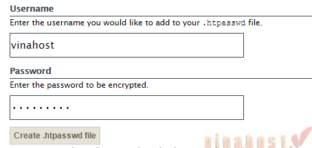
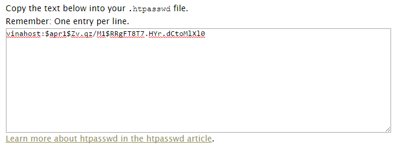
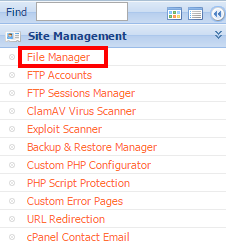
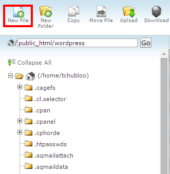
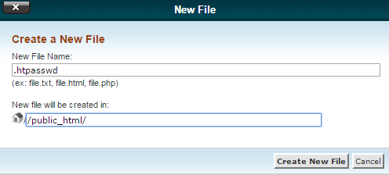
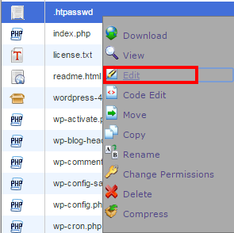
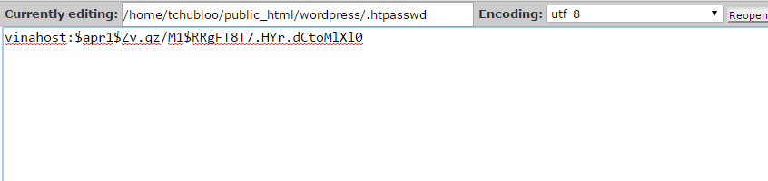

## Hướng dẫn cách bảo vệ bài viết WordPress

Khi đặt mật khẩu, chỉ những người có mật khẩu mới đọc được bài viết.

**Các bước thực hiện như sau:**

**Bước 1**: Đăng nhập vào trang quản trị WordPress.  
**Bước 2**: Ở mục Dashboard chọn Post và chọn Add New.  
**Bước 3**: Soạn thảo nội dung bài viết cần bảo vệ.  
**Bước 4**: Tại bảng tùy chọn Publish mục Visibility chọn Edit sẽ hiển thị các tùy chọn hiển thị bài đăng.

**Bước 5**: Chọn Password protected.  
**Bước 6**: Nhập mật khẩu vào text box.  
**Bước 7**: Chọn OK và click Publish.

Video tham khảo:

<iframe title="YouTube video player" src="https://www.youtube.com/embed/Xhm2wHyMMVQ" width="560" height="315" frameborder="0" allowfullscreen="allowfullscreen"></iframe>

Vậy là bài viết của bạn đã được bảo vệ chỉ những ai có mật khẩu mới có thể xem được.  

## Hướng dẫn thay đổi mật khẩu WordPress

Thông thường nếu quên mật khẩu, bạn có thể sử dụng chức năng **Reset** mật khẩu thông qua **e-mail** của **WordPress**. Nhưng trong trường hợp **email** bạn đặt không chính xác hoặc **email** không thể sử dụng, bạn có thể thực hiện truy vấn **SQL** trên **database** để thực hiện cập nhật lại mật khẩu. 

**Các bước thực hiện như sau:**

**Bước 1**: Đăng nhập vào cPanel.  
**Bước 2**: Tại mục Database Management bên trái bạn chọn phpMyAdmin.  
**Bước 3**: Trong cửa sổ bên trái sẽ có danh sách các database trên hosting của bạn, bạn chọn vào database website WordPress.

**Bước 4**: Tại Menu phía trên bạn chọn SQL.  
**Bước 5**: Copy và dán đoạn truy vấn SQL sau vào text box.

UPDATE \`wp\_users\` SET \`user\_pass\` = MD5( '_NEW\_PASSWORD_' ) WHERE \`wp\_users\`.\`user\_login\` = "_ADMIN\_USERNAME_";

Thay đổi NEW\_PASSWORD bằng mật khẩu mới và ADMIN\_USERNAME bằng tên user quản trị.

Chọn **Go** sau khi nhập hoàn tất sẽ cập nhật lại **database** với mật khẩu mới.

Bây giờ bạn có thể đăng nhập vào trang quản trị **WordPress** bằng thông tin mật khẩu mới. Các bạn có thể xem thêm video hướng dẫn sau:

<iframe title="YouTube video player" src="https://www.youtube.com/embed/gmQSvSy5FcY" width="560" height="315" frameborder="0" allowfullscreen="allowfullscreen"></iframe>

## Hướng dẫn bảo vệ WordPress Login khỏi Brute Force Attack

Hãy tưởng tượng hacker nắm trong tay một danh sách rất lớn các username và mật khẩu phổ biến hay được sử dụng. Sau đó họ gửi liên tục các truy vấn đăng nhập vào file wp-login.php của bạn và nếu tài khoản nào sai, nó sẽ bỏ qua và thử tiếp tài khoản khác. Cứ lần lượt như vậy, sau đó lại “trộn” mật khẩu đến khi nào đăng nhập được thì thôi. Đó là một hình thức brute force attack.

Bạn sẽ dễ bị tấn công trong các trường hợp:

- Đặt username là admin, cũng như administrator.
- Không bảo mật đường dẫn đăng nhập.
- Không thay đổi mật khẩu thường xuyên.
- Mật khẩu không an toàn, và phổ biến.

Để bảo vệ WordPress Login khỏi Brute Force Attack, bạn cần thực hiện các bước sau:

## **1\. Tạo file password**

**B1**: Truy cập đường dẫn: [http://www.htaccesstools.com/htpasswd-generator/](http://www.htaccesstools.com/htpasswd-generator/)

**B2**: Thực hiện tạo nội dung file **.htpasswd**, điền thông tin **username** và **password** để tạo nội dung file .htpasswd, sau khi điền đầy đủ thông tin bạn chọ **Create .htpasswd file**.

**B3**: Thực hiện đăng nhập vào cPanel hoặc các chương trình quản lý hosting thông dụng khác, chọn **Site Management -> File Manager**.

**B4**: Truy cập đường dẫn chứa source code website, nếu là domain chính tại thư mục **public\_html** tạo file **.htpasswd**.  

**B5**: Điền file name là **.htpasswd** sau đó nhấn **Create New File**.  

**B6**: Click phải file **.htpasswd** vừa tạo chọn **Edit**.

**B7**: Nhập thông tin username và mật khẩu đã mã hóa từ B1 vào file **.htpasswd** sau đó lưu file này lại.  

## **2\. Cấu hình file .htaccess**

Thêm đoạn cấu hình sau vào file **.htaccess**

        ErrorDocument 401 "Unauthorized Access"  
        ErrorDocument 403 "Forbidden"  
        <FilesMatch "wp-login.php">  
        AuthName "Authorized Only"  
        AuthType Basic  
        AuthUserFile /home/username/public\_html/.htpasswd  
        require valid-user  
        </FilesMatch>

**Lưu ý: AuthUserFile /home/username/public\_html/.htpasswd** thay đổi username cho phù hợp với tên user hosting của bạn.

## **3\. Kiểm tra**

Thực hiện truy cập vào đường dẫn quản trị website WordPress của bạn sẽ xuất hiện trang thông tin nhập **User** và **Password** mà bạn đã đặt ở B1 sau đó sẽ được truy cập vào trang Login quản trị website.

Bạn có thể xem video hướng dẫn sau:

<iframe title="YouTube video player" src="https://www.youtube.com/embed/xI6ya0ELq9Q" width="560" height="315" frameborder="0" allowfullscreen="allowfullscreen"></iframe>

Chúc bạn thành công!

> **THAM KHẢO CÁC DỊCH VỤ TẠI [VINAHOST](https://blog.vinahost.vn/)**
> 
> **\>>** [**SERVER**](https://vinahost.vn/thue-may-chu-rieng/) **–** [**COLOCATION**](https://vinahost.vn/colocation.html) – [**CDN**](https://vinahost.vn/dich-vu-cdn-chuyen-nghiep)
> 
> **\>> [CLOUD](https://vinahost.vn/cloud-server-gia-re/) – [VPS](https://vinahost.vn/vps-ssd-chuyen-nghiep/)**
> 
> **\>> [HOSTING](https://vinahost.vn/wordpress-hosting)**
> 
> **\>> [EMAIL](https://vinahost.vn/email-hosting)**
> 
> **\>> [WEBSITE](http://vinawebsite.vn/)**
> 
> **\>> [TÊN MIỀN](https://vinahost.vn/ten-mien-gia-re/)**
> 
> **\>> [SSL](https://vinahost.vn/geotrust-ssl) – [LICENSE](https://vinahost.vn/bang-gia-license)**
