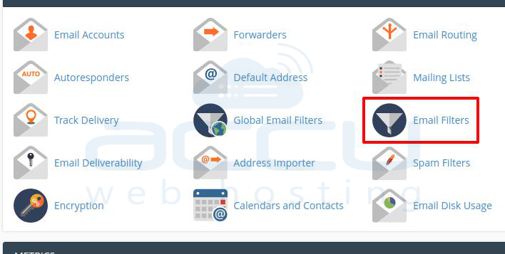
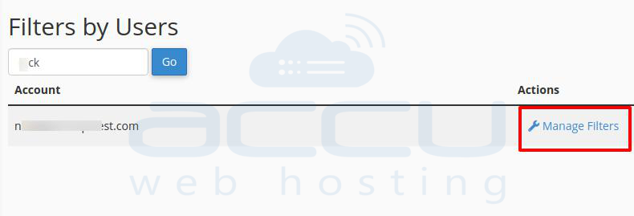
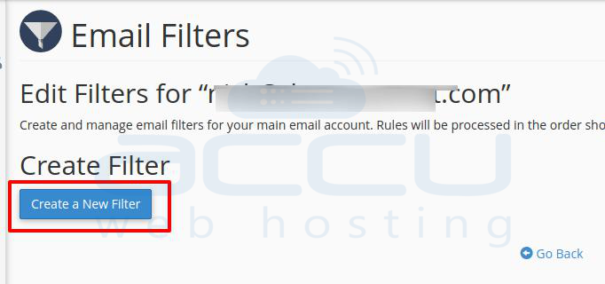
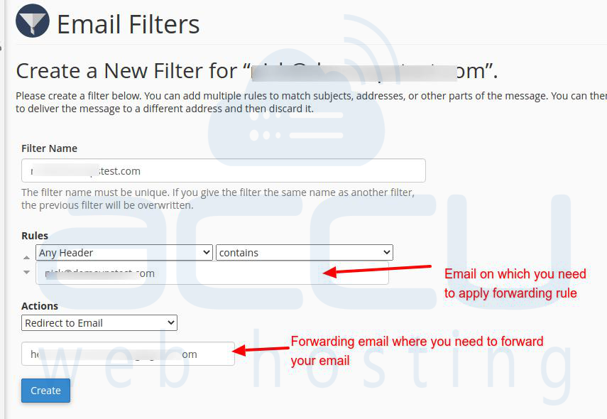

Bài viết này sẽ hướng dẫn bạn **Tự Động Xóa Các Thư Chuyển Tiếp Trong cPanel**. Nếu bạn cần hỗ trợ, xin vui lòng liên hệ VinaHost qua **Hotline 1900 6046 ext.3**, email về [support@vinahost.vn](mailto:support@vinahost.vn) hoặc chat với VinaHost qua livechat [https://livechat.vinahost.vn/chat.php](https://livechat.vinahost.vn/chat.php).

## 1\. Giới thiệu chung

Bạn có thể sử dụng tùy chọn chuyển tiếp email cPanel để chuyển tiếp email của bạn đến bất kỳ tài khoản email nào khác. Tuy nhiên, nó sẽ giữ một bản sao tại địa chỉ email chính và gửi một bản sao đến tài khoản email chuyển tiếp. Vì vậy, bạn sẽ có 2 email.

Tuy nhiên, trong trường hợp của chúng tôi, chúng tôi cần xóa email trong tài khoản chính được chuyển tiếp đến tài khoản email chuyển tiếp. cPanel không cung cấp chức năng này như một chức năng trực tiếp nhưng bạn cần đặt quy tắc lọc email để đạt được điều này.

## 2\. Hướng Dẫn Tự Động Xóa Các Thư Chuyển Tiếp Trong cPanel

Vui lòng tham khảo các bước sau để xóa các bản sao các thư chuyển tiếp trong cPanel.

Đăng nhập vào cPanel của bạn, đi đến **Bộ lọc email**.

Tìm kiếm tài khoản email của bạn, nơi bạn cần đặt chuyển tiếp email và nhấp vào **Quản lý bộ lọc > > Tạo bộ lọc mới**.

 

Tại phần Quy tắc, chọn **Bất kỳ tiêu đề**và **Chứa** và đặt địa chỉ email của bạn mà bạn cần đặt chuyển tiếp email.

Tại **Hành động**, chọn **Chuyển hướng đến Email** và nhập tài khoản email nơi bạn muốn chuyển tiếp tài khoản email.

Lưu lại, vậy là bạn đã hoàn thành với xóa các bản sao email chuyển tiếp trong cPanel.

Chúc bạn thực hiện Tự Động Xóa Các Thư Chuyển Tiếp Trong cPanel thành công!

> **THAM KHẢO CÁC DỊCH VỤ TẠI [VINAHOST](https://kb.vinahost.vn/)**
> 
> **\>>** [**SERVER**](https://vinahost.vn/thue-may-chu-rieng/) **–** [**COLOCATION**](https://vinahost.vn/colocation.html) – [**CDN**](https://vinahost.vn/dich-vu-cdn-chuyen-nghiep)
> 
> **\>> [CLOUD](https://vinahost.vn/cloud-server-gia-re/) – [VPS](https://vinahost.vn/vps-ssd-chuyen-nghiep/)**
> 
> **\>> [HOSTING](https://vinahost.vn/wordpress-hosting)**
> 
> **\>> [EMAIL](https://vinahost.vn/email-hosting)**
> 
> **\>> [WEBSITE](http://vinawebsite.vn/)**
> 
> **\>> [TÊN MIỀN](https://vinahost.vn/ten-mien-gia-re/)**
